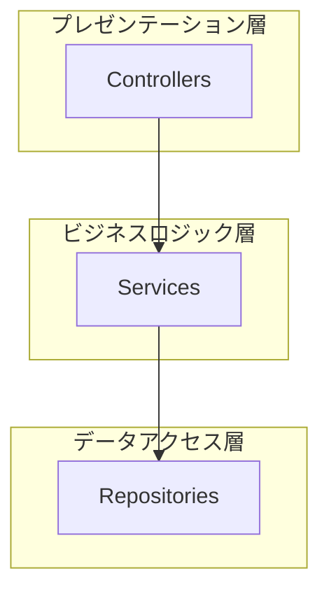
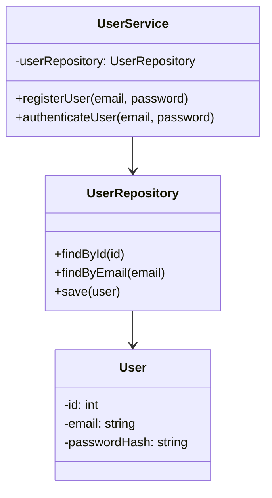
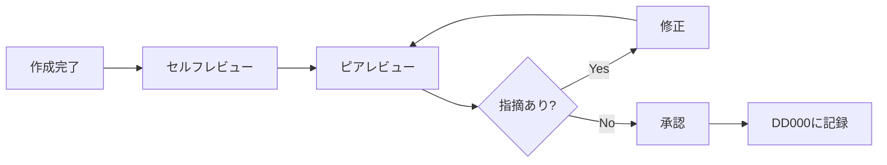

# IPA準拠 詳細設計書のスケーリング戦略

**最終更新**: 2025-12-15
**対象**: IPA Common Frame 2013準拠プロジェクトの詳細設計フェーズ

---

## 使用方法

このドキュメントは、大規模システムでIPA Common Frame 2013に準拠しつつ、現実的な詳細設計書を作成する際に参照してください：

- **プロジェクト計画時**: 詳細設計書の分割方針決定
- **テンプレート設計時**: 文書構造の設計
- **レビュー時**: 文書粒度の妥当性確認
- **運用改善時**: 既存プロジェクトの問題解決

---

## 問題の本質

### IPA Common Frame 2013の課題

IPA Common Frame 2013は、**成果物の種類**は定義していますが、**文書の分割方法**は明示していません：

#### IPAが定義しているもの ✅

```
詳細設計フェーズの成果物:
- モジュール構成設計書
- 機能詳細設計書
- 画面・帳票詳細設計書
- 単体テスト仕様書
```

#### IPAが定義していないもの ❌

```
- 1ファイルに全部書くのか？
- モジュールごとに分割するのか？
- 何ページまで許容するのか？
- クラス図は全クラスを1枚に？
```

→ **結論**: 「現場で適切に判断しろ」が IPA の立ち位置

---

## 大規模システムでの現実

### 一般的な問題

```
問題1: クラス図が1000クラス
└─ A3 50枚に印刷しても見えない

問題2: 詳細設計書が1ファイル500ページ
└─ レビューに3週間、修正にさらに2週間

問題3: 全機能を1つのファイルに記載
└─ Gitコンフリクト多発、並行作業不可能

問題4: 更新のたびに全体を再生成
└─ 変更した1クラスのためにWord 500ページを更新
```

### IPAプロジェクトでの実態

実際の大手SIerでのIPA準拠プロジェクトでは、以下のように対応しています：

```yaml
文書管理の実運用:
  基準:
    - 1ドキュメント50ページ以内
    - サブシステム単位で分割
    - クラス図は10クラス以内/1図

  分割方法:
    モジュール構成設計書:
      全体俯瞰図: パッケージ図のみ（A3 1枚）
      詳細図: モジュール単位で作成（5-10クラス/1図）

    機能詳細設計書:
      粒度: ユースケース単位またはサービスクラス単位
      目安: 1機能 = 1ファイル（10-30ページ）

    単体テスト仕様書:
      粒度: クラス/モジュール単位
      目安: 1クラス = 1ファイル（20-50テストケース）
```

---

## ベストプラクティス

### 1. 階層的文書管理

#### マスター文書 + 個別文書の2層構造

```
DD000_詳細設計総括.md （マスター）
├── サブシステム一覧
├── 各詳細設計書の索引
├── 分割ガイドライン
└── レビュー進捗管理

実成果物/ （個別文書）
├── 01_ユーザー管理/
│   ├── DD001_モジュール構成設計書_ユーザー管理.md
│   ├── DD002_機能詳細設計書_ユーザー登録.md
│   └── DD004_単体テスト仕様書_UserService.md
├── 02_注文管理/
│   └── ...
└── 03_決済管理/
    └── ...
```

**メリット**:
- ✅ 全体像の把握が容易（マスター文書）
- ✅ 並行作業可能（個別文書）
- ✅ レビュー効率化（サブシステム単位）
- ✅ 変更影響範囲の局所化

---

### 2. 文書分割の具体的基準

#### クラス設計書（DD001）

| 分割基準 | 閾値 | 推奨分割単位 |
|---------|------|-------------|
| クラス数 | 10超 | モジュール/パッケージ |
| ページ数 | 50超 | レイヤー/機能 |
| クラス図のクラス数 | 10超 | 関連クラスのグループ |

**Good例**:
```
01_ユーザー管理/
├── DD001_モジュール構成設計書_認証モジュール.md（8クラス）
├── DD001_モジュール構成設計書_ユーザーリポジトリ.md（7クラス）
└── DD001_モジュール構成設計書_パスワードハッシュ.md（5クラス）
```

**Bad例**:
```
DD001_モジュール構成設計書.md
└── 全200クラスを記載（NG!）
```

---

#### 機能詳細設計書（DD002）

| 分割基準 | 閾値 | 推奨分割単位 |
|---------|------|-------------|
| ユースケース数 | 5超 | ユースケース単位 |
| ページ数 | 30超 | 機能単位 |
| 処理フロー数 | 10超 | サービスクラス単位 |

**Good例**:
```
01_ユーザー管理/
├── DD002_機能詳細設計書_ユーザー登録.md
├── DD002_機能詳細設計書_ユーザー認証.md
└── DD002_機能詳細設計書_パスワードリセット.md
```

---

#### 単体テスト仕様書（DD004）

| 分割基準 | 閾値 | 推奨分割単位 |
|---------|------|-------------|
| テストケース数 | 50超 | クラス/モジュール |
| テスト対象クラス数 | 3超 | クラス単位 |
| ページ数 | 30超 | 機能単位 |

**Good例**:
```
01_ユーザー管理/
├── DD004_単体テスト仕様書_UserService.md（30ケース）
├── DD004_単体テスト仕様書_AuthController.md（25ケース）
└── DD004_単体テスト仕様書_UserRepository.md（20ケース）
```

---

### 3. クラス図の分割戦略

#### 全体俯瞰図（1図のみ）



- **目的**: システム全体のアーキテクチャ理解
- **粒度**: パッケージ/レイヤーレベル（クラスの詳細なし）
- **サイズ**: A3サイズ1枚（最大30パッケージ）
- **配置**: `DD001_全体俯瞰.md` として独立ファイル

#### 詳細クラス図（モジュールごと）



- **目的**: モジュール内部のクラス設計
- **粒度**: クラス単位（属性・メソッド記載）
- **サイズ**: **5-10クラス/1図**
- **配置**: 各モジュールの詳細設計書内

---

### 4. 命名規則の統一

#### ファイル命名

```
{文書番号}_{文書名}_{対象範囲}.md

例:
DD001_モジュール構成設計書_ユーザー管理_認証モジュール.md
DD002_機能詳細設計書_ユーザー登録.md
DD003_画面詳細設計書_ログイン画面.md
DD004_単体テスト仕様書_UserService.md
```

#### ディレクトリ命名

```
{番号}_{サブシステム名}/

例:
00_全体俯瞰/
01_ユーザー管理/
02_注文管理/
03_決済管理/
04_共通基盤/
```

---

### 5. Git管理戦略

#### ブランチ戦略

```bash
# サブシステムごとにブランチ
feature/detailed-design/user-management
feature/detailed-design/order-management
feature/detailed-design/payment

# レビュー単位でPR
PR #1: ユーザー管理サブシステム 詳細設計
PR #2: 注文管理サブシステム 詳細設計
```

#### コンフリクト回避

```
# Good: サブシステム別ディレクトリ
01_ユーザー管理/DD001_*.md  ← 山田担当
02_注文管理/DD001_*.md      ← 鈴木担当
└─ コンフリクトなし ✅

# Bad: 単一ファイル
DD001_全システム.md
└─ 山田と鈴木が同時編集でコンフリクト ❌
```

---

## 実践的な運用フロー

### Step 1: プロジェクト開始時


#### 実施内容

1. **サブシステム分割の決定**
   ```
   例: ECサイトの場合
   - 01_ユーザー管理
   - 02_商品管理
   - 03_注文管理
   - 04_決済管理
   - 05_共通基盤
   ```

2. **DD000_詳細設計総括 の作成**
   - サブシステム一覧
   - 成果物索引の枠組み
   - 分割ガイドライン

3. **ディレクトリ構造の作成**
   ```bash
   mkdir -p 実成果物/{01_ユーザー管理,02_商品管理,03_注文管理}
   ```

---

### Step 2: 詳細設計書作成


#### 実施内容

1. **テンプレートからコピー**
   ```bash
   cp DD001_template.md 実成果物/01_ユーザー管理/DD001_認証モジュール.md
   ```

2. **プレースホルダ置換**
   ```
   {プロジェクト名} → Antigravity
   {サブシステム名} → ユーザー管理
   {モジュール名} → 認証モジュール
   ```

3. **分割ガイドラインチェック**
   - [ ] クラス数は10以下か？
   - [ ] ページ数は50ページ以下か？
   - [ ] 単一モジュールに絞られているか？

---

### Step 3: レビュー・承認



#### レビュー観点

| 観点 | チェック内容 |
|------|------------|
| **構造** | テンプレートに従っているか |
| **粒度** | 適切に分割されているか（50ページ以内） |
| **整合性** | 他の設計書と矛盾がないか |
| **完全性** | 必須項目が全て記載されているか |
| **可読性** | 第三者が理解できるか |

---

## チェックリスト

### プロジェクト開始時
- [ ] DD000_詳細設計総括 を作成
- [ ] サブシステム分割を決定
- [ ] ディレクトリ構造を作成
- [ ] 分割ガイドラインを共有

### 文書作成時
- [ ] 適切なテンプレートを使用
- [ ] 分割基準を満たす（ページ数、クラス数）
- [ ] 命名規則に従う
- [ ] 他の設計書との整合性を確認

### レビュー時
- [ ] 構造がテンプレートに準拠
- [ ] 粒度が適切（過度に大きくない）
- [ ] クラス図が見やすい（5-10クラス/1図）
- [ ] 他の設計書と矛盾がない

### 承認時
- [ ] DD000 の索引を更新
- [ ] レビュー記録を残す
- [ ] 承認記録を残す

---

## トラブルシューティング

### Q1: 既存プロジェクトで1ファイルが300ページになってしまった

**A**: 段階的に分割してください：

```bash
# Step 1: サブシステム単位に分割
DD001_全システム.md
→ DD001_ユーザー管理.md (100ページ)
→ DD001_注文管理.md (100ページ)
→ DD001_決済管理.md (100ページ)

# Step 2: モジュール単位に分割
DD001_ユーザー管理.md
→ DD001_ユーザー管理_認証.md (40ページ)
→ DD001_ユーザー管理_リポジトリ.md (30ページ)
→ DD001_ユーザー管理_バリデーション.md (30ページ)
```

---

### Q2: クラス図が50クラスあって1図に収まらない

**A**: 以下の方法で分割してください：

```
Option 1: レイヤーで分割
- DD001_クラス図_プレゼンテーション層.md (15クラス)
- DD001_クラス図_ビジネスロジック層.md (20クラス)
- DD001_クラス図_データアクセス層.md (15クラス)

Option 2: 機能で分割
- DD001_クラス図_認証機能.md (10クラス)
- DD001_クラス図_ユーザー管理機能.md (12クラス)
- DD001_クラス図_権限管理機能.md (8クラス)

Option 3: 全体俯瞰図 + 詳細図
- DD001_クラス図_全体俯瞰.md (パッケージレベルのみ)
- DD001_クラス図_認証モジュール詳細.md (8クラス詳細)
- DD001_クラス図_リポジトリ詳細.md (7クラス詳細)
```

---

### Q3: IPAの監査で「分割しすぎ」と指摘された

**A**: DD000_詳細設計総括 で全体像を示してください：

```markdown
DD000_詳細設計総括.md にて:

## サブシステム一覧
（全体構成を明示）

## 詳細設計書索引
（全ての詳細設計書へのリンク）

## 分割の根拠
（なぜこの粒度で分割したかを説明）
- 担当者別の並行作業のため
- レビュー効率化のため
- 変更影響範囲の局所化のため
```

**監査官への説明ポイント**:
- IPA標準は分割を禁止していない
- 大規模システムでは分割が現実的
- マスター文書で全体管理している
- 各成果物は IPA の定義に準拠している

---

## まとめ

### IPAとの両立が可能

```
IPA Common Frame 2013 の成果物定義
+
現場での適切な文書分割
=
スケーラブルで保守性の高い詳細設計書
```

### 成功の鍵

1. **DD000 マスター文書**で全体を統括
2. **明確な分割基準**（50ページ、10クラス等）
3. **命名規則の統一**
4. **Git管理**による並行作業
5. **レビュー単位**の最適化

---

## 参考資料

- [IPA Common Frame 2013](https://www.ipa.go.jp/ikc/publish/tn16-007.html)
- [DD000_詳細設計総括.md](.agent/templates/04_詳細設計/DD000_詳細設計総括.md)
- 各テンプレートの「文書分割ガイドライン」セクション

---

**大規模システムでも、IPAに準拠しつつ現実的な詳細設計が可能です。**
