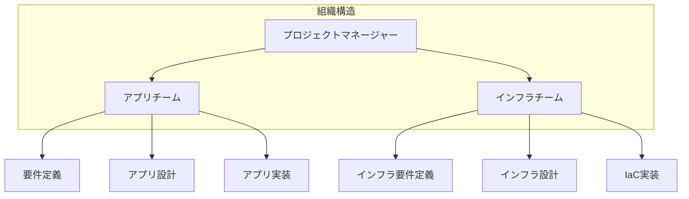
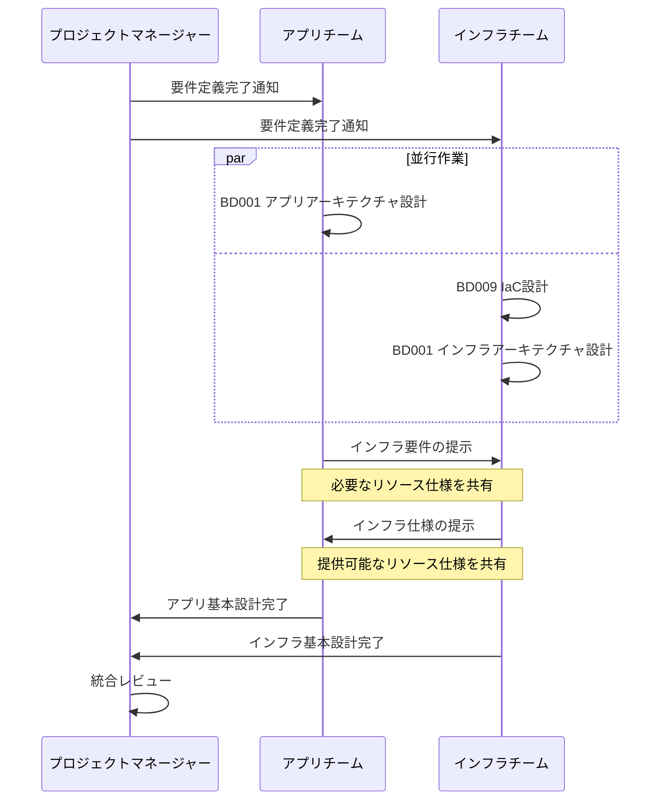
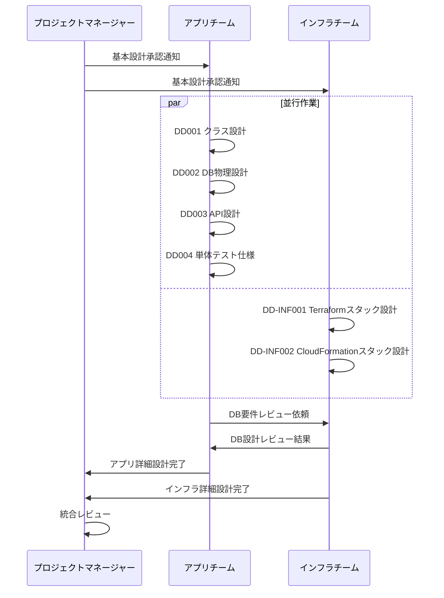
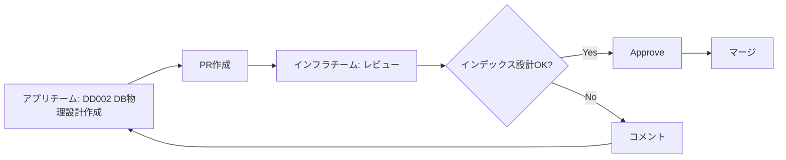

# アプリチーム・インフラチーム 分離ガイドライン

> **目的**: アプリケーション開発チームとインフラ開発チームが並行して作業できるよう、責任範囲と文書構成を明確化する

---

## 📋 目次

1. [チーム分離の背景](#1-チーム分離の背景)
2. [責任分界点](#2-責任分界点)
3. [文書構成](#3-文書構成)
4. [ワークフロー](#4-ワークフロー)
5. [実践例](#5-実践例)

---

## 1. チーム分離の背景

### 1.1 よくある組織体制

多くの開発現場では、以下のようにチームが分離されています：



### 1.2 チーム分離の理由

| 理由 | 説明 |
|------|------|
| **専門性の違い** | アプリとインフラでは必要なスキルセットが異なる |
| **ライフサイクルの違い** | アプリは頻繁にリリース、インフラは安定運用重視 |
| **セキュリティ** | インフラ権限を限定し、最小権限の原則を実現 |
| **スケーラビリティ** | 大規模プロジェクトでは並行作業が必須 |

### 1.3 IPA Common Frame 2013との整合性

**IPA標準の立場**:
- チーム分離は組織判断（IPAは規定しない）
- 成果物の種類と品質は定義（誰が作るかは不問）

**本ガイドラインの方針**:
- IPA標準に準拠しつつ、現実的なチーム分離をサポート
- 成果物の整合性を担保する仕組みを提供

---

## 2. 責任分界点

### 2.1 責任マトリクス（RACI）

| 成果物 / 活動 | アプリチーム | インフラチーム | 備考 |
|-------------|------------|--------------|------|
| **要件定義** | R/A | C | アプリチームがリード |
| **基本設計** | | | |
| - アプリアーキテクチャ | R/A | C | アプリチームがリード |
| - インフラアーキテクチャ | C | R/A | インフラチームがリード |
| - ネットワーク設計 | I | R/A | インフラチームがリード |
| - セキュリティ設計 | C | R/A | 両チーム協働 |
| **詳細設計** | | | |
| - クラス設計 | R/A | I | アプリチームがリード |
| - DB物理設計 | R/A | C | アプリチーム主導、インフラはレビュー |
| - API設計 | R/A | I | アプリチームがリード |
| - IaCスタック設計 | C | R/A | インフラチームがリード |
| **実装** | | | |
| - アプリケーションコード | R/A | I | アプリチームのみ |
| - IaCコード（Terraform/CFn） | I | R/A | インフラチームのみ |
| **運用設計** | C | R/A | インフラチームがリード |

**凡例**:
- **R**: Responsible（実行責任者）
- **A**: Accountable（説明責任者）
- **C**: Consulted（相談先）
- **I**: Informed（報告先）

### 2.2 技術領域の分界

```
┌─────────────────────────────────────────────────┐
│ アプリチームの責任範囲                           │
├─────────────────────────────────────────────────┤
│ - ビジネスロジック                               │
│ - アプリケーションアーキテクチャ                  │
│ - データモデル設計                               │
│ - API仕様                                       │
│ - フロントエンド/バックエンド実装                 │
└─────────────────────────────────────────────────┘
                        ↕
              【インターフェース】
         - 必要なインフラリソース仕様
         - 環境変数、設定値
         - ログ出力先、形式
         - ヘルスチェックエンドポイント
                        ↕
┌─────────────────────────────────────────────────┐
│ インフラチームの責任範囲                          │
├─────────────────────────────────────────────────┤
│ - ネットワーク構成（VPC, Subnet, SG）            │
│ - コンピューティング基盤（EC2, ECS, Lambda）      │
│ - データストア基盤（RDS, S3, ElastiCache）       │
│ - 監視・ログ基盤（CloudWatch, X-Ray）            │
│ - CI/CDパイプライン                              │
│ - セキュリティ基盤（IAM, KMS, Secrets Manager）  │
└─────────────────────────────────────────────────┘
```

---

## 3. 文書構成

### 3.1 ディレクトリ構造

```
.agent/
└── templates/
    ├── 01_要件定義/
    │   └── （共通）
    │
    ├── 02_基本設計/
    │   ├── BD001_システム方式設計書_template.md      # 両チーム協働
    │   ├── BD009_IaC設計書_template.md              # インフラチームがリード
    │   └── 実成果物/
    │       ├── 00_アプリアーキテクチャ/             # アプリチーム
    │       └── 01_インフラアーキテクチャ/           # インフラチーム
    │
    └── 04_詳細設計/
        ├── DD000_詳細設計総括.md                    # 両チーム共有
        ├── DD001-01_クラス設計書_template.md        # アプリチーム
        ├── DD002_データベース物理設計書_template.md  # アプリチーム（主導）
        ├── DD003_API設計書_template.md              # アプリチーム
        ├── DD004_単体テスト仕様書_template.md        # アプリチーム
        ├── DD-INF001_Terraformスタック設計書_template.md      # インフラチーム
        ├── DD-INF002_CloudFormationスタック設計書_template.md # インフラチーム
        └── 実成果物/
            ├── 00_全体俯瞰/                         # 両チーム協働
            ├── 01_アプリ/                           # アプリチーム
            │   ├── ユーザー管理/
            │   ├── 注文管理/
            │   └── 決済管理/
            └── 02_インフラ/                         # インフラチーム
                ├── network/
                ├── security/
                └── application-platform/
```

### 3.2 文書テンプレートの使い分け

| テンプレート | 使用チーム | 目的 |
|------------|----------|------|
| **DD001-01** クラス設計書 | アプリ | アプリケーションクラス設計 |
| **DD002** DB物理設計書 | アプリ（主導）→ インフラ（レビュー） | DBテーブル設計 |
| **DD003** API設計書 | アプリ | REST/GraphQL API仕様 |
| **DD004** 単体テスト仕様書 | アプリ | アプリケーションテスト |
| **DD-INF001** Terraformスタック設計書 | インフラ | IaCスタック設計 |
| **DD-INF002** CloudFormationスタック設計書 | インフラ | IaCスタック設計 |

---

## 4. ワークフロー

### 4.1 基本設計フェーズ



### 4.2 詳細設計フェーズ



### 4.3 ハンドオフポイント

各フェーズで、以下のハンドオフポイントが存在します：

| フェーズ | アプリ → インフラ | インフラ → アプリ |
|---------|-----------------|-----------------|
| **基本設計** | - 必要なリソース仕様<br>- 非機能要件（性能、可用性） | - 提供するインフラ構成<br>- 制約事項 |
| **詳細設計** | - DB物理設計<br>- アプリ実行環境要件 | - IaCスタック設計<br>- 運用手順 |
| **実装** | - デプロイ成果物<br>- 環境変数仕様 | - 環境構築完了通知<br>- 接続情報 |

---

## 5. 実践例

### 5.1 ケーススタディ: ECサイト構築

**プロジェクト概要**:
- アプリチーム: 5名（フロント3名、バック2名）
- インフラチーム: 2名（AWS担当）

**成果物分担**:

| フェーズ | アプリチーム成果物 | インフラチーム成果物 |
|---------|------------------|-------------------|
| **基本設計** | - BD001（アプリアーキテクチャ部分）<br>- 画面設計<br>- ER図 | - BD009 IaC設計書<br>- BD001（インフラアーキテクチャ部分）<br>- ネットワーク図 |
| **詳細設計** | - DD001 クラス設計（ユーザー管理、商品管理、注文管理）<br>- DD002 DB物理設計<br>- DD003 API設計<br>- DD004 単体テスト仕様 | - DD-INF001 Terraform（network, security, ecs）<br>- 運用設計書 |

**ディレクトリ構成例**:
```
.agent/templates/04_詳細設計/実成果物/
├── 00_全体俯瞰/
│   └── DD000_詳細設計総括.md               # 両チームで管理
│
├── 01_アプリ/
│   ├── ユーザー管理/
│   │   ├── DD001-01_クラス設計書_認証モジュール.md
│   │   ├── DD003_API設計書_ユーザー管理API.md
│   │   └── DD004_単体テスト仕様書_UserService.md
│   ├── 商品管理/
│   └── 注文管理/
│
└── 02_インフラ/
    ├── network/
    │   └── DD-INF001_Terraformスタック設計書_VPC.md
    ├── security/
    │   └── DD-INF001_Terraformスタック設計書_SecurityGroup.md
    └── application-platform/
        └── DD-INF001_Terraformスタック設計書_ECS.md
```

### 5.2 Git運用

**ブランチ戦略**:
```
main
├── feature/app/user-management          # アプリチーム
├── feature/app/product-management       # アプリチーム
└── feature/infra/network-stack          # インフラチーム
```

**PR作成ルール**:
- アプリチーム: `.agent/templates/04_詳細設計/実成果物/01_アプリ/` 配下のみ変更
- インフラチーム: `.agent/templates/04_詳細設計/実成果物/02_インフラ/` 配下のみ変更
- DD000総括は両チームで調整

### 5.3 レビュープロセス



**レビューポイント（アプリ → インフラ）**:
- DB物理設計: インデックス設計の妥当性、パーティショニング
- API設計: レート制限、認証方式

**レビューポイント（インフラ → アプリ）**:
- IaCスタック設計: アプリ要件を満たしているか
- 環境構成: 開発環境でのテスト可能性

---

## 6. トラブルシューティング

### Q1: アプリチームとインフラチームで認識齟齬が発生した

**原因**:
- ハンドオフポイントでの情報共有不足

**対策**:
1. **定例ミーティング**（週1回）で進捗と課題を共有
2. **インターフェース仕様書**を作成し、合意形成
3. **DD000総括**で依存関係を明示

### Q2: DB物理設計のレビューでインフラチームから大幅修正指摘

**原因**:
- 基本設計段階で詳細な調整不足

**対策**:
1. 基本設計時にインフラチームへ**事前相談**（正式レビュー前）
2. **テーブル設計ガイドライン**をインフラチームが提供
3. 詳細設計初期に**ドラフトレビュー**実施

### Q3: IaCスタックがアプリの要件を満たしていない

**原因**:
- アプリチームからのインフラ要件の伝達漏れ

**対策**:
1. **インフラ要件チェックリスト**を作成（基本設計フェーズ）
2. アプリチームが **DD-INF001のレビュー**に参加
3. **アクセプタンス基準**を明確化

---

## 7. まとめ

### チーム分離成功の3原則

1. **明確な責任分界**
   - RACIマトリクスで役割を明示
   - インターフェースを文書化

2. **並行作業の仕組み**
   - ディレクトリ分離（01_アプリ / 02_インフラ）
   - Git運用ルールの整備

3. **定期的な調整**
   - ハンドオフポイントでのレビュー
   - 週次ミーティングでの進捗共有

### IPA準拠との両立

- **IPA標準**: 成果物の種類と品質を規定
- **本ガイドライン**: 現実的なチーム分離をサポート
- **結果**: IPA準拠を維持しつつ、効率的な並行作業を実現

---

## 📚 関連資料

- [DD000_詳細設計総括.md](../../templates/04_詳細設計/DD000_詳細設計総括.md)
- [BD009_IaC設計書_template.md](../../templates/02_基本設計/BD009_IaC設計書_template.md)
- [DD-INF001_Terraformスタック設計書_template.md](../../templates/04_詳細設計/DD-INF001_Terraformスタック設計書_template.md)
- [ipa-detailed-design-scaling.md](./ipa-detailed-design-scaling.md)
