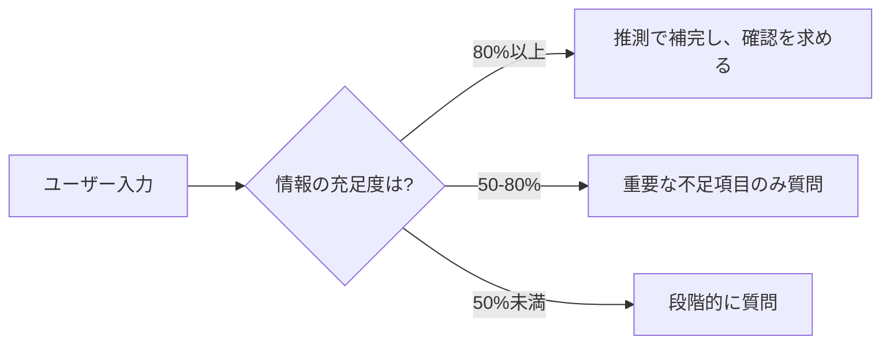

# エージェント質問ガイダンス - SDLC各フェーズ

> **方針**: 固定の質問リストではなく、**確認すべきポイント**を示す。エージェントは状況に応じて柔軟に質問を生成すること。

---

## 📋 目次

1. [基本方針](#1-基本方針)
2. [要件定義フェーズ](#2-要件定義フェーズ)
3. [基本設計フェーズ](#3-基本設計フェーズ)
4. [詳細設計フェーズ](#4-詳細設計フェーズ)
5. [質問生成のパターン](#5-質問生成のパターン)

---

## 1. 基本方針

### 1.1 質問の目的

エージェントが質問する目的は以下の通り：

1. **不足情報の特定**: テンプレート作成に必要だが、現在の情報では不明な項目
2. **曖昧性の解消**: 複数の解釈が可能な要件の明確化
3. **トレードオフの判断**: 設計判断において、ユーザーの優先順位を確認
4. **制約条件の確認**: 技術的制約、ビジネス制約、コスト制約

### 1.2 質問生成の原則

#### ✅ Good: 状況に応じた質問

- 現在の情報を分析し、**不足している部分のみ**質問
- ユーザーの業界、プロジェクト規模に応じた質問
- 技術スタック、チーム構成を考慮

#### ❌ Bad: 固定リストの機械的な質問

- すべてのフェーズで同じ質問をする
- すでに情報がある項目を再度質問
- プロジェクトに関係ない項目を質問

### 1.3 質問のタイミング



**推奨アプローチ**:
1. まず現在の情報で作れる範囲を作成
2. 重要な不足項目を特定
3. 5-7個程度に絞って質問
4. ユーザーの回答を受けて追加質問（必要なら）

---

## 2. 要件定義フェーズ

### 2.1 確認すべきポイント

#### ビジネス要件

**よくある不足情報**:
- システムの目的（何を解決するのか）
- 主要なステークホルダー
- 成功の指標（KPI）

**質問例**（状況に応じて生成）:
- "このシステムで解決したい主な課題は何ですか？"
- "想定ユーザー数はどのくらいですか？（初期 / 1年後）"

#### 機能要件

**よくある不足情報**:
- 主要機能の優先順位
- 機能間の依存関係
- データのライフサイクル

**質問の生成パターン**:
```
IF 機能リストはあるが優先順位不明 THEN
  → "MVPに含めるべき機能はどれですか？"

IF データ連携が必要そうだが詳細不明 THEN
  → "外部システムとのデータ連携は必要ですか？"
```

#### 非機能要件

**よくある不足情報**:
- 性能要件（レスポンスタイム、スループット）
- 可用性要件（稼働率、ダウンタイム許容）
- セキュリティ要件（認証方式、データ保護）

**確認が必須の項目**:
- [ ] 想定同時接続数
- [ ] 可用性目標（99%? 99.9%? 99.99%?）
- [ ] データ保存期間、バックアップ要件
- [ ] コンプライアンス要件（GDPR, 個人情報保護法など）

### 2.2 質問の優先度

| 優先度 | 項目 | 質問タイミング |
|--------|------|--------------|
| **High** | 性能要件、可用性要件 | 必ず確認 |
| **Medium** | セキュリティ要件、運用要件 | プロジェクト規模に応じて |
| **Low** | 将来拡張性 | 必要に応じて |

---

## 3. 基本設計フェーズ

### 3.1 確認すべきポイント

#### システムアーキテクチャ

**よくある不足情報**:
- デプロイ環境（オンプレ / クラウド / ハイブリッド）
- スケーリング方針（垂直 / 水平）
- データベース選定理由

**質問生成パターン**:
```
IF クラウド利用を検討している THEN
  → "AWS / Azure / GCP のいずれを利用しますか？"
  → "既存のクラウドアカウント、組織ポリシーはありますか？"

IF マイクロサービスかモノリスか不明 THEN
  → "チーム規模、開発体制から判断して推奨を提示"
  → "ユーザーに最終判断を求める"
```

#### 技術スタック

**よくある不足情報**:
- プログラミング言語の選定理由
- フレームワークの選定理由
- チームの習熟度

**確認が必須の項目**:
- [ ] 開発チームのスキルセット（言語、フレームワーク）
- [ ] 既存システムとの技術的整合性
- [ ] サポート体制（内製 / ベンダー依存）

#### インフラ構成

**よくある不足情報**:
- ネットワーク要件（VPN接続、専用線）
- 環境分離方針（dev / stg / prod）
- DR（災害復旧）要件

**質問の生成パターン**:
```
IF 可用性要件が99.9%以上 THEN
  → "マルチAZ構成が必要です。リージョンレベルのDRも必要ですか？"

IF 機密データを扱う THEN
  → "データ保存時の暗号化、通信時の暗号化要件を確認"
```

### 3.2 トレードオフの確認

基本設計では、以下のトレードオフを確認：

| トレードオフ | 確認ポイント |
|------------|------------|
| **コスト vs 性能** | 高性能インスタンス vs コスト最適化 |
| **可用性 vs コスト** | マルチAZ vs シングルAZ |
| **開発速度 vs 保守性** | モノリス vs マイクロサービス |
| **柔軟性 vs シンプルさ** | カスタマイズ vs 標準構成 |

**質問例**:
- "コストと性能、どちらを優先しますか？（初期は性能重視、後でコスト最適化など）"
- "開発速度を優先しますか？それとも長期的な保守性を重視しますか？"

---

## 4. 詳細設計フェーズ

### 4.1 確認すべきポイント

#### クラス設計（DD001-01）

**よくある不足情報**:
- デザインパターンの適用方針
- クラスの責務分割基準
- インターフェース設計方針

**質問生成パターン**:
```
IF 基本設計でレイヤー構成が定義されている THEN
  → レイヤーごとのクラス分割を提案
  → 不明点のみ質問

IF 認証・認可が必要 THEN
  → "認証方式は決まっていますか？（JWT / Session / OAuth）"
  → 決まっていない場合は推奨を提示
```

**確認が必須の項目**:
- [ ] エラーハンドリング方針（例外 / Result型 / エラーコード）
- [ ] ロギング方針（ログレベル、出力先）
- [ ] テスタビリティ（DI / モック）

#### データベース物理設計（DD002）

**よくある不足情報**:
- インデックス設計方針
- パーティショニング要否
- データ保持期間

**質問生成パターン**:
```
IF テーブルが大量データを扱う THEN
  → "年間データ増加量はどのくらいですか？"
  → "パーティショニング（日次、月次）を検討しますか？"

IF 全文検索が必要そう THEN
  → "Elasticsearchなど専用サービスの利用を検討しますか？"
```

#### API設計（DD003）

**よくある不足情報**:
- 認証方式（API Key / JWT / OAuth）
- レート制限
- バージョニング戦略

**確認が必須の項目**:
- [ ] 外部公開APIか、内部APIか
- [ ] SLA（可用性、レスポンスタイム）
- [ ] 後方互換性の維持方針

#### IaCスタック設計（DD-INF001/002）

**よくある不足情報**:
- スタック分割方針
- State管理方針
- 環境間の差分許容度

**質問生成パターン**:
```
IF Terraform使用 THEN
  → "Workspaceを使いますか？それとも環境ごとに別ディレクトリですか？"
  → チーム規模、運用体制から推奨を提示

IF 複数環境がある THEN
  → "dev環境はコスト最適化を優先し、シングルAZ構成でよいですか？"
```

### 4.2 文書分割の確認

詳細設計では、文書分割が重要：

**確認ポイント**:
- [ ] クラス数が10を超える場合、分割方針は決まっているか？
- [ ] サブシステム分割は基本設計と整合しているか？
- [ ] アプリチーム / インフラチームの分離は必要か？

**質問例**:
- "このシステムのサブシステムはどのように分割しますか？（ユーザー管理、注文管理など）"
- "アプリチームとインフラチームは分かれていますか？"

---

## 5. 質問生成のパターン

### 5.1 情報不足の検出

エージェントは以下のパターンで情報不足を検出：

```python
# 疑似コード
def detect_missing_info(user_input, template):
    required_fields = template.get_required_fields()
    provided_info = extract_info(user_input)

    missing = []
    for field in required_fields:
        if field not in provided_info:
            if is_critical(field):
                missing.append(field)
            elif can_infer(field, provided_info):
                # 推測で補完
                inferred_value = infer(field, provided_info)
                # ユーザーに確認を求める
                missing.append((field, inferred_value))

    return missing
```

### 5.2 質問の構造化

**Good: 構造化された質問**

```markdown
以下の点を確認させてください：

### 1. 性能要件
- 想定同時接続数: ?
- 目標レスポンスタイム: ?

### 2. 可用性要件
- 目標稼働率: 99%? 99.9%? 99.99%?
- 許容ダウンタイム: ?

### 3. セキュリティ要件
- 認証方式: JWT? Session? OAuth?
- データ暗号化: 必要?
```

**Bad: 質問の羅列**

```markdown
- 想定同時接続数は？
- 目標レスポンスタイムは？
- 目標稼働率は？
- 許容ダウンタイムは？
...（延々と続く）
```

### 5.3 推測と確認のパターン

エージェントは以下のアプローチを取る：

1. **推測できる場合**: 推測値を提示し、確認を求める
2. **複数選択肢がある場合**: 選択肢を提示し、選択を求める
3. **完全に不明な場合**: オープンクエスチョンで質問

**例**:

```markdown
## 推測パターン
「ECサイト」とのことですので、以下を前提に設計を進めます：
- 想定同時接続数: 1,000ユーザー（ピーク時）
- データベース: PostgreSQL（トランザクション処理に適しているため）
- 認証方式: JWT（ステートレス、スケーラブル）

この前提でよろしいですか？修正があればお知らせください。

## 選択肢提示パターン
可用性要件について、以下から選択してください：
A. 99%（年間3.65日のダウンタイム許容）- 開発環境向け
B. 99.9%（年間8.76時間のダウンタイム許容）- 一般的なWebサービス
C. 99.99%（年間52.56分のダウンタイム許容）- ミッションクリティカル

## オープンクエスチョンパターン
外部システムとのデータ連携は必要ですか？
必要な場合、連携先システムと連携方式（API, バッチ, メッセージキュー等）を教えてください。
```

---

## 6. フェーズ別の質問数ガイドライン

| フェーズ | 推奨質問数 | 理由 |
|---------|----------|------|
| 要件定義 | 5-10個 | 広範囲をカバーする必要があるため |
| 基本設計 | 3-7個 | 要件定義で多くの情報が揃っているため |
| 詳細設計 | 2-5個 | 基本設計で技術方針が決まっているため |

**原則**: 一度に質問しすぎない（ユーザーの負担を減らす）

---

## 7. 実践例

### 例1: 要件定義フェーズ

**ユーザー入力**:
> "社内の勤怠管理システムを作りたい。従業員100名程度。"

**エージェントの分析**:
- ✅ システム目的: 勤怠管理（明確）
- ✅ ユーザー数: 100名（明確）
- ❌ 主要機能: 不明（打刻のみ? 休暇申請も?）
- ❌ 非機能要件: 不明（性能、可用性）
- ❌ デプロイ環境: 不明（オンプレ? クラウド?）

**エージェントの質問**:
```markdown
以下の点を確認させてください：

### 1. 主要機能
勤怠管理システムに必要な機能を教えてください：
- [ ] 出退勤打刻
- [ ] 休暇申請・承認
- [ ] 残業申請・承認
- [ ] 勤怠レポート
- [ ] その他: ___________

### 2. 非機能要件
- 稼働時間: 24時間365日? それとも営業時間のみ（平日9-18時）?
- 目標レスポンスタイム: （例: 2秒以内）

### 3. デプロイ環境
- オンプレミス（社内サーバー）ですか？
- クラウド（AWS等）ですか？
- 既存のインフラ制約はありますか？
```

### 例2: 詳細設計フェーズ（IaC）

**ユーザー入力**:
> "基本設計が完了しました。Terraformで詳細設計を進めてください。"

**エージェントの分析**:
- ✅ IaCツール: Terraform（明確）
- ❌ スタック分割方針: 不明
- ❌ State管理方針: 不明
- ❌ 環境数: 不明（prod/stg/dev?）

**エージェントの質問**:
```markdown
Terraformスタック設計を進めます。以下を確認させてください：

### 1. 環境構成
何環境必要ですか？
- [ ] Production のみ
- [ ] Production + Staging
- [ ] Production + Staging + Development

### 2. State管理
以下の推奨構成でよろしいですか？
- Backend: S3 + DynamoDB（State lock）
- State分離: 環境ごとに別S3バケット

修正があればお知らせください。

### 3. スタック分割
以下の分割でよろしいですか？
- `network-vpc`: VPC, Subnet, NAT Gateway
- `security-sg`: Security Group
- `application-ecs`: ECS, ALB
- `data-rds`: RDS

（基本設計のアーキテクチャから推測しています）
```

---

## 8. まとめ

### エージェントの質問生成原則

1. **状況に応じた質問**: 固定リストではなく、現在の情報を分析して必要な質問のみ生成
2. **推測と確認**: 推測できる項目は推測し、ユーザーに確認を求める
3. **質問数を絞る**: 一度に5-10個程度に絞る
4. **構造化**: カテゴリごとに整理して質問
5. **選択肢の提示**: 可能な限り選択肢を提示し、ユーザーの負担を減らす

### よくある不足情報チェックリスト

各フェーズで以下をチェック：

**要件定義**:
- [ ] システム目的
- [ ] 想定ユーザー数
- [ ] 主要機能
- [ ] 性能要件
- [ ] 可用性要件

**基本設計**:
- [ ] デプロイ環境
- [ ] 技術スタック
- [ ] スケーリング方針
- [ ] DR要件

**詳細設計**:
- [ ] デザインパターン
- [ ] エラーハンドリング方針
- [ ] 文書分割方針
- [ ] 環境間差分
