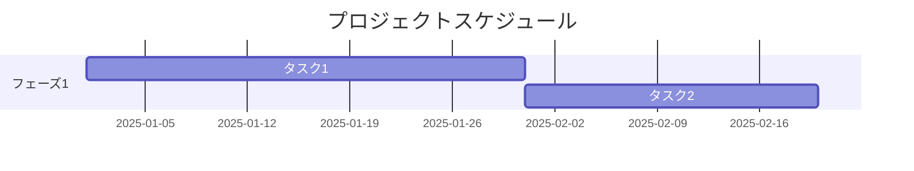

# プロジェクト計画書

## ドキュメント情報
| 項目 | 内容 |
|------|------|
| ドキュメントID | PM001 |
| バージョン | 1.0 |
| 作成日 | YYYY-MM-DD |
| 作成者 | {作成者名} |
| 承認者 | {承認者名} |
| 承認日 | YYYY-MM-DD |

## 変更履歴
| バージョン | 日付 | 変更者 | 変更内容 |
|-----------|------|--------|---------|
| 1.0 | YYYY-MM-DD | {名前} | 初版作成 |

---

## 1. プロジェクト概要

### 1.1 プロジェクト名
{プロジェクト名}

### 1.2 プロジェクト背景
{プロジェクト発足の背景・経緯}

### 1.3 プロジェクト目的
{プロジェクトの目的}

### 1.4 プロジェクト目標
| 目標項目 | 目標値 | 測定方法 |
|---------|--------|---------|
| {項目} | {値} | {方法} |

---

## 2. スコープ

### 2.1 対象範囲（In Scope）
- {対象1}
- {対象2}

### 2.2 対象外（Out of Scope）
- {対象外1}
- {対象外2}

### 2.3 前提条件
- {前提1}
- {前提2}

### 2.4 制約条件
- {制約1}
- {制約2}

---

## 3. 成果物

| 成果物 | 説明 | 納品時期 |
|--------|------|---------|
| {成果物名} | {説明} | YYYY-MM-DD |

---

## 4. 体制

### 4.1 体制図
```
                    ┌─────────────┐
                    │ プロジェクト  │
                    │ オーナー     │
                    └──────┬──────┘
                           │
                    ┌──────┴──────┐
                    │   PM        │
                    └──────┬──────┘
           ┌───────────┼───────────┐
    ┌──────┴──────┐ ┌──┴──┐ ┌──────┴──────┐
    │ 開発チーム   │ │ QA  │ │ インフラ    │
    └─────────────┘ └─────┘ └─────────────┘
```

### 4.2 役割と責任
| 役割 | 担当者 | 責務 |
|------|--------|------|
| プロジェクトオーナー | {名前} | 最終意思決定、予算承認 |
| PM | {名前} | 進捗管理、課題解決 |

---

## 5. スケジュール

### 5.1 マイルストーン
| マイルストーン | 予定日 | 完了条件 |
|--------------|--------|---------|
| {MS名} | YYYY-MM-DD | {条件} |

### 5.2 WBS概要


---

## 6. 予算

| 費目 | 金額（税抜） | 備考 |
|------|------------|------|
| 人件費 | XXX万円 | |
| 外注費 | XXX万円 | |
| その他 | XXX万円 | |
| **合計** | **XXX万円** | |

---

## 7. リスク管理

| リスクID | リスク内容 | 発生確率 | 影響度 | 対策 |
|---------|-----------|---------|--------|------|
| R-001 | {リスク} | 高/中/低 | 高/中/低 | {対策} |

---

## 8. コミュニケーション計画

| 会議体 | 目的 | 頻度 | 参加者 |
|--------|------|------|--------|
| ステコミ | 意思決定 | 月次 | PO, PM |
| 進捗会議 | 進捗確認 | 週次 | PM, PL |

---

## 9. 品質管理計画

| 指標 | 目標値 |
|------|--------|
| バグ密度 | X件/KLOC以下 |
| テストカバレッジ | XX%以上 |

---

## 10. 承認

| 役割 | 氏名 | 署名 | 日付 |
|------|------|------|------|
| プロジェクトオーナー | | | |
| PM | | | |
