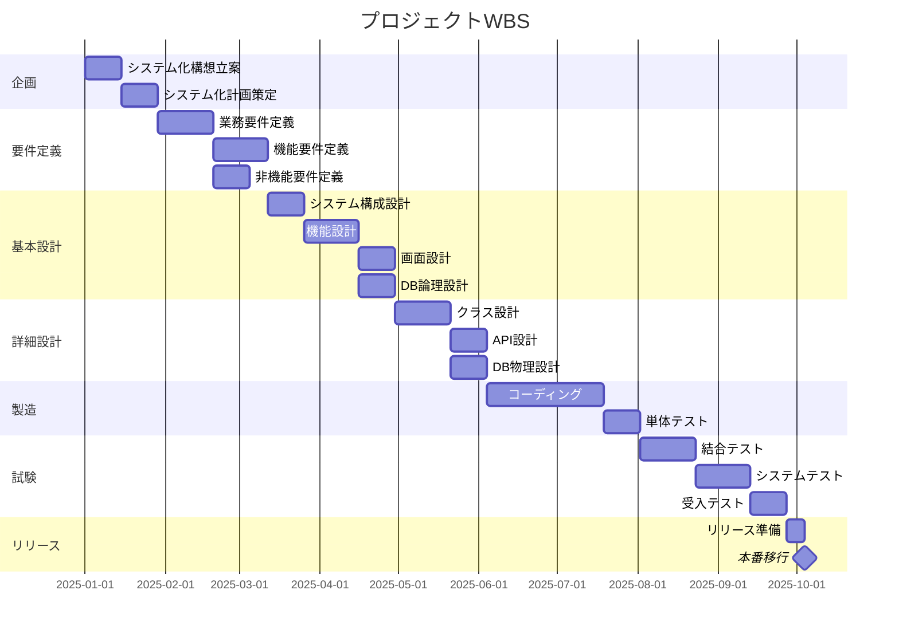

# WBS（Work Breakdown Structure）

## ドキュメント情報
| 項目 | 内容 |
|------|------|
| ドキュメントID | PM002 |
| バージョン | 1.0 |
| 作成日 | YYYY-MM-DD |
| 作成者 | {作成者名} |
| 承認者 | {承認者名} |
| 承認日 | YYYY-MM-DD |

## 変更履歴
| バージョン | 日付 | 変更者 | 変更内容 |
|-----------|------|--------|---------|
| 1.0 | YYYY-MM-DD | {名前} | 初版作成 |

---

## 1. WBS概要

### 1.1 プロジェクト名
{プロジェクト名}

### 1.2 WBS構成レベル
- Level 1: フェーズ
- Level 2: 成果物/主要タスク
- Level 3: ワークパッケージ
- Level 4: アクティビティ

---

## 2. WBS一覧

| WBS ID | タスク名 | 担当 | 開始日 | 終了日 | 工数(人日) | 進捗(%) | 先行タスク | 成果物 |
|--------|---------|------|--------|--------|-----------|---------|-----------|--------|
| 1 | **企画フェーズ** | | | | | | | |
| 1.1 | システム化構想立案 | {担当} | YYYY-MM-DD | YYYY-MM-DD | XX | 0 | - | PL001 |
| 1.2 | システム化計画策定 | {担当} | YYYY-MM-DD | YYYY-MM-DD | XX | 0 | 1.1 | PL002 |
| 2 | **要件定義フェーズ** | | | | | | | |
| 2.1 | 業務要件定義 | {担当} | YYYY-MM-DD | YYYY-MM-DD | XX | 0 | 1.2 | RD001-01 |
| 2.2 | 機能要件定義 | {担当} | YYYY-MM-DD | YYYY-MM-DD | XX | 0 | 2.1 | RD001-02 |
| 2.3 | 非機能要件定義 | {担当} | YYYY-MM-DD | YYYY-MM-DD | XX | 0 | 2.1 | RD001-03 |
| 3 | **基本設計フェーズ** | | | | | | | |
| 3.1 | システム構成設計 | {担当} | YYYY-MM-DD | YYYY-MM-DD | XX | 0 | 2.3 | BD001 |
| 3.2 | 機能設計 | {担当} | YYYY-MM-DD | YYYY-MM-DD | XX | 0 | 3.1 | BD002 |
| 3.3 | 画面設計 | {担当} | YYYY-MM-DD | YYYY-MM-DD | XX | 0 | 3.2 | BD003 |
| 3.4 | DB論理設計 | {担当} | YYYY-MM-DD | YYYY-MM-DD | XX | 0 | 3.2 | BD006 |
| 4 | **詳細設計フェーズ** | | | | | | | |
| 4.1 | クラス設計 | {担当} | YYYY-MM-DD | YYYY-MM-DD | XX | 0 | 3.4 | DD001 |
| 4.2 | API設計 | {担当} | YYYY-MM-DD | YYYY-MM-DD | XX | 0 | 4.1 | DD003 |
| 4.3 | DB物理設計 | {担当} | YYYY-MM-DD | YYYY-MM-DD | XX | 0 | 4.1 | DD002 |
| 5 | **製造フェーズ** | | | | | | | |
| 5.1 | コーディング | {担当} | YYYY-MM-DD | YYYY-MM-DD | XX | 0 | 4.3 | ソースコード |
| 5.2 | 単体テスト | {担当} | YYYY-MM-DD | YYYY-MM-DD | XX | 0 | 5.1 | IM003 |
| 6 | **試験フェーズ** | | | | | | | |
| 6.1 | 結合テスト | {担当} | YYYY-MM-DD | YYYY-MM-DD | XX | 0 | 5.2 | TS002 |
| 6.2 | システムテスト | {担当} | YYYY-MM-DD | YYYY-MM-DD | XX | 0 | 6.1 | TS003 |
| 6.3 | 受入テスト | {担当} | YYYY-MM-DD | YYYY-MM-DD | XX | 0 | 6.2 | TS004 |
| 7 | **リリースフェーズ** | | | | | | | |
| 7.1 | リリース準備 | {担当} | YYYY-MM-DD | YYYY-MM-DD | XX | 0 | 6.3 | RL001 |
| 7.2 | 本番移行 | {担当} | YYYY-MM-DD | YYYY-MM-DD | XX | 0 | 7.1 | RL003 |

---

## 3. ガントチャート

---

## 4. 工数サマリー

| フェーズ | 工数（人日） | 比率 |
|---------|------------|------|
| 企画 | XX | XX% |
| 要件定義 | XX | XX% |
| 基本設計 | XX | XX% |
| 詳細設計 | XX | XX% |
| 製造 | XX | XX% |
| 試験 | XX | XX% |
| リリース | XX | XX% |
| **合計** | **XXX** | **100%** |

---

## 5. クリティカルパス

| No | タスク | 開始日 | 終了日 | 所要日数 |
|----|--------|--------|--------|---------|
| 1 | {タスク名} | YYYY-MM-DD | YYYY-MM-DD | XX日 |
| 2 | {タスク名} | YYYY-MM-DD | YYYY-MM-DD | XX日 |

**クリティカルパス所要日数**: XX日
