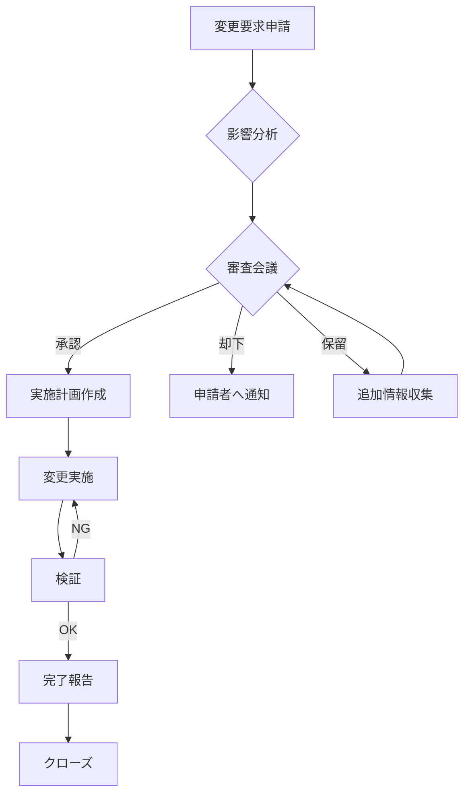

# 変更管理表

## ドキュメント情報
| 項目 | 内容 |
|------|------|
| ドキュメントID | PM006 |
| バージョン | 1.0 |
| 作成日 | YYYY-MM-DD |
| 作成者 | {作成者名} |
| 承認者 | {承認者名} |
| 承認日 | YYYY-MM-DD |

## 変更履歴
| バージョン | 日付 | 変更者 | 変更内容 |
|-----------|------|--------|---------|
| 1.0 | YYYY-MM-DD | {名前} | 初版作成 |

---

## 1. 変更要求サマリー

| ステータス | 件数 |
|-----------|------|
| 申請中 | X件 |
| 審査中 | X件 |
| 承認済 | X件 |
| 却下 | X件 |
| 完了 | X件 |
| **合計** | **XX件** |

---

## 2. 変更要求一覧

| 変更ID | 申請日 | 申請者 | 種別 | タイトル | 優先度 | ステータス | 承認日 | 完了日 |
|--------|--------|--------|------|---------|--------|-----------|--------|--------|
| CR-001 | YYYY-MM-DD | {申請者} | スコープ/スケジュール/コスト/品質 | {タイトル} | 高/中/低 | 申請中/審査中/承認済/却下/完了 | YYYY-MM-DD | YYYY-MM-DD |
| CR-002 | YYYY-MM-DD | | | | | | | |

---

## 3. 変更要求詳細

### CR-001: {変更タイトル}

| 項目 | 内容 |
|------|------|
| 変更ID | CR-001 |
| 申請日 | YYYY-MM-DD |
| 申請者 | {申請者名} |
| 種別 | スコープ/スケジュール/コスト/品質 |
| 優先度 | 高/中/低 |
| ステータス | 申請中/審査中/承認済/却下/完了 |

#### 変更内容
{変更の詳細な説明}

#### 変更理由
{変更が必要な理由}

#### 影響分析

**スコープへの影響**
- {影響内容}

**スケジュールへの影響**
| 項目 | 変更前 | 変更後 | 差異 |
|------|--------|--------|------|
| {マイルストーン} | YYYY-MM-DD | YYYY-MM-DD | +X日 |

**コストへの影響**
| 項目 | 変更前 | 変更後 | 差異 |
|------|--------|--------|------|
| 開発費 | XXX万円 | XXX万円 | +XX万円 |

**品質への影響**
- {影響内容}

**リスクへの影響**
- {新たに発生するリスク}

#### 対応案

**案1: {案の名称}**
- 概要: {概要}
- メリット: {メリット}
- デメリット: {デメリット}
- 見積工数: XX人日
- 見積コスト: XXX万円

**案2: {案の名称}**
- 概要: {概要}
- メリット: {メリット}
- デメリット: {デメリット}
- 見積工数: XX人日
- 見積コスト: XXX万円

#### 推奨案
案X を推奨。理由: {理由}

#### 審査結果

| 審査日 | 審査者 | 判定 | コメント |
|--------|--------|------|---------|
| YYYY-MM-DD | {審査者} | 承認/条件付承認/却下/保留 | {コメント} |

#### 承認

| 役割 | 氏名 | 判定 | 日付 |
|------|------|------|------|
| PM | | 承認/却下 | YYYY-MM-DD |
| PO | | 承認/却下 | YYYY-MM-DD |

#### 実施記録

| 日付 | 担当者 | 作業内容 | 成果物 |
|------|--------|---------|--------|
| YYYY-MM-DD | {担当者} | {作業内容} | {成果物} |

---

## 4. 変更管理プロセス

---

## 5. 承認権限

| 変更種別 | 影響度 | 承認者 |
|---------|--------|--------|
| スコープ変更 | 高 | PO |
| スコープ変更 | 中/低 | PM |
| スケジュール変更（1週間以上） | - | PO |
| スケジュール変更（1週間未満） | - | PM |
| コスト変更（10%以上） | - | PO |
| コスト変更（10%未満） | - | PM |
