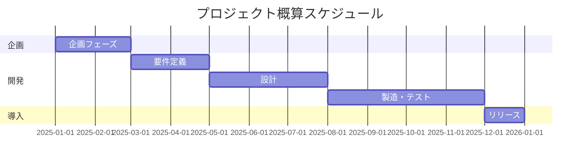

# システム化構想書

## ドキュメント情報
| 項目 | 内容 |
|------|------|
| ドキュメントID | PL001 |
| バージョン | 1.0 |
| 作成日 | YYYY-MM-DD |
| 作成者 | {作成者名} |
| 承認者 | {承認者名} |
| 承認日 | YYYY-MM-DD |

## 変更履歴
| バージョン | 日付 | 変更者 | 変更内容 |
|-----------|------|--------|---------|
| 1.0 | YYYY-MM-DD | {名前} | 初版作成 |

---

## 1. エグゼクティブサマリー

{プロジェクト全体の概要を1ページ以内で記述}

---

## 2. 背景と目的

### 2.1 事業環境の変化
- 外部環境の変化
- 内部環境の変化
- 競合状況

### 2.2 現状の課題

| 課題ID | 課題分類 | 課題内容 | 影響度 | 緊急度 |
|--------|---------|---------|--------|--------|
| ISS-001 | 業務 | {課題内容} | 高/中/低 | 高/中/低 |

### 2.3 システム化の目的
- 目的1: {具体的な目的}
- 目的2: {具体的な目的}

---

## 3. システム化の方向性

### 3.1 対象業務の範囲

```
【対象範囲図】
┌─────────────────────────────────────┐
│           対象範囲                    │
│  ┌─────────┐    ┌─────────┐         │
│  │ 業務A    │    │ 業務B    │         │
│  └─────────┘    └─────────┘         │
└─────────────────────────────────────┘
```

### 3.2 基本方針
1. {方針1}
2. {方針2}
3. {方針3}

### 3.3 期待される効果

#### 定量効果
| 効果項目 | 現状 | 目標 | 改善率 |
|---------|------|------|--------|
| 処理時間 | XX時間 | YY時間 | ZZ% |
| コスト | XX万円 | YY万円 | ZZ% |

#### 定性効果
- {効果1}
- {効果2}

---

## 4. 実現可能性評価

### 4.1 技術的実現可能性
| 評価項目 | 評価 | 備考 |
|---------|------|------|
| 技術成熟度 | ○/△/× | {理由} |
| 社内スキル | ○/△/× | {理由} |
| ベンダー対応 | ○/△/× | {理由} |

### 4.2 運用面の実現可能性
| 評価項目 | 評価 | 備考 |
|---------|------|------|
| 運用体制 | ○/△/× | {理由} |
| 教育・研修 | ○/△/× | {理由} |

### 4.3 組織的実現可能性
| 評価項目 | 評価 | 備考 |
|---------|------|------|
| 経営層支援 | ○/△/× | {理由} |
| 現場受容性 | ○/△/× | {理由} |

---

## 5. 概算スケジュール



---

## 6. 概算費用

| 費用項目 | 概算金額 | 備考 |
|---------|---------|------|
| 初期費用 | XXX万円 | |
| ├ ハードウェア | XXX万円 | |
| ├ ソフトウェア | XXX万円 | |
| ├ 開発費 | XXX万円 | |
| └ その他 | XXX万円 | |
| 運用費用（年間） | XXX万円 | |
| **合計（5年間）** | **XXX万円** | |

---

## 7. リスクと対策

| リスクID | リスク内容 | 発生確率 | 影響度 | 対策 |
|---------|-----------|---------|--------|------|
| R-001 | {リスク} | 高/中/低 | 高/中/低 | {対策} |

---

## 8. 次のステップ

1. {アクション1} - 担当: {担当者} - 期限: YYYY-MM-DD
2. {アクション2} - 担当: {担当者} - 期限: YYYY-MM-DD
