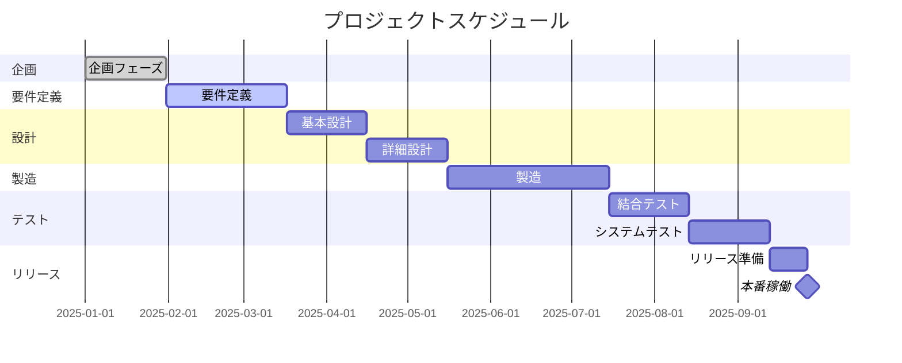

# システム化計画書

## ドキュメント情報
| 項目 | 内容 |
|------|------|
| ドキュメントID | PL002 |
| バージョン | 1.0 |
| 作成日 | YYYY-MM-DD |
| 作成者 | {作成者名} |
| 承認者 | {承認者名} |
| 承認日 | YYYY-MM-DD |

## 変更履歴
| バージョン | 日付 | 変更者 | 変更内容 |
|-----------|------|--------|---------|
| 1.0 | YYYY-MM-DD | {名前} | 初版作成 |

---

## 1. プロジェクト概要

### 1.1 プロジェクト名
{プロジェクト名}

### 1.2 プロジェクト目的
{目的の記述}

### 1.3 プロジェクト目標
| 目標項目 | 目標値 | 測定方法 |
|---------|--------|---------|
| {項目} | {値} | {方法} |

---

## 2. スコープ定義

### 2.1 対象範囲（In Scope）
- {対象1}
- {対象2}

### 2.2 対象外（Out of Scope）
- {対象外1}
- {対象外2}

### 2.3 前提条件
- {前提1}
- {前提2}

### 2.4 制約条件
- {制約1}
- {制約2}

---

## 3. 開発方針

### 3.1 開発手法
- [ ] ウォーターフォール
- [ ] アジャイル（スクラム）
- [ ] ハイブリッド

### 3.2 技術方針
| 項目 | 方針 |
|------|------|
| 言語 | {言語} |
| フレームワーク | {FW} |
| インフラ | {クラウド/オンプレ} |
| DB | {RDBMS名} |

---

## 4. 体制計画

### 4.1 体制図

```
                    ┌─────────────┐
                    │ プロジェクト  │
                    │ オーナー     │
                    └──────┬──────┘
                           │
                    ┌──────┴──────┐
                    │   PM        │
                    └──────┬──────┘
           ┌───────────┼───────────┐
    ┌──────┴──────┐ ┌──┴──┐ ┌──────┴──────┐
    │ 開発チーム   │ │ QA  │ │ インフラ    │
    └─────────────┘ └─────┘ └─────────────┘
```

### 4.2 役割定義

| 役割 | 担当者 | 責務 |
|------|--------|------|
| プロジェクトオーナー | {名前} | 最終意思決定、予算承認 |
| PM | {名前} | 進捗管理、課題解決 |
| PL | {名前} | 技術リード、品質管理 |

### 4.3 RACI表

| タスク | PO | PM | PL | 開発 | QA |
|--------|----|----|----|----|-----|
| 要件承認 | A | R | C | I | I |
| 設計レビュー | I | A | R | C | C |
| コーディング | I | I | A | R | I |
| テスト | I | I | A | C | R |

※ R=Responsible, A=Accountable, C=Consulted, I=Informed

---

## 5. スケジュール計画

### 5.1 マイルストーン

| マイルストーン | 予定日 | 完了条件 |
|--------------|--------|---------|
| 要件定義完了 | YYYY-MM-DD | 要件定義書承認 |
| 基本設計完了 | YYYY-MM-DD | 基本設計書承認 |
| 製造完了 | YYYY-MM-DD | 単体テスト完了 |
| リリース | YYYY-MM-DD | 本番稼働開始 |

### 5.2 WBS概要



---

## 6. 予算計画

### 6.1 費用内訳

| 費目 | 金額（税抜） | 備考 |
|------|------------|------|
| 人件費 | XXX万円 | XX人月 × YY万円 |
| 外注費 | XXX万円 | |
| ハードウェア | XXX万円 | |
| ソフトウェア | XXX万円 | ライセンス費 |
| その他 | XXX万円 | |
| **合計** | **XXX万円** | |
| 予備費（10%） | XXX万円 | |
| **総計** | **XXX万円** | |

### 6.2 月別予算計画

| 月 | 予算 | 累計 |
|----|------|------|
| 1月 | XX万円 | XX万円 |
| 2月 | XX万円 | XX万円 |
| ... | ... | ... |

---

## 7. リスク管理計画

### 7.1 リスク一覧

| ID | リスク | 発生確率 | 影響度 | リスクスコア | 対策 | 担当 |
|----|--------|---------|--------|------------|------|------|
| R-001 | {リスク内容} | 高(3)/中(2)/低(1) | 高(3)/中(2)/低(1) | {スコア} | {対策} | {担当} |

### 7.2 リスク対応方針
- 回避: {方針}
- 軽減: {方針}
- 転嫁: {方針}
- 受容: {方針}

---

## 8. コミュニケーション計画

| 会議体 | 目的 | 頻度 | 参加者 | 成果物 |
|--------|------|------|--------|--------|
| ステコミ | 意思決定 | 月次 | PO, PM | 議事録 |
| 進捗会議 | 進捗確認 | 週次 | PM, PL, 開発 | 進捗報告書 |
| デイリー | 日次共有 | 日次 | 開発チーム | - |

---

## 9. 品質管理計画

### 9.1 品質目標

| 指標 | 目標値 |
|------|--------|
| バグ密度 | X件/KLOC以下 |
| テストカバレッジ | XX%以上 |
| 重大障害 | 0件 |

### 9.2 レビュー計画

| レビュー対象 | 実施タイミング | レビューア |
|-------------|--------------|-----------|
| 要件定義書 | 要件定義完了時 | PO, PM |
| 設計書 | 各設計完了時 | PL, 有識者 |
| ソースコード | 実装完了時 | PL, 開発者 |

---

## 10. 承認

| 役割 | 氏名 | 署名 | 日付 |
|------|------|------|------|
| プロジェクトオーナー | | | |
| PM | | | |
