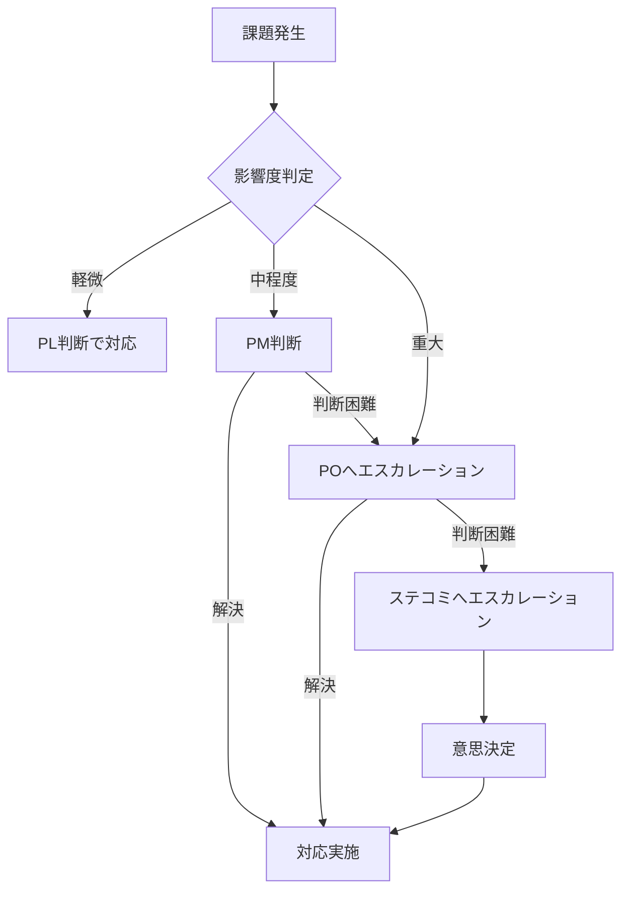

# プロジェクト体制図

## ドキュメント情報
| 項目 | 内容 |
|------|------|
| ドキュメントID | PL004 |
| バージョン | 1.0 |
| 作成日 | YYYY-MM-DD |
| 作成者 | {作成者名} |
| 承認者 | {承認者名} |
| 承認日 | YYYY-MM-DD |

## 変更履歴
| バージョン | 日付 | 変更者 | 変更内容 |
|-----------|------|--------|---------|
| 1.0 | YYYY-MM-DD | {名前} | 初版作成 |

---

## 1. プロジェクト体制図

```
                        ┌─────────────────────┐
                        │   ステアリング       │
                        │   コミッティ         │
                        │   {役員名}           │
                        └──────────┬──────────┘
                                   │
                        ┌──────────┴──────────┐
                        │  プロジェクト        │
                        │  オーナー（PO）      │
                        │  {PO名}             │
                        └──────────┬──────────┘
                                   │
                        ┌──────────┴──────────┐
                        │  プロジェクト        │
                        │  マネージャー（PM）  │
                        │  {PM名}             │
                        └──────────┬──────────┘
                                   │
        ┌──────────────┬───────────┼───────────┬──────────────┐
        │              │           │           │              │
┌───────┴───────┐┌─────┴─────┐┌────┴────┐┌─────┴─────┐┌───────┴───────┐
│ 開発チーム    ││  QAチーム  ││インフラ ││ 業務チーム ││  PMO          │
│ PL: {名前}   ││ {名前}    ││ {名前}  ││ {名前}    ││ {名前}       │
│              ││           ││         ││           ││              │
│ ・{メンバー} ││・{メンバー}││・{メンバー}││・{メンバー}││・{メンバー}   │
│ ・{メンバー} ││・{メンバー}││・{メンバー}││・{メンバー}││              │
│ ・{メンバー} ││           ││         ││           ││              │
└───────────────┘└───────────┘└─────────┘└───────────┘└───────────────┘
```

---

## 2. 役割と責任

| 役割 | 担当者 | 所属 | 責務 |
|------|--------|------|------|
| ステアリングコミッティ | {役員名} | {部門} | 重要事項の意思決定、予算承認 |
| プロジェクトオーナー（PO） | {PO名} | {部門} | プロジェクト全体責任、最終意思決定 |
| プロジェクトマネージャー（PM） | {PM名} | {部門} | 進捗管理、課題解決、ステークホルダー調整 |
| プロジェクトリーダー（PL） | {PL名} | {部門} | 技術リード、設計・実装の品質管理 |
| 開発メンバー | {名前} | {部門/会社} | 設計・開発・テスト |
| QAリーダー | {名前} | {部門} | 品質管理、テスト計画・実行 |
| インフラ担当 | {名前} | {部門} | インフラ設計・構築・運用 |
| 業務担当 | {名前} | {部門} | 要件確認、受入テスト、ユーザー教育 |
| PMO | {名前} | {部門} | 標準化、進捗管理支援、報告書作成 |

---

## 3. RACI表

| タスク/成果物 | ステコミ | PO | PM | PL | 開発 | QA | インフラ | 業務 |
|--------------|---------|----|----|----|----|----|----|------|
| プロジェクト計画承認 | A | R | R | C | I | I | I | C |
| 要件定義 | I | A | R | C | C | I | I | R |
| 要件承認 | I | A | R | C | I | I | I | R |
| 基本設計 | I | I | A | R | C | C | C | C |
| 詳細設計 | I | I | A | R | R | C | C | I |
| 実装 | I | I | I | A | R | I | I | I |
| 単体テスト | I | I | I | A | R | C | I | I |
| 結合テスト | I | I | A | C | C | R | C | I |
| システムテスト | I | I | A | C | I | R | C | C |
| 受入テスト | I | A | R | I | I | C | I | R |
| インフラ構築 | I | I | A | C | I | I | R | I |
| リリース判定 | A | R | R | C | I | C | C | C |
| 運用引継ぎ | I | A | R | C | C | I | R | R |

**凡例**: R=Responsible（実行責任）, A=Accountable（説明責任）, C=Consulted（相談）, I=Informed（報告）

---

## 4. エスカレーションルート



### エスカレーション基準

| 区分 | 条件 | エスカレーション先 | 対応期限 |
|------|------|-------------------|---------|
| 軽微 | スケジュール影響なし、コスト影響なし | PL | 随時 |
| 中程度 | スケジュール1週間以内の遅延、コスト5%未満増 | PM | 1営業日以内 |
| 重大 | スケジュール1週間超の遅延、コスト5%以上増、品質基準未達 | PO | 即時 |
| 最重大 | プロジェクト継続判断が必要 | ステコミ | 即時 |

---

## 5. コミュニケーション計画

| 会議体 | 目的 | 頻度 | 参加者 | 主催 | 成果物 |
|--------|------|------|--------|------|--------|
| ステアリング | 重要事項決裁 | 月次 | ステコミ, PO, PM | PM | 議事録 |
| 進捗報告会 | 進捗確認・課題共有 | 週次 | PO, PM, PL, リーダー | PM | 進捗報告書 |
| チーム定例 | 日次進捗・課題共有 | 日次 | 各チームメンバー | PL | - |
| 技術レビュー | 設計・コードレビュー | 随時 | PL, 開発メンバー | PL | レビュー記録 |
| 課題検討会 | 課題解決協議 | 随時 | 関係者 | PM | 課題管理表 |

---

## 6. メンバー一覧

| No | 氏名 | 役割 | 所属 | 参画期間 | 稼働率 | スキル | 連絡先 |
|----|------|------|------|---------|--------|--------|--------|
| 1 | {名前} | PM | {部門/会社} | YYYY/MM〜YYYY/MM | 100% | {スキル} | {メール} |
| 2 | {名前} | PL | {部門/会社} | YYYY/MM〜YYYY/MM | 100% | {スキル} | {メール} |
| 3 | {名前} | 開発 | {部門/会社} | YYYY/MM〜YYYY/MM | 100% | {スキル} | {メール} |
| 4 | {名前} | 開発 | {部門/会社} | YYYY/MM〜YYYY/MM | 50% | {スキル} | {メール} |
| 5 | {名前} | QA | {部門/会社} | YYYY/MM〜YYYY/MM | 50% | {スキル} | {メール} |

---

## 7. 外部ステークホルダー

| 区分 | 組織/担当者 | 役割 | 連絡先 |
|------|-----------|------|--------|
| 発注元 | {会社名} / {担当者名} | 要件提示、受入確認 | {連絡先} |
| 開発ベンダー | {会社名} / {担当者名} | 開発実施 | {連絡先} |
| インフラベンダー | {会社名} / {担当者名} | インフラ提供 | {連絡先} |
| 運用ベンダー | {会社名} / {担当者名} | 運用サポート | {連絡先} |
