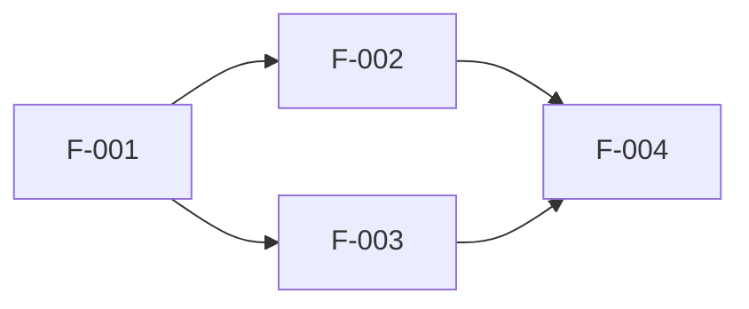

# 機能要件定義書

## ドキュメント情報

| 項目 | 内容 |
|------|------|
| ドキュメントID | RD001-02 |
| ドキュメント名 | 機能要件定義書 |
| プロジェクト名 | {プロジェクト名} |
| バージョン | {バージョン} |
| ステータス | 作成中/レビュー中/承認済み |
| 作成日 | {YYYY-MM-DD} |
| 作成者 | {作成者名} |
| 最終更新日 | {YYYY-MM-DD} |
| 最終更新者 | {更新者名} |
| 承認者 | {承認者名} |
| 承認日 | {YYYY-MM-DD} |

## 変更履歴

| バージョン | 日付 | 変更者 | 変更内容 |
|-----------|------|--------|----------|
| 0.1 | {YYYY-MM-DD} | {変更者名} | 初版作成 |
| | | | |

---

## 1. 機能要件概要

### 1.1 目的

{機能要件定義の目的を記述}

### 1.2 対象システム

{対象となるシステムの範囲を記述}

### 1.3 参照ドキュメント

| ドキュメント名 | ドキュメントID | バージョン |
|---------------|---------------|-----------|
| 業務要件定義書 | RD001-01 | {バージョン} |
| {その他参照ドキュメント} | {ID} | {バージョン} |

---

## 2. 機能要件一覧

### 2.1 機能分類

| 大分類 | 中分類 | 小分類 | 説明 |
|--------|--------|--------|------|
| {大分類名} | {中分類名} | {小分類名} | {分類の説明} |
| | | | |

### 2.2 機能一覧

| 機能ID | 機能名 | 機能概要 | 機能分類 | 優先度 | 関連業務要件 | 備考 |
|--------|--------|----------|----------|--------|--------------|------|
| F-001 | {機能名} | {機能の概要} | {大分類>中分類>小分類} | Must/Should/Could/Won't | {BR-xxx} | {備考} |
| F-002 | {機能名} | {機能の概要} | {大分類>中分類>小分類} | Must/Should/Could/Won't | {BR-xxx} | {備考} |
| F-003 | {機能名} | {機能の概要} | {大分類>中分類>小分類} | Must/Should/Could/Won't | {BR-xxx} | {備考} |
| | | | | | | |

---

## 3. 機能詳細定義

### 3.1 {機能名1} (F-001)

#### 3.1.1 機能概要

| 項目 | 内容 |
|------|------|
| 機能ID | F-001 |
| 機能名 | {機能名} |
| 機能概要 | {機能の詳細な説明} |
| 利用者 | {利用者/ロール} |
| 利用シーン | {利用される場面} |
| 優先度 | Must/Should/Could/Won't |

#### 3.1.2 入力

| 入力項目 | データ型 | 必須 | 入力元 | 検証ルール | 備考 |
|----------|----------|------|--------|------------|------|
| {入力項目名1} | {String/Number/Date/Boolean/その他} | ○/- | {画面/API/バッチ/その他} | {検証条件} | {備考} |
| {入力項目名2} | {String/Number/Date/Boolean/その他} | ○/- | {画面/API/バッチ/その他} | {検証条件} | {備考} |
| | | | | | |

#### 3.1.3 処理内容

1. {処理ステップ1の説明}
2. {処理ステップ2の説明}
3. {処理ステップ3の説明}

**処理フロー図:**

```mermaid
graph TD
    Start[処理開始] --> Input[入力受付]
    Input --> Validate{検証}
    Validate -->|OK| Process[{処理内容}]
    Validate -->|NG| Error[エラー処理]
    Process --> Output[出力生成]
    Output --> End[処理終了]
    Error --> End
```

#### 3.1.4 出力

| 出力項目 | データ型 | 出力先 | 出力条件 | 備考 |
|----------|----------|--------|----------|------|
| {出力項目名1} | {String/Number/Date/Boolean/その他} | {画面/DB/ファイル/API/その他} | {出力される条件} | {備考} |
| {出力項目名2} | {String/Number/Date/Boolean/その他} | {画面/DB/ファイル/API/その他} | {出力される条件} | {備考} |
| | | | | |

#### 3.1.5 ビジネスルール

| ルールID | ルール内容 | 適用条件 | 例外処理 |
|----------|------------|----------|----------|
| BL-{xxx} | {ビジネスルールの詳細} | {適用される条件} | {例外時の処理} |
| | | | |

#### 3.1.6 画面・帳票

| 種別 | ID | 名称 | 備考 |
|------|-----|------|------|
| 画面 | {SC-xxx} | {画面名} | {備考} |
| 帳票 | {RP-xxx} | {帳票名} | {備考} |

#### 3.1.7 データアクセス

| 操作 | エンティティ/テーブル | 処理内容 |
|------|---------------------|----------|
| {Create/Read/Update/Delete} | {エンティティ名} | {処理の説明} |
| | | |

#### 3.1.8 外部連携

| 連携先 | IF-ID | 連携内容 | タイミング |
|--------|-------|----------|------------|
| {連携先システム名} | {IF-xxx} | {連携する内容} | {連携タイミング} |
| | | | |

#### 3.1.9 エラー処理

| エラーコード | エラー内容 | エラー条件 | エラーメッセージ | 対処方法 |
|-------------|------------|------------|------------------|----------|
| {E-xxx} | {エラーの種類} | {発生条件} | {ユーザーに表示するメッセージ} | {対処方法} |
| | | | | |

#### 3.1.10 性能要件

| 項目 | 要件 |
|------|------|
| 応答時間 | {x}秒以内 |
| 処理件数 | {y}件/時間 |
| 同時実行数 | {z}ユーザー |

#### 3.1.11 制約事項

- {制約事項1}
- {制約事項2}

---

### 3.2 {機能名2} (F-002)

#### 3.2.1 機能概要

| 項目 | 内容 |
|------|------|
| 機能ID | F-002 |
| 機能名 | {機能名} |
| 機能概要 | {機能の詳細な説明} |
| 利用者 | {利用者/ロール} |
| 利用シーン | {利用される場面} |
| 優先度 | Must/Should/Could/Won't |

#### 3.2.2 入力

| 入力項目 | データ型 | 必須 | 入力元 | 検証ルール | 備考 |
|----------|----------|------|--------|------------|------|
| {入力項目名1} | {String/Number/Date/Boolean/その他} | ○/- | {画面/API/バッチ/その他} | {検証条件} | {備考} |
| | | | | | |

#### 3.2.3 処理内容

1. {処理ステップ1の説明}
2. {処理ステップ2の説明}

#### 3.2.4 出力

| 出力項目 | データ型 | 出力先 | 出力条件 | 備考 |
|----------|----------|--------|----------|------|
| {出力項目名1} | {String/Number/Date/Boolean/その他} | {画面/DB/ファイル/API/その他} | {出力される条件} | {備考} |
| | | | | |

#### 3.2.5 ビジネスルール

| ルールID | ルール内容 | 適用条件 | 例外処理 |
|----------|------------|----------|----------|
| BL-{xxx} | {ビジネスルールの詳細} | {適用される条件} | {例外時の処理} |
| | | | |

---

## 4. MoSCoW優先度分類

### 4.1 Must (必須)

必須機能。システムリリースに不可欠な機能。

| 機能ID | 機能名 | 理由 |
|--------|--------|------|
| F-{xxx} | {機能名} | {必須である理由} |
| | | |

### 4.2 Should (重要)

重要機能。できる限り実装すべき機能。

| 機能ID | 機能名 | 理由 | 代替案 |
|--------|--------|------|--------|
| F-{xxx} | {機能名} | {重要である理由} | {実装できない場合の代替案} |
| | | | |

### 4.3 Could (可能であれば)

あれば望ましい機能。リソースに余裕があれば実装する。

| 機能ID | 機能名 | 理由 | 優先順位 |
|--------|--------|------|----------|
| F-{xxx} | {機能名} | {あれば望ましい理由} | {1/2/3...} |
| | | | |

### 4.4 Won't (今回は対象外)

今回のリリースでは実装しない機能。将来的な実装を検討。

| 機能ID | 機能名 | 理由 | 将来的な検討 |
|--------|--------|------|--------------|
| F-{xxx} | {機能名} | {対象外とする理由} | {将来実装する可能性} |
| | | | |

---

## 5. 機能間の関連

### 5.1 機能依存関係

| 機能ID | 機能名 | 依存先機能ID | 依存内容 |
|--------|--------|--------------|----------|
| F-{xxx} | {機能名} | F-{yyy} | {依存関係の説明} |
| | | | |

### 5.2 機能実装順序



---

## 6. 機能要件のトレーサビリティ

| 業務要件ID | 業務要件名 | 機能要件ID | 機能要件名 | カバー状況 |
|-----------|------------|------------|------------|------------|
| BR-{xxx} | {業務要件名} | F-{xxx} | {機能名} | {完全/部分/未カバー} |
| | | | | |

---

## 7. 用語集

| 用語 | 定義 | 備考 |
|------|------|------|
| {用語1} | {定義} | {備考} |
| {用語2} | {定義} | {備考} |
| | | |

---

## 8. 添付資料

| 資料名 | ファイル名 | 説明 |
|--------|-----------|------|
| {資料名} | {ファイル名} | {資料の説明} |
| | | |

---

## 承認

| 役割 | 氏名 | 承認日 | 署名 |
|------|------|--------|------|
| 業務部門責任者 | {氏名} | {YYYY-MM-DD} | |
| システム部門責任者 | {氏名} | {YYYY-MM-DD} | |
| プロジェクトマネージャー | {氏名} | {YYYY-MM-DD} | |

---

**文書の終わり**
