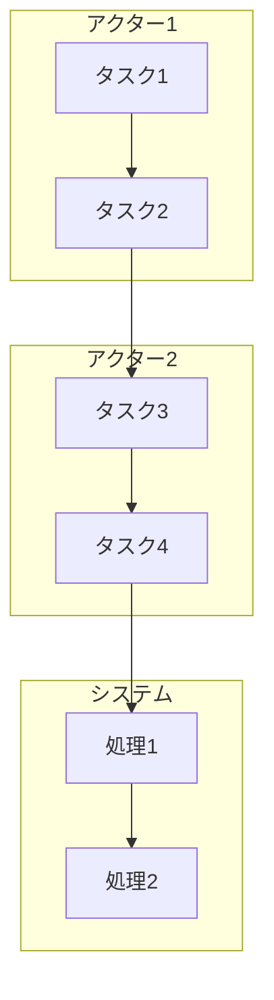
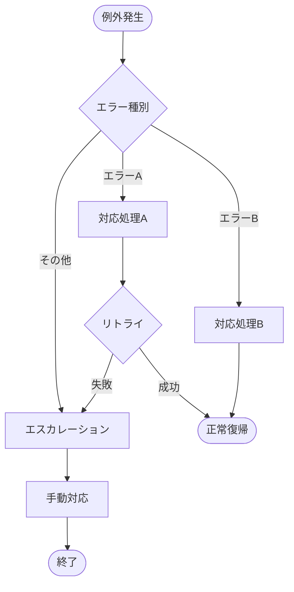
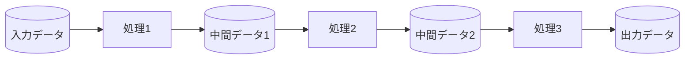

# 業務フロー図

## ドキュメント情報

| 項目 | 内容 |
|------|------|
| ドキュメントID | RD002 |
| ドキュメント名 | 業務フロー図 |
| プロジェクト名 | {プロジェクト名} |
| バージョン | {バージョン} |
| ステータス | 作成中/レビュー中/承認済み |
| 作成日 | {YYYY-MM-DD} |
| 作成者 | {作成者名} |
| 最終更新日 | {YYYY-MM-DD} |
| 最終更新者 | {更新者名} |
| 承認者 | {承認者名} |
| 承認日 | {YYYY-MM-DD} |

## 変更履歴

| バージョン | 日付 | 変更者 | 変更内容 |
|-----------|------|--------|----------|
| 0.1 | {YYYY-MM-DD} | {変更者名} | 初版作成 |
| | | | |

---

## 1. 概要

### 1.1 目的

{業務フロー図の目的を記述}

### 1.2 対象業務

{対象となる業務の範囲を記述}

### 1.3 参照ドキュメント

| ドキュメント名 | ドキュメントID | バージョン |
|---------------|---------------|-----------|
| 業務要件定義書 | RD001-01 | {バージョン} |
| {その他参照ドキュメント} | {ID} | {バージョン} |

---

## 2. アクター定義

### 2.1 アクター一覧

| アクターID | アクター名 | 役割 | 所属/権限 | 備考 |
|-----------|-----------|------|----------|------|
| ACT-001 | {アクター名1} | {役割の説明} | {所属部門/権限レベル} | {備考} |
| ACT-002 | {アクター名2} | {役割の説明} | {所属部門/権限レベル} | {備考} |
| ACT-003 | {アクター名3} | {役割の説明} | {所属部門/権限レベル} | {備考} |
| | | | | |

### 2.2 システムアクター

| アクターID | システム名 | 役割 | 連携方式 | 備考 |
|-----------|-----------|------|----------|------|
| SYS-001 | {システム名1} | {役割の説明} | {API/バッチ/その他} | {備考} |
| SYS-002 | {システム名2} | {役割の説明} | {API/バッチ/その他} | {備考} |
| | | | | |

---

## 3. 業務フロー (BPMN)

### 3.1 {業務プロセス名1} - 全体フロー

#### 3.1.1 フロー概要

| 項目 | 内容 |
|------|------|
| プロセスID | BP-001 |
| プロセス名 | {業務プロセス名} |
| 概要 | {プロセスの概要説明} |
| トリガー | {開始条件/トリガーイベント} |
| 終了条件 | {正常終了条件} |
| 所要時間 | {想定所要時間} |
| 頻度 | {実行頻度} |

#### 3.1.2 業務フロー図

```mermaid
graph TD
    Start([開始]) --> Task1[{タスク1}]
    Task1 --> Gateway1{条件分岐}
    Gateway1 -->|条件A| Task2A[{タスク2A}]
    Gateway1 -->|条件B| Task2B[{タスク2B}]
    Task2A --> Task3[{タスク3}]
    Task2B --> Task3
    Task3 --> End([終了])
```

#### 3.1.3 タスク詳細

| タスクID | タスク名 | 担当アクター | 処理内容 | インプット | アウトプット | 使用システム/機能 |
|---------|---------|-------------|----------|-----------|-------------|------------------|
| T-001 | {タスク1} | {ACT-xxx} | {処理の説明} | {インプット} | {アウトプット} | {システム/機能ID} |
| T-002 | {タスク2A} | {ACT-xxx} | {処理の説明} | {インプット} | {アウトプット} | {システム/機能ID} |
| T-003 | {タスク2B} | {ACT-xxx} | {処理の説明} | {インプット} | {アウトプット} | {システム/機能ID} |
| T-004 | {タスク3} | {ACT-xxx} | {処理の説明} | {インプット} | {アウトプット} | {システム/機能ID} |
| | | | | | | |

#### 3.1.4 分岐条件

| 分岐点ID | 分岐条件 | 分岐先 | 判定ルール |
|---------|---------|--------|-----------|
| GW-001 | 条件A | タスク2A | {判定条件の詳細} |
| GW-001 | 条件B | タスク2B | {判定条件の詳細} |
| | | | |

---

### 3.2 {業務プロセス名2} - 詳細フロー

#### 3.2.1 フロー概要

| 項目 | 内容 |
|------|------|
| プロセスID | BP-002 |
| プロセス名 | {業務プロセス名} |
| 概要 | {プロセスの概要説明} |
| トリガー | {開始条件/トリガーイベント} |
| 終了条件 | {正常終了条件} |
| 所要時間 | {想定所要時間} |
| 頻度 | {実行頻度} |

#### 3.2.2 業務フロー図 (スイムレーン形式)



#### 3.2.3 タスク詳細

| タスクID | タスク名 | 担当アクター | 処理内容 | インプット | アウトプット | 使用システム/機能 |
|---------|---------|-------------|----------|-----------|-------------|------------------|
| T-005 | {タスク1} | {ACT-xxx} | {処理の説明} | {インプット} | {アウトプット} | {システム/機能ID} |
| T-006 | {タスク2} | {ACT-xxx} | {処理の説明} | {インプット} | {アウトプット} | {システム/機能ID} |
| | | | | | | |

---

### 3.3 {業務プロセス名3} - 例外処理フロー

#### 3.3.1 フロー概要

| 項目 | 内容 |
|------|------|
| プロセスID | BP-003 |
| プロセス名 | {業務プロセス名} |
| 概要 | {プロセスの概要説明} |
| トリガー | {例外発生条件} |
| 終了条件 | {例外処理完了条件} |

#### 3.3.2 例外処理フロー図



#### 3.3.3 例外シナリオ

| 例外ID | 例外シナリオ | 発生条件 | 対応処理 | エスカレーション | 備考 |
|--------|------------|---------|---------|----------------|------|
| EX-001 | {例外シナリオ名} | {発生する条件} | {対応処理の内容} | {エスカレーション先} | {備考} |
| EX-002 | {例外シナリオ名} | {発生する条件} | {対応処理の内容} | {エスカレーション先} | {備考} |
| | | | | | |

---

## 4. プロセス間連携

### 4.1 プロセス関連図

```mermaid
graph LR
    BP001[BP-001<br/>{プロセス名1}] --> BP002[BP-002<br/>{プロセス名2}]
    BP001 --> BP003[BP-003<br/>{プロセス名3}]
    BP002 --> BP004[BP-004<br/>{プロセス名4}]
    BP003 --> BP004
```

### 4.2 プロセス連携詳細

| 連携元プロセス | 連携先プロセス | 連携トリガー | 受け渡しデータ | 備考 |
|--------------|--------------|-------------|--------------|------|
| BP-001 | BP-002 | {トリガー条件} | {データ内容} | {備考} |
| BP-001 | BP-003 | {トリガー条件} | {データ内容} | {備考} |
| | | | | |

---

## 5. データフロー

### 5.1 主要データフロー図



### 5.2 データフロー詳細

| データID | データ名 | 発生元 | 送信先 | データ形式 | タイミング | 備考 |
|---------|---------|--------|--------|-----------|-----------|------|
| DF-001 | {データ名} | {発生元} | {送信先} | {CSV/JSON/XML/その他} | {タイミング} | {備考} |
| DF-002 | {データ名} | {発生元} | {送信先} | {CSV/JSON/XML/その他} | {タイミング} | {備考} |
| | | | | | | |

---

## 6. ビジネスルール適用箇所

### 6.1 ルール適用マトリクス

| プロセスID | タスクID | 適用ルールID | ルール名 | ルール内容 |
|-----------|---------|-------------|---------|-----------|
| BP-001 | T-001 | BL-{xxx} | {ルール名} | {ルール内容の要約} |
| BP-001 | T-003 | BL-{yyy} | {ルール名} | {ルール内容の要約} |
| | | | | |

---

## 7. 性能要件とフロー

### 7.1 処理時間要件

| プロセスID | プロセス名 | 目標処理時間 | ピーク時処理件数 | ボトルネック箇所 | 対策 |
|-----------|-----------|-------------|----------------|----------------|------|
| BP-001 | {プロセス名} | {x}秒/分/時間 | {y}件/時間 | {タスクID} | {対策内容} |
| | | | | | |

---

## 8. As-Is / To-Be 比較

### 8.1 業務フロー比較

| 比較項目 | As-Is (現行) | To-Be (新業務) | 改善効果 |
|---------|-------------|---------------|----------|
| 処理ステップ数 | {x}ステップ | {y}ステップ | {削減率}% |
| 所要時間 | {x}時間/分 | {y}時間/分 | {短縮率}% |
| 手作業割合 | {x}% | {y}% | {削減率}% |
| システム化範囲 | {範囲} | {範囲} | {拡大内容} |

### 8.2 主要変更点

| 変更箇所 | As-Is | To-Be | 変更理由 |
|---------|-------|-------|---------|
| {箇所1} | {現行の処理} | {新業務の処理} | {変更理由} |
| {箇所2} | {現行の処理} | {新業務の処理} | {変更理由} |
| | | | |

---

## 9. BPMN記法凡例

### 9.1 基本要素

| 記号 | 要素名 | 説明 |
|------|--------|------|
| ([ ]) | 開始イベント | プロセスの開始点 |
| ([ ]) | 終了イベント | プロセスの終了点 |
| [ ] | タスク | 実行される作業 |
| { } | ゲートウェイ | 分岐・合流点 |
| → | シーケンスフロー | 処理の流れ |

### 9.2 ゲートウェイ種別

| 記号 | 種別 | 説明 |
|------|------|------|
| ◇ | 排他ゲートウェイ | いずれか1つの経路を選択 |
| ◇+ | 並行ゲートウェイ | すべての経路を並行実行 |
| ◇○ | 包含ゲートウェイ | 条件を満たす経路を実行 |

---

## 10. 用語集

| 用語 | 定義 | 備考 |
|------|------|------|
| BPMN | Business Process Model and Notation | 業務プロセスモデリング表記法 |
| スイムレーン | 担当者/部門ごとに区切られた領域 | プロセス図での責任範囲の明確化 |
| {用語} | {定義} | {備考} |

---

## 11. 添付資料

| 資料名 | ファイル名 | 説明 |
|--------|-----------|------|
| {資料名} | {ファイル名} | {資料の説明} |
| | | |

---

## 承認

| 役割 | 氏名 | 承認日 | 署名 |
|------|------|--------|------|
| 業務部門責任者 | {氏名} | {YYYY-MM-DD} | |
| システム部門責任者 | {氏名} | {YYYY-MM-DD} | |
| プロジェクトマネージャー | {氏名} | {YYYY-MM-DD} | |

---

**文書の終わり**
