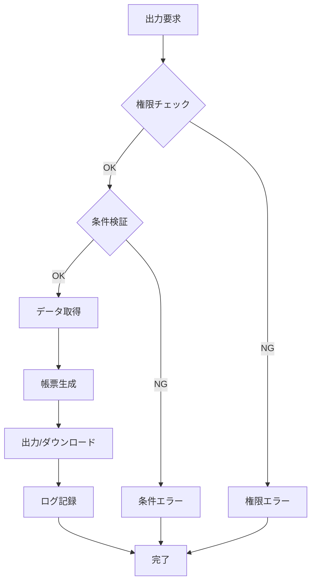
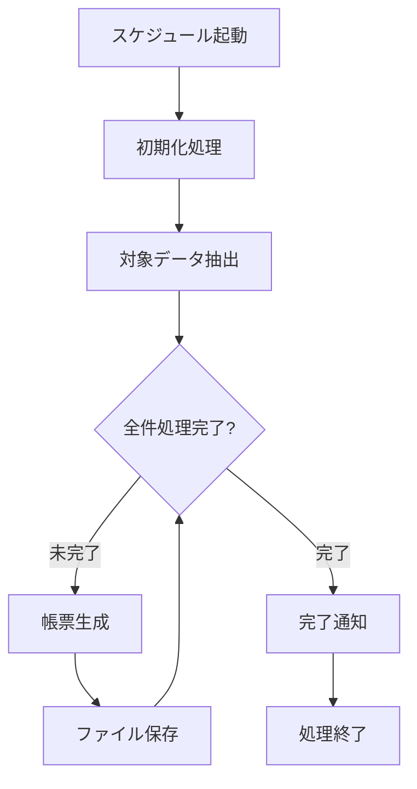

# 帳票一覧

## ドキュメント情報

| 項目 | 内容 |
|------|------|
| ドキュメントID | RD005 |
| ドキュメント名 | 帳票一覧 |
| プロジェクト名 | {プロジェクト名} |
| バージョン | {バージョン} |
| ステータス | 作成中/レビュー中/承認済み |
| 作成日 | {YYYY-MM-DD} |
| 作成者 | {作成者名} |
| 最終更新日 | {YYYY-MM-DD} |
| 最終更新者 | {更新者名} |
| 承認者 | {承認者名} |
| 承認日 | {YYYY-MM-DD} |

## 変更履歴

| バージョン | 日付 | 変更者 | 変更内容 |
|-----------|------|--------|----------|
| 0.1 | {YYYY-MM-DD} | {変更者名} | 初版作成 |
| | | | |

---

## 1. 概要

### 1.1 目的

{帳票一覧の目的を記述}

### 1.2 対象システム

{対象となるシステムの範囲を記述}

### 1.3 参照ドキュメント

| ドキュメント名 | ドキュメントID | バージョン |
|---------------|---------------|-----------|
| 機能要件定義書 | RD001-02 | {バージョン} |
| ユースケース定義書 | RD003 | {バージョン} |

---

## 2. 帳票分類

### 2.1 帳票種別定義

| 帳票種別 | 説明 | 用途例 |
|---------|------|--------|
| 一覧表 | データを一覧形式で出力 | マスタ一覧、売上一覧 |
| 詳細票 | 単一データの詳細を出力 | 注文明細、申請書詳細 |
| 集計表 | データを集計して出力 | 月次売上集計、在庫集計 |
| 帳票 | 定型フォーマットで出力 | 請求書、納品書、領収書 |
| ラベル | ラベル形式で出力 | 宛名ラベル、バーコードラベル |
| レポート | 分析結果を出力 | 経営レポート、分析レポート |
| 証明書 | 証明書形式で出力 | 修了証明書、在籍証明書 |
| 通知書 | 通知内容を出力 | 通知書、案内状 |
| その他 | 上記以外の帳票 | - |

### 2.2 帳票カテゴリ

| カテゴリ | 説明 |
|---------|------|
| {カテゴリ名1} | {カテゴリの説明} |
| {カテゴリ名2} | {カテゴリの説明} |
| {カテゴリ名3} | {カテゴリの説明} |

---

## 3. 帳票一覧

### 3.1 全帳票一覧

| 帳票ID | 帳票名 | 種別 | 出力形式 | 出力タイミング | 関連機能 | 関連UC | 利用者 | 優先度 | 備考 |
|--------|--------|------|----------|--------------|---------|--------|--------|--------|------|
| RP-001 | {帳票名1} | {一覧表/詳細票/集計表/帳票/ラベル/レポート/証明書/通知書/その他} | {PDF/Excel/CSV/その他} | {オンライン/バッチ/オンデマンド} | F-{xxx} | UC-{xxx} | {利用者ロール} | Must/Should/Could/Won't | {備考} |
| RP-002 | {帳票名2} | {一覧表/詳細票/集計表/帳票/ラベル/レポート/証明書/通知書/その他} | {PDF/Excel/CSV/その他} | {オンライン/バッチ/オンデマンド} | F-{xxx} | UC-{xxx} | {利用者ロール} | Must/Should/Could/Won't | {備考} |
| RP-003 | {帳票名3} | {一覧表/詳細票/集計表/帳票/ラベル/レポート/証明書/通知書/その他} | {PDF/Excel/CSV/その他} | {オンライン/バッチ/オンデマンド} | F-{xxx} | UC-{xxx} | {利用者ロール} | Must/Should/Could/Won't | {備考} |
| RP-004 | {帳票名4} | {一覧表/詳細票/集計表/帳票/ラベル/レポート/証明書/通知書/その他} | {PDF/Excel/CSV/その他} | {オンライン/バッチ/オンデマンド} | F-{xxx} | UC-{xxx} | {利用者ロール} | Must/Should/Could/Won't | {備考} |
| RP-005 | {帳票名5} | {一覧表/詳細票/集計表/帳票/ラベル/レポート/証明書/通知書/その他} | {PDF/Excel/CSV/その他} | {オンライン/バッチ/オンデマンド} | F-{xxx} | UC-{xxx} | {利用者ロール} | Must/Should/Could/Won't | {備考} |
| | | | | | | | | | |

### 3.2 カテゴリ別帳票一覧

#### 3.2.1 {カテゴリ名1}

| 帳票ID | 帳票名 | 種別 | 出力形式 | 優先度 | 備考 |
|--------|--------|------|----------|--------|------|
| RP-{xxx} | {帳票名} | {種別} | {形式} | Must/Should/Could/Won't | {備考} |
| | | | | | |

#### 3.2.2 {カテゴリ名2}

| 帳票ID | 帳票名 | 種別 | 出力形式 | 優先度 | 備考 |
|--------|--------|------|----------|--------|------|
| RP-{xxx} | {帳票名} | {種別} | {形式} | Must/Should/Could/Won't | {備考} |
| | | | | | |

---

## 4. 帳票詳細情報

### 4.1 {帳票名1} (RP-001)

#### 4.1.1 基本情報

| 項目 | 内容 |
|------|------|
| 帳票ID | RP-001 |
| 帳票名 | {帳票名} |
| 帳票種別 | {一覧表/詳細票/集計表/帳票/ラベル/レポート/証明書/通知書/その他} |
| カテゴリ | {カテゴリ名} |
| 帳票概要 | {帳票の概要説明} |
| 用途 | {帳票の用途} |
| 利用者 | {利用者ロール/権限} |
| 関連機能 | F-{xxx} |
| 関連ユースケース | UC-{xxx} |
| 優先度 | Must/Should/Could/Won't |

#### 4.1.2 出力仕様

| 項目 | 内容 |
|------|------|
| 出力形式 | {PDF/Excel/CSV/Word/その他} |
| ファイル名規則 | {ファイル名のパターン (例: REPORT_YYYYMMDD_hhmmss.pdf)} |
| 用紙サイズ | {A4/A3/B4/B5/Letter/その他} |
| 用紙向き | {縦/横} |
| 出力タイミング | {オンライン/バッチ/オンデマンド} |
| 出力トリガー | {ボタン押下/スケジュール/イベント発生} |
| 出力先 | {画面ダウンロード/プリンタ/ファイルサーバー/メール添付/その他} |
| 保存期間 | {x}日/ヶ月/年 |
| 保存場所 | {保存場所の指定} |

#### 4.1.3 出力条件

| 項目 | 内容 |
|------|------|
| 出力権限 | {権限の条件} |
| 出力可能期間 | {期間の制約} |
| 出力回数制限 | {あり (x回まで)/なし} |
| データ抽出条件 | {抽出条件の詳細} |
| データ並び順 | {ソート条件} |

#### 4.1.4 帳票項目

| 項目No | セクション | 項目名 | データ項目ID | データ型 | 桁数 | 必須 | データソース | 編集ルール | 備考 |
|-------|----------|--------|------------|---------|------|------|------------|------------|------|
| 1 | ヘッダー | {項目名1} | {data_id_1} | {String/Number/Date/その他} | {桁数} | ○/- | {テーブル名.カラム名} | {編集ルール} | {備考} |
| 2 | ヘッダー | {項目名2} | {data_id_2} | {String/Number/Date/その他} | {桁数} | ○/- | {テーブル名.カラム名} | {編集ルール} | {備考} |
| 3 | 明細 | {項目名3} | {data_id_3} | {String/Number/Date/その他} | {桁数} | ○/- | {テーブル名.カラム名} | {編集ルール} | {備考} |
| 4 | 明細 | {項目名4} | {data_id_4} | {String/Number/Date/その他} | {桁数} | ○/- | {テーブル名.カラム名} | {編集ルール} | {備考} |
| 5 | フッター | {項目名5} | {data_id_5} | {String/Number/Date/その他} | {桁数} | ○/- | {計算式/定数} | {編集ルール} | {備考} |
| | | | | | | | | | |

#### 4.1.5 集計・計算項目

| 項目名 | 計算式 | 集計方法 | 備考 |
|--------|--------|---------|------|
| {項目名1} | {計算式の詳細} | {SUM/AVG/COUNT/MAX/MIN/その他} | {備考} |
| {項目名2} | {計算式の詳細} | {SUM/AVG/COUNT/MAX/MIN/その他} | {備考} |
| | | | |

#### 4.1.6 帳票レイアウト (概要)

```
+--------------------------------------------------+
| ヘッダー                                          |
| {帳票タイトル}                            {出力日} |
+--------------------------------------------------+
| {ヘッダー情報1}                                   |
| {ヘッダー情報2}                                   |
+--------------------------------------------------+
| 明細部                                           |
| +------+----------+----------+----------+------+ |
| | No   | {列名1}  | {列名2}  | {列名3}  | 金額  | |
| +------+----------+----------+----------+------+ |
| | 1    | xxx      | xxx      | xxx      | xxx  | |
| | 2    | xxx      | xxx      | xxx      | xxx  | |
| +------+----------+----------+----------+------+ |
+--------------------------------------------------+
| フッター                                          |
| 合計: {集計値}                          {ページ}  |
+--------------------------------------------------+
```

#### 4.1.7 帳票サンプル

{帳票のサンプルイメージまたはモックアップへの参照}

#### 4.1.8 性能要件

| 項目 | 要件 |
|------|------|
| 出力時間 | {x}秒以内 (y件の場合) |
| 最大出力件数 | {z}件 |
| 同時出力数 | {w}件まで |
| ファイルサイズ制限 | {上限サイズ} |

#### 4.1.9 データ取得SQL/処理

```sql
-- データ取得SQLの概要
{SQLの記述またはSQL仕様書への参照}
```

#### 4.1.10 エラー処理

| エラーコード | エラー内容 | エラー条件 | エラーメッセージ | 対処方法 |
|-------------|------------|------------|------------------|----------|
| {E-xxx} | {エラーの種類} | {発生条件} | {メッセージ} | {対処方法} |
| | | | | |

#### 4.1.11 制約事項・注意事項

- {制約事項1}
- {制約事項2}

---

### 4.2 {帳票名2} (RP-002)

#### 4.2.1 基本情報

| 項目 | 内容 |
|------|------|
| 帳票ID | RP-002 |
| 帳票名 | {帳票名} |
| 帳票種別 | {種別} |
| 帳票概要 | {帳票の概要説明} |
| 利用者 | {利用者ロール} |

#### 4.2.2 出力仕様

| 項目 | 内容 |
|------|------|
| 出力形式 | {PDF/Excel/CSV/その他} |
| 用紙サイズ | {A4/A3/その他} |
| 出力タイミング | {オンライン/バッチ/オンデマンド} |

---

## 5. 出力タイミング別帳票一覧

### 5.1 オンライン出力帳票

| 帳票ID | 帳票名 | 出力トリガー | 出力先 | 備考 |
|--------|--------|------------|--------|------|
| RP-{xxx} | {帳票名} | {トリガー} | {出力先} | {備考} |
| | | | | |

### 5.2 バッチ出力帳票

| 帳票ID | 帳票名 | 実行スケジュール | 出力先 | 配信先 | 備考 |
|--------|--------|----------------|--------|--------|------|
| RP-{xxx} | {帳票名} | {日次x時/週次x曜日/月次x日} | {出力先} | {配信先} | {備考} |
| | | | | | |

### 5.3 オンデマンド出力帳票

| 帳票ID | 帳票名 | 出力条件 | 出力先 | 備考 |
|--------|--------|---------|--------|------|
| RP-{xxx} | {帳票名} | {条件} | {出力先} | {備考} |
| | | | | |

---

## 6. 出力形式別帳票一覧

### 6.1 PDF出力帳票

| 帳票ID | 帳票名 | 用途 | 備考 |
|--------|--------|------|------|
| RP-{xxx} | {帳票名} | {用途} | {備考} |
| | | | |

### 6.2 Excel出力帳票

| 帳票ID | 帳票名 | 用途 | テンプレート使用 | 備考 |
|--------|--------|------|----------------|------|
| RP-{xxx} | {帳票名} | {用途} | {あり/なし} | {備考} |
| | | | | |

### 6.3 CSV出力帳票

| 帳票ID | 帳票名 | 用途 | 文字コード | 区切り文字 | 備考 |
|--------|--------|------|-----------|-----------|------|
| RP-{xxx} | {帳票名} | {用途} | {UTF-8/Shift-JIS/その他} | {カンマ/タブ/その他} | {備考} |
| | | | | | |

---

## 7. ロール別帳票出力権限

### 7.1 出力権限マトリクス

| 帳票ID | 帳票名 | {ロール1} | {ロール2} | {ロール3} | {ロール4} | 備考 |
|--------|--------|----------|----------|----------|----------|------|
| RP-001 | {帳票名1} | ○ | ○ | - | - | {備考} |
| RP-002 | {帳票名2} | ○ | - | ○ | - | {備考} |
| RP-003 | {帳票名3} | ○ | ○ | ○ | - | {備考} |
| RP-004 | {帳票名4} | ○ | - | - | ○ | {備考} |
| | | | | | | |

**凡例:**
- ○: 出力可
- △: 条件付き出力可
- -: 出力不可

---

## 8. 優先度別帳票一覧

### 8.1 Must (必須)

| 帳票ID | 帳票名 | 種別 | 理由 |
|--------|--------|------|------|
| RP-{xxx} | {帳票名} | {種別} | {必須である理由} |
| | | | |

### 8.2 Should (重要)

| 帳票ID | 帳票名 | 種別 | 理由 |
|--------|--------|------|------|
| RP-{xxx} | {帳票名} | {種別} | {重要である理由} |
| | | | |

### 8.3 Could (可能であれば)

| 帳票ID | 帳票名 | 種別 | 理由 |
|--------|--------|------|------|
| RP-{xxx} | {帳票名} | {種別} | {あれば望ましい理由} |
| | | | |

---

## 9. 帳票出力フロー

### 9.1 オンライン出力フロー



### 9.2 バッチ出力フロー



---

## 10. 帳票テンプレート管理

### 10.1 テンプレート一覧

| テンプレートID | テンプレート名 | 使用帳票 | フォーマット | 保存場所 | 備考 |
|--------------|--------------|---------|------------|----------|------|
| TPL-{xxx} | {テンプレート名} | RP-{xxx} | {形式} | {パス} | {備考} |
| | | | | | |

### 10.2 テンプレート更新履歴

| テンプレートID | バージョン | 更新日 | 更新者 | 更新内容 |
|--------------|-----------|--------|--------|----------|
| TPL-{xxx} | {v1.0} | {YYYY-MM-DD} | {更新者名} | {更新内容} |
| | | | | |

---

## 11. 用語集

| 用語 | 定義 | 備考 |
|------|------|------|
| オンライン出力 | ユーザー操作により即座に帳票を出力 | - |
| バッチ出力 | スケジュールに基づき自動的に帳票を出力 | - |
| オンデマンド出力 | 特定条件下で必要時に帳票を出力 | - |
| {用語} | {定義} | {備考} |

---

## 12. 添付資料

| 資料名 | ファイル名 | 説明 |
|--------|-----------|------|
| 帳票サンプル集 | {ファイル名} | {資料の説明} |
| 帳票テンプレート | {ファイル名} | {資料の説明} |
| | | |

---

## 承認

| 役割 | 氏名 | 承認日 | 署名 |
|------|------|--------|------|
| 業務部門責任者 | {氏名} | {YYYY-MM-DD} | |
| システム部門責任者 | {氏名} | {YYYY-MM-DD} | |
| プロジェクトマネージャー | {氏名} | {YYYY-MM-DD} | |

---

**文書の終わり**
