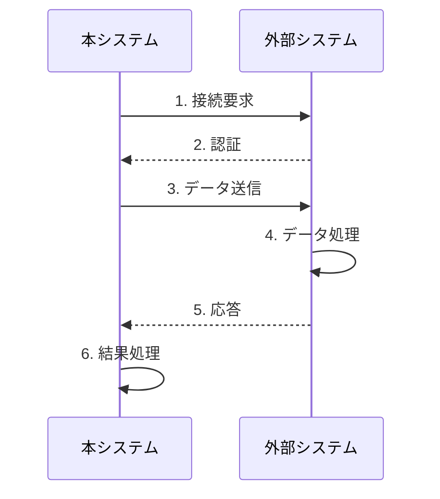
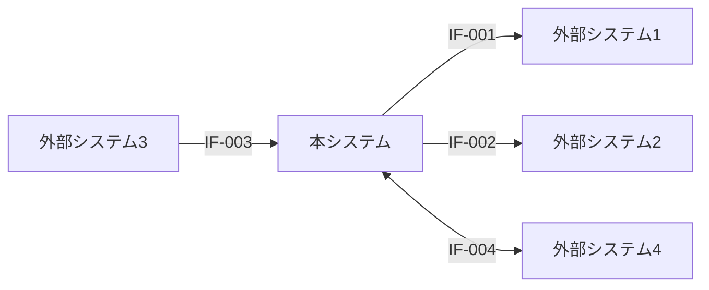

# 外部インターフェース一覧

## ドキュメント情報

| 項目 | 内容 |
|------|------|
| ドキュメントID | RD006 |
| ドキュメント名 | 外部インターフェース一覧 |
| プロジェクト名 | {プロジェクト名} |
| バージョン | {バージョン} |
| ステータス | 作成中/レビュー中/承認済み |
| 作成日 | {YYYY-MM-DD} |
| 作成者 | {作成者名} |
| 最終更新日 | {YYYY-MM-DD} |
| 最終更新者 | {更新者名} |
| 承認者 | {承認者名} |
| 承認日 | {YYYY-MM-DD} |

## 変更履歴

| バージョン | 日付 | 変更者 | 変更内容 |
|-----------|------|--------|----------|
| 0.1 | {YYYY-MM-DD} | {変更者名} | 初版作成 |
| | | | |

---

## 1. 概要

### 1.1 目的

{外部インターフェース一覧の目的を記述}

### 1.2 対象システム

{対象となるシステムの範囲を記述}

### 1.3 参照ドキュメント

| ドキュメント名 | ドキュメントID | バージョン |
|---------------|---------------|-----------|
| 機能要件定義書 | RD001-02 | {バージョン} |
| 非機能要件定義書 | RD001-03 | {バージョン} |

---

## 2. インターフェース分類

### 2.1 連携方式分類

| 連携方式 | 説明 | 用途例 |
|---------|------|--------|
| REST API | RESTfulなHTTP/HTTPS通信 | リアルタイムデータ連携 |
| SOAP API | SOAPプロトコルによる通信 | レガシーシステム連携 |
| ファイル連携 | ファイルの授受による連携 | バッチデータ連携 |
| データベース連携 | 直接DBアクセスによる連携 | リアルタイムデータ参照 |
| メッセージキュー | MQ/メッセージングによる連携 | 非同期データ連携 |
| FTP/SFTP | ファイル転送による連携 | 定期ファイル交換 |
| WebSocket | 双方向通信による連携 | リアルタイム通信 |
| その他 | 上記以外の連携方式 | - |

### 2.2 連携方向分類

| 連携方向 | 説明 |
|---------|------|
| 送信 (Outbound) | 本システムから外部システムへデータを送信 |
| 受信 (Inbound) | 外部システムから本システムへデータを受信 |
| 双方向 (Bidirectional) | 相互にデータを送受信 |

---

## 3. 外部インターフェース一覧

### 3.1 全インターフェース一覧

| IF-ID | インターフェース名 | 連携先システム | 連携方向 | 連携方式 | データ形式 | タイミング | 関連機能 | 優先度 | 備考 |
|-------|------------------|--------------|---------|---------|-----------|-----------|---------|--------|------|
| IF-001 | {IF名1} | {外部システム名1} | 送信/受信/双方向 | {REST API/SOAP/ファイル/DB/MQ/FTP/その他} | {JSON/XML/CSV/固定長/その他} | {リアルタイム/日次/週次/月次/イベント} | F-{xxx} | Must/Should/Could/Won't | {備考} |
| IF-002 | {IF名2} | {外部システム名2} | 送信/受信/双方向 | {REST API/SOAP/ファイル/DB/MQ/FTP/その他} | {JSON/XML/CSV/固定長/その他} | {リアルタイム/日次/週次/月次/イベント} | F-{xxx} | Must/Should/Could/Won't | {備考} |
| IF-003 | {IF名3} | {外部システム名3} | 送信/受信/双方向 | {REST API/SOAP/ファイル/DB/MQ/FTP/その他} | {JSON/XML/CSV/固定長/その他} | {リアルタイム/日次/週次/月次/イベント} | F-{xxx} | Must/Should/Could/Won't | {備考} |
| IF-004 | {IF名4} | {外部システム名4} | 送信/受信/双方向 | {REST API/SOAP/ファイル/DB/MQ/FTP/その他} | {JSON/XML/CSV/固定長/その他} | {リアルタイム/日次/週次/月次/イベント} | F-{xxx} | Must/Should/Could/Won't | {備考} |
| | | | | | | | | | |

### 3.2 連携先システム別一覧

#### 3.2.1 {外部システム名1}

| IF-ID | インターフェース名 | 連携方向 | 連携方式 | タイミング | 備考 |
|-------|------------------|---------|---------|-----------|------|
| IF-{xxx} | {IF名} | 送信/受信/双方向 | {方式} | {タイミング} | {備考} |
| | | | | | |

---

## 4. インターフェース詳細

### 4.1 {インターフェース名1} (IF-001)

#### 4.1.1 基本情報

| 項目 | 内容 |
|------|------|
| インターフェースID | IF-001 |
| インターフェース名 | {インターフェース名} |
| インターフェース概要 | {概要説明} |
| 連携先システム | {外部システム名} |
| 連携先システム管理者 | {管理者名/部署/連絡先} |
| 連携方向 | 送信/受信/双方向 |
| 連携方式 | {REST API/SOAP/ファイル/DB/MQ/FTP/その他} |
| データ形式 | {JSON/XML/CSV/固定長/その他} |
| 関連機能 | F-{xxx} |
| 関連ユースケース | UC-{xxx} |
| 優先度 | Must/Should/Could/Won't |

#### 4.1.2 連携仕様

| 項目 | 内容 |
|------|------|
| プロトコル | {HTTP/HTTPS/FTP/SFTP/SMTP/その他} |
| 接続方式 | {同期/非同期} |
| 認証方式 | {Basic認証/OAuth2.0/APIキー/証明書/その他} |
| エンドポイント | {URL/ホスト名/IPアドレス} |
| ポート番号 | {ポート番号} |
| タイムアウト | {x}秒 |
| リトライ | {あり (x回)/なし} |
| 文字コード | {UTF-8/Shift-JIS/その他} |
| 暗号化 | {TLS 1.2以上/SSL/なし} |

#### 4.1.3 実行タイミング

| 項目 | 内容 |
|------|------|
| 実行契機 | {リアルタイム/スケジュール/イベント発生時/手動実行} |
| 実行スケジュール | {日次x時/週次x曜日/月次x日/その他} |
| 実行頻度 | {x回/日、y回/時間} |
| ピーク時間帯 | {時間帯の指定} |
| 処理ウィンドウ | {処理可能時間帯} |

#### 4.1.4 データ仕様 (送信/受信)

**ヘッダー情報:**

| 項目名 | 必須 | データ型 | 桁数 | 説明 | 設定値例 |
|--------|------|---------|------|------|---------|
| {ヘッダー項目1} | ○/- | {String/Number/その他} | {桁数} | {説明} | {例} |
| {ヘッダー項目2} | ○/- | {String/Number/その他} | {桁数} | {説明} | {例} |
| | | | | | |

**ボディ情報:**

| 項目No | 項目名 | 項目ID | 必須 | データ型 | 桁数 | 説明 | 設定値例 | 備考 |
|-------|--------|--------|------|---------|------|------|---------|------|
| 1 | {項目名1} | {item_id_1} | ○/- | {String/Number/Date/Boolean/Object/Array} | {桁数} | {説明} | {例} | {備考} |
| 2 | {項目名2} | {item_id_2} | ○/- | {String/Number/Date/Boolean/Object/Array} | {桁数} | {説明} | {例} | {備考} |
| 3 | {項目名3} | {item_id_3} | ○/- | {String/Number/Date/Boolean/Object/Array} | {桁数} | {説明} | {例} | {備考} |
| | | | | | | | | |

#### 4.1.5 データサンプル

**送信データサンプル (JSON例):**

```json
{
  "header": {
    "message_id": "MSG-20240101-001",
    "timestamp": "2024-01-01T12:00:00Z"
  },
  "body": {
    "item1": "value1",
    "item2": 12345,
    "item3": true
  }
}
```

**受信データサンプル (JSON例):**

```json
{
  "status": "success",
  "data": {
    "result": "OK",
    "message": "処理完了"
  }
}
```

#### 4.1.6 エラー処理

| エラーコード | エラー内容 | 発生条件 | 対処方法 | リトライ | エスカレーション |
|-------------|------------|---------|---------|---------|----------------|
| {E-xxx} | {エラー名} | {発生条件} | {対処方法} | {する/しない} | {条件} |
| {E-yyy} | {エラー名} | {発生条件} | {対処方法} | {する/しない} | {条件} |
| | | | | | |

#### 4.1.7 HTTPステータスコード (API連携の場合)

| ステータスコード | 意味 | 処理内容 |
|----------------|------|----------|
| 200 | OK | 正常処理 |
| 400 | Bad Request | リクエストエラー |
| 401 | Unauthorized | 認証エラー |
| 403 | Forbidden | 権限エラー |
| 404 | Not Found | リソース未検出 |
| 500 | Internal Server Error | サーバーエラー |
| 503 | Service Unavailable | サービス利用不可 |

#### 4.1.8 性能要件

| 項目 | 要件 |
|------|------|
| 応答時間 | {x}秒以内 |
| 処理件数 | {y}件/時間 |
| データ量 | {z}KB/MB/件 |
| 同時接続数 | {w}接続まで |
| スループット | {v}TPS |

#### 4.1.9 セキュリティ要件

| 項目 | 要件 |
|------|------|
| 通信暗号化 | {TLS 1.2以上/その他} |
| 認証 | {認証方式の詳細} |
| アクセス制御 | {IPアドレス制限/その他} |
| データ暗号化 | {必要/不要} |
| ログ記録 | {記録内容} |

#### 4.1.10 監視項目

| 監視項目 | 監視内容 | 閾値 | アラート条件 |
|---------|---------|------|-------------|
| {項目1} | {監視内容} | {閾値} | {条件} |
| {項目2} | {監視内容} | {閾値} | {条件} |
| | | | |

#### 4.1.11 データフロー図



#### 4.1.12 制約事項・注意事項

- {制約事項1}
- {制約事項2}
- {注意事項1}

---

### 4.2 {インターフェース名2} (IF-002)

#### 4.2.1 基本情報

| 項目 | 内容 |
|------|------|
| インターフェースID | IF-002 |
| インターフェース名 | {インターフェース名} |
| 連携先システム | {外部システム名} |
| 連携方向 | 送信/受信/双方向 |
| 連携方式 | {連携方式} |

---

## 5. ファイル連携仕様 (該当する場合)

### 5.1 {ファイル連携名} (IF-{xxx})

#### 5.1.1 ファイル仕様

| 項目 | 内容 |
|------|------|
| ファイル名規則 | {ファイル名のパターン} |
| ファイル形式 | {CSV/TSV/固定長/XML/JSON/その他} |
| 文字コード | {UTF-8/Shift-JIS/その他} |
| 改行コード | {LF/CRLF/CR} |
| 区切り文字 | {カンマ/タブ/その他} |
| ヘッダー行 | {あり/なし} |
| フッター行 | {あり/なし} |
| 最大ファイルサイズ | {サイズ} |
| 圧縮 | {ZIP/GZIP/なし} |

#### 5.1.2 ファイルレイアウト

**ヘッダーレコード:**

| 項目No | 開始位置 | 終了位置 | 桁数 | 項目名 | データ型 | 必須 | 説明 |
|-------|---------|---------|------|--------|---------|------|------|
| 1 | 1 | 10 | 10 | {項目名1} | {型} | ○/- | {説明} |
| 2 | 11 | 20 | 10 | {項目名2} | {型} | ○/- | {説明} |

**データレコード:**

| 項目No | 開始位置 | 終了位置 | 桁数 | 項目名 | データ型 | 必須 | 説明 |
|-------|---------|---------|------|--------|---------|------|------|
| 1 | 1 | 10 | 10 | {項目名1} | {型} | ○/- | {説明} |
| 2 | 11 | 20 | 10 | {項目名2} | {型} | ○/- | {説明} |
| 3 | 21 | 30 | 10 | {項目名3} | {型} | ○/- | {説明} |

**トレーラーレコード:**

| 項目No | 開始位置 | 終了位置 | 桁数 | 項目名 | データ型 | 必須 | 説明 |
|-------|---------|---------|------|--------|---------|------|------|
| 1 | 1 | 10 | 10 | {項目名1} | {型} | ○/- | {説明} |

#### 5.1.3 ファイル授受方法

| 項目 | 内容 |
|------|------|
| 転送プロトコル | {FTP/SFTP/FTPS/HTTP/その他} |
| 転送方向 | {送信/受信} |
| 転送先/元ディレクトリ | {パス} |
| 転送タイミング | {スケジュール} |
| 完了通知 | {あり/なし} |
| エラー時の対応 | {対応方法} |

---

## 6. 連携方式別インターフェース一覧

### 6.1 REST API連携

| IF-ID | インターフェース名 | 連携先 | メソッド | エンドポイント | 備考 |
|-------|------------------|--------|---------|--------------|------|
| IF-{xxx} | {IF名} | {連携先} | {GET/POST/PUT/DELETE} | {/api/endpoint} | {備考} |
| | | | | | |

### 6.2 ファイル連携

| IF-ID | インターフェース名 | 連携先 | ファイル形式 | 転送方式 | 備考 |
|-------|------------------|--------|------------|---------|------|
| IF-{xxx} | {IF名} | {連携先} | {CSV/XML/その他} | {FTP/SFTP/その他} | {備考} |
| | | | | | |

### 6.3 データベース連携

| IF-ID | インターフェース名 | 連携先 | DB種類 | アクセス方式 | 備考 |
|-------|------------------|--------|--------|-------------|------|
| IF-{xxx} | {IF名} | {連携先} | {Oracle/MySQL/PostgreSQL/その他} | {直接接続/DB Link/その他} | {備考} |
| | | | | | |

---

## 7. タイミング別インターフェース一覧

### 7.1 リアルタイム連携

| IF-ID | インターフェース名 | 連携先 | 連携方式 | トリガー | 備考 |
|-------|------------------|--------|---------|---------|------|
| IF-{xxx} | {IF名} | {連携先} | {方式} | {トリガー} | {備考} |
| | | | | | |

### 7.2 バッチ連携

| IF-ID | インターフェース名 | 連携先 | 実行スケジュール | 処理内容 | 備考 |
|-------|------------------|--------|----------------|---------|------|
| IF-{xxx} | {IF名} | {連携先} | {スケジュール} | {処理内容} | {備考} |
| | | | | | |

---

## 8. 優先度別インターフェース一覧

### 8.1 Must (必須)

| IF-ID | インターフェース名 | 連携先 | 理由 |
|-------|------------------|--------|------|
| IF-{xxx} | {IF名} | {連携先} | {必須である理由} |
| | | | |

### 8.2 Should (重要)

| IF-ID | インターフェース名 | 連携先 | 理由 |
|-------|------------------|--------|------|
| IF-{xxx} | {IF名} | {連携先} | {重要である理由} |
| | | | |

---

## 9. 外部システム連携図

### 9.1 システム連携概要図



---

## 10. 用語集

| 用語 | 定義 | 備考 |
|------|------|------|
| REST | Representational State Transfer | WebAPIのアーキテクチャスタイル |
| SOAP | Simple Object Access Protocol | XML-RPCベースの通信プロトコル |
| JSON | JavaScript Object Notation | データ交換フォーマット |
| XML | Extensible Markup Language | マークアップ言語 |
| {用語} | {定義} | {備考} |

---

## 11. 添付資料

| 資料名 | ファイル名 | 説明 |
|--------|-----------|------|
| IF仕様詳細書 | {ファイル名} | {資料の説明} |
| データサンプル | {ファイル名} | {資料の説明} |
| | | |

---

## 承認

| 役割 | 氏名 | 承認日 | 署名 |
|------|------|--------|------|
| 業務部門責任者 | {氏名} | {YYYY-MM-DD} | |
| システム部門責任者 | {氏名} | {YYYY-MM-DD} | |
| 外部システム管理者 | {氏名} | {YYYY-MM-DD} | |
| プロジェクトマネージャー | {氏名} | {YYYY-MM-DD} | |

---

**文書の終わり**
