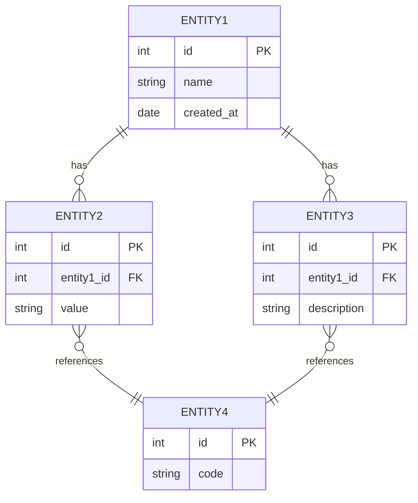

# データ項目一覧

## ドキュメント情報

| 項目 | 内容 |
|------|------|
| ドキュメントID | RD007 |
| ドキュメント名 | データ項目一覧 |
| プロジェクト名 | {プロジェクト名} |
| バージョン | {バージョン} |
| ステータス | 作成中/レビュー中/承認済み |
| 作成日 | {YYYY-MM-DD} |
| 作成者 | {作成者名} |
| 最終更新日 | {YYYY-MM-DD} |
| 最終更新者 | {更新者名} |
| 承認者 | {承認者名} |
| 承認日 | {YYYY-MM-DD} |

## 変更履歴

| バージョン | 日付 | 変更者 | 変更内容 |
|-----------|------|--------|----------|
| 0.1 | {YYYY-MM-DD} | {変更者名} | 初版作成 |
| | | | |

---

## 1. 概要

### 1.1 目的

{データ項目一覧の目的を記述}

### 1.2 対象システム

{対象となるシステムの範囲を記述}

### 1.3 参照ドキュメント

| ドキュメント名 | ドキュメントID | バージョン |
|---------------|---------------|-----------|
| 機能要件定義書 | RD001-02 | {バージョン} |
| 非機能要件定義書 | RD001-03 | {バージョン} |

---

## 2. データ分類

### 2.1 エンティティ分類

| 分類 | 説明 | 該当エンティティ例 |
|------|------|------------------|
| マスタデータ | 基本的な静的データ | 顧客マスタ、商品マスタ、組織マスタ |
| トランザクションデータ | 業務処理で発生する動的データ | 受注データ、売上データ、在庫移動データ |
| 履歴データ | 過去の状態や変更を記録するデータ | 変更履歴、操作ログ、監査証跡 |
| 設定データ | システム設定や業務設定 | システム設定、権限設定、パラメータ |
| 参照データ | 参照用の静的データ | コードマスタ、区分マスタ |

### 2.2 データライフサイクル

| ライフサイクル | 説明 |
|--------------|------|
| 生成 | データの新規作成タイミング |
| 更新 | データの更新タイミング・頻度 |
| 参照 | データの参照パターン |
| 削除 | データの削除条件・タイミング |
| アーカイブ | データの保管・移行条件 |

---

## 3. エンティティ一覧

### 3.1 全エンティティ一覧

| エンティティID | エンティティ名 (論理) | エンティティ名 (物理) | 分類 | 説明 | 関連機能 | 備考 |
|--------------|---------------------|---------------------|------|------|---------|------|
| E-001 | {論理名1} | {PHYSICAL_NAME_1} | {マスタ/トランザクション/履歴/設定/参照} | {説明} | F-{xxx} | {備考} |
| E-002 | {論理名2} | {PHYSICAL_NAME_2} | {マスタ/トランザクション/履歴/設定/参照} | {説明} | F-{xxx} | {備考} |
| E-003 | {論理名3} | {PHYSICAL_NAME_3} | {マスタ/トランザクション/履歴/設定/参照} | {説明} | F-{xxx} | {備考} |
| E-004 | {論理名4} | {PHYSICAL_NAME_4} | {マスタ/トランザクション/履歴/設定/参照} | {説明} | F-{xxx} | {備考} |
| | | | | | | |

### 3.2 分類別エンティティ一覧

#### 3.2.1 マスタデータ

| エンティティID | エンティティ名 | 件数見込 | 更新頻度 | 備考 |
|--------------|--------------|---------|---------|------|
| E-{xxx} | {エンティティ名} | {件数} | {日次/週次/月次/随時} | {備考} |
| | | | | |

#### 3.2.2 トランザクションデータ

| エンティティID | エンティティ名 | 日次発生件数 | 年間増加件数 | 保存期間 | 備考 |
|--------------|--------------|------------|-------------|---------|------|
| E-{xxx} | {エンティティ名} | {件数} | {件数} | {期間} | {備考} |
| | | | | | |

---

## 4. データ項目詳細

### 4.1 {エンティティ名1} (E-001)

#### 4.1.1 エンティティ概要

| 項目 | 内容 |
|------|------|
| エンティティID | E-001 |
| エンティティ名 (論理) | {論理名} |
| エンティティ名 (物理) | {PHYSICAL_NAME} |
| 分類 | {マスタ/トランザクション/履歴/設定/参照} |
| 説明 | {エンティティの説明} |
| 件数見込 (初期) | {x}件 |
| 件数見込 (年間増加) | {y}件/年 |
| 更新頻度 | {日次/週次/月次/随時} |
| 保存期間 | {z}年/{永久保存} |
| アーカイブ条件 | {条件} |

#### 4.1.2 データ項目一覧

| 項目No | 項目名 (論理) | 項目名 (物理) | データ型 | 桁数 | 小数桁 | 必須 | PK | FK | UK | デフォルト値 | 説明 | 備考 |
|-------|-------------|-------------|---------|------|--------|------|----|----|-------|------------|------|------|
| 1 | {論理名1} | {physical_name_1} | {VARCHAR/INTEGER/DATE/TIMESTAMP/BOOLEAN/DECIMAL/その他} | {桁数} | {桁} | ○/- | ○/- | - | - | {値} | {説明} | {備考} |
| 2 | {論理名2} | {physical_name_2} | {VARCHAR/INTEGER/DATE/TIMESTAMP/BOOLEAN/DECIMAL/その他} | {桁数} | {桁} | ○/- | ○/- | - | ○/- | {値} | {説明} | {備考} |
| 3 | {論理名3} | {physical_name_3} | {VARCHAR/INTEGER/DATE/TIMESTAMP/BOOLEAN/DECIMAL/その他} | {桁数} | {桁} | ○/- | - | ○/- | - | {値} | {説明} | {参照: E-{xxx}} |
| 4 | {論理名4} | {physical_name_4} | {VARCHAR/INTEGER/DATE/TIMESTAMP/BOOLEAN/DECIMAL/その他} | {桁数} | {桁} | ○/- | - | - | - | {値} | {説明} | {備考} |
| 5 | {論理名5} | {physical_name_5} | {VARCHAR/INTEGER/DATE/TIMESTAMP/BOOLEAN/DECIMAL/その他} | {桁数} | {桁} | ○/- | - | - | - | {値} | {説明} | {備考} |
| 6 | 作成日時 | created_at | TIMESTAMP | - | - | ○ | - | - | - | CURRENT_TIMESTAMP | レコード作成日時 | 共通項目 |
| 7 | 作成者ID | created_by | VARCHAR | 50 | - | ○ | - | - | - | - | レコード作成者 | 共通項目 |
| 8 | 更新日時 | updated_at | TIMESTAMP | - | - | ○ | - | - | - | CURRENT_TIMESTAMP | レコード更新日時 | 共通項目 |
| 9 | 更新者ID | updated_by | VARCHAR | 50 | - | ○ | - | - | - | - | レコード更新者 | 共通項目 |
| 10 | バージョン | version | INTEGER | - | - | ○ | - | - | - | 1 | 楽観的ロック用 | 共通項目 |

**凡例:**
- PK: Primary Key (主キー)
- FK: Foreign Key (外部キー)
- UK: Unique Key (ユニークキー)

#### 4.1.3 主キー定義

| キー名 | 構成項目 (物理名) | 説明 |
|--------|-----------------|------|
| PK_{PHYSICAL_NAME} | {physical_name_1} | {説明} |

#### 4.1.4 外部キー定義

| キー名 | 項目 (物理名) | 参照先エンティティ | 参照先項目 | 更新時動作 | 削除時動作 |
|--------|-------------|------------------|-----------|-----------|-----------|
| FK_{PHYSICAL_NAME}_{xxx} | {physical_name_3} | E-{xxx} ({エンティティ名}) | {physical_name_x} | {CASCADE/RESTRICT/SET NULL} | {CASCADE/RESTRICT/SET NULL} |

#### 4.1.5 ユニークキー定義

| キー名 | 構成項目 (物理名) | 説明 |
|--------|-----------------|------|
| UK_{PHYSICAL_NAME}_{xxx} | {physical_name_2} | {説明} |

#### 4.1.6 インデックス定義

| インデックス名 | 種別 | 構成項目 (物理名) | 説明 |
|--------------|------|-----------------|------|
| IDX_{PHYSICAL_NAME}_{xxx} | {通常/ユニーク} | {physical_name_x, physical_name_y} | {説明} |

#### 4.1.7 検証ルール・制約

| 項目名 (物理) | 検証ルール | 制約内容 |
|-------------|-----------|---------|
| {physical_name_x} | {ルール} | {制約の詳細} |
| | | |

#### 4.1.8 データ保護要件

| 項目名 (物理) | 機密区分 | 暗号化 | マスキング | 備考 |
|-------------|---------|--------|-----------|------|
| {physical_name_x} | {公開/内部/機密/極秘} | {要/不要} | {要/不要} | {備考} |
| | | | | |

#### 4.1.9 ライフサイクル

| 操作 | タイミング | 実施者 | 備考 |
|------|-----------|--------|------|
| 生成 | {タイミング} | {機能ID/ユーザー} | {備考} |
| 更新 | {タイミング} | {機能ID/ユーザー} | {備考} |
| 削除 | {タイミング} | {機能ID/ユーザー} | {物理削除/論理削除} |
| アーカイブ | {タイミング} | {バッチ処理} | {備考} |

---

### 4.2 {エンティティ名2} (E-002)

#### 4.2.1 エンティティ概要

| 項目 | 内容 |
|------|------|
| エンティティID | E-002 |
| エンティティ名 (論理) | {論理名} |
| エンティティ名 (物理) | {PHYSICAL_NAME} |
| 分類 | {分類} |
| 説明 | {エンティティの説明} |

#### 4.2.2 データ項目一覧

| 項目No | 項目名 (論理) | 項目名 (物理) | データ型 | 桁数 | 必須 | PK | FK | 説明 |
|-------|-------------|-------------|---------|------|------|----|-------|------|
| 1 | {論理名1} | {physical_name_1} | {型} | {桁数} | ○/- | ○/- | - | {説明} |
| 2 | {論理名2} | {physical_name_2} | {型} | {桁数} | ○/- | - | - | {説明} |
| | | | | | | | | |

---

## 5. エンティティ関連図 (ER図)

### 5.1 全体ER図

### 5.2 エンティティ関連一覧

| 親エンティティ | 子エンティティ | 関連 | カーディナリティ | 説明 |
|--------------|--------------|------|----------------|------|
| E-{xxx} | E-{yyy} | {has/references} | {1:1/1:N/N:M} | {関連の説明} |
| | | | | |

---

## 6. データ型定義

### 6.1 標準データ型

| データ型 | 説明 | 用途例 | 桁数範囲 |
|---------|------|--------|---------|
| VARCHAR | 可変長文字列 | 名称、コード | 1-4000 |
| CHAR | 固定長文字列 | 固定長コード | 1-255 |
| INTEGER | 整数 | ID、件数 | - |
| BIGINT | 大きな整数 | 大量データID | - |
| DECIMAL | 固定小数点数 | 金額、数量 | 全体桁数, 小数桁数 |
| DATE | 日付 | 日付項目 | - |
| TIMESTAMP | 日時 | 作成日時、更新日時 | - |
| BOOLEAN | 真偽値 | フラグ | - |
| TEXT | 長文テキスト | 備考、説明 | - |
| JSON | JSON形式データ | 可変構造データ | - |

### 6.2 共通項目定義

| 項目名 (論理) | 項目名 (物理) | データ型 | 必須 | 説明 |
|-------------|-------------|---------|------|------|
| 作成日時 | created_at | TIMESTAMP | ○ | レコード作成日時 |
| 作成者ID | created_by | VARCHAR(50) | ○ | レコード作成者のユーザーID |
| 更新日時 | updated_at | TIMESTAMP | ○ | レコード更新日時 |
| 更新者ID | updated_by | VARCHAR(50) | ○ | レコード更新者のユーザーID |
| バージョン | version | INTEGER | ○ | 楽観的ロック用バージョン番号 |
| 削除フラグ | is_deleted | BOOLEAN | - | 論理削除フラグ (true=削除済) |
| 削除日時 | deleted_at | TIMESTAMP | - | 論理削除日時 |

---

## 7. コード値定義

### 7.1 コード一覧

| コード分類ID | コード分類名 | 説明 | 関連エンティティ |
|------------|------------|------|----------------|
| CD-{xxx} | {コード分類名} | {説明} | E-{xxx} |
| | | | |

### 7.2 {コード分類名} (CD-{xxx})

| コード値 | コード名 | 表示順 | 説明 | 備考 |
|---------|---------|--------|------|------|
| {01/02/03...} | {コード名1} | {1/2/3...} | {説明} | {備考} |
| {01/02/03...} | {コード名2} | {1/2/3...} | {説明} | {備考} |
| | | | | |

---

## 8. データボリューム見積

### 8.1 エンティティ別データボリューム

| エンティティID | エンティティ名 | 初期件数 | 年間増加件数 | 3年後想定件数 | 平均レコードサイズ | 想定容量 (3年後) |
|--------------|--------------|---------|-------------|--------------|----------------|----------------|
| E-{xxx} | {エンティティ名} | {x}件 | {y}件 | {z}件 | {w}KB | {容量}GB |
| | | | | | | |
| **合計** | - | - | - | - | - | {合計}GB |

---

## 9. データ移行対象

### 9.1 移行対象エンティティ

| エンティティID | エンティティ名 | 移行元 | 移行件数 | 移行方式 | 備考 |
|--------------|--------------|--------|---------|---------|------|
| E-{xxx} | {エンティティ名} | {移行元システム/ファイル} | {件数} | {一括/段階/その他} | {備考} |
| | | | | | |

---

## 10. データ保管・アーカイブ

### 10.1 保管・アーカイブ方針

| エンティティID | エンティティ名 | オンライン保存期間 | アーカイブ条件 | アーカイブ先 | 最終削除条件 |
|--------------|--------------|------------------|--------------|------------|-------------|
| E-{xxx} | {エンティティ名} | {期間} | {条件} | {保存先} | {条件} |
| | | | | | |

---

## 11. 用語集

| 用語 | 定義 | 備考 |
|------|------|------|
| エンティティ | データの論理的なまとまり | テーブルに対応 |
| 主キー (PK) | レコードを一意に識別するキー | - |
| 外部キー (FK) | 他のエンティティを参照するキー | - |
| カーディナリティ | エンティティ間の数の関係 | 1:1, 1:N, N:M |
| 正規化 | データの冗長性を排除する手法 | - |
| {用語} | {定義} | {備考} |

---

## 12. 添付資料

| 資料名 | ファイル名 | 説明 |
|--------|-----------|------|
| 詳細ER図 | {ファイル名} | {資料の説明} |
| データ辞書 | {ファイル名} | {資料の説明} |
| | | |

---

## 承認

| 役割 | 氏名 | 承認日 | 署名 |
|------|------|--------|------|
| 業務部門責任者 | {氏名} | {YYYY-MM-DD} | |
| システム部門責任者 | {氏名} | {YYYY-MM-DD} | |
| データベース管理者 | {氏名} | {YYYY-MM-DD} | |
| プロジェクトマネージャー | {氏名} | {YYYY-MM-DD} | |

---

**文書の終わり**
