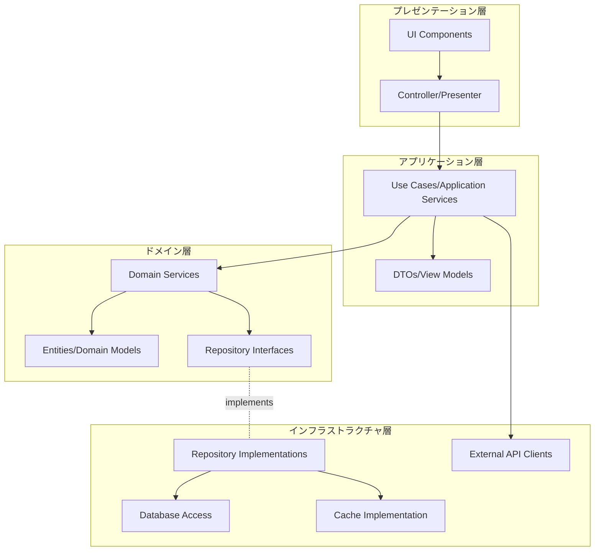
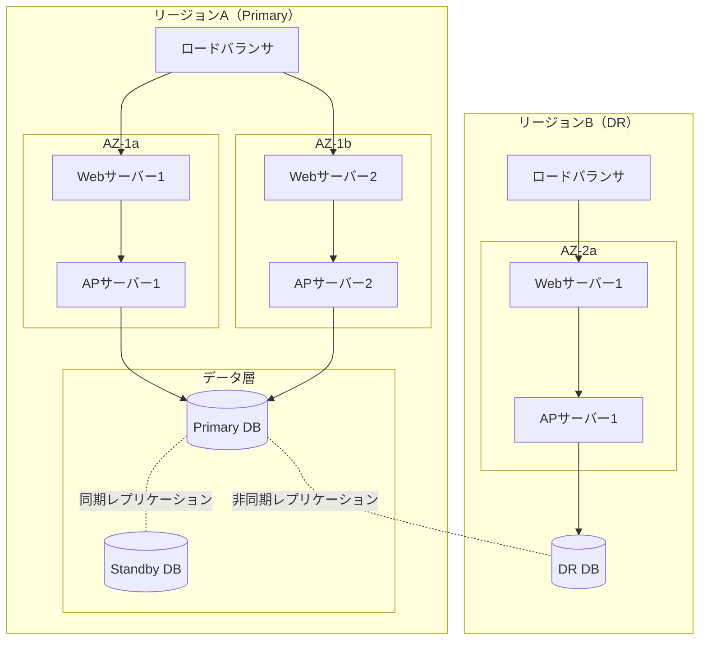

# システム構成図

## ドキュメント情報

| 項目 | 内容 |
|------|------|
| ドキュメントID | BD001-01 |
| ドキュメント名 | システム構成図 |
| システム名 | {システム名} |
| サブシステム名 | {サブシステム名} |
| 版数 | {版数} |
| ステータス | {作成中/レビュー中/承認済み} |
| 作成日 | {YYYY/MM/DD} |
| 作成者 | {作成者名} |
| 承認日 | {YYYY/MM/DD} |
| 承認者 | {承認者名} |

## 変更履歴

| 版数 | 変更日 | 変更者 | 変更内容 | 承認者 |
|------|--------|--------|----------|--------|
| 1.0 | {YYYY/MM/DD} | {変更者名} | 新規作成 | {承認者名} |
| {版数} | {YYYY/MM/DD} | {変更者名} | {変更内容} | {承認者名} |

## 目次

1. [概要](#概要)
2. [全体構成図](#全体構成図)
3. [技術スタック](#技術スタック)
4. [レイヤー構成](#レイヤー構成)
5. [冗長構成](#冗長構成)
6. [スケーリング方針](#スケーリング方針)

---

## 概要

### 目的

{このシステム構成図の目的を記述}

### 適用範囲

{このシステム構成図が適用される範囲を記述}

### 前提条件

- {前提条件1}
- {前提条件2}
- {前提条件3}

---

## 全体構成図

### システム全体構成

```mermaid
graph TB
    subgraph "クライアント層"
        WEB[Webブラウザ]
        MOBILE[モバイルアプリ]
    end

    subgraph "CDN/LB層"
        CDN[CDN<br/>{CloudFront/Akamai/Cloudflare}]
        LB[ロードバランサ<br/>{ALB/NLB/ELB}]
    end

    subgraph "プレゼンテーション層"
        WEB1[Webサーバー1<br/>{Nginx/Apache}]
        WEB2[Webサーバー2<br/>{Nginx/Apache}]
    end

    subgraph "アプリケーション層"
        APP1[APサーバー1<br/>{言語/フレームワーク}]
        APP2[APサーバー2<br/>{言語/フレームワーク}]
    end

    subgraph "データ層"
        DB[(データベース<br/>{RDS/PostgreSQL/MySQL})]
        CACHE[(キャッシュ<br/>{Redis/Memcached})]
        STORAGE[オブジェクトストレージ<br/>{S3/GCS/Azure Blob}]
    end

    subgraph "バッチ処理層"
        BATCH[バッチサーバー<br/>{言語/環境}]
        QUEUE[メッセージキュー<br/>{SQS/RabbitMQ/Kafka}]
    end

    subgraph "外部システム"
        EXT1[外部API 1]
        EXT2[外部API 2]
    end

    WEB --> CDN
    MOBILE --> CDN
    CDN --> LB
    LB --> WEB1
    LB --> WEB2
    WEB1 --> APP1
    WEB2 --> APP2
    APP1 --> DB
    APP2 --> DB
    APP1 --> CACHE
    APP2 --> CACHE
    APP1 --> STORAGE
    APP2 --> STORAGE
    APP1 --> QUEUE
    APP2 --> QUEUE
    QUEUE --> BATCH
    BATCH --> DB
    APP1 --> EXT1
    APP2 --> EXT2
```

### 構成要素説明

| 構成要素 | 種類 | 役割 | 冗長化 | 備考 |
|----------|------|------|--------|------|
| {構成要素名} | {サーバー/サービス/ミドルウェア} | {役割説明} | {冗長化方式} | {補足事項} |
| CDN | サービス | 静的コンテンツ配信 | グローバル分散 | {CDNサービス名} |
| ロードバランサ | サービス | 負荷分散 | Multi-AZ | {LB種別} |
| Webサーバー | サーバー | 静的コンテンツ配信 | 2台構成 | {Webサーバー仕様} |
| APサーバー | サーバー | ビジネスロジック実行 | 2台構成 | {APサーバー仕様} |
| データベース | サービス | データ永続化 | マスター/スタンバイ | {DB仕様} |
| キャッシュ | サービス | データキャッシング | クラスター構成 | {キャッシュ仕様} |

---

## 技術スタック

### フロントエンド

| カテゴリ | 技術要素 | バージョン | 用途 | 備考 |
|----------|----------|------------|------|------|
| フレームワーク | {React/Vue.js/Angular} | {バージョン} | {用途} | {備考} |
| ビルドツール | {Webpack/Vite/Rollup} | {バージョン} | {用途} | {備考} |
| 状態管理 | {Redux/Vuex/Pinia} | {バージョン} | {用途} | {備考} |
| UIライブラリ | {Material-UI/Ant Design/Chakra UI} | {バージョン} | {用途} | {備考} |
| テストツール | {Jest/Vitest/Cypress} | {バージョン} | {用途} | {備考} |

### バックエンド

| カテゴリ | 技術要素 | バージョン | 用途 | 備考 |
|----------|----------|------------|------|------|
| 言語 | {Python/Java/Go/Node.js} | {バージョン} | {用途} | {備考} |
| フレームワーク | {FastAPI/Spring Boot/Gin/Express} | {バージョン} | {用途} | {備考} |
| ORM | {SQLAlchemy/JPA/GORM/TypeORM} | {バージョン} | {用途} | {備考} |
| 認証 | {OAuth2/JWT/SAML} | {バージョン} | {用途} | {備考} |
| テストツール | {pytest/JUnit/testing/Jest} | {バージョン} | {用途} | {備考} |

### データストア

| カテゴリ | 技術要素 | バージョン | 用途 | 備考 |
|----------|----------|------------|------|------|
| RDB | {PostgreSQL/MySQL/Oracle} | {バージョン} | {用途} | {備考} |
| NoSQL | {MongoDB/DynamoDB/Cassandra} | {バージョン} | {用途} | {備考} |
| キャッシュ | {Redis/Memcached} | {バージョン} | {用途} | {備考} |
| 全文検索 | {Elasticsearch/OpenSearch} | {バージョン} | {用途} | {備考} |
| オブジェクトストレージ | {S3/GCS/Azure Blob} | {バージョン} | {用途} | {備考} |

### インフラストラクチャ

| カテゴリ | 技術要素 | バージョン | 用途 | 備考 |
|----------|----------|------------|------|------|
| クラウド | {AWS/GCP/Azure} | - | {用途} | {備考} |
| コンテナ | {Docker} | {バージョン} | {用途} | {備考} |
| オーケストレーション | {Kubernetes/ECS/EKS} | {バージョン} | {用途} | {備考} |
| IaC | {Terraform/CloudFormation} | {バージョン} | {用途} | {備考} |
| CI/CD | {GitHub Actions/Jenkins/GitLab CI} | {バージョン} | {用途} | {備考} |
| 監視 | {CloudWatch/Datadog/Prometheus} | {バージョン} | {用途} | {備考} |

---

## レイヤー構成

### アーキテクチャパターン

{選択したアーキテクチャパターン: レイヤードアーキテクチャ/クリーンアーキテクチャ/ヘキサゴナルアーキテクチャ/マイクロサービス}

### レイヤー構成図



### レイヤー責務定義

| レイヤー | 責務 | 主要コンポーネント | 依存方向 |
|----------|------|-------------------|----------|
| プレゼンテーション層 | ユーザーインターフェース、入力検証、表示制御 | {コンポーネント一覧} | アプリケーション層 |
| アプリケーション層 | ユースケース実装、トランザクション制御、DTO変換 | {コンポーネント一覧} | ドメイン層 |
| ドメイン層 | ビジネスロジック、ドメインルール、ドメインモデル | {コンポーネント一覧} | なし（独立） |
| インフラストラクチャ層 | データ永続化、外部API連携、技術的関心事 | {コンポーネント一覧} | ドメイン層（インターフェース） |

---

## 冗長構成

### 可用性要件

| 要件 | 目標値 | 実現方式 |
|------|--------|----------|
| 稼働率（Availability） | {99.9%/99.95%/99.99%} | {実現方式} |
| 目標復旧時間（RTO） | {時間} | {実現方式} |
| 目標復旧時点（RPO） | {時間} | {実現方式} |

### 冗長化構成



### 冗長化方式詳細

| コンポーネント | 冗長化方式 | フェイルオーバー時間 | 自動/手動 | 備考 |
|----------------|------------|---------------------|-----------|------|
| {コンポーネント名} | {Active-Active/Active-Standby/Multi-AZ} | {時間} | {自動/手動} | {備考} |
| ロードバランサ | Multi-AZ | < 1分 | 自動 | {LB仕様} |
| Webサーバー | Active-Active | < 1分 | 自動 | {冗長化詳細} |
| APサーバー | Active-Active | < 1分 | 自動 | {冗長化詳細} |
| データベース | Primary-Standby | < 5分 | 自動 | {冗長化詳細} |

---

## スケーリング方針

### スケーリング要件

| 項目 | 現状 | 1年後 | 3年後 | スケーリング方式 |
|------|------|--------|--------|------------------|
| 同時接続ユーザー数 | {数値} | {数値} | {数値} | {水平/垂直スケーリング} |
| トランザクション数/秒 | {数値} | {数値} | {数値} | {水平/垂直スケーリング} |
| データ量 | {容量} | {容量} | {容量} | {ストレージ拡張方式} |
| API リクエスト数/秒 | {数値} | {数値} | {数値} | {水平/垂直スケーリング} |

### オートスケーリング設定

```mermaid
graph LR
    subgraph "スケーリング条件"
        CPU[CPU使用率<br/>> {閾値}%]
        MEM[メモリ使用率<br/>> {閾値}%]
        REQ[リクエスト数<br/>> {閾値}/秒]
    end

    subgraph "スケーリング動作"
        SCALE_OUT[スケールアウト<br/>インスタンス追加]
        SCALE_IN[スケールイン<br/>インスタンス削減]
    end

    CPU --> SCALE_OUT
    MEM --> SCALE_OUT
    REQ --> SCALE_OUT

    CPU_LOW[CPU < {閾値}%] --> SCALE_IN
    MEM_LOW[メモリ < {閾値}%] --> SCALE_IN
```

### スケーリング設定詳細

| コンポーネント | スケーリング方式 | 最小台数 | 最大台数 | スケールアウト条件 | スケールイン条件 | クールダウン時間 |
|----------------|------------------|----------|----------|--------------------|------------------|------------------|
| {コンポーネント名} | {水平/垂直} | {台数} | {台数} | {条件} | {条件} | {時間} |
| Webサーバー | 水平スケーリング | 2 | 10 | CPU > 70% | CPU < 30% | 5分 |
| APサーバー | 水平スケーリング | 2 | 20 | CPU > 70% | CPU < 30% | 5分 |
| データベース | 垂直スケーリング | 1 | - | 手動判断 | 手動判断 | - |

---

## 承認

| 役割 | 氏名 | 承認日 | 署名 |
|------|------|--------|------|
| 作成者 | {作成者名} | {YYYY/MM/DD} | |
| レビュー担当者 | {レビュー担当者名} | {YYYY/MM/DD} | |
| 承認者 | {承認者名} | {YYYY/MM/DD} | |

---

## 参照

### 関連ドキュメント

- [要件定義書] {ドキュメントパス}
- [ネットワーク構成図] BD001-02_ネットワーク構成図
- [ソフトウェア構成図] BD001-03_ソフトウェア構成図
- [ハードウェア構成図] BD001-04_ハードウェア構成図

### 外部参照

- {参照先タイトル}: {URL}
- {参照先タイトル}: {URL}
