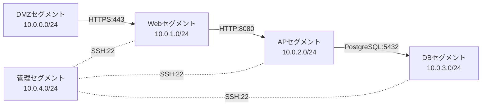
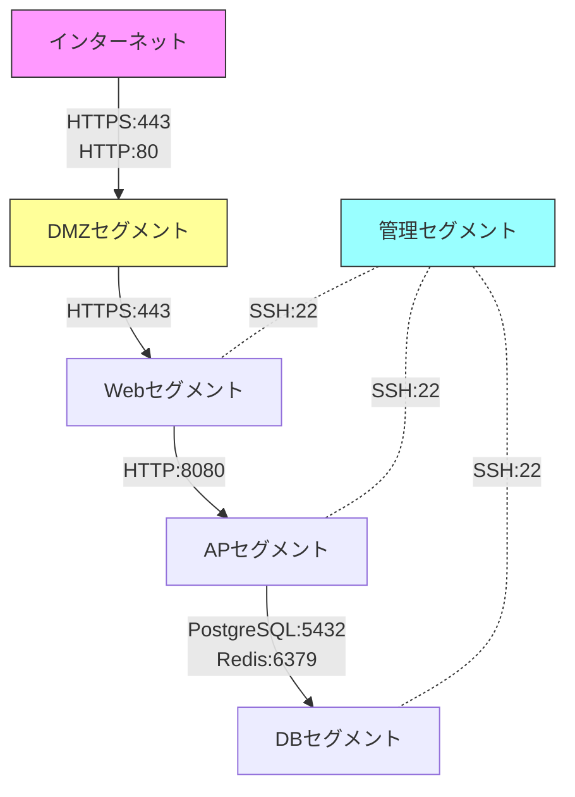

# ネットワーク構成図

## ドキュメント情報

| 項目 | 内容 |
|------|------|
| ドキュメントID | BD001-02 |
| ドキュメント名 | ネットワーク構成図 |
| システム名 | {システム名} |
| サブシステム名 | {サブシステム名} |
| 版数 | {版数} |
| ステータス | {作成中/レビュー中/承認済み} |
| 作成日 | {YYYY/MM/DD} |
| 作成者 | {作成者名} |
| 承認日 | {YYYY/MM/DD} |
| 承認者 | {承認者名} |

## 変更履歴

| 版数 | 変更日 | 変更者 | 変更内容 | 承認者 |
|------|--------|--------|----------|--------|
| 1.0 | {YYYY/MM/DD} | {変更者名} | 新規作成 | {承認者名} |
| {版数} | {YYYY/MM/DD} | {変更者名} | {変更内容} | {承認者名} |

## 目次

1. [概要](#概要)
2. [ネットワークトポロジー](#ネットワークトポロジー)
3. [ネットワークセグメント](#ネットワークセグメント)
4. [IPアドレス設計](#ipアドレス設計)
5. [ファイアウォール設計](#ファイアウォール設計)
6. [VPN接続](#vpn接続)
7. [DNS設計](#dns設計)

---

## 概要

### 目的

{このネットワーク構成図の目的を記述}

### 適用範囲

{このネットワーク構成図が適用される範囲を記述}

### ネットワーク要件

- {要件1}
- {要件2}
- {要件3}

---

## ネットワークトポロジー

### 全体ネットワーク構成

```mermaid
graph TB
    subgraph "インターネット"
        INTERNET[インターネット]
    end

    subgraph "DMZ ({CIDR})"
        FW1[ファイアウォール1]
        FW2[ファイアウォール2]
        LB[ロードバランサ<br/>{IPアドレス}]
        WAF[WAF<br/>{IPアドレス}]
    end

    subgraph "フロントエンドサブネット ({CIDR})"
        WEB1[Webサーバー1<br/>{IPアドレス}]
        WEB2[Webサーバー2<br/>{IPアドレス}]
    end

    subgraph "アプリケーションサブネット ({CIDR})"
        APP1[APサーバー1<br/>{IPアドレス}]
        APP2[APサーバー2<br/>{IPアドレス}]
    end

    subgraph "データベースサブネット ({CIDR})"
        DB1[(DBサーバー1<br/>{IPアドレス})]
        DB2[(DBサーバー2<br/>{IPアドレス})]
    end

    subgraph "管理サブネット ({CIDR})"
        BASTION[踏み台サーバー<br/>{IPアドレス}]
        MONITOR[監視サーバー<br/>{IPアドレス}]
    end

    INTERNET --> FW1
    INTERNET --> FW2
    FW1 --> WAF
    FW2 --> WAF
    WAF --> LB
    LB --> WEB1
    LB --> WEB2
    WEB1 --> APP1
    WEB2 --> APP2
    APP1 --> DB1
    APP2 --> DB2
    DB1 -.レプリケーション.- DB2

    BASTION -.管理アクセス.- WEB1
    BASTION -.管理アクセス.- APP1
    BASTION -.管理アクセス.- DB1
    MONITOR -.監視.- WEB1
    MONITOR -.監視.- APP1
    MONITOR -.監視.- DB1
```

### VPC/VNet構成（クラウド環境の場合）

```mermaid
graph TB
    subgraph "リージョン: {リージョン名}"
        subgraph "VPC: {VPC名} ({CIDR})"
            subgraph "AZ-1: {AZ名}"
                PUB1[パブリックサブネット1<br/>{CIDR}]
                PRI1[プライベートサブネット1<br/>{CIDR}]
                DB1[DBサブネット1<br/>{CIDR}]
            end

            subgraph "AZ-2: {AZ名}"
                PUB2[パブリックサブネット2<br/>{CIDR}]
                PRI2[プライベートサブネット2<br/>{CIDR}]
                DB2[DBサブネット2<br/>{CIDR}]
            end

            IGW[インターネットゲートウェイ]
            NATGW1[NATゲートウェイ1]
            NATGW2[NATゲートウェイ2]
        end

        subgraph "VPC Peering/Transit Gateway"
            PEER[他VPCとの接続]
        end
    end

    IGW --> PUB1
    IGW --> PUB2
    PUB1 --> NATGW1
    PUB2 --> NATGW2
    NATGW1 --> PRI1
    NATGW2 --> PRI2
    PRI1 --> DB1
    PRI2 --> DB2
```

### ネットワーク構成要素

| 構成要素 | 種別 | 冗長化 | 台数 | 帯域 | 備考 |
|----------|------|--------|------|------|------|
| {構成要素名} | {種別} | {冗長化方式} | {台数} | {帯域} | {備考} |
| ファイアウォール | {製品名/サービス名} | Active-Active | 2 | {帯域} | {備考} |
| ロードバランサ | {製品名/サービス名} | Multi-AZ | 2 | {帯域} | {備考} |
| NATゲートウェイ | {製品名/サービス名} | Multi-AZ | 2 | {帯域} | {備考} |

---

## ネットワークセグメント

### セグメント一覧

| セグメント名 | VLAN ID | サブネット | サブネットマスク | ゲートウェイ | 用途 | アクセス制御 |
|--------------|---------|------------|------------------|--------------|------|--------------|
| {セグメント名} | {VLAN ID} | {CIDR} | {サブネットマスク} | {ゲートウェイIP} | {用途} | {アクセス制御} |
| DMZセグメント | 10 | 10.0.0.0/24 | 255.255.255.0 | 10.0.0.1 | 公開サーバー配置 | インターネットからアクセス可 |
| Webセグメント | 20 | 10.0.1.0/24 | 255.255.255.0 | 10.0.1.1 | Webサーバー配置 | DMZからのみアクセス可 |
| APセグメント | 30 | 10.0.2.0/24 | 255.255.255.0 | 10.0.2.1 | APサーバー配置 | Webセグメントからのみアクセス可 |
| DBセグメント | 40 | 10.0.3.0/24 | 255.255.255.0 | 10.0.3.1 | DBサーバー配置 | APセグメントからのみアクセス可 |
| 管理セグメント | 50 | 10.0.4.0/24 | 255.255.255.0 | 10.0.4.1 | 運用管理サーバー配置 | 特定IPからのみアクセス可 |

### セグメント間通信



---

## IPアドレス設計

### IPアドレス割り当て方針

| 項目 | 方針 |
|------|------|
| プライベートIPアドレス範囲 | {RFC1918準拠範囲: 10.0.0.0/8 / 172.16.0.0/12 / 192.168.0.0/16} |
| サブネット割り当て単位 | {/24 / /25 / /26} |
| 将来拡張性 | {拡張可能台数} |
| 静的IP割り当て対象 | {サーバー/ロードバランサ/ゲートウェイ} |
| 動的IP割り当て対象 | {クライアント端末/一時サーバー} |

### IPアドレス割り当て表

#### DMZセグメント (10.0.0.0/24)

| IPアドレス | ホスト名 | 用途 | 割り当て方式 | 備考 |
|------------|----------|------|--------------|------|
| 10.0.0.1 | gw-dmz-01 | ゲートウェイ | 静的 | |
| 10.0.0.10 | lb-dmz-01 | ロードバランサ1 | 静的 | Primary |
| 10.0.0.11 | lb-dmz-02 | ロードバランサ2 | 静的 | Secondary |
| 10.0.0.20 | waf-dmz-01 | WAF | 静的 | |
| 10.0.0.100-10.0.0.200 | - | 予約 | - | 将来拡張用 |

#### Webセグメント (10.0.1.0/24)

| IPアドレス | ホスト名 | 用途 | 割り当て方式 | 備考 |
|------------|----------|------|--------------|------|
| 10.0.1.1 | gw-web-01 | ゲートウェイ | 静的 | |
| 10.0.1.10 | web-app-01 | Webサーバー1 | 静的 | |
| 10.0.1.11 | web-app-02 | Webサーバー2 | 静的 | |
| 10.0.1.100-10.0.1.200 | - | 予約 | - | オートスケーリング用 |

#### アプリケーションセグメント (10.0.2.0/24)

| IPアドレス | ホスト名 | 用途 | 割り当て方式 | 備考 |
|------------|----------|------|--------------|------|
| 10.0.2.1 | gw-app-01 | ゲートウェイ | 静的 | |
| 10.0.2.10 | app-srv-01 | APサーバー1 | 静的 | |
| 10.0.2.11 | app-srv-02 | APサーバー2 | 静的 | |
| 10.0.2.100-10.0.2.200 | - | 予約 | - | オートスケーリング用 |

#### データベースセグメント (10.0.3.0/24)

| IPアドレス | ホスト名 | 用途 | 割り当て方式 | 備考 |
|------------|----------|------|--------------|------|
| 10.0.3.1 | gw-db-01 | ゲートウェイ | 静的 | |
| 10.0.3.10 | db-primary-01 | DBサーバー（Primary） | 静的 | |
| 10.0.3.11 | db-standby-01 | DBサーバー（Standby） | 静的 | |
| 10.0.3.20 | cache-redis-01 | Redisキャッシュ | 静的 | |

#### 管理セグメント (10.0.4.0/24)

| IPアドレス | ホスト名 | 用途 | 割り当て方式 | 備考 |
|------------|----------|------|--------------|------|
| 10.0.4.1 | gw-mgmt-01 | ゲートウェイ | 静的 | |
| 10.0.4.10 | bastion-01 | 踏み台サーバー | 静的 | |
| 10.0.4.20 | monitor-01 | 監視サーバー | 静的 | |
| 10.0.4.30 | log-01 | ログ収集サーバー | 静的 | |

### パブリックIPアドレス

| パブリックIP | 用途 | 関連付け先 | Elastic IP | 備考 |
|--------------|------|------------|------------|------|
| {パブリックIP} | {用途} | {プライベートIP/リソース} | {Yes/No} | {備考} |
| {xxx.xxx.xxx.xxx} | サービス公開 | ロードバランサ | Yes | |
| {xxx.xxx.xxx.xxx} | 管理アクセス | 踏み台サーバー | Yes | |

---

## ファイアウォール設計

### ファイアウォールポリシー



### インバウンドルール

#### インターネット → DMZ

| ルールNo | プロトコル | 送信元 | 送信元ポート | 宛先 | 宛先ポート | アクション | 用途 | 備考 |
|----------|------------|--------|--------------|------|------------|------------|------|------|
| 100 | TCP | 0.0.0.0/0 | * | 10.0.0.10 | 443 | ALLOW | HTTPS通信 | |
| 101 | TCP | 0.0.0.0/0 | * | 10.0.0.10 | 80 | ALLOW | HTTP通信 | HTTPSへリダイレクト |
| 900 | ALL | 0.0.0.0/0 | * | 10.0.0.0/24 | * | DENY | デフォルト拒否 | |

#### DMZ → Webセグメント

| ルールNo | プロトコル | 送信元 | 送信元ポート | 宛先 | 宛先ポート | アクション | 用途 | 備考 |
|----------|------------|--------|--------------|------|------------|------------|------|------|
| 200 | TCP | 10.0.0.0/24 | * | 10.0.1.0/24 | 443 | ALLOW | HTTPS通信 | |
| 900 | ALL | 10.0.0.0/24 | * | 10.0.1.0/24 | * | DENY | デフォルト拒否 | |

#### Webセグメント → APセグメント

| ルールNo | プロトコル | 送信元 | 送信元ポート | 宛先 | 宛先ポート | アクション | 用途 | 備考 |
|----------|------------|--------|--------------|------|------------|------------|------|------|
| 300 | TCP | 10.0.1.0/24 | * | 10.0.2.0/24 | 8080 | ALLOW | HTTPアプリケーション通信 | |
| 900 | ALL | 10.0.1.0/24 | * | 10.0.2.0/24 | * | DENY | デフォルト拒否 | |

#### APセグメント → DBセグメント

| ルールNo | プロトコル | 送信元 | 送信元ポート | 宛先 | 宛先ポート | アクション | 用途 | 備考 |
|----------|------------|--------|--------------|------|------------|------------|------|------|
| 400 | TCP | 10.0.2.0/24 | * | 10.0.3.10 | 5432 | ALLOW | PostgreSQL通信 | |
| 401 | TCP | 10.0.2.0/24 | * | 10.0.3.20 | 6379 | ALLOW | Redis通信 | |
| 900 | ALL | 10.0.2.0/24 | * | 10.0.3.0/24 | * | DENY | デフォルト拒否 | |

#### 管理セグメント → 各セグメント

| ルールNo | プロトコル | 送信元 | 送信元ポート | 宛先 | 宛先ポート | アクション | 用途 | 備考 |
|----------|------------|--------|--------------|------|------------|------------|------|------|
| 500 | TCP | 10.0.4.0/24 | * | 10.0.1.0/24 | 22 | ALLOW | SSH管理アクセス | |
| 501 | TCP | 10.0.4.0/24 | * | 10.0.2.0/24 | 22 | ALLOW | SSH管理アクセス | |
| 502 | TCP | 10.0.4.0/24 | * | 10.0.3.0/24 | 22 | ALLOW | SSH管理アクセス | |
| 503 | ICMP | 10.0.4.0/24 | * | 10.0.0.0/16 | * | ALLOW | 死活監視 | |

### アウトバウンドルール

| ルールNo | プロトコル | 送信元 | 送信元ポート | 宛先 | 宛先ポート | アクション | 用途 | 備考 |
|----------|------------|--------|--------------|------|------------|------------|------|------|
| 600 | TCP | 10.0.0.0/16 | * | 0.0.0.0/0 | 443 | ALLOW | 外部APIアクセス | |
| 601 | TCP | 10.0.0.0/16 | * | 0.0.0.0/0 | 80 | ALLOW | パッケージ更新 | |
| 602 | UDP | 10.0.0.0/16 | * | {DNSサーバーIP} | 53 | ALLOW | DNS問い合わせ | |
| 603 | UDP | 10.0.0.0/16 | 123 | 0.0.0.0/0 | 123 | ALLOW | NTP同期 | |
| 900 | ALL | 10.0.0.0/16 | * | 0.0.0.0/0 | * | DENY | デフォルト拒否 | |

### セキュリティグループ/NSG設定（クラウド環境の場合）

#### Webサーバー用セキュリティグループ

| 方向 | プロトコル | ポート範囲 | 送信元/送信先 | 説明 |
|------|------------|-----------|---------------|------|
| Inbound | TCP | 443 | {LBセキュリティグループID} | LBからのHTTPS通信 |
| Inbound | TCP | 22 | {踏み台セキュリティグループID} | 管理アクセス |
| Outbound | TCP | 8080 | {APセキュリティグループID} | APサーバーへの通信 |
| Outbound | TCP | 443 | 0.0.0.0/0 | 外部APIアクセス |

---

## VPN接続

### VPN構成

```mermaid
graph LR
    subgraph "オンプレミス環境"
        ON_PREM[社内ネットワーク<br/>{CIDR}]
        VPN_GW_ON[VPNゲートウェイ<br/>オンプレミス側]
    end

    subgraph "インターネット"
        INTERNET[インターネット]
    end

    subgraph "クラウド環境"
        VPN_GW_CLOUD[VPNゲートウェイ<br/>クラウド側]
        VPC[VPC<br/>{CIDR}]
    end

    ON_PREM --> VPN_GW_ON
    VPN_GW_ON -.IPsec Tunnel.- INTERNET
    INTERNET -.IPsec Tunnel.- VPN_GW_CLOUD
    VPN_GW_CLOUD --> VPC
```

### VPN接続設定

| 項目 | 設定値 | 備考 |
|------|--------|------|
| VPN種別 | {Site-to-Site VPN / Client VPN / AWS Direct Connect / Azure ExpressRoute} | |
| 暗号化方式 | {IPsec / SSL-VPN / WireGuard} | |
| 認証方式 | {事前共有鍵 / 証明書 / MFA} | |
| IKEバージョン | {IKEv1 / IKEv2} | |
| Phase 1暗号化 | {AES-256 / AES-128} | |
| Phase 1ハッシュ | {SHA-256 / SHA-1} | |
| Phase 1 DHグループ | {Group 14 / Group 2} | |
| Phase 2暗号化 | {AES-256 / AES-128} | |
| Phase 2ハッシュ | {SHA-256 / SHA-1} | |
| Phase 2 PFSグループ | {Group 14 / Group 2} | |
| キープアライブ | {秒数} | |
| 帯域 | {帯域} | |

### VPN接続一覧

| 接続名 | 接続元 | 接続先 | 用途 | 冗長化 | 備考 |
|--------|--------|--------|------|--------|------|
| {接続名} | {CIDR} | {CIDR} | {用途} | {冗長化構成} | {備考} |
| VPN-HQ-to-Cloud | 192.168.0.0/16 | 10.0.0.0/16 | 本社-クラウド間接続 | Primary/Secondary | |

---

## DNS設計

### DNS構成

```mermaid
graph TB
    subgraph "パブリックDNS"
        ROUTE53[Route 53 / Cloud DNS<br/>ゾーン: {example.com}]
    end

    subgraph "プライベートDNS"
        PRIVATE_DNS[プライベートDNSゾーン<br/>ゾーン: {internal.example.com}]
    end

    INTERNET[インターネットユーザー]
    INTERNAL[内部サーバー]

    INTERNET --> ROUTE53
    ROUTE53 --> LB[ロードバランサ]
    INTERNAL --> PRIVATE_DNS
    PRIVATE_DNS --> APP[アプリケーションサーバー]
```

### パブリックDNSレコード

| レコードタイプ | ホスト名 | 値 | TTL | ルーティングポリシー | 備考 |
|----------------|----------|-----|-----|----------------------|------|
| {A/AAAA/CNAME/MX/TXT} | {ホスト名} | {IPアドレス/FQDN} | {秒数} | {シンプル/加重/レイテンシー/フェイルオーバー} | {備考} |
| A | www.{example.com} | {パブリックIP} | 300 | フェイルオーバー | Primary |
| A | www.{example.com} | {パブリックIP-DR} | 300 | フェイルオーバー | Secondary |
| CNAME | api.{example.com} | {LB DNS名} | 300 | シンプル | |
| MX | {example.com} | mail.{example.com} | 3600 | シンプル | 優先度:10 |
| TXT | {example.com} | "v=spf1 include:_spf.{example.com} ~all" | 3600 | シンプル | SPFレコード |

### プライベートDNSレコード

| レコードタイプ | ホスト名 | 値 | TTL | 備考 |
|----------------|----------|-----|-----|------|
| A | db-primary.internal.{example.com} | 10.0.3.10 | 60 | DBプライマリ |
| A | db-standby.internal.{example.com} | 10.0.3.11 | 60 | DBスタンバイ |
| A | cache.internal.{example.com} | 10.0.3.20 | 60 | Redisキャッシュ |
| CNAME | db.internal.{example.com} | db-primary.internal.{example.com} | 60 | DB接続エンドポイント |

### DNSフェイルオーバー設定

| エンドポイント | タイプ | ヘルスチェック | フェイルオーバー先 | 備考 |
|----------------|--------|----------------|-------------------|------|
| {エンドポイント名} | {Primary/Secondary} | {ヘルスチェック設定} | {フェイルオーバー先} | {備考} |
| Primary LB | Primary | HTTPS:443 @ /health | Secondary LB | |
| Secondary LB | Secondary | HTTPS:443 @ /health | - | DR環境 |

---

## 承認

| 役割 | 氏名 | 承認日 | 署名 |
|------|------|--------|------|
| 作成者 | {作成者名} | {YYYY/MM/DD} | |
| レビュー担当者 | {レビュー担当者名} | {YYYY/MM/DD} | |
| 承認者 | {承認者名} | {YYYY/MM/DD} | |

---

## 参照

### 関連ドキュメント

- [システム構成図] BD001-01_システム構成図
- [セキュリティ要件定義書] {ドキュメントパス}
- [ハードウェア構成図] BD001-04_ハードウェア構成図

### 外部参照

- {参照先タイトル}: {URL}
