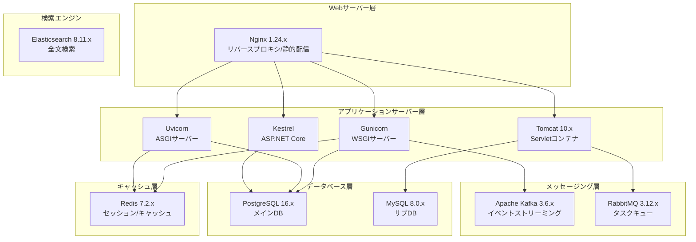
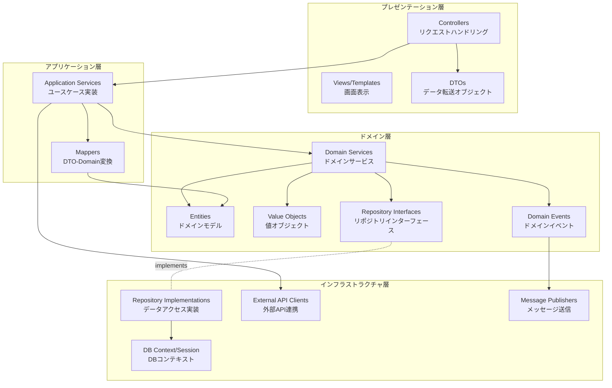
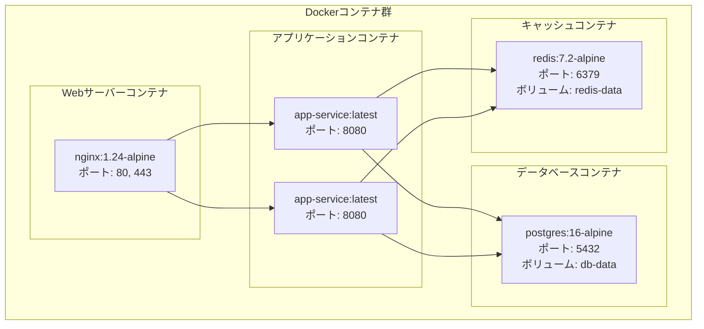
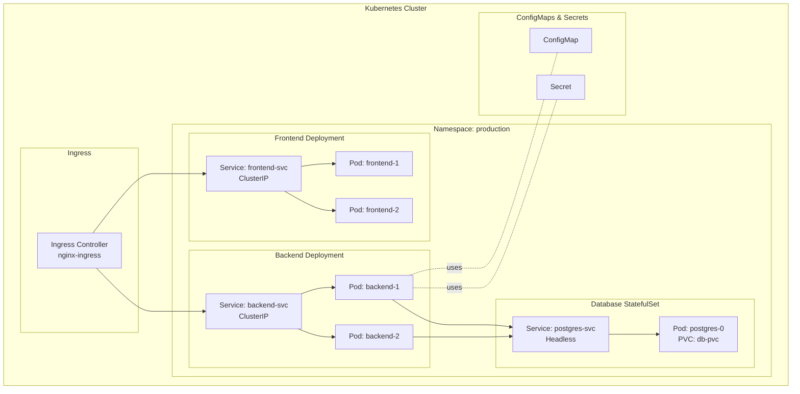

# ソフトウェア構成図

## ドキュメント情報

| 項目 | 内容 |
|------|------|
| ドキュメントID | BD001-03 |
| ドキュメント名 | ソフトウェア構成図 |
| システム名 | {システム名} |
| サブシステム名 | {サブシステム名} |
| 版数 | {版数} |
| ステータス | {作成中/レビュー中/承認済み} |
| 作成日 | {YYYY/MM/DD} |
| 作成者 | {作成者名} |
| 承認日 | {YYYY/MM/DD} |
| 承認者 | {承認者名} |

## 変更履歴

| 版数 | 変更日 | 変更者 | 変更内容 | 承認者 |
|------|--------|--------|----------|--------|
| 1.0 | {YYYY/MM/DD} | {変更者名} | 新規作成 | {承認者名} |
| {版数} | {YYYY/MM/DD} | {変更者名} | {変更内容} | {承認者名} |

## 目次

1. [概要](#概要)
2. [アプリケーション構成](#アプリケーション構成)
3. [ミドルウェア構成](#ミドルウェア構成)
4. [ソフトウェアコンポーネント](#ソフトウェアコンポーネント)
5. [ライブラリ・パッケージ](#ライブラリパッケージ)
6. [デプロイメント構成](#デプロイメント構成)

---

## 概要

### 目的

{このソフトウェア構成図の目的を記述}

### 適用範囲

{このソフトウェア構成図が適用される範囲を記述}

### ソフトウェアアーキテクチャパターン

{選択したアーキテクチャパターン: モノリシック/マイクロサービス/レイヤードアーキテクチャ/クリーンアーキテクチャ}

---

## アプリケーション構成

### アプリケーション全体構成

```mermaid
graph TB
    subgraph "フロントエンドアプリケーション"
        WEB_APP[Webアプリケーション<br/>{React/Vue.js/Angular}]
        MOBILE_APP[モバイルアプリ<br/>{React Native/Flutter}]
    end

    subgraph "バックエンドアプリケーション"
        API_GW[APIゲートウェイ<br/>{Kong/AWS API Gateway}]

        subgraph "マイクロサービス群"
            AUTH_SVC[認証サービス<br/>{言語/フレームワーク}]
            USER_SVC[ユーザーサービス<br/>{言語/フレームワーク}]
            ORDER_SVC[注文サービス<br/>{言語/フレームワーク}]
            PAYMENT_SVC[決済サービス<br/>{言語/フレームワーク}]
        end

        BATCH[バッチアプリケーション<br/>{言語/フレームワーク}]
    end

    subgraph "データストア"
        DB[(RDB<br/>{PostgreSQL/MySQL})]
        NOSQL[(NoSQL<br/>{MongoDB/DynamoDB})]
        CACHE[(Cache<br/>{Redis/Memcached})]
        QUEUE[メッセージキュー<br/>{Kafka/RabbitMQ/SQS}]
    end

    WEB_APP --> API_GW
    MOBILE_APP --> API_GW
    API_GW --> AUTH_SVC
    API_GW --> USER_SVC
    API_GW --> ORDER_SVC
    API_GW --> PAYMENT_SVC

    AUTH_SVC --> DB
    USER_SVC --> DB
    ORDER_SVC --> DB
    PAYMENT_SVC --> DB

    USER_SVC --> CACHE
    ORDER_SVC --> CACHE

    ORDER_SVC --> QUEUE
    PAYMENT_SVC --> QUEUE
    QUEUE --> BATCH
    BATCH --> DB
```

### アプリケーション一覧

| アプリケーション名 | 種別 | 開発言語 | フレームワーク | バージョン | 実行環境 | 備考 |
|--------------------|------|----------|----------------|------------|----------|------|
| {アプリケーション名} | {Web/API/バッチ/モバイル} | {言語} | {フレームワーク} | {バージョン} | {実行環境} | {備考} |
| Webフロントエンド | Web | TypeScript | React | 18.2.0 | Node.js 20.x | SPA |
| 認証サービス | API | Python | FastAPI | 0.104.0 | Python 3.11 | マイクロサービス |
| ユーザーサービス | API | Go | Gin | 1.9.0 | Go 1.21 | マイクロサービス |
| 注文サービス | API | Java | Spring Boot | 3.2.0 | JDK 21 | マイクロサービス |
| 決済サービス | API | C# | ASP.NET Core | 8.0 | .NET 8.0 | マイクロサービス |
| 日次集計バッチ | バッチ | Python | - | 3.11 | Python 3.11 | 毎日2:00実行 |

---

## ミドルウェア構成

### ミドルウェアスタック



### ミドルウェア一覧

| カテゴリ | ミドルウェア名 | バージョン | 用途 | インストール先 | 設定ファイル | 備考 |
|----------|----------------|------------|------|----------------|--------------|------|
| {カテゴリ} | {製品名} | {バージョン} | {用途} | {サーバー/コンテナ} | {パス} | {備考} |
| Webサーバー | Nginx | 1.24.0 | リバースプロキシ | Webサーバー | /etc/nginx/nginx.conf | |
| APサーバー | Gunicorn | 21.2.0 | WSGI実行 | APサーバー | gunicorn_config.py | Python用 |
| APサーバー | Uvicorn | 0.24.0 | ASGI実行 | APサーバー | - | FastAPI用 |
| APサーバー | Tomcat | 10.1.15 | Servlet実行 | APサーバー | server.xml | Spring Boot用 |
| RDBMS | PostgreSQL | 16.1 | メインデータベース | DBサーバー | postgresql.conf | |
| RDBMS | MySQL | 8.0.35 | サブデータベース | DBサーバー | my.cnf | |
| キャッシュ | Redis | 7.2.3 | セッション管理/キャッシュ | キャッシュサーバー | redis.conf | クラスター構成 |
| メッセージブローカー | Apache Kafka | 3.6.0 | イベントストリーミング | メッセージサーバー | server.properties | |
| メッセージブローカー | RabbitMQ | 3.12.10 | タスクキュー | メッセージサーバー | rabbitmq.conf | |
| 全文検索 | Elasticsearch | 8.11.3 | 全文検索エンジン | 検索サーバー | elasticsearch.yml | |

### ミドルウェア設定概要

#### Nginx

```nginx
# 主要設定項目
worker_processes: {数値}
worker_connections: {数値}
keepalive_timeout: {秒数}
client_max_body_size: {サイズ}
proxy_connect_timeout: {秒数}
proxy_read_timeout: {秒数}
```

#### PostgreSQL

```ini
# 主要設定項目
max_connections = {数値}
shared_buffers = {サイズ}
effective_cache_size = {サイズ}
maintenance_work_mem = {サイズ}
checkpoint_completion_target = {数値}
wal_buffers = {サイズ}
default_statistics_target = {数値}
random_page_cost = {数値}
work_mem = {サイズ}
```

#### Redis

```ini
# 主要設定項目
maxmemory = {サイズ}
maxmemory-policy = {allkeys-lru/volatile-lru/allkeys-lfu}
timeout = {秒数}
tcp-keepalive = {秒数}
cluster-enabled = {yes/no}
```

---

## ソフトウェアコンポーネント

### コンポーネント構成図（レイヤードアーキテクチャ）



### コンポーネント一覧

| レイヤー | コンポーネント名 | 責務 | 主要クラス/モジュール | 備考 |
|----------|------------------|------|----------------------|------|
| プレゼンテーション層 | Controllers | HTTPリクエスト処理、バリデーション | {クラス名リスト} | {備考} |
| プレゼンテーション層 | DTOs | データ転送、シリアライゼーション | {クラス名リスト} | {備考} |
| アプリケーション層 | Application Services | ユースケース実装、トランザクション管理 | {クラス名リスト} | {備考} |
| アプリケーション層 | Mappers | DTO-Domain変換 | {クラス名リスト} | {備考} |
| ドメイン層 | Entities | ビジネスルール、不変条件 | {クラス名リスト} | {備考} |
| ドメイン層 | Value Objects | 値の表現、不変性 | {クラス名リスト} | {備考} |
| ドメイン層 | Domain Services | ドメインロジック | {クラス名リスト} | {備考} |
| インフラストラクチャ層 | Repositories | データ永続化 | {クラス名リスト} | {備考} |
| インフラストラクチャ層 | External API Clients | 外部サービス連携 | {クラス名リスト} | {備考} |

---

## ライブラリ・パッケージ

### フロントエンド（TypeScript/React）

#### 依存パッケージ一覧

```json
{
  "dependencies": {
    "react": "^18.2.0",
    "react-dom": "^18.2.0",
    "react-router-dom": "^6.20.0",
    "@tanstack/react-query": "^5.12.0",
    "axios": "^1.6.2",
    "zustand": "^4.4.7",
    "@mui/material": "^5.14.20",
    "date-fns": "^2.30.0",
    "zod": "^3.22.4"
  },
  "devDependencies": {
    "@types/react": "^18.2.43",
    "@types/react-dom": "^18.2.17",
    "@vitejs/plugin-react": "^4.2.1",
    "vite": "^5.0.7",
    "typescript": "^5.3.3",
    "eslint": "^8.55.0",
    "prettier": "^3.1.1",
    "vitest": "^1.0.4",
    "@testing-library/react": "^14.1.2"
  }
}
```

### バックエンド（Python/FastAPI）

#### 依存パッケージ一覧（requirements.txt）

```txt
fastapi==0.104.1
uvicorn[standard]==0.24.0
pydantic==2.5.2
pydantic-settings==2.1.0
sqlalchemy==2.0.23
alembic==1.13.0
psycopg2-binary==2.9.9
redis==5.0.1
celery==5.3.4
httpx==0.25.2
python-jose[cryptography]==3.3.0
passlib[bcrypt]==1.7.4
python-multipart==0.0.6
pytest==7.4.3
pytest-asyncio==0.21.1
black==23.12.0
flake8==6.1.0
mypy==1.7.1
```

### バックエンド（Java/Spring Boot）

#### 依存関係一覧（pom.xml/build.gradle）

```xml
<!-- Spring Boot Starter -->
<dependency>
    <groupId>org.springframework.boot</groupId>
    <artifactId>spring-boot-starter-web</artifactId>
    <version>3.2.0</version>
</dependency>
<dependency>
    <groupId>org.springframework.boot</groupId>
    <artifactId>spring-boot-starter-data-jpa</artifactId>
    <version>3.2.0</version>
</dependency>
<dependency>
    <groupId>org.springframework.boot</groupId>
    <artifactId>spring-boot-starter-security</artifactId>
    <version>3.2.0</version>
</dependency>
<!-- Database -->
<dependency>
    <groupId>org.postgresql</groupId>
    <artifactId>postgresql</artifactId>
    <version>42.7.1</version>
</dependency>
<!-- Redis -->
<dependency>
    <groupId>org.springframework.boot</groupId>
    <artifactId>spring-boot-starter-data-redis</artifactId>
    <version>3.2.0</version>
</dependency>
<!-- Testing -->
<dependency>
    <groupId>org.springframework.boot</groupId>
    <artifactId>spring-boot-starter-test</artifactId>
    <version>3.2.0</version>
    <scope>test</scope>
</dependency>
```

### ライブラリ管理方針

| 項目 | 方針 | 備考 |
|------|------|------|
| バージョン固定 | {セマンティックバージョニング準拠/固定バージョン} | {備考} |
| 脆弱性チェック | {ツール名: npm audit/pip-audit/OWASP Dependency Check} | {実施頻度} |
| ライセンス確認 | {確認対象ライセンス} | {承認プロセス} |
| 更新頻度 | {月次/四半期/随時} | {更新基準} |

---

## デプロイメント構成

### コンテナ構成（Docker）



### Dockerイメージ一覧

| イメージ名 | ベースイメージ | タグ | 用途 | ビルド方法 | レジストリ | 備考 |
|------------|----------------|------|------|------------|------------|------|
| {イメージ名} | {ベースイメージ} | {タグ} | {用途} | {Dockerfile/docker-compose} | {ECR/Docker Hub/GCR} | {備考} |
| web-frontend | node:20-alpine | latest | フロントエンド配信 | Multi-stage build | ECR | Nginx配信 |
| api-auth-service | python:3.11-slim | latest | 認証API | Dockerfile | ECR | FastAPI |
| api-user-service | golang:1.21-alpine | latest | ユーザーAPI | Multi-stage build | ECR | Gin |
| api-order-service | eclipse-temurin:21-jre | latest | 注文API | Multi-stage build | ECR | Spring Boot |

### Kubernetes構成（K8s使用時）



### デプロイメント設定

| 環境 | デプロイ方式 | オーケストレーション | レプリカ数 | リソース制限 | 備考 |
|------|--------------|----------------------|------------|--------------|------|
| {環境名} | {Blue/Green/Rolling/Canary} | {Docker Compose/K8s/ECS} | {数値} | {CPU/メモリ} | {備考} |
| 開発環境 | Rolling Update | Docker Compose | 1 | CPU: 0.5, Mem: 512MB | |
| ステージング環境 | Blue/Green | Kubernetes | 2 | CPU: 1, Mem: 1GB | |
| 本番環境 | Rolling Update | Kubernetes | 3-10（オートスケール） | CPU: 2, Mem: 2GB | HPA設定 |

---

## 承認

| 役割 | 氏名 | 承認日 | 署名 |
|------|------|--------|------|
| 作成者 | {作成者名} | {YYYY/MM/DD} | |
| レビュー担当者 | {レビュー担当者名} | {YYYY/MM/DD} | |
| 承認者 | {承認者名} | {YYYY/MM/DD} | |

---

## 参照

### 関連ドキュメント

- [システム構成図] BD001-01_システム構成図
- [ハードウェア構成図] BD001-04_ハードウェア構成図
- [詳細設計書] {ドキュメントパス}

### 外部参照

- {参照先タイトル}: {URL}
