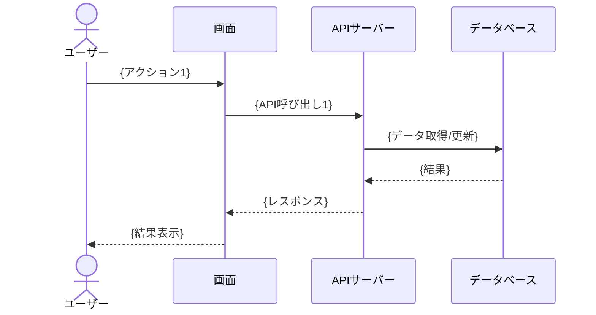
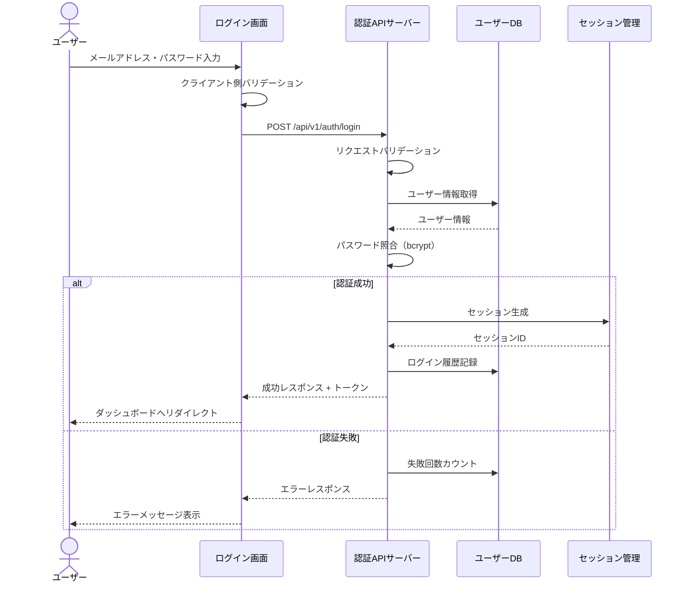
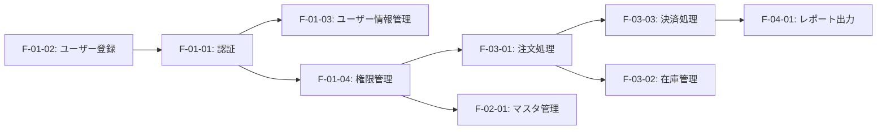

# 機能設計書

## ドキュメント情報

| 項目 | 内容 |
|------|------|
| ドキュメントID | BD002 |
| ドキュメント名 | 機能設計書 |
| システム名 | {システム名} |
| サブシステム名 | {サブシステム名} |
| 版数 | {版数} |
| ステータス | {作成中/レビュー中/承認済み} |
| 作成日 | {YYYY/MM/DD} |
| 作成者 | {作成者名} |
| 承認日 | {YYYY/MM/DD} |
| 承認者 | {承認者名} |

## 変更履歴

| 版数 | 変更日 | 変更者 | 変更内容 | 承認者 |
|------|--------|--------|----------|--------|
| 1.0 | {YYYY/MM/DD} | {変更者名} | 新規作成 | {承認者名} |
| {版数} | {YYYY/MM/DD} | {変更者名} | {変更内容} | {承認者名} |

## 目次

1. [概要](#概要)
2. [機能一覧](#機能一覧)
3. [機能階層図](#機能階層図)
4. [機能詳細仕様](#機能詳細仕様)
5. [機能間連携](#機能間連携)
6. [非機能要件](#非機能要件)

---

## 概要

### 目的

{この機能設計書の目的を記述}

### 適用範囲

{この機能設計書が適用される範囲を記述}

### 用語定義

| 用語 | 定義 |
|------|------|
| {用語} | {定義} |

---

## 機能一覧

### 大分類機能一覧

| 機能ID | 機能大分類 | 概要 | 優先度 | 開発フェーズ | 備考 |
|--------|------------|------|--------|--------------|------|
| {F-XX} | {機能大分類名} | {概要} | {高/中/低} | {Phase1/Phase2} | {備考} |
| F-01 | ユーザー管理 | ユーザーの登録・認証・権限管理 | 高 | Phase1 | |
| F-02 | マスタ管理 | 各種マスタデータの管理 | 高 | Phase1 | |
| F-03 | 業務処理 | メイン業務処理機能 | 高 | Phase1 | |
| F-04 | レポート出力 | 各種帳票・レポート出力 | 中 | Phase2 | |
| F-05 | システム管理 | システム設定・監視・ログ管理 | 中 | Phase1 | |

### 機能一覧詳細

| 機能ID | 大分類 | 中分類 | 小分類 | 機能名 | 概要 | 画面/API | 優先度 | 備考 |
|--------|--------|--------|--------|--------|------|----------|--------|------|
| {F-XX-YY-ZZ} | {大分類} | {中分類} | {小分類} | {機能名} | {概要} | {画面ID/API ID} | {高/中/低} | {備考} |
| F-01-01-01 | ユーザー管理 | 認証 | ログイン | ユーザーログイン | メールアドレスとパスワードでログイン | SCR-001 | 高 | |
| F-01-01-02 | ユーザー管理 | 認証 | ログアウト | ユーザーログアウト | セッション破棄とログアウト処理 | - | 高 | |
| F-01-01-03 | ユーザー管理 | 認証 | パスワードリセット | パスワード再設定 | メールによるパスワードリセット | SCR-002 | 高 | |
| F-01-02-01 | ユーザー管理 | ユーザー登録 | 新規登録 | ユーザー新規登録 | 新規ユーザーの登録 | SCR-010 | 高 | |
| F-01-02-02 | ユーザー管理 | ユーザー登録 | メール認証 | メールアドレス認証 | 登録メールアドレスの認証 | SCR-011 | 高 | |
| F-01-03-01 | ユーザー管理 | ユーザー情報管理 | プロフィール参照 | プロフィール表示 | ユーザープロフィール情報の表示 | SCR-020 | 中 | |
| F-01-03-02 | ユーザー管理 | ユーザー情報管理 | プロフィール更新 | プロフィール編集 | ユーザープロフィール情報の更新 | SCR-021 | 中 | |

---

## 機能階層図

### 機能階層構造

```mermaid
graph TB
    ROOT[システム]

    ROOT --> F01[F-01: ユーザー管理]
    ROOT --> F02[F-02: マスタ管理]
    ROOT --> F03[F-03: 業務処理]
    ROOT --> F04[F-04: レポート出力]
    ROOT --> F05[F-05: システム管理]

    F01 --> F0101[F-01-01: 認証]
    F01 --> F0102[F-01-02: ユーザー登録]
    F01 --> F0103[F-01-03: ユーザー情報管理]
    F01 --> F0104[F-01-04: 権限管理]

    F0101 --> F010101[F-01-01-01: ログイン]
    F0101 --> F010102[F-01-01-02: ログアウト]
    F0101 --> F010103[F-01-01-03: パスワードリセット]
    F0101 --> F010104[F-01-01-04: 多要素認証]

    F0102 --> F010201[F-01-02-01: 新規登録]
    F0102 --> F010202[F-01-02-02: メール認証]
    F0102 --> F010203[F-01-02-03: 招待登録]

    F02 --> F0201[F-02-01: 商品マスタ]
    F02 --> F0202[F-02-02: 顧客マスタ]
    F02 --> F0203[F-02-03: 組織マスタ]

    F03 --> F0301[F-03-01: 注文処理]
    F03 --> F0302[F-03-02: 在庫管理]
    F03 --> F0303[F-03-03: 決済処理]

    F04 --> F0401[F-04-01: 売上レポート]
    F04 --> F0402[F-04-02: 在庫レポート]

    F05 --> F0501[F-05-01: システム設定]
    F05 --> F0502[F-05-02: ログ管理]
    F05 --> F0503[F-05-03: 監視・アラート]
```

---

## 機能詳細仕様

### 機能仕様テンプレート

各機能について以下の形式で詳細を記述します。

---

#### 機能ID: {F-XX-YY-ZZ}

##### 基本情報

| 項目 | 内容 |
|------|------|
| 機能ID | {F-XX-YY-ZZ} |
| 機能名 | {機能名} |
| 機能概要 | {機能の概要説明} |
| 利用者 | {利用者ロール} |
| 関連画面 | {画面ID} |
| 関連API | {API ID} |
| 優先度 | {高/中/低} |
| 開発フェーズ | {Phase1/Phase2} |

##### 機能フロー

##### 入力

| 項目ID | 項目名 | 型 | 必須 | 桁数 | 形式 | デフォルト値 | バリデーション | 備考 |
|--------|--------|-----|------|------|------|--------------|----------------|------|
| {項目ID} | {項目名} | {String/Number/Date/Boolean} | {○/×} | {桁数} | {形式} | {デフォルト値} | {バリデーションルール} | {備考} |

##### 処理内容

1. {処理ステップ1}
2. {処理ステップ2}
3. {処理ステップ3}

##### 出力

| 項目ID | 項目名 | 型 | 形式 | 備考 |
|--------|--------|-----|------|------|
| {項目ID} | {項目名} | {String/Number/Date/Boolean} | {形式} | {備考} |

##### ビジネスルール

| ルールID | ルール内容 | 優先度 |
|----------|------------|--------|
| {BR-XXX} | {ビジネスルール内容} | {高/中/低} |

##### エラー処理

| エラーコード | エラー条件 | エラーメッセージ | 対処方法 |
|--------------|------------|------------------|----------|
| {E-XXXX} | {エラー条件} | {エラーメッセージ} | {対処方法} |

##### 非機能要件

| 項目 | 要件 |
|------|------|
| レスポンスタイム | {X秒以内} |
| スループット | {Y件/秒} |
| 同時実行数 | {Z件} |
| データ保持期間 | {期間} |

---

### 機能詳細: F-01-01-01 ユーザーログイン

##### 基本情報

| 項目 | 内容 |
|------|------|
| 機能ID | F-01-01-01 |
| 機能名 | ユーザーログイン |
| 機能概要 | メールアドレスとパスワードを使用したユーザー認証 |
| 利用者 | 全ユーザー |
| 関連画面 | SCR-001 ログイン画面 |
| 関連API | API-001 POST /api/v1/auth/login |
| 優先度 | 高 |
| 開発フェーズ | Phase1 |

##### 機能フロー

##### 入力

| 項目ID | 項目名 | 型 | 必須 | 桁数 | 形式 | デフォルト値 | バリデーション | 備考 |
|--------|--------|-----|------|------|------|--------------|----------------|------|
| email | メールアドレス | String | ○ | 最大255 | メールアドレス形式 | - | RFC5322準拠 | |
| password | パスワード | String | ○ | 8-128 | 英数字記号 | - | 最低8文字、英大小数字記号各1文字以上 | |
| remember_me | ログイン状態保持 | Boolean | × | - | true/false | false | - | チェックボックス |

##### 処理内容

1. 入力値のバリデーション実行
2. メールアドレスでユーザー情報を検索
3. ユーザーが存在しない場合はエラー（E-0101）
4. アカウントロック状態を確認（5回連続失敗でロック）
5. パスワードハッシュ値を照合（bcrypt使用）
6. 認証成功時:
   - JWTトークン生成（有効期限: 1時間）
   - リフレッシュトークン生成（有効期限: 30日）
   - セッション情報をRedisに保存
   - ログイン履歴をDBに記録
   - 失敗カウントをリセット
7. 認証失敗時:
   - 失敗回数をインクリメント
   - 5回失敗でアカウントロック（30分間）
   - ログイン失敗履歴を記録

##### 出力

| 項目ID | 項目名 | 型 | 形式 | 備考 |
|--------|--------|-----|------|------|
| access_token | アクセストークン | String | JWT | 有効期限1時間 |
| refresh_token | リフレッシュトークン | String | JWT | 有効期限30日 |
| user_id | ユーザーID | String | UUID | |
| user_name | ユーザー名 | String | - | |
| roles | ロール | Array | - | 権限情報 |
| expires_at | トークン有効期限 | DateTime | ISO8601 | |

##### ビジネスルール

| ルールID | ルール内容 | 優先度 |
|----------|------------|--------|
| BR-001 | 5回連続ログイン失敗でアカウントを30分間ロック | 高 |
| BR-002 | パスワードは90日ごとに変更を推奨（警告表示） | 中 |
| BR-003 | 最終ログインから180日経過したアカウントは無効化 | 中 |
| BR-004 | セッションタイムアウトは30分間操作なし | 高 |

##### エラー処理

| エラーコード | エラー条件 | エラーメッセージ | 対処方法 |
|--------------|------------|------------------|----------|
| E-0101 | メールアドレス未登録 | メールアドレスまたはパスワードが正しくありません | 入力内容を確認 |
| E-0102 | パスワード不一致 | メールアドレスまたはパスワードが正しくありません | 入力内容を確認 |
| E-0103 | アカウントロック中 | アカウントがロックされています。30分後に再試行してください | 時間経過後に再試行 |
| E-0104 | アカウント無効化 | このアカウントは無効化されています。管理者にお問い合わせください | 管理者連絡 |
| E-0105 | メール未認証 | メールアドレスの認証が完了していません | 認証メール確認 |

##### 非機能要件

| 項目 | 要件 |
|------|------|
| レスポンスタイム | 2秒以内（95パーセンタイル） |
| スループット | 100リクエスト/秒 |
| 同時実行数 | 1000セッション |
| セキュリティ | HTTPS必須、bcryptでパスワードハッシュ化 |
| ログ保持期間 | ログイン履歴は3年間保持 |

---

## 機能間連携

### 機能間連携図

### 連携仕様

| 連携元機能 | 連携先機能 | 連携データ | 連携方式 | タイミング | 備考 |
|------------|------------|------------|----------|------------|------|
| {機能ID} | {機能ID} | {データ項目} | {同期/非同期/API/イベント} | {タイミング} | {備考} |
| F-01-01 | F-01-04 | ユーザーID、ロール情報 | 同期API呼び出し | ログイン時 | 権限チェック |
| F-03-01 | F-03-03 | 注文ID、金額 | 非同期メッセージング | 注文確定時 | Kafka経由 |
| F-03-01 | F-03-02 | 商品ID、数量 | 同期API呼び出し | 注文登録時 | 在庫引当 |
| F-03-03 | F-04-01 | 決済完了イベント | 非同期イベント | 決済完了時 | レポート更新 |

---

## 非機能要件

### パフォーマンス要件

| 機能ID | レスポンスタイム目標 | スループット目標 | 備考 |
|--------|----------------------|------------------|------|
| F-01-01-01 | 2秒以内（95%ile） | 100 req/sec | ログイン処理 |
| F-03-01-XX | 3秒以内（95%ile） | 50 req/sec | 注文処理 |
| F-04-01-XX | 10秒以内（95%ile） | 10 req/sec | レポート生成 |

### 可用性要件

| 機能ID | 稼働率目標 | ダウンタイム許容 | 備考 |
|--------|------------|------------------|------|
| F-01-01-01 | 99.9% | 8.76時間/年 | 認証機能 |
| F-03-01-XX | 99.9% | 8.76時間/年 | 注文処理 |
| F-04-01-XX | 99.5% | 43.8時間/年 | レポート出力 |

### セキュリティ要件

| 機能ID | セキュリティ要件 | 実装方式 |
|--------|------------------|----------|
| F-01-01-01 | パスワード暗号化 | bcrypt（cost: 12） |
| F-01-01-01 | 通信暗号化 | TLS 1.3 |
| F-01-04-XX | アクセス制御 | RBAC（ロールベース） |
| 全機能 | 監査ログ | 全API実行ログ記録 |

---

## 承認

| 役割 | 氏名 | 承認日 | 署名 |
|------|------|--------|------|
| 作成者 | {作成者名} | {YYYY/MM/DD} | |
| レビュー担当者 | {レビュー担当者名} | {YYYY/MM/DD} | |
| 承認者 | {承認者名} | {YYYY/MM/DD} | |

---

## 参照

### 関連ドキュメント

- [要件定義書] {ドキュメントパス}
- [画面設計書] BD003-XX_画面設計書
- [API設計書] BD005_外部インターフェース設計書
- [データベース設計書] BD006-XX_データベース設計書

### 外部参照

- {参照先タイトル}: {URL}
