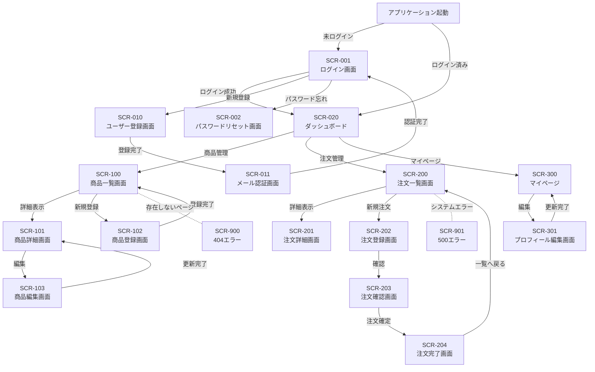
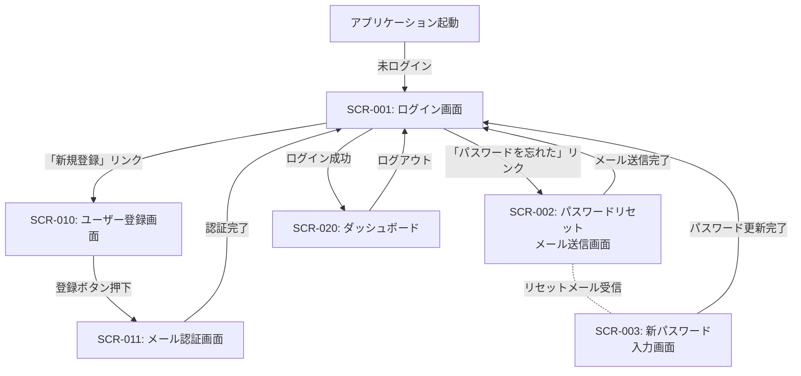
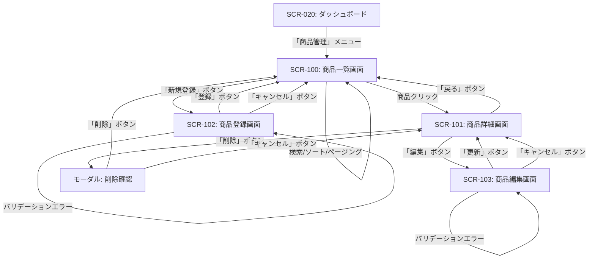
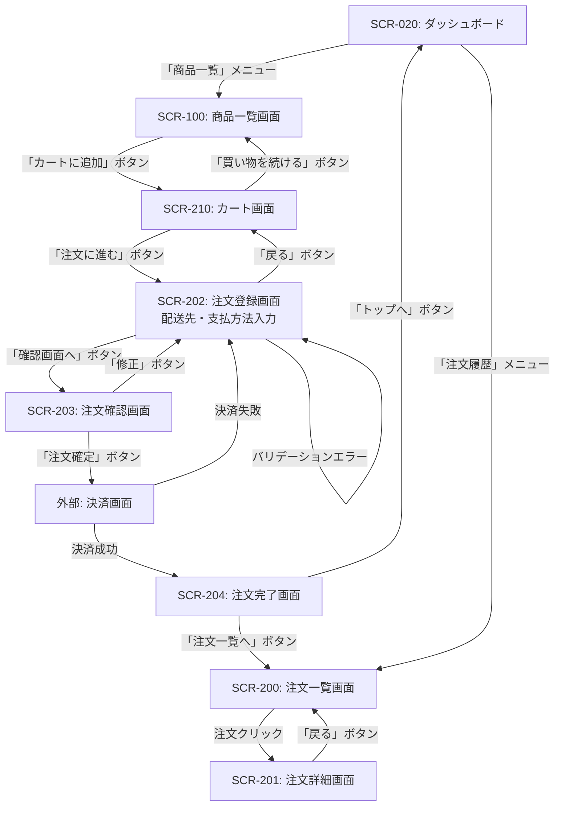
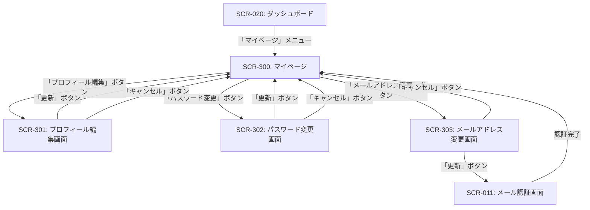

# 画面遷移図

## ドキュメント情報

| 項目 | 内容 |
|------|------|
| ドキュメントID | BD003-01 |
| ドキュメント名 | 画面遷移図 |
| システム名 | {システム名} |
| サブシステム名 | {サブシステム名} |
| 版数 | {版数} |
| ステータス | {作成中/レビュー中/承認済み} |
| 作成日 | {YYYY/MM/DD} |
| 作成者 | {作成者名} |
| 承認日 | {YYYY/MM/DD} |
| 承認者 | {承認者名} |

## 変更履歴

| 版数 | 変更日 | 変更者 | 変更内容 | 承認者 |
|------|--------|--------|----------|--------|
| 1.0 | {YYYY/MM/DD} | {変更者名} | 新規作成 | {承認者名} |
| {版数} | {YYYY/MM/DD} | {変更者名} | {変更内容} | {承認者名} |

## 目次

1. [概要](#概要)
2. [画面一覧](#画面一覧)
3. [全体画面遷移図](#全体画面遷移図)
4. [機能別画面遷移図](#機能別画面遷移図)
5. [画面遷移仕様](#画面遷移仕様)

---

## 概要

### 目的

{この画面遷移図の目的を記述}

### 適用範囲

{この画面遷移図が適用される範囲を記述}

### 画面種別

| 画面種別 | 説明 | 備考 |
|----------|------|------|
| 一覧画面 | データの一覧表示画面 | 検索・ソート・ページング機能を含む |
| 詳細画面 | データの詳細表示画面 | 1件のデータを詳細に表示 |
| 登録画面 | データの新規登録画面 | 入力フォーム形式 |
| 編集画面 | データの編集画面 | 既存データの更新 |
| 確認画面 | 入力内容の確認画面 | 登録/更新前の確認 |
| 完了画面 | 処理完了画面 | 処理完了メッセージ表示 |
| モーダル | モーダルダイアログ | ポップアップ形式 |

---

## 画面一覧

### 画面一覧表

| 画面ID | 画面名 | 画面種別 | URL | 権限 | 関連機能ID | 備考 |
|--------|--------|----------|-----|------|------------|------|
| {SCR-XXX} | {画面名} | {画面種別} | {URL} | {権限ロール} | {機能ID} | {備考} |
| SCR-001 | ログイン画面 | 入力 | /login | 全員 | F-01-01-01 | |
| SCR-002 | パスワードリセット画面 | 入力 | /password-reset | 全員 | F-01-01-03 | |
| SCR-010 | ユーザー登録画面 | 登録 | /register | 全員 | F-01-02-01 | |
| SCR-011 | メール認証画面 | 確認 | /verify-email | 全員 | F-01-02-02 | |
| SCR-020 | ダッシュボード | 一覧 | /dashboard | ログインユーザー | F-03-00-01 | ホーム画面 |
| SCR-100 | 商品一覧画面 | 一覧 | /products | ログインユーザー | F-02-01-01 | |
| SCR-101 | 商品詳細画面 | 詳細 | /products/:id | ログインユーザー | F-02-01-02 | |
| SCR-102 | 商品登録画面 | 登録 | /products/new | 管理者 | F-02-01-03 | |
| SCR-103 | 商品編集画面 | 編集 | /products/:id/edit | 管理者 | F-02-01-04 | |
| SCR-200 | 注文一覧画面 | 一覧 | /orders | ログインユーザー | F-03-01-01 | |
| SCR-201 | 注文詳細画面 | 詳細 | /orders/:id | ログインユーザー | F-03-01-02 | |
| SCR-202 | 注文登録画面 | 登録 | /orders/new | ログインユーザー | F-03-01-03 | |
| SCR-203 | 注文確認画面 | 確認 | /orders/confirm | ログインユーザー | F-03-01-04 | |
| SCR-204 | 注文完了画面 | 完了 | /orders/complete | ログインユーザー | F-03-01-05 | |
| SCR-300 | マイページ | 詳細 | /mypage | ログインユーザー | F-01-03-01 | |
| SCR-301 | プロフィール編集画面 | 編集 | /mypage/edit | ログインユーザー | F-01-03-02 | |
| SCR-900 | エラー画面（404） | エラー | /404 | 全員 | - | |
| SCR-901 | エラー画面（500） | エラー | /500 | 全員 | - | |

---

## 全体画面遷移図

### システム全体の画面遷移

---

## 機能別画面遷移図

### ユーザー認証フロー

### 商品管理フロー

### 注文処理フロー

### マイページフロー

---

## 画面遷移仕様

### 画面遷移パターン

| パターンID | パターン名 | 説明 | 実装方式 |
|------------|------------|------|----------|
| TP-01 | 通常遷移 | ボタン/リンククリックによる遷移 | リンク遷移 / SPA遷移 |
| TP-02 | フォーム送信遷移 | フォーム送信後の遷移 | POST → リダイレクト |
| TP-03 | モーダル表示 | モーダルダイアログ表示 | オーバーレイ表示 |
| TP-04 | タブ切り替え | 同一画面内のタブ切り替え | JavaScript制御 |
| TP-05 | エラー遷移 | エラー発生時の遷移 | エラーページ表示 |
| TP-06 | 認証エラー遷移 | 未ログイン時の遷移 | ログイン画面へリダイレクト |
| TP-07 | 外部遷移 | 外部サイトへの遷移 | 別タブで開く |

### 画面遷移詳細

#### SCR-001 ログイン画面

| 遷移元操作 | 遷移先画面 | 遷移条件 | 遷移方式 | パラメータ | 備考 |
|------------|------------|----------|----------|------------|------|
| ログインボタン押下 | SCR-020 ダッシュボード | 認証成功 | POST → リダイレクト | - | トークンをセッションに保存 |
| ログインボタン押下 | SCR-001 ログイン画面 | 認証失敗 | 同一画面 | - | エラーメッセージ表示 |
| 新規登録リンク | SCR-010 ユーザー登録画面 | - | リンク遷移 | - | |
| パスワードを忘れたリンク | SCR-002 パスワードリセット画面 | - | リンク遷移 | - | |

#### SCR-100 商品一覧画面

| 遷移元操作 | 遷移先画面 | 遷移条件 | 遷移方式 | パラメータ | 備考 |
|------------|------------|----------|----------|------------|------|
| 商品行クリック | SCR-101 商品詳細画面 | - | リンク遷移 | product_id | |
| 新規登録ボタン | SCR-102 商品登録画面 | 管理者権限あり | リンク遷移 | - | 権限チェック |
| 新規登録ボタン | SCR-900 エラー画面 | 管理者権限なし | エラー遷移 | - | 403 Forbidden |
| 検索ボタン | SCR-100 商品一覧画面 | - | GET → 同一画面 | search_query, page | クエリパラメータで検索条件保持 |
| ページネーション | SCR-100 商品一覧画面 | - | リンク遷移 | page | |
| ソートヘッダークリック | SCR-100 商品一覧画面 | - | リンク遷移 | sort_by, order | |

#### SCR-202 注文登録画面

| 遷移元操作 | 遷移先画面 | 遷移条件 | 遷移方式 | パラメータ | 備考 |
|------------|------------|----------|----------|------------|------|
| 確認画面へボタン | SCR-203 注文確認画面 | 入力値妥当 | POST → リダイレクト | 注文データ | セッションに一時保存 |
| 確認画面へボタン | SCR-202 注文登録画面 | バリデーションエラー | 同一画面 | - | エラーメッセージ表示 |
| 戻るボタン | SCR-210 カート画面 | - | リンク遷移 | - | 入力内容破棄確認 |

#### SCR-203 注文確認画面

| 遷移元操作 | 遷移先画面 | 遷移条件 | 遷移方式 | パラメータ | 備考 |
|------------|------------|----------|----------|------------|------|
| 注文確定ボタン | 外部決済画面 | - | POST → 外部遷移 | 決済情報 | 決済代行サービス |
| 修正ボタン | SCR-202 注文登録画面 | - | リンク遷移 | - | セッションから入力内容復元 |

### 認証・権限制御

| 画面ID | 認証要否 | 必要権限 | 未認証時の動作 | 権限不足時の動作 |
|--------|----------|----------|----------------|------------------|
| SCR-001 | 不要 | なし | - | - |
| SCR-010 | 不要 | なし | - | - |
| SCR-020 | 必要 | ログインユーザー | ログイン画面へリダイレクト | - |
| SCR-100 | 必要 | ログインユーザー | ログイン画面へリダイレクト | - |
| SCR-102 | 必要 | 管理者 | ログイン画面へリダイレクト | 403エラー画面表示 |
| SCR-103 | 必要 | 管理者 | ログイン画面へリダイレクト | 403エラー画面表示 |

### ブラウザバック時の動作

| 画面ID | ブラウザバック時の動作 | 理由 |
|--------|------------------------|------|
| SCR-001 | 通常の戻る動作 | |
| SCR-202 | 入力内容を保持 | ユーザビリティ向上 |
| SCR-203 | 注文登録画面へ戻る | 確認画面は履歴に残さない |
| SCR-204 | ブラウザバック無効化 | 二重送信防止 |

---

## 承認

| 役割 | 氏名 | 承認日 | 署名 |
|------|------|--------|------|
| 作成者 | {作成者名} | {YYYY/MM/DD} | |
| レビュー担当者 | {レビュー担当者名} | {YYYY/MM/DD} | |
| 承認者 | {承認者名} | {YYYY/MM/DD} | |

---

## 参照

### 関連ドキュメント

- [機能設計書] BD002_機能設計書
- [画面レイアウト] BD003-02_画面レイアウト
- [画面項目定義書] BD003-03_画面項目定義書

### 外部参照

- {参照先タイトル}: {URL}
