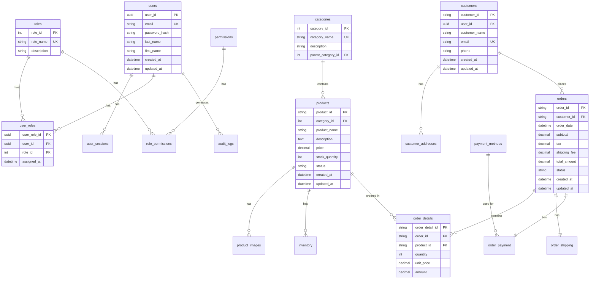
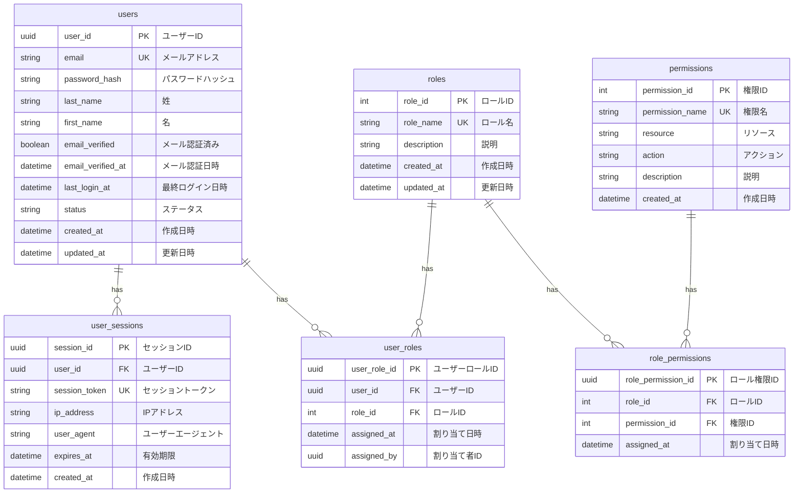

# ER図

## ドキュメント情報

| 項目 | 内容 |
|------|------|
| ドキュメントID | BD006-01 |
| ドキュメント名 | ER図 |
| システム名 | {システム名} |
| サブシステム名 | {サブシステム名} |
| 版数 | {版数} |
| ステータス | {作成中/レビュー中/承認済み} |
| 作成日 | {YYYY/MM/DD} |
| 作成者 | {作成者名} |
| 承認日 | {YYYY/MM/DD} |
| 承認者 | {承認者名} |

## 変更履歴

| 版数 | 変更日 | 変更者 | 変更内容 | 承認者 |
|------|--------|--------|----------|--------|
| 1.0 | {YYYY/MM/DD} | {変更者名} | 新規作成 | {承認者名} |
| {版数} | {YYYY/MM/DD} | {変更者名} | {変更内容} | {承認者名} |

## 目次

1. [概要](#概要)
2. [全体ER図](#全体er図)
3. [エンティティ一覧](#エンティティ一覧)
4. [リレーションシップ一覧](#リレーションシップ一覧)
5. [ドメイン別ER図](#ドメイン別er図)

---

## 概要

### 目的

{このER図の目的を記述}

### 適用範囲

{このER図が適用される範囲を記述}

### ER図表記法

| 表記 | 意味 |
|------|------|
| ──── | リレーションシップ |
| \|\|──  | 1対多（1側） |
| ──o{ | 1対多（多側） |
| \|\|──\|\| | 1対1 |
| }o──o{ | 多対多 |
| PK | 主キー（Primary Key） |
| FK | 外部キー（Foreign Key） |
| UK | ユニークキー（Unique Key） |

---

## 全体ER図

### システム全体のER図



---

## エンティティ一覧

### エンティティ定義一覧

| No | エンティティ論理名 | エンティティ物理名 | 説明 | レコード数見積 | 成長率 | 備考 |
|----|-------------------|-------------------|------|----------------|--------|------|
| 1 | ユーザー | users | システムユーザー情報 | 10,000 | 1,000件/年 | |
| 2 | ロール | roles | ユーザーロール定義 | 10 | 1件/年 | マスタ |
| 3 | ユーザーロール | user_roles | ユーザーとロールの関連 | 10,000 | 1,000件/年 | |
| 4 | 権限 | permissions | システム権限定義 | 100 | 10件/年 | マスタ |
| 5 | ロール権限 | role_permissions | ロールと権限の関連 | 500 | 50件/年 | |
| 6 | ユーザーセッション | user_sessions | ログインセッション情報 | 5,000 | - | 30日で削除 |
| 7 | カテゴリ | categories | 商品カテゴリ | 100 | 10件/年 | マスタ |
| 8 | 商品 | products | 商品情報 | 10,000 | 1,000件/年 | |
| 9 | 商品画像 | product_images | 商品画像 | 30,000 | 3,000件/年 | |
| 10 | 在庫 | inventory | 在庫情報 | 10,000 | 1,000件/年 | |
| 11 | 顧客 | customers | 顧客情報 | 50,000 | 5,000件/年 | |
| 12 | 顧客住所 | customer_addresses | 顧客配送先住所 | 100,000 | 10,000件/年 | |
| 13 | 注文 | orders | 注文ヘッダー | 100,000 | 50,000件/年 | |
| 14 | 注文明細 | order_details | 注文明細 | 300,000 | 150,000件/年 | |
| 15 | 注文配送 | order_shipping | 配送情報 | 100,000 | 50,000件/年 | |
| 16 | 注文決済 | order_payment | 決済情報 | 100,000 | 50,000件/年 | |
| 17 | 支払方法 | payment_methods | 支払方法 | 10 | 1件/年 | マスタ |
| 18 | 監査ログ | audit_logs | 操作ログ | 1,000,000 | 500,000件/年 | パーティション |

---

## リレーションシップ一覧

### エンティティ間リレーションシップ

| No | 親エンティティ | 子エンティティ | カーディナリティ | リレーションシップ名 | 外部キー | 備考 |
|----|----------------|----------------|------------------|---------------------|----------|------|
| 1 | users | user_roles | 1:N | ユーザーはロールを持つ | user_roles.user_id | |
| 2 | roles | user_roles | 1:N | ロールはユーザーに割り当てられる | user_roles.role_id | |
| 3 | roles | role_permissions | 1:N | ロールは権限を持つ | role_permissions.role_id | |
| 4 | permissions | role_permissions | 1:N | 権限はロールに割り当てられる | role_permissions.permission_id | |
| 5 | users | user_sessions | 1:N | ユーザーはセッションを持つ | user_sessions.user_id | |
| 6 | categories | categories | 1:N | カテゴリは子カテゴリを持つ | categories.parent_category_id | 自己参照 |
| 7 | categories | products | 1:N | カテゴリは商品を含む | products.category_id | |
| 8 | products | product_images | 1:N | 商品は画像を持つ | product_images.product_id | |
| 9 | products | inventory | 1:1 | 商品は在庫情報を持つ | inventory.product_id | |
| 10 | users | customers | 1:1 | ユーザーは顧客情報を持つ | customers.user_id | オプション |
| 11 | customers | customer_addresses | 1:N | 顧客は複数の住所を持つ | customer_addresses.customer_id | |
| 12 | customers | orders | 1:N | 顧客は注文を行う | orders.customer_id | |
| 13 | orders | order_details | 1:N | 注文は明細を持つ | order_details.order_id | |
| 14 | products | order_details | 1:N | 商品は注文明細に含まれる | order_details.product_id | |
| 15 | orders | order_shipping | 1:1 | 注文は配送情報を持つ | order_shipping.order_id | |
| 16 | orders | order_payment | 1:1 | 注文は決済情報を持つ | order_payment.order_id | |
| 17 | payment_methods | order_payment | 1:N | 支払方法は決済に使用される | order_payment.payment_method_id | |
| 18 | users | audit_logs | 1:N | ユーザーは監査ログを生成する | audit_logs.user_id | |

---

## ドメイン別ER図

### ユーザー・認証ドメイン



### 商品ドメイン

```mermaid
erDiagram
    categories ||--o{ categories : "parent of"
    categories ||--o{ products : contains
    products ||--o{ product_images : has
    products ||--|| inventory : has

    categories {
        int category_id PK "カテゴリID"
        string category_name UK "カテゴリ名"
        string description "説明"
        int parent_category_id FK "親カテゴリID"
        int sort_order "表示順"
        boolean is_active "有効フラグ"
        datetime created_at "作成日時"
        datetime updated_at "更新日時"
    }

    products {
        string product_id PK "商品ID"
        int category_id FK "カテゴリID"
        string product_code UK "商品コード"
        string product_name "商品名"
        text description "説明"
        decimal price "価格"
        decimal cost "原価"
        string status "ステータス"
        boolean is_active "有効フラグ"
        datetime created_at "作成日時"
        datetime updated_at "更新日時"
    }

    product_images {
        uuid image_id PK "画像ID"
        string product_id FK "商品ID"
        string image_url "画像URL"
        int sort_order "表示順"
        boolean is_primary "メイン画像フラグ"
        datetime created_at "作成日時"
    }

    inventory {
        string product_id PK_FK "商品ID"
        int stock_quantity "在庫数"
        int reserved_quantity "引当数"
        int available_quantity "利用可能数"
        int safety_stock "安全在庫"
        datetime last_updated "最終更新日時"
    }
```

### 注文ドメイン

```mermaid
erDiagram
    customers ||--o{ orders : places
    orders ||--o{ order_details : contains
    orders ||--|| order_shipping : has
    orders ||--|| order_payment : has
    products ||--o{ order_details : "ordered in"
    payment_methods ||--o{ order_payment : "used for"

    customers {
        string customer_id PK "顧客ID"
        uuid user_id FK "ユーザーID"
        string customer_code UK "顧客コード"
        string customer_name "顧客名"
        string email UK "メールアドレス"
        string phone "電話番号"
        datetime created_at "作成日時"
        datetime updated_at "更新日時"
    }

    orders {
        string order_id PK "注文ID"
        string order_number UK "注文番号"
        string customer_id FK "顧客ID"
        datetime order_date "注文日"
        decimal subtotal "小計"
        decimal tax "消費税"
        decimal shipping_fee "送料"
        decimal discount "割引額"
        decimal total_amount "合計金額"
        string status "ステータス"
        datetime created_at "作成日時"
        datetime updated_at "更新日時"
    }

    order_details {
        string order_detail_id PK "注文明細ID"
        string order_id FK "注文ID"
        string product_id FK "商品ID"
        string product_name "商品名"
        int quantity "数量"
        decimal unit_price "単価"
        decimal amount "金額"
        decimal tax "消費税"
    }

    order_shipping {
        string order_id PK_FK "注文ID"
        string shipping_last_name "配送先姓"
        string shipping_first_name "配送先名"
        string shipping_postal_code "郵便番号"
        string shipping_prefecture "都道府県"
        string shipping_city "市区町村"
        string shipping_address "番地・建物名"
        string shipping_phone "電話番号"
        datetime shipped_at "出荷日時"
        datetime delivered_at "配達完了日時"
        string tracking_number "追跡番号"
    }

    order_payment {
        string order_id PK_FK "注文ID"
        int payment_method_id FK "支払方法ID"
        decimal payment_amount "支払金額"
        string payment_status "支払ステータス"
        datetime paid_at "支払日時"
        string transaction_id "トランザクションID"
    }

    payment_methods {
        int payment_method_id PK "支払方法ID"
        string method_name UK "支払方法名"
        string description "説明"
        boolean is_active "有効フラグ"
    }
```

---

## 承認

| 役割 | 氏名 | 承認日 | 署名 |
|------|------|--------|------|
| 作成者 | {作成者名} | {YYYY/MM/DD} | |
| レビュー担当者 | {レビュー担当者名} | {YYYY/MM/DD} | |
| 承認者 | {承認者名} | {YYYY/MM/DD} | |

---

## 参照

### 関連ドキュメント

- [テーブル一覧] BD006-02_テーブル一覧
- [テーブル定義書] BD006-03_テーブル定義書
- [機能設計書] BD002_機能設計書

### 外部参照

- {参照先タイトル}: {URL}
