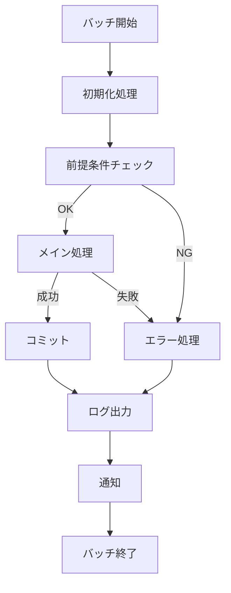
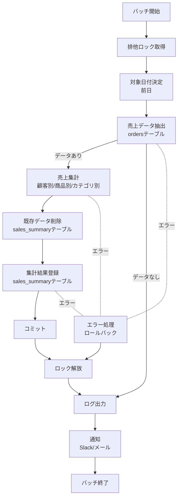
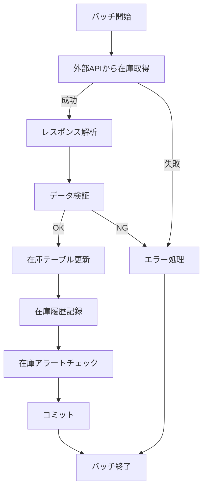
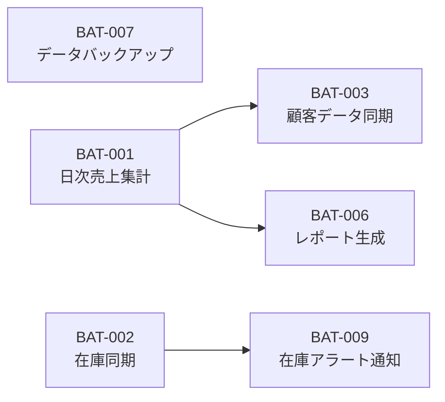

# バッチ設計書

## ドキュメント情報

| 項目 | 内容 |
|------|------|
| ドキュメントID | BD007 |
| ドキュメント名 | バッチ設計書 |
| システム名 | {システム名} |
| サブシステム名 | {サブシステム名} |
| 版数 | {版数} |
| ステータス | {作成中/レビュー中/承認済み} |
| 作成日 | {YYYY/MM/DD} |
| 作成者 | {作成者名} |
| 承認日 | {YYYY/MM/DD} |
| 承認者 | {承認者名} |

## 変更履歴

| 版数 | 変更日 | 変更者 | 変更内容 | 承認者 |
|------|--------|--------|----------|--------|
| 1.0 | {YYYY/MM/DD} | {変更者名} | 新規作成 | {承認者名} |
| {版数} | {YYYY/MM/DD} | {変更者名} | {変更内容} | {承認者名} |

## 目次

1. [概要](#概要)
2. [バッチ一覧](#バッチ一覧)
3. [バッチ詳細設計](#バッチ詳細設計)
4. [バッチスケジュール](#バッチスケジュール)
5. [エラーハンドリング](#エラーハンドリング)

---

## 概要

### 目的

{このバッチ設計書の目的を記述}

### 適用範囲

{このバッチ設計書が適用される範囲を記述}

### バッチ実行環境

| 項目 | 内容 |
|------|------|
| 実行環境 | {開発/ステージング/本番} |
| 実行サーバー | {サーバー名/IP} |
| スケジューラー | {Cron/Kubernetes CronJob/AWS EventBridge/Cloud Scheduler} |
| 実行言語 | {Python/Shell/Java/Node.js} |
| ログ出力先 | {ファイルパス/CloudWatch/StackDriver} |
| 通知先 | {メール/Slack/PagerDuty} |

---

## バッチ一覧

### バッチ一覧表

| バッチID | バッチ名 | 実行頻度 | 実行時刻 | 処理時間目安 | 優先度 | 依存関係 | 備考 |
|---------|---------|---------|---------|-------------|--------|----------|------|
| {BAT-XXX} | {バッチ名} | {日次/週次/月次/随時} | {HH:MM} | {時間} | {高/中/低} | {依存バッチID} | {備考} |
| BAT-001 | 日次売上集計バッチ | 日次 | 02:00 | 30分 | 高 | - | |
| BAT-002 | 在庫同期バッチ | 15分毎 | */15 * * * * | 5分 | 高 | - | |
| BAT-003 | 顧客データ同期バッチ | 日次 | 03:00 | 10分 | 中 | BAT-001 | 売上集計後に実行 |
| BAT-004 | セッションクリーンアップ | 日次 | 04:00 | 5分 | 中 | - | |
| BAT-005 | メール配信バッチ | 1時間毎 | 0 * * * * | 10分 | 中 | - | |
| BAT-006 | レポート生成バッチ | 月次 | 1日 05:00 | 1時間 | 中 | BAT-001 | 月初に実行 |
| BAT-007 | データバックアップ | 日次 | 01:00 | 2時間 | 高 | - | |
| BAT-008 | ログアーカイブバッチ | 週次 | 日曜 06:00 | 30分 | 低 | - | |
| BAT-009 | 在庫アラート通知 | 日次 | 09:00 | 5分 | 中 | BAT-002 | 在庫同期後に実行 |
| BAT-010 | 注文ステータス更新 | 30分毎 | */30 * * * * | 3分 | 高 | - | |

---

## バッチ詳細設計

### バッチ設計テンプレート

各バッチについて以下の形式で詳細を記述します。

---

#### バッチID: {BAT-XXX}

##### 基本情報

| 項目 | 内容 |
|------|------|
| バッチID | {BAT-XXX} |
| バッチ名 | {バッチ名} |
| 概要 | {バッチの概要説明} |
| 実行頻度 | {日次/週次/月次/時間毎/分毎/随時} |
| 実行時刻 | {HH:MM または Cron式} |
| 処理時間目安 | {時間} |
| タイムアウト | {時間} |
| 優先度 | {高/中/低} |
| 依存関係 | {依存するバッチID} |
| 関連機能ID | {F-XX-YY-ZZ} |

##### 処理フロー



##### 入力

| 入力種別 | 入力元 | 形式 | 必須 | 説明 |
|----------|--------|------|------|------|
| {パラメータ/ファイル/DB/API} | {入力元} | {形式} | {○/×} | {説明} |

##### 処理内容

1. {処理ステップ1}
2. {処理ステップ2}
3. {処理ステップ3}

##### 出力

| 出力種別 | 出力先 | 形式 | 説明 |
|----------|--------|------|------|
| {ファイル/DB/API/ログ} | {出力先} | {形式} | {説明} |

##### エラーハンドリング

| エラー種別 | エラー条件 | 対処方法 | リトライ |
|------------|------------|----------|----------|
| {エラー種別} | {条件} | {対処方法} | {○/×} |

##### 成功条件

- {成功条件1}
- {成功条件2}

##### 失敗条件

- {失敗条件1}
- {失敗条件2}

---

### BAT-001: 日次売上集計バッチ

##### 基本情報

| 項目 | 内容 |
|------|------|
| バッチID | BAT-001 |
| バッチ名 | 日次売上集計バッチ |
| 概要 | 前日の売上データを集計し、売上サマリーテーブルに登録する |
| 実行頻度 | 日次 |
| 実行時刻 | 02:00 |
| 処理時間目安 | 30分 |
| タイムアウト | 60分 |
| 優先度 | 高 |
| 依存関係 | なし |
| 関連機能ID | F-04-01-01 |

##### 処理フロー



##### 入力

| 入力種別 | 入力元 | 形式 | 必須 | 説明 |
|----------|--------|------|------|------|
| パラメータ | コマンドライン引数 | --date YYYY-MM-DD | × | 集計対象日（省略時は前日） |
| DB | ordersテーブル | - | ○ | 注文データ |
| DB | order_detailsテーブル | - | ○ | 注文明細データ |
| DB | customersテーブル | - | ○ | 顧客データ |
| DB | productsテーブル | - | ○ | 商品データ |

##### 処理内容

1. **初期化処理**
   - ログファイル作成
   - データベース接続確立
   - 排他ロック取得（batch_locksテーブル）

2. **対象日付決定**
   - コマンドライン引数から対象日付を取得
   - 引数がない場合は前日を対象日付とする

3. **売上データ抽出**
   ```sql
   SELECT
       o.order_date,
       o.customer_id,
       c.customer_name,
       od.product_id,
       p.product_name,
       p.category_id,
       SUM(od.quantity) as total_quantity,
       SUM(od.amount) as total_amount
   FROM orders o
   INNER JOIN order_details od ON o.order_id = od.order_id
   INNER JOIN customers c ON o.customer_id = c.customer_id
   INNER JOIN products p ON od.product_id = p.product_id
   WHERE o.order_date = '{対象日付}'
     AND o.status IN ('confirmed', 'shipped', 'delivered')
   GROUP BY o.order_date, o.customer_id, c.customer_name,
            od.product_id, p.product_name, p.category_id
   ```

4. **売上集計**
   - 顧客別売上集計
   - 商品別売上集計
   - カテゴリ別売上集計
   - 日別売上サマリー作成

5. **既存データ削除**
   ```sql
   DELETE FROM sales_summary
   WHERE summary_date = '{対象日付}'
   ```

6. **集計結果登録**
   ```sql
   INSERT INTO sales_summary
   (summary_date, customer_id, product_id, category_id,
    total_quantity, total_amount, created_at)
   VALUES (?, ?, ?, ?, ?, ?, CURRENT_TIMESTAMP)
   ```

7. **コミットとロック解放**
   - トランザクションコミット
   - 排他ロック解放

8. **ログ出力**
   - 処理件数、処理時間をログ出力
   - 成功/失敗ステータス記録

9. **通知**
   - Slackに処理結果通知
   - 失敗時はメール通知

##### 出力

| 出力種別 | 出力先 | 形式 | 説明 |
|----------|--------|------|------|
| DB | sales_summaryテーブル | - | 売上集計結果 |
| ログ | /var/log/batch/BAT-001.log | テキスト | 処理ログ |
| 通知 | Slack #batch-notifications | JSON | 処理結果通知 |
| メール | batch-admin@example.com | テキスト | エラー通知（失敗時のみ） |

##### エラーハンドリング

| エラー種別 | エラー条件 | 対処方法 | リトライ |
|------------|------------|----------|----------|
| DB接続エラー | データベースに接続できない | ロールバック、エラーログ出力、管理者通知 | × |
| ロック取得失敗 | 既に同じバッチが実行中 | エラーログ出力、バッチ終了 | × |
| データ不整合 | 売上データに不正な値 | 該当データをスキップ、警告ログ出力 | × |
| タイムアウト | 処理時間が60分を超過 | ロールバック、エラーログ出力、管理者通知 | × |

##### 成功条件

- 対象日付の売上データが正常に集計された
- sales_summaryテーブルへの登録が完了した
- エラーが発生していない

##### 失敗条件

- データベース接続エラーが発生した
- ロック取得に失敗した
- タイムアウトが発生した
- データ登録時にエラーが発生した

##### 実行例

```bash
# 前日の売上を集計（デフォルト）
python batch/BAT-001_daily_sales_aggregation.py

# 特定日の売上を集計
python batch/BAT-001_daily_sales_aggregation.py --date 2024-01-15

# ドライラン（実際には登録しない）
python batch/BAT-001_daily_sales_aggregation.py --date 2024-01-15 --dry-run
```

---

### BAT-002: 在庫同期バッチ

##### 基本情報

| 項目 | 内容 |
|------|------|
| バッチID | BAT-002 |
| バッチ名 | 在庫同期バッチ |
| 概要 | 外部在庫管理システムから在庫情報を取得し、システムの在庫を更新する |
| 実行頻度 | 15分毎 |
| 実行時刻 | */15 * * * * |
| 処理時間目安 | 5分 |
| タイムアウト | 10分 |
| 優先度 | 高 |
| 依存関係 | なし |
| 関連機能ID | F-03-02-01 |

##### 処理フロー



##### 入力

| 入力種別 | 入力元 | 形式 | 必須 | 説明 |
|----------|--------|------|------|------|
| API | 在庫管理システムAPI | JSON | ○ | 在庫情報 |
| DB | productsテーブル | - | ○ | 商品マスタ |

##### 処理内容

1. 外部在庫管理システムAPIを呼び出し
2. レスポンスをJSON形式で取得
3. 各商品の在庫数を検証（負の値チェック）
4. inventoryテーブルを更新
5. inventory_historyテーブルに変更履歴を記録
6. 在庫アラート閾値チェック
7. アラート対象商品があればSlack通知

##### 出力

| 出力種別 | 出力先 | 形式 | 説明 |
|----------|--------|------|------|
| DB | inventoryテーブル | - | 在庫情報 |
| DB | inventory_historyテーブル | - | 在庫変更履歴 |
| 通知 | Slack #inventory-alerts | JSON | 在庫アラート通知 |
| ログ | /var/log/batch/BAT-002.log | テキスト | 処理ログ |

---

## バッチスケジュール

### 日次スケジュール

```
00:00 - 01:00  (データバックアップ時間帯)
├─ 01:00  BAT-007 データバックアップ
│
02:00 - 03:00  (集計処理時間帯)
├─ 02:00  BAT-001 日次売上集計バッチ
│
03:00 - 04:00  (データ同期時間帯)
├─ 03:00  BAT-003 顧客データ同期バッチ
│
04:00 - 05:00  (クリーンアップ時間帯)
├─ 04:00  BAT-004 セッションクリーンアップ
│
05:00 - 06:00  (レポート生成時間帯)
├─ 05:00  BAT-006 レポート生成バッチ (月次)
│
09:00 - 10:00  (業務開始時刻)
├─ 09:00  BAT-009 在庫アラート通知
│
継続実行
├─ */15  BAT-002 在庫同期バッチ (15分毎)
├─ */30  BAT-010 注文ステータス更新 (30分毎)
└─ 0 *   BAT-005 メール配信バッチ (1時間毎)
```

### 週次スケジュール

```
日曜日
├─ 06:00  BAT-008 ログアーカイブバッチ
```

### 月次スケジュール

```
毎月1日
├─ 05:00  BAT-006 レポート生成バッチ
```

### バッチ依存関係図



---

## エラーハンドリング

### エラー分類

| エラー分類 | 説明 | 対処方針 |
|------------|------|----------|
| システムエラー | DB接続エラー、ファイルI/Oエラー | ロールバック、管理者通知、リトライ不可 |
| ネットワークエラー | API接続タイムアウト、通信エラー | リトライ3回、失敗時は管理者通知 |
| データエラー | データ不整合、バリデーションエラー | スキップして処理継続、警告ログ出力 |
| ビジネスエラー | ロック取得失敗、依存バッチ未実行 | エラーログ出力、バッチ終了 |

### リトライポリシー

| バッチID | リトライ回数 | リトライ間隔 | リトライ対象エラー |
|---------|-------------|-------------|-------------------|
| BAT-001 | なし | - | - |
| BAT-002 | 3回 | 1分 | API接続エラー、タイムアウト |
| BAT-003 | 3回 | 5分 | API接続エラー |
| BAT-005 | 2回 | 10分 | メール送信エラー |

### 通知設定

| 通知レベル | 通知先 | 通知条件 |
|-----------|--------|----------|
| INFO | Slack #batch-notifications | バッチ正常終了時 |
| WARNING | Slack #batch-notifications | 処理時間が目安の1.5倍を超過 |
| ERROR | Slack #batch-alerts + メール | バッチ失敗時、システムエラー発生時 |
| CRITICAL | Slack #batch-alerts + メール + PagerDuty | 優先度:高のバッチが失敗 |

### ログ出力仕様

**ログレベル**

- DEBUG: デバッグ情報
- INFO: 処理開始/終了、処理件数
- WARNING: 警告、スキップしたデータ
- ERROR: エラー、異常終了
- CRITICAL: 致命的エラー

**ログ出力項目**

- タイムスタンプ
- ログレベル
- バッチID
- バッチ名
- 処理ステップ
- メッセージ
- 処理件数
- 処理時間
- エラー詳細（エラー時のみ）

**ログ保存期間**

- 開発環境: 7日間
- ステージング環境: 30日間
- 本番環境: 90日間

---

## 承認

| 役割 | 氏名 | 承認日 | 署名 |
|------|------|--------|------|
| 作成者 | {作成者名} | {YYYY/MM/DD} | |
| レビュー担当者 | {レビュー担当者名} | {YYYY/MM/DD} | |
| 承認者 | {承認者名} | {YYYY/MM/DD} | |

---

## 参照

### 関連ドキュメント

- [機能設計書] BD002_機能設計書
- [外部インターフェース設計書] BD005_外部インターフェース設計書
- [テーブル定義書] BD006-03_テーブル定義書
- [帳票設計書] BD004_帳票設計書

### 外部参照

- {参照先タイトル}: {URL}
