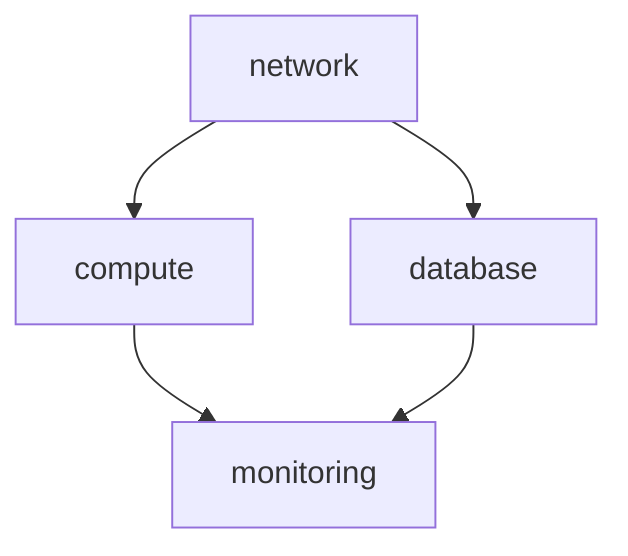

# IaC設計書

## ドキュメント情報
| 項目 | 内容 |
|------|------|
| ドキュメントID | BD009 |
| バージョン | 1.0 |
| 作成日 | YYYY-MM-DD |
| 作成者 | {作成者名} |
| 承認者 | {承認者名} |
| 承認日 | YYYY-MM-DD |

## 変更履歴
| バージョン | 日付 | 変更者 | 変更内容 |
|-----------|------|--------|---------|
| 1.0 | YYYY-MM-DD | {名前} | 初版作成 |

---

## 1. 設計原則

### 1.1 本書の目的
Infrastructure as Code（IaC）の設計方針を定義し、
インフラの再現性、一貫性、保守性を確保する。

### 1.2 IaCの基本原則

| 原則 | 説明 |
|------|------|
| 宣言的記述 | 「あるべき状態」を定義し、ツールが収束させる |
| 冪等性 | 何度実行しても同じ結果になる |
| バージョン管理 | インフラもコードとしてGitで管理 |
| コードレビュー | インフラ変更もPR/MRでレビュー |
| 自動化 | 手作業を排除し、CI/CDで適用 |

### 1.3 参考資料（調査時点の最新ベストプラクティス）
| 調査日 | 情報源 | 概要 |
|--------|--------|------|
| YYYY-MM-DD | {URL/ドキュメント名} | {要点} |

> ⚠️ 技術トレンドは変化するため、設計時に最新情報を再調査すること

---

## 2. ツール選定

### 2.1 概念
IaCツールにはそれぞれ特徴があり、プロジェクト要件に応じて選択する。

### 2.2 選択肢
| ツール | 特徴 | 向いてるケース |
|--------|------|---------------|
| Terraform | マルチクラウド、宣言的、大きなエコシステム | マルチクラウド、汎用性重視 |
| CloudFormation | AWS純正、サポート手厚い | AWSのみ、サポート重視 |
| Pulumi | 汎用言語（Python等）で記述 | 開発者主導、複雑なロジック |
| CDK | プログラミング言語でCFn生成 | 開発者主導、AWS中心 |

### 2.3 本プロジェクトでの採用方針

> ⚠️ ユーザーと協議の上、決定してください

【協議ポイント】
- マルチクラウドの可能性は？
- チームのスキルセットは？
- 既存資産はあるか？

### 2.4 決定事項
| 項目 | 決定内容 | 理由 | 承認者 | 日付 |
|------|---------|------|--------|------|
| IaCツール | {Terraform/CFn/...} | {理由} | {承認者} | {日付} |
| バージョン | {バージョン} | | | |

---

## 3. ディレクトリ構成

### 3.1 概念
ディレクトリ構成は可読性・保守性に直結する。
環境分離とモジュール再利用のバランスを考慮する。

### 3.2 選択肢

**パターンA: 環境別ディレクトリ**
```
infrastructure/
├── environments/
│   ├── dev/
│   │   ├── main.tf
│   │   └── terraform.tfvars
│   ├── stg/
│   └── prod/
└── modules/
    ├── network/
    ├── compute/
    └── database/
```

**パターンB: Workspaceベース**
```
infrastructure/
├── main.tf
├── variables.tf
├── terraform.tfvars.dev
├── terraform.tfvars.stg
└── terraform.tfvars.prod
```

### 3.3 本プロジェクトでの採用方針

> ⚠️ ユーザーと協議の上、決定してください

【協議ポイント】
- 環境間の差分はどの程度か？
- チームの習熟度は？

【推奨】
- 環境差分が大きい → パターンA
- 環境差分が小さい → パターンB

### 3.4 決定事項
| 項目 | 決定内容 | 承認者 | 日付 |
|------|---------|--------|------|
| ディレクトリ構成 | {パターンA/B/カスタム} | {承認者} | {日付} |

### 3.5 採用するディレクトリ構成

```
{ここに決定した構成を記載}
```

---

## 4. モジュール設計

### 4.1 概念
モジュール化により再利用性と保守性を向上させる。
ただし、過度な抽象化は複雑性を増す。

### 4.2 モジュール化の原則

| 原則 | 説明 |
|------|------|
| 単一責任 | 1モジュール = 1責務 |
| 明確なインターフェース | input/outputを明確に定義 |
| 適切な粒度 | 細かすぎず、大きすぎず |
| ドキュメント | README.mdで使い方を明記 |

### 4.3 モジュール一覧

| モジュール名 | 責務 | 入力（主要） | 出力（主要） |
|-------------|------|-------------|-------------|
| network | VPC, Subnet, SG | cidr, azs | vpc_id, subnet_ids |
| compute | ECS/EC2 | instance_type, ami | instance_ids |
| database | RDS | engine, instance_class | endpoint, port |
| monitoring | CloudWatch | alarm_configs | alarm_arns |

### 4.4 モジュール依存関係図



---

## 5. スタック分割設計

### 5.1 概念
スタックはライフサイクル（変更頻度）で分割することで、
影響範囲を最小化し、安全なデプロイを実現する。

### 5.2 選択肢
| パターン | 特徴 | 向いてるケース |
|---------|------|---------------|
| 全部1スタック | シンプル | 小規模、PoC |
| ライフサイクル分割 | 影響範囲限定 | 中〜大規模 |
| マイクロスタック | 完全分離 | 大規模、複数チーム |

### 5.3 ライフサイクル分割の例

```
[ほぼ変わらない]     network-stack（VPC, Subnet）
        ↓
[たまに変わる]       security-stack（IAM, SG）
        ↓
[よく変わる]         app-stack（ECS, Lambda）
        ↓
[独立]              monitoring-stack（CloudWatch, Alarms）
```

### 5.4 本プロジェクトでの採用方針

> ⚠️ ユーザーと協議の上、決定してください

【協議ポイント】
- プロジェクト規模は？
- チーム構成は？（単一 or 複数）
- 変更頻度の見込みは？

### 5.5 決定事項
| 項目 | 決定内容 | 承認者 | 日付 |
|------|---------|--------|------|
| スタック分割方針 | {記入} | {記入} | {記入} |

### 5.6 スタック一覧

| スタック名 | 責務 | 変更頻度 | 依存先スタック |
|-----------|------|---------|---------------|
| {スタック名} | {責務} | 低/中/高 | {依存先} |

---

## 6. ネスト構造設計

### 6.1 概念
ネスト（入れ子）構造により、可読性とメンテナンス性を向上させる。

**メリット**
- インデックス的に全体把握しやすい
- 関連リソースをグループ化
- 大量リソース（アラーム定義等）の管理が容易

**デメリット・注意点**
- 深すぎると依存関係が追えなくなる
- デバッグが困難になる

### 6.2 推奨ネスト階層

| 階層 | 推奨 | 注意 |
|------|------|------|
| 1〜2階層 | ✅ 推奨 | |
| 3階層 | ⚠️ 許容 | 依存関係を明確に |
| 4階層以上 | ❌ 非推奨 | 分割を検討 |

---

## 7. 状態管理設計（Terraform）

### 7.1 概念
Terraformはtfstateファイルで「現在の状態」を管理する。
チーム開発では共有ストレージとロック機構が必須。

### 7.2 状態管理方式

| 方式 | 特徴 | 向いてるケース |
|------|------|---------------|
| ローカル | シンプル | 個人開発、学習 |
| S3 + DynamoDB | AWS標準、ロック対応 | AWSチーム開発 |
| Terraform Cloud | フルマネージド | 大規模、エンタープライズ |

### 7.3 本プロジェクトでの採用方針

| 項目 | 設計値 |
|------|--------|
| バックエンド | S3 / Terraform Cloud / ... |
| S3バケット名 | {バケット名} |
| DynamoDBテーブル名 | {テーブル名} |
| 暗号化 | 有効 |
| バージョニング | 有効 |

### 7.4 バックエンド設定例

```hcl
terraform {
  backend "s3" {
    bucket         = "{バケット名}"
    key            = "{環境}/terraform.tfstate"
    region         = "ap-northeast-1"
    encrypt        = true
    dynamodb_table = "{テーブル名}"
  }
}
```

---

## 8. 命名規則

### 8.1 リソース命名規則

**パターン**
```
{プロジェクト}-{環境}-{リソース種別}-{用途}
```

**例**
| リソース | 命名例 |
|---------|--------|
| VPC | myapp-prod-vpc |
| Subnet | myapp-prod-subnet-public-a |
| Security Group | myapp-prod-sg-web |
| EC2 | myapp-prod-ec2-api-01 |
| RDS | myapp-prod-rds-main |
| S3 | myapp-prod-s3-logs |

### 8.2 Terraform命名規則

| 対象 | 規則 | 例 |
|------|------|-----|
| リソース名 | snake_case | `aws_instance.web_server` |
| 変数名 | snake_case | `var.instance_type` |
| モジュール名 | kebab-case | `module "network"` |
| ファイル名 | snake_case | `main.tf`, `variables.tf` |

---

## 9. タグ戦略

### 9.1 必須タグ

| タグキー | 用途 | 例 |
|---------|------|-----|
| Project | コスト配分、リソース識別 | myapp |
| Environment | 環境識別 | prod / stg / dev |
| Owner | 責任者・チーム | team-a |
| ManagedBy | 管理方法 | terraform |
| CostCenter | コストセンター | cc-12345 |

### 9.2 オプションタグ

| タグキー | 用途 | 例 |
|---------|------|-----|
| Component | コンポーネント識別 | api / web / batch |
| Version | バージョン | 1.0.0 |
| Backup | バックアップ対象 | daily / weekly |
| AutoStop | 自動停止対象（開発環境） | true / false |

### 9.3 タグ付与の自動化

```hcl
locals {
  common_tags = {
    Project     = var.project
    Environment = var.environment
    Owner       = var.owner
    ManagedBy   = "terraform"
  }
}

resource "aws_instance" "example" {
  # ...
  tags = merge(local.common_tags, {
    Name      = "${var.project}-${var.environment}-ec2-web"
    Component = "web"
  })
}
```

---

## 10. シークレット管理

### 10.1 原則
- tfファイルにシークレットをハードコードしない
- tfstateにシークレットが含まれる場合は暗号化必須
- 最小権限の原則

### 10.2 選択肢

| 方式 | 特徴 | 向いてるケース |
|------|------|---------------|
| AWS Secrets Manager | ローテーション対応、高機能 | 本番、コンプライアンス重視 |
| AWS Parameter Store | シンプル、安価 | 開発、コスト重視 |
| HashiCorp Vault | マルチクラウド、高機能 | 大規模、マルチクラウド |
| 環境変数 | シンプル | CI/CDパイプライン内 |

### 10.3 本プロジェクトでの採用方針

| 用途 | 方式 |
|------|------|
| DBパスワード | {Secrets Manager / Parameter Store} |
| APIキー | {Secrets Manager / Parameter Store} |
| CI/CD用 | {環境変数 / Secrets Manager} |

---

## 11. 運用ルール

### 11.1 変更管理フロー

```
1. featureブランチ作成
2. コード変更
3. terraform plan で差分確認
4. Pull Request作成
5. コードレビュー
6. plan結果をPRにコメント
7. 承認
8. mainマージ
9. CI/CDで自動apply（または手動）
```

### 11.2 レビュー観点

| 観点 | チェック項目 |
|------|-------------|
| セキュリティ | SG, IAMの過剰権限がないか |
| コスト | 不要なリソース、過剰スペックがないか |
| 命名規則 | 規則に従っているか |
| タグ | 必須タグが付与されているか |
| 依存関係 | 循環依存がないか |
| plan結果 | 意図しない変更がないか |

### 11.3 緊急時対応

| 状況 | 対応 |
|------|------|
| 誤ったapply | tfstateバックアップから復元、または手動修正 |
| tfstate破損 | バージョニングから復元 |
| ロック解除できない | DynamoDB手動削除（最終手段） |

---

## 12. 承認

| 役割 | 氏名 | 署名 | 日付 |
|------|------|------|------|
| インフラリード | | | |
| セキュリティ担当 | | | |
| PM | | | |
