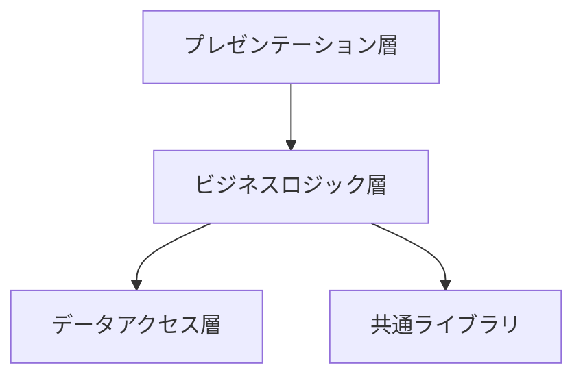

# DD000: 詳細設計総括

**文書番号**: DD000
**版数**: 1.0
**作成日**: YYYY-MM-DD
**最終更新日**: YYYY-MM-DD
**作成者**: [作成者名]
**承認者**: [承認者名]

---

## 改訂履歴

| 版数 | 日付 | 作成者 | 変更内容 |
|------|------|--------|---------|
| 1.0  | YYYY-MM-DD | [作成者名] | 初版作成 |

---

## 1. 目的

本文書は、プロジェクト全体の詳細設計成果物を統括し、以下を提供します：

- **詳細設計書の全体像**: サブシステム・モジュール構成の俯瞰
- **成果物の索引**: 各詳細設計書へのナビゲーション
- **作成ルール**: 文書分割・命名規則・記載粒度の統一基準
- **レビュー管理**: 詳細設計レビューの進捗管理

---

## 2. 詳細設計書の構成

### 2.1 成果物の全体構造

```
.agent/templates/04_詳細設計/
│
├── DD000_詳細設計総括.md                    # 本文書（マスター）
│
├── テンプレート/                             # 各ドキュメントのひな形
│   ├── DD001_モジュール構成設計書_template.md
│   ├── DD002_機能詳細設計書_template.md
│   ├── DD003_画面・帳票詳細設計書_template.md
│   └── DD004_単体テスト仕様書_template.md
│
└── 実成果物/                                # 実際の詳細設計書（サブシステム別）
    ├── 01_[サブシステム名]/
    │   ├── DD001_モジュール構成設計書_[サブシステム名].md
    │   ├── DD002_機能詳細設計書_[機能名].md
    │   ├── DD003_画面・帳票詳細設計書_[画面名].md
    │   └── DD004_単体テスト仕様書_[モジュール名].md
    ├── 02_[サブシステム名]/
    │   └── ...
    └── 共通基盤/
        └── ...
```

---

## 3. サブシステム一覧

### 3.1 サブシステム構成

| No | サブシステム名 | 概要 | 担当者 | ステータス |
|----|--------------|------|--------|-----------|
| 01 | [サブシステム名] | [概要] | [担当者名] | 設計中/完了 |
| 02 | [サブシステム名] | [概要] | [担当者名] | 設計中/完了 |
| 03 | [サブシステム名] | [概要] | [担当者名] | 設計中/完了 |

**例**:
| No | サブシステム名 | 概要 | 担当者 | ステータス |
|----|--------------|------|--------|-----------|
| 01 | ユーザー管理 | ユーザー登録・認証・権限管理 | 山田太郎 | 完了 |
| 02 | 注文管理 | 商品注文・在庫管理・配送 | 鈴木花子 | 設計中 |
| 03 | 決済管理 | クレジットカード決済・請求 | 佐藤次郎 | 設計中 |
| 04 | 共通基盤 | ログ・認証・エラーハンドリング | 田中一郎 | 完了 |

---

## 4. 詳細設計書索引

### 4.1 モジュール構成設計書（DD001）

| サブシステム | ファイル名 | 概要 | 作成日 | レビュー |
|------------|-----------|------|--------|---------|
| ユーザー管理 | `DD001_モジュール構成設計書_ユーザー管理.md` | ユーザー管理サブシステムのクラス構成 | 2025-01-15 | ✅ |
| 注文管理 | `DD001_モジュール構成設計書_注文管理.md` | 注文管理サブシステムのクラス構成 | 2025-01-20 | 🔄 |
| 決済管理 | `DD001_モジュール構成設計書_決済管理.md` | 決済管理サブシステムのクラス構成 | 2025-01-25 | ⏳ |
| 共通基盤 | `DD001_モジュール構成設計書_共通基盤.md` | 共通ライブラリ・ミドルウェア構成 | 2025-01-10 | ✅ |

**凡例**:
- ✅ レビュー完了
- 🔄 レビュー中
- ⏳ 未レビュー

---

### 4.2 機能詳細設計書（DD002）

| サブシステム | 機能名 | ファイル名 | 作成日 | レビュー |
|------------|--------|-----------|--------|---------|
| ユーザー管理 | ユーザー登録 | `DD002_機能詳細設計書_ユーザー登録.md` | 2025-01-16 | ✅ |
| ユーザー管理 | ユーザー認証 | `DD002_機能詳細設計書_ユーザー認証.md` | 2025-01-16 | ✅ |
| ユーザー管理 | パスワードリセット | `DD002_機能詳細設計書_パスワードリセット.md` | 2025-01-17 | ✅ |
| 注文管理 | 商品注文 | `DD002_機能詳細設計書_商品注文.md` | 2025-01-21 | 🔄 |
| 注文管理 | 注文キャンセル | `DD002_機能詳細設計書_注文キャンセル.md` | 2025-01-22 | ⏳ |

---

### 4.3 画面・帳票詳細設計書（DD003）

| サブシステム | 画面/帳票名 | ファイル名 | 作成日 | レビュー |
|------------|-----------|-----------|--------|---------|
| ユーザー管理 | ログイン画面 | `DD003_画面詳細設計書_ログイン.md` | 2025-01-18 | ✅ |
| ユーザー管理 | ユーザー登録画面 | `DD003_画面詳細設計書_ユーザー登録.md` | 2025-01-18 | ✅ |
| 注文管理 | 注文一覧画面 | `DD003_画面詳細設計書_注文一覧.md` | 2025-01-23 | ⏳ |
| 注文管理 | 注文詳細画面 | `DD003_画面詳細設計書_注文詳細.md` | 2025-01-23 | ⏳ |

---

### 4.4 単体テスト仕様書（DD004）

| サブシステム | モジュール名 | ファイル名 | 作成日 | レビュー |
|------------|------------|-----------|--------|---------|
| ユーザー管理 | UserService | `DD004_単体テスト仕様書_UserService.md` | 2025-01-19 | ✅ |
| ユーザー管理 | AuthController | `DD004_単体テスト仕様書_AuthController.md` | 2025-01-19 | ✅ |
| 注文管理 | OrderService | `DD004_単体テスト仕様書_OrderService.md` | 2025-01-24 | ⏳ |

---

## 5. 文書分割・作成ルール

### 5.1 基本原則

#### 📏 ページ数の目安

| 文書種類 | 1ファイルあたりの目安 | 分割基準 |
|---------|-------------------|---------|
| **DD001: モジュール構成設計書** | 30-50ページ | サブシステム単位 |
| **DD002: 機能詳細設計書** | 10-30ページ | 機能単位（ユースケース） |
| **DD003: 画面・帳票詳細設計書** | 5-15ページ | 画面/帳票単位 |
| **DD004: 単体テスト仕様書** | 10-20ページ | クラス/モジュール単位 |

#### 🎯 分割の判断基準

**こんなときは分割**:
- ✅ 1ファイルが50ページを超える場合
- ✅ 担当者が異なる場合
- ✅ レビュー単位を分けたい場合
- ✅ 変更頻度が大きく異なる場合

**分割しなくてもよい**:
- ⭕ 密結合で切り離せない機能
- ⭕ 同一チームで同時に作成する小規模機能

---

### 5.2 クラス図の扱い

#### 全体俯瞰図（推奨）

- **目的**: システム全体のパッケージ構成を把握
- **粒度**: パッケージレベル（クラスの詳細は省略）
- **サイズ**: A3サイズ1枚に収まる範囲（最大30パッケージ程度）



#### 詳細クラス図（DD001で記載）

- **目的**: モジュール内部のクラス設計
- **粒度**: クラス単位（属性・メソッド記載）
- **サイズ**: 1図あたり5-10クラス程度
- **分割**: 関連するクラスごとにグループ化

**Good例**:
```
DD001_モジュール構成設計書_ユーザー管理.md 内に:
- クラス図1: 認証モジュール（5クラス）
- クラス図2: ユーザーリポジトリ（7クラス）
- クラス図3: パスワードハッシュ（3クラス）
```

**Bad例**:
```
DD001_モジュール構成設計書.md に:
- クラス図: 全システムの200クラスを1図に記載（NG!）
```

---

### 5.3 命名規則

#### ファイル命名規則

```
{文書番号}_{文書名}_{対象範囲}.md

例:
DD001_モジュール構成設計書_ユーザー管理.md
DD002_機能詳細設計書_ユーザー登録.md
DD003_画面詳細設計書_ログイン.md
DD004_単体テスト仕様書_UserService.md
```

#### ディレクトリ命名規則

```
{番号}_{サブシステム名}/

例:
01_ユーザー管理/
02_注文管理/
03_決済管理/
04_共通基盤/
```

---

### 5.4 記載粒度の目安

#### DD001: モジュール構成設計書

| 項目 | 記載内容 | 粒度 |
|------|---------|------|
| **クラス図** | クラス間の関連 | 5-10クラス/1図 |
| **パッケージ構成** | ディレクトリ構造 | 3階層程度まで |
| **クラス定義** | 属性・メソッド一覧 | 主要クラスのみ詳細記載 |
| **シーケンス図** | 主要処理フロー | 1機能1図（10ステップ程度） |

#### DD002: 機能詳細設計書

| 項目 | 記載内容 | 粒度 |
|------|---------|------|
| **処理フロー** | 業務ロジック | 擬似コードレベル |
| **入出力** | I/Fの詳細仕様 | データ型・桁数・制約 |
| **エラー処理** | 例外ハンドリング | エラーコード・メッセージ |
| **性能要件** | レスポンスタイム | 具体的な数値目標 |

#### DD003: 画面・帳票詳細設計書

| 項目 | 記載内容 | 粒度 |
|------|---------|------|
| **レイアウト** | 画面イメージ | ワイヤーフレーム |
| **項目定義** | 入力項目の詳細 | 型・桁数・必須/任意 |
| **イベント** | ボタン押下時の処理 | 疑似コード |

#### DD004: 単体テスト仕様書

| 項目 | 記載内容 | 粒度 |
|------|---------|------|
| **テストケース** | 正常系・異常系 | メソッド単位 |
| **カバレッジ** | 行カバレッジ目標 | 80%以上 |
| **テストデータ** | 入力値・期待値 | 境界値・エッジケース |

---

## 6. レビュー管理

### 6.1 レビュー進捗

| フェーズ | 計画 | 実績 | 完了率 |
|---------|------|------|--------|
| DD001作成 | 2025-01-31 | 2025-01-25 | 80% |
| DD001レビュー | 2025-02-05 | - | 60% |
| DD002作成 | 2025-02-15 | - | 40% |
| DD002レビュー | 2025-02-20 | - | 20% |
| DD003作成 | 2025-02-25 | - | 30% |
| DD004作成 | 2025-03-05 | - | 20% |

### 6.2 レビュー指摘事項サマリー

| サブシステム | 指摘件数 | 重大 | 軽微 | 対応完了 |
|------------|---------|------|------|---------|
| ユーザー管理 | 12 | 2 | 10 | 12/12 ✅ |
| 注文管理 | 8 | 1 | 7 | 5/8 🔄 |
| 決済管理 | - | - | - | - |

---

## 7. 添付資料

### 7.1 参考文献

- IPA Common Frame 2013
- [プロジェクト基本設計書]
- [外部設計書]

### 7.2 関連ドキュメント

- `SD000_基本設計総括.md`（前フェーズ）
- `PG000_プログラム設計総括.md`（次フェーズ）

---

## 8. 承認

| 役割 | 氏名 | 日付 | 署名 |
|------|------|------|------|
| 作成者 | [作成者名] | YYYY-MM-DD | |
| レビュアー | [レビュアー名] | YYYY-MM-DD | |
| 承認者 | [承認者名] | YYYY-MM-DD | |

---

## 補足: 大規模システムでの運用Tips

### 📊 成果物管理のベストプラクティス

1. **Git管理**: サブシステムごとにディレクトリ分割し、チーム並行作業可能に
2. **変更履歴**: 各ファイルに改訂履歴セクションを設ける
3. **相互参照**: `[関連: DD002_機能詳細設計書_ユーザー登録.md]` 形式でリンク
4. **自動生成**: クラス図はPlantUML/Mermaidで保守性向上

### 🔍 レビュー効率化

- **段階レビュー**: 全体構成 → 個別モジュール の順でレビュー
- **チェックリスト**: `.agent/knowledge/` のチェックリストを活用
- **自動検証**: リンク切れ、必須項目の記載漏れをスクリプトでチェック

---

**本文書は、詳細設計フェーズ全体のナビゲーションとして活用してください。**
