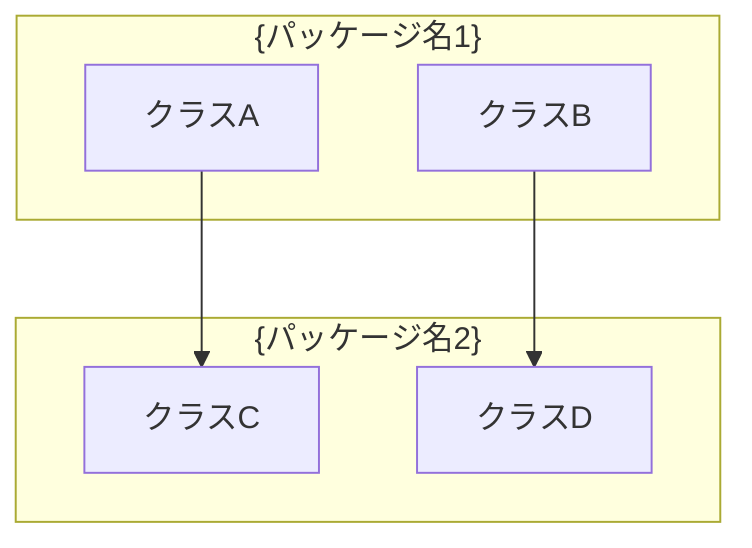
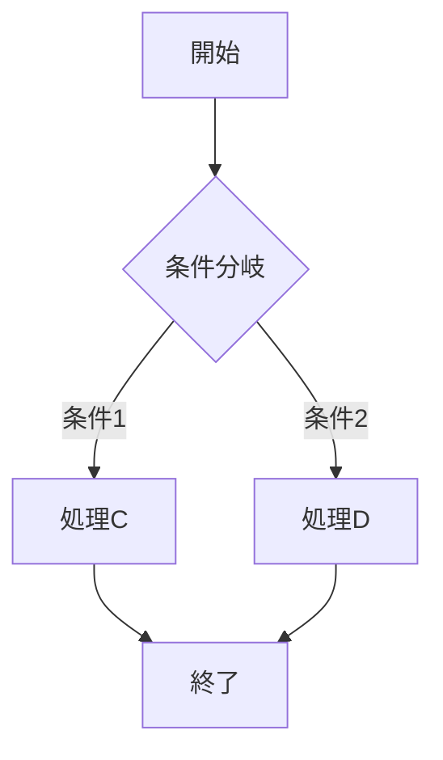

# クラス設計書

## ドキュメント情報

| 項目 | 内容 |
|------|------|
| ドキュメントID | DD001-01-{YYYYMMDD} |
| プロジェクト名 | {プロジェクト名} |
| サブシステム名 | {サブシステム名} |
| 対象機能 | {対象機能名} |
| 作成日 | {YYYY/MM/DD} |
| 作成者 | {作成者名} |
| 最終更新日 | {YYYY/MM/DD} |
| 最終更新者 | {更新者名} |
| 版数 | {1.0} |
| 承認者 | {承認者名} |
| 承認日 | {YYYY/MM/DD} |

## 変更履歴

| 版数 | 日付 | 変更者 | 変更内容 |
|------|------|--------|----------|
| 1.0 | {YYYY/MM/DD} | {変更者名} | 新規作成 |

## 目次

1. [概要](#概要)
2. [クラス図](#クラス図)
3. [クラス詳細](#クラス詳細)
4. [メソッド定義](#メソッド定義)
5. [依存関係](#依存関係)
6. [デザインパターン適用](#デザインパターン適用)

---

## 概要

### 目的

{このクラス設計書の目的を記述}

### スコープ

{対象となるクラス群のスコープを記述}

### 前提条件

- {前提条件1}
- {前提条件2}
- {前提条件3}

### 参照ドキュメント

| ドキュメント名 | ドキュメントID | 版数 |
|----------------|----------------|------|
| {基本設計書} | {BD001-XX} | {1.0} |
| {アーキテクチャ設計書} | {AD001-XX} | {1.0} |
| DD000_詳細設計総括 | DD000 | {1.0} |

---

## 📋 文書分割ガイドライン

> **重要**: 大規模システムでは、このテンプレートを**そのまま1ファイルで使用しない**でください。
> 以下のガイドラインに従って適切に分割してください。

### 分割の基本原則

#### ✅ 分割推奨ケース

以下のいずれかに該当する場合は、ファイルを分割してください：

1. **クラス数が10を超える場合**
   - 📁 推奨: パッケージ単位、レイヤー単位で分割
   - 例: `DD001-01_クラス設計書_ユーザー管理_認証モジュール.md`

2. **1ファイルが50ページを超える場合**
   - 📁 推奨: 機能単位、サブシステム単位で分割

3. **担当者が異なる場合**
   - 📁 推奨: 担当チーム単位で分割し、並行作業を可能に

4. **レビュー単位を分けたい場合**
   - 📁 推奨: レビュー対象範囲ごとに分割

#### 分割例

**Before**（非推奨）:
```
DD001-01_クラス設計書.md
└── 全システムの200クラスを記載（500ページ）❌
```

**After**（推奨）:
```
01_ユーザー管理/
├── DD001-01_クラス設計書_ユーザー管理_認証モジュール.md（8クラス）✅
├── DD001-01_クラス設計書_ユーザー管理_ユーザーリポジトリ.md（7クラス）✅
└── DD001-01_クラス設計書_ユーザー管理_パスワードハッシュ.md（5クラス）✅

02_注文管理/
├── DD001-01_クラス設計書_注文管理_注文サービス.md（9クラス）✅
└── DD001-01_クラス設計書_注文管理_在庫管理.md（6クラス）✅
```

### クラス図の分割方針

#### 全体俯瞰図（1図のみ推奨）

- **目的**: システム全体のパッケージ構成を把握
- **粒度**: パッケージレベル（クラスの詳細は省略）
- **サイズ**: A3サイズ1枚に収まる範囲（最大30パッケージ程度）
- **配置**: `DD001-01_クラス設計書_全体俯瞰.md` として別ファイル推奨

#### 詳細クラス図（モジュールごと）

- **目的**: モジュール内部のクラス設計
- **粒度**: クラス単位（属性・メソッド記載）
- **サイズ**: **1図あたり5-10クラス程度**
- **分割**: 関連するクラスごとにグループ化し、別ファイルに

### 実運用での推奨ディレクトリ構造

```
.agent/templates/04_詳細設計/実成果物/
├── 00_全体俯瞰/
│   └── DD001-01_クラス設計書_全体俯瞰.md
│
├── 01_ユーザー管理/
│   ├── DD001-01_クラス設計書_認証モジュール.md
│   ├── DD001-01_クラス設計書_ユーザーリポジトリ.md
│   └── DD001-01_クラス設計書_パスワードハッシュ.md
│
├── 02_注文管理/
│   ├── DD001-01_クラス設計書_注文サービス.md
│   └── DD001-01_クラス設計書_在庫管理.md
│
└── 03_共通基盤/
    ├── DD001-01_クラス設計書_ロギング.md
    └── DD001-01_クラス設計書_エラーハンドリング.md
```

### 命名規則

```
DD001-01_クラス設計書_{サブシステム名}_{モジュール名}.md

例:
DD001-01_クラス設計書_ユーザー管理_認証モジュール.md
DD001-01_クラス設計書_注文管理_注文サービス.md
DD001-01_クラス設計書_共通基盤_ロギング.md
```

### チェックリスト

文書作成前に以下を確認してください：

- [ ] このファイルに記載するクラス数は10以下か？
- [ ] ページ数は50ページ以下に収まる見込みか？
- [ ] 単一のモジュール/パッケージに絞られているか？
- [ ] クラス図は5-10クラス程度に抑えられているか？

**1つでも No の場合は、ファイル分割を検討してください。**

詳細は [DD000_詳細設計総括.md](./DD000_詳細設計総括.md) を参照してください。

---

## クラス図

### パッケージ構成



### クラス図（全体）

```mermaid
classDiagram
    class {クラス名1} {
        {+/-/#/~} {属性名1}: {型}
        {+/-/#/~} {属性名2}: {型}
        {+/-/#/~} {メソッド名1}({引数}): {戻り値型}
        {+/-/#/~} {メソッド名2}({引数}): {戻り値型}
    }

    class {クラス名2} {
        {+/-/#/~} {属性名1}: {型}
        {+/-/#/~} {属性名2}: {型}
        {+/-/#/~} {メソッド名1}({引数}): {戻り値型}
        {+/-/#/~} {メソッド名2}({引数}): {戻り値型}
    }

    class {インターフェース名} {
        <<interface>>
        {+} {メソッド名1}({引数}): {戻り値型}
        {+} {メソッド名2}({引数}): {戻り値型}
    }

    {クラス名1} ..|> {インターフェース名}: 実装
    {クラス名2} ..|> {インターフェース名}: 実装
    {クラス名1} --> {クラス名2}: 依存
    {クラス名1} o-- {クラス名3}: 集約
    {クラス名1} *-- {クラス名4}: 合成
```

### クラス図（詳細: {機能名}）

```mermaid
classDiagram
    %% 詳細なクラス図を記述
```

---

## クラス詳細

### {クラス名1}

#### 基本情報

| 項目 | 内容 |
|------|------|
| クラス名 | {クラス名1} |
| パッケージ | {パッケージ名} |
| 継承元 | {親クラス名/なし} |
| 実装インターフェース | {インターフェース名/なし} |
| 責務 | {クラスの責務を記述} |
| ステレオタイプ | {Entity/Service/Repository/Controller/ValueObject/なし} |
| 可視性 | {public/internal/private} |

#### 属性一覧

| No | 属性名 | 型 | 可視性 | 初期値 | 説明 | 制約 |
|----|--------|----|----|--------|------|------|
| 1 | {属性名1} | {型} | {+/-/#/~} | {初期値/なし} | {説明} | {NotNull/Size/Pattern/なし} |
| 2 | {属性名2} | {型} | {+/-/#/~} | {初期値/なし} | {説明} | {NotNull/Size/Pattern/なし} |
| 3 | {属性名3} | {型} | {+/-/#/~} | {初期値/なし} | {説明} | {NotNull/Size/Pattern/なし} |

#### メソッド一覧

| No | メソッド名 | 可視性 | 戻り値型 | 説明 | 備考 |
|----|------------|--------|----------|------|------|
| 1 | {メソッド名1} | {+/-/#/~} | {型} | {説明} | {static/abstract/final/なし} |
| 2 | {メソッド名2} | {+/-/#/~} | {型} | {説明} | {static/abstract/final/なし} |
| 3 | {メソッド名3} | {+/-/#/~} | {型} | {説明} | {static/abstract/final/なし} |

#### 関連クラス

| 関連種別 | 相手クラス | 多重度 | 説明 |
|----------|------------|--------|------|
| {依存/関連/集約/合成/汎化/実現} | {クラス名} | {1/0..1/1..*/0..*} | {関連の説明} |

#### 備考

{特記事項があれば記述}

### {クラス名2}

#### 基本情報

| 項目 | 内容 |
|------|------|
| クラス名 | {クラス名2} |
| パッケージ | {パッケージ名} |
| 継承元 | {親クラス名/なし} |
| 実装インターフェース | {インターフェース名/なし} |
| 責務 | {クラスの責務を記述} |
| ステレオタイプ | {Entity/Service/Repository/Controller/ValueObject/なし} |
| 可視性 | {public/internal/private} |

#### 属性一覧

| No | 属性名 | 型 | 可視性 | 初期値 | 説明 | 制約 |
|----|--------|----|----|--------|------|------|
| 1 | {属性名1} | {型} | {+/-/#/~} | {初期値/なし} | {説明} | {NotNull/Size/Pattern/なし} |

#### メソッド一覧

| No | メソッド名 | 可視性 | 戻り値型 | 説明 | 備考 |
|----|------------|--------|----------|------|------|
| 1 | {メソッド名1} | {+/-/#/~} | {型} | {説明} | {static/abstract/final/なし} |

#### 関連クラス

| 関連種別 | 相手クラス | 多重度 | 説明 |
|----------|------------|--------|------|
| {依存/関連/集約/合成/汎化/実現} | {クラス名} | {1/0..1/1..*/0..*} | {関連の説明} |

#### 備考

{特記事項があれば記述}

---

## メソッド定義

### {クラス名1}.{メソッド名1}

#### 基本情報

| 項目 | 内容 |
|------|------|
| メソッド名 | {メソッド名1} |
| 所属クラス | {クラス名1} |
| 可視性 | {public/protected/private/package} |
| 修飾子 | {static/abstract/final/synchronized/なし} |
| 戻り値型 | {型} |
| 説明 | {メソッドの説明} |

#### 引数

| No | 引数名 | 型 | 必須 | デフォルト値 | 説明 | 制約 |
|----|--------|----|----|--------------|------|------|
| 1 | {引数名1} | {型} | {必須/任意} | {値/なし} | {説明} | {NotNull/Size/Pattern/なし} |
| 2 | {引数名2} | {型} | {必須/任意} | {値/なし} | {説明} | {NotNull/Size/Pattern/なし} |

#### 戻り値

| 型 | 説明 | 備考 |
|----|------|------|
| {型} | {戻り値の説明} | {null許容/非null/なし} |

#### 例外

| 例外クラス | 発生条件 | 処理方針 |
|------------|----------|----------|
| {例外名1} | {発生条件} | {処理方針} |
| {例外名2} | {発生条件} | {処理方針} |

#### 処理概要

1. {処理ステップ1}
2. {処理ステップ2}
3. {処理ステップ3}

#### 処理フロー



#### 呼び出し先メソッド

| クラス名 | メソッド名 | 説明 |
|----------|------------|------|
| {クラス名} | {メソッド名} | {説明} |

#### トランザクション

| 項目 | 内容 |
|------|------|
| トランザクション境界 | {要/不要} |
| 分離レベル | {READ_UNCOMMITTED/READ_COMMITTED/REPEATABLE_READ/SERIALIZABLE/なし} |
| タイムアウト | {秒数/なし} |

#### パフォーマンス要件

| 項目 | 内容 |
|------|------|
| 実行時間目標 | {ミリ秒} |
| 同時実行数 | {数値/制限なし} |
| キャッシュ | {有/無} |

#### セキュリティ要件

| 項目 | 内容 |
|------|------|
| 認証要否 | {要/不要} |
| 認可要否 | {要/不要} |
| ロール | {ロール名/なし} |
| 監査ログ | {要/不要} |

#### コード例

```{java/python/typescript/go/csharp}
// コード例を記述
{コード}
```

#### 備考

{特記事項があれば記述}

### {クラス名1}.{メソッド名2}

{上記と同様の形式で記述}

---

## 依存関係

### 依存関係マトリクス

| クラス名 | {クラスA} | {クラスB} | {クラスC} | {クラスD} |
|----------|-----------|-----------|-----------|-----------|
| {クラスA} | - | ○ | ○ | - |
| {クラスB} | - | - | ○ | ○ |
| {クラスC} | - | - | - | ○ |
| {クラスD} | - | - | - | - |

凡例: ○ = 依存あり、- = 依存なし

### 循環依存チェック

| No | クラス群 | 循環依存 | 対策 |
|----|----------|----------|------|
| 1 | {クラスA → クラスB → クラスA} | {有/無} | {対策内容/なし} |

### 外部ライブラリ依存

| クラス名 | 外部ライブラリ | バージョン | 用途 |
|----------|----------------|------------|------|
| {クラス名} | {ライブラリ名} | {x.y.z} | {用途} |

---

## デザインパターン適用

### 適用パターン一覧

| No | パターン名 | 適用箇所 | 目的 | 備考 |
|----|------------|----------|------|------|
| 1 | {Singleton/Factory/Strategy/Observer/Repository/など} | {クラス名} | {目的} | {備考} |
| 2 | {Singleton/Factory/Strategy/Observer/Repository/など} | {クラス名} | {目的} | {備考} |

### {パターン名1} 適用詳細

#### 適用理由

{適用理由を記述}

#### 構成要素

| 役割 | クラス名 | 説明 |
|------|----------|------|
| {役割1} | {クラス名} | {説明} |
| {役割2} | {クラス名} | {説明} |

#### クラス図

```mermaid
classDiagram
    %% パターン適用箇所のクラス図
```

---

## 付録

### 用語集

| 用語 | 説明 |
|------|------|
| {用語1} | {説明} |
| {用語2} | {説明} |

### レビュー記録

| 日付 | レビュアー | 指摘事項 | 対応状況 |
|------|------------|----------|----------|
| {YYYY/MM/DD} | {レビュアー名} | {指摘事項} | {対応済/対応中/未対応} |

### 承認記録

| 役割 | 氏名 | 承認日 | 署名 |
|------|------|--------|------|
| {設計者} | {氏名} | {YYYY/MM/DD} | {署名} |
| {レビュアー} | {氏名} | {YYYY/MM/DD} | {署名} |
| {承認者} | {氏名} | {YYYY/MM/DD} | {署名} |
