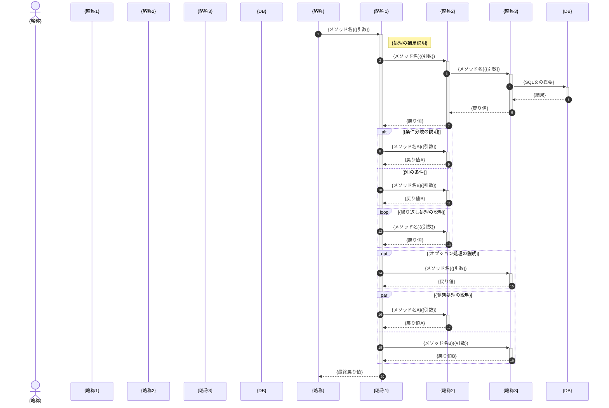
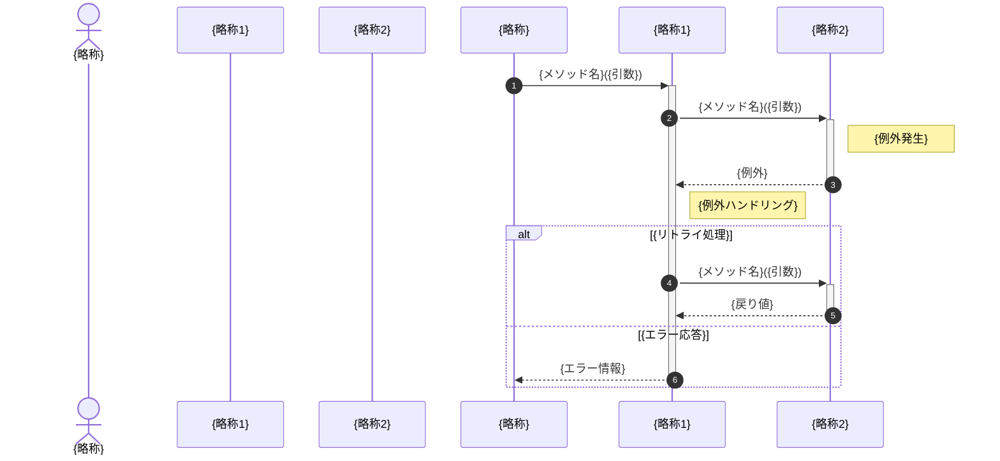
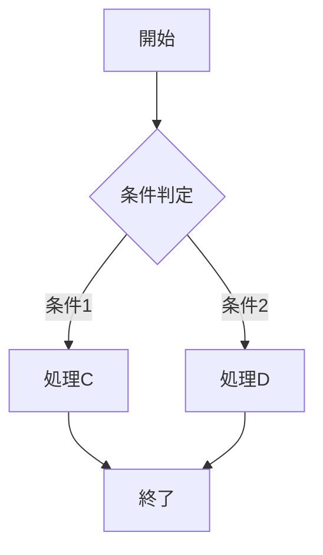

# シーケンス図

## ドキュメント情報

| 項目 | 内容 |
|------|------|
| ドキュメントID | DD001-02-{YYYYMMDD} |
| プロジェクト名 | {プロジェクト名} |
| サブシステム名 | {サブシステム名} |
| 対象機能 | {対象機能名} |
| 作成日 | {YYYY/MM/DD} |
| 作成者 | {作成者名} |
| 最終更新日 | {YYYY/MM/DD} |
| 最終更新者 | {更新者名} |
| 版数 | {1.0} |
| 承認者 | {承認者名} |
| 承認日 | {YYYY/MM/DD} |

## 変更履歴

| 版数 | 日付 | 変更者 | 変更内容 |
|------|------|--------|----------|
| 1.0 | {YYYY/MM/DD} | {変更者名} | 新規作成 |

## 目次

1. [概要](#概要)
2. [シーケンス図一覧](#シーケンス図一覧)
3. [シーケンス図詳細](#シーケンス図詳細)
4. [処理フロー説明](#処理フロー説明)
5. [例外処理シーケンス](#例外処理シーケンス)

---

## 概要

### 目的

{このシーケンス図の目的を記述}

### スコープ

{対象となる処理フローのスコープを記述}

### 前提条件

- {前提条件1}
- {前提条件2}
- {前提条件3}

### 参照ドキュメント

| ドキュメント名 | ドキュメントID | 版数 |
|----------------|----------------|------|
| {基本設計書} | {BD001-XX} | {1.0} |
| {クラス設計書} | {DD001-01-XX} | {1.0} |

---

## シーケンス図一覧

### 対象シーケンス一覧

| No | シーケンスID | シーケンス名 | 説明 | 関連ユースケース |
|----|--------------|--------------|------|------------------|
| 1 | SEQ-{001} | {シーケンス名1} | {説明} | {UC-XXX} |
| 2 | SEQ-{002} | {シーケンス名2} | {説明} | {UC-XXX} |
| 3 | SEQ-{003} | {シーケンス名3} | {説明} | {UC-XXX} |

### 登場オブジェクト一覧

| No | オブジェクト名 | 種別 | 説明 | 備考 |
|----|----------------|------|------|------|
| 1 | {オブジェクト名1} | {Actor/Boundary/Control/Entity/External} | {説明} | {備考} |
| 2 | {オブジェクト名2} | {Actor/Boundary/Control/Entity/External} | {説明} | {備考} |
| 3 | {オブジェクト名3} | {Actor/Boundary/Control/Entity/External} | {説明} | {備考} |

---

## シーケンス図詳細

### SEQ-{001}: {シーケンス名1}

#### 基本情報

| 項目 | 内容 |
|------|------|
| シーケンスID | SEQ-{001} |
| シーケンス名 | {シーケンス名1} |
| 概要 | {シーケンスの概要を記述} |
| トリガー | {トリガーとなるイベント} |
| 前提条件 | {前提条件} |
| 事後条件 | {事後条件} |
| 主要処理時間 | {予想処理時間} |

#### シーケンス図



#### メッセージ詳細

| No | 送信元 | 受信先 | メッセージ名 | 引数 | 戻り値 | 説明 | 同期/非同期 |
|----|--------|--------|--------------|------|--------|------|-------------|
| 1 | {送信元} | {受信先} | {メソッド名} | {引数} | {戻り値} | {説明} | {同期/非同期} |
| 2 | {送信元} | {受信先} | {メソッド名} | {引数} | {戻り値} | {説明} | {同期/非同期} |
| 3 | {送信元} | {受信先} | {メソッド名} | {引数} | {戻り値} | {説明} | {同期/非同期} |

#### トランザクション境界

| 開始位置 | 終了位置 | 分離レベル | タイムアウト | 備考 |
|----------|----------|------------|--------------|------|
| {メッセージNo} | {メッセージNo} | {READ_COMMITTED/REPEATABLE_READ/SERIALIZABLE} | {秒数} | {備考} |

#### パフォーマンス情報

| 項目 | 目標値 | 実測値 | 備考 |
|------|--------|--------|------|
| 全体処理時間 | {ミリ秒} | {ミリ秒/未測定} | {備考} |
| DB処理時間 | {ミリ秒} | {ミリ秒/未測定} | {備考} |
| 外部API処理時間 | {ミリ秒} | {ミリ秒/未測定} | {備考} |

### SEQ-{002}: {シーケンス名2}

#### 基本情報

| 項目 | 内容 |
|------|------|
| シーケンスID | SEQ-{002} |
| シーケンス名 | {シーケンス名2} |
| 概要 | {シーケンスの概要を記述} |
| トリガー | {トリガーとなるイベント} |
| 前提条件 | {前提条件} |
| 事後条件 | {事後条件} |
| 主要処理時間 | {予想処理時間} |

#### シーケンス図

```mermaid
sequenceDiagram
    autonumber

    %% シーケンス図を記述
```

#### メッセージ詳細

| No | 送信元 | 受信先 | メッセージ名 | 引数 | 戻り値 | 説明 | 同期/非同期 |
|----|--------|--------|--------------|------|--------|------|-------------|
| 1 | {送信元} | {受信先} | {メソッド名} | {引数} | {戻り値} | {説明} | {同期/非同期} |

---

## 処理フロー説明

### SEQ-{001}: {シーケンス名1} 処理フロー

#### ステップ詳細

##### ステップ1: {処理名}

| 項目 | 内容 |
|------|------|
| 処理概要 | {処理の概要} |
| 実行条件 | {実行条件} |
| 処理内容 | {詳細な処理内容} |
| 入力データ | {入力データ} |
| 出力データ | {出力データ} |
| エラー処理 | {エラー発生時の処理} |
| 処理時間目標 | {ミリ秒} |

##### ステップ2: {処理名}

| 項目 | 内容 |
|------|------|
| 処理概要 | {処理の概要} |
| 実行条件 | {実行条件} |
| 処理内容 | {詳細な処理内容} |
| 入力データ | {入力データ} |
| 出力データ | {出力データ} |
| エラー処理 | {エラー発生時の処理} |
| 処理時間目標 | {ミリ秒} |

#### 条件分岐詳細

| 分岐No | 分岐条件 | 処理内容 | 備考 |
|--------|----------|----------|------|
| 1 | {条件式} | {処理内容} | {備考} |
| 2 | {条件式} | {処理内容} | {備考} |

#### ループ処理詳細

| ループNo | ループ条件 | 最大繰り返し数 | 処理内容 | 備考 |
|----------|------------|----------------|----------|------|
| 1 | {条件} | {回数/制限なし} | {処理内容} | {備考} |

---

## 例外処理シーケンス

### SEQ-{001}-EX01: {例外シーケンス名1}

#### 基本情報

| 項目 | 内容 |
|------|------|
| 例外シーケンスID | SEQ-{001}-EX01 |
| 親シーケンス | SEQ-{001} |
| 例外名 | {例外クラス名} |
| 発生条件 | {例外発生条件} |
| 重要度 | {高/中/低} |

#### 例外処理シーケンス図



#### 例外処理詳細

| 項目 | 内容 |
|------|------|
| 例外キャッチ箇所 | {クラス名.メソッド名} |
| 処理方針 | {リトライ/ロールバック/ログ記録/エラー返却} |
| リトライ回数 | {回数/なし} |
| リトライ間隔 | {秒数/なし} |
| ロールバック対象 | {トランザクション範囲/なし} |
| ログレベル | {ERROR/WARN/INFO} |
| ユーザー通知 | {通知内容/なし} |
| 通知方法 | {画面/メール/通知/なし} |

### SEQ-{001}-EX02: {例外シーケンス名2}

{上記と同様の形式で記述}

---

## 非機能要件マッピング

### パフォーマンス要件

| シーケンスID | 処理時間目標 | 同時実行数 | スループット | 備考 |
|--------------|--------------|------------|--------------|------|
| SEQ-{001} | {ミリ秒} | {件/秒} | {件/秒} | {備考} |
| SEQ-{002} | {ミリ秒} | {件/秒} | {件/秒} | {備考} |

### セキュリティ要件

| シーケンスID | 認証 | 認可 | 暗号化 | 監査ログ | 備考 |
|--------------|------|------|--------|----------|------|
| SEQ-{001} | {要/不要} | {要/不要} | {要/不要} | {要/不要} | {備考} |
| SEQ-{002} | {要/不要} | {要/不要} | {要/不要} | {要/不要} | {備考} |

### 可用性要件

| シーケンスID | 可用性目標 | 障害時動作 | リカバリ方法 | 備考 |
|--------------|------------|------------|--------------|------|
| SEQ-{001} | {99.9%} | {縮退運転/停止} | {自動/手動} | {備考} |
| SEQ-{002} | {99.9%} | {縮退運転/停止} | {自動/手動} | {備考} |

---

## 付録

### アクティビティ図（参考）



### タイミング図（参考）

```mermaid
gantt
    title 処理タイミングチャート
    dateFormat X
    axisFormat %s

    section オブジェクト1
    処理A :0, 100
    処理B :100, 200

    section オブジェクト2
    処理C :50, 150
    処理D :150, 250
```



### 用語集

| 用語 | 説明 |
|------|------|
| {用語1} | {説明} |
| {用語2} | {説明} |

### レビュー記録

| 日付 | レビュアー | 指摘事項 | 対応状況 |
|------|------------|----------|----------|
| {YYYY/MM/DD} | {レビュアー名} | {指摘事項} | {対応済/対応中/未対応} |

### 承認記録

| 役割 | 氏名 | 承認日 | 署名 |
|------|------|--------|------|
| {設計者} | {氏名} | {YYYY/MM/DD} | {署名} |
| {レビュアー} | {氏名} | {YYYY/MM/DD} | {署名} |
| {承認者} | {氏名} | {YYYY/MM/DD} | {署名} |
