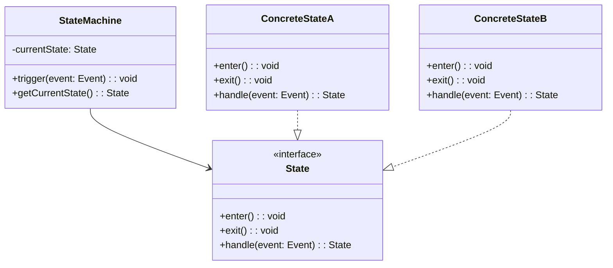

# 状態遷移図

## ドキュメント情報

| 項目 | 内容 |
|------|------|
| ドキュメントID | DD001-03-{YYYYMMDD} |
| プロジェクト名 | {プロジェクト名} |
| サブシステム名 | {サブシステム名} |
| 対象機能 | {対象機能名} |
| 作成日 | {YYYY/MM/DD} |
| 作成者 | {作成者名} |
| 最終更新日 | {YYYY/MM/DD} |
| 最終更新者 | {更新者名} |
| 版数 | {1.0} |
| 承認者 | {承認者名} |
| 承認日 | {YYYY/MM/DD} |

## 変更履歴

| 版数 | 日付 | 変更者 | 変更内容 |
|------|------|--------|----------|
| 1.0 | {YYYY/MM/DD} | {変更者名} | 新規作成 |

## 目次

1. [概要](#概要)
2. [状態遷移図一覧](#状態遷移図一覧)
3. [状態遷移図詳細](#状態遷移図詳細)
4. [状態定義](#状態定義)
5. [イベント定義](#イベント定義)
6. [遷移条件定義](#遷移条件定義)

---

## 概要

### 目的

{この状態遷移図の目的を記述}

### スコープ

{対象となる状態管理のスコープを記述}

### 前提条件

- {前提条件1}
- {前提条件2}
- {前提条件3}

### 参照ドキュメント

| ドキュメント名 | ドキュメントID | 版数 |
|----------------|----------------|------|
| {基本設計書} | {BD001-XX} | {1.0} |
| {データベース設計書} | {DD002-XX} | {1.0} |

---

## 状態遷移図一覧

### 対象エンティティ一覧

| No | エンティティID | エンティティ名 | 説明 | 状態管理テーブル |
|----|----------------|----------------|------|------------------|
| 1 | ENT-{001} | {エンティティ名1} | {説明} | {テーブル名} |
| 2 | ENT-{002} | {エンティティ名2} | {説明} | {テーブル名} |
| 3 | ENT-{003} | {エンティティ名3} | {説明} | {テーブル名} |

### 状態一覧サマリ

| エンティティID | 初期状態 | 終了状態 | 状態数 | イベント数 | 備考 |
|----------------|----------|----------|--------|------------|------|
| ENT-{001} | {状態名} | {状態名} | {数} | {数} | {備考} |
| ENT-{002} | {状態名} | {状態名} | {数} | {数} | {備考} |

---

## 状態遷移図詳細

### ENT-{001}: {エンティティ名1} 状態遷移図

#### 基本情報

| 項目 | 内容 |
|------|------|
| エンティティID | ENT-{001} |
| エンティティ名 | {エンティティ名1} |
| 概要 | {状態遷移の概要を記述} |
| 状態管理方式 | {DB/メモリ/ファイル/分散キャッシュ} |
| 状態永続化 | {要/不要} |
| 状態履歴管理 | {要/不要} |

#### 状態遷移図

```mermaid
stateDiagram-v2
    [*] --> {初期状態名}

    {初期状態名} --> {状態名2}: {イベント名1} / {アクション}
    {初期状態名} --> {状態名3}: {イベント名2} [条件] / {アクション}

    {状態名2} --> {状態名4}: {イベント名3} / {アクション}
    {状態名2} --> {状態名5}: {イベント名4} / {アクション}

    {状態名3} --> {状態名4}: {イベント名5} / {アクション}

    state {状態名4} {
        [*] --> {サブ状態1}
        {サブ状態1} --> {サブ状態2}: {イベント名}
        {サブ状態2} --> [*]
    }

    {状態名4} --> {状態名6}: {イベント名6} / {アクション}
    {状態名5} --> {状態名6}: {イベント名7} / {アクション}

    {状態名6} --> [*]

    note right of {状態名2}
        {状態に関する補足説明}
    end note
```

#### 状態遷移マトリクス

| 現在の状態 / イベント | {イベント1} | {イベント2} | {イベント3} | {イベント4} | {イベント5} |
|----------------------|-------------|-------------|-------------|-------------|-------------|
| {初期状態名} | {次状態名} | {次状態名} | - | - | - |
| {状態名2} | - | - | {次状態名} | {次状態名} | - |
| {状態名3} | - | - | - | - | {次状態名} |
| {状態名4} | - | - | - | - | {次状態名} |
| {状態名5} | - | - | - | - | {次状態名} |

凡例: - = 遷移不可

### ENT-{002}: {エンティティ名2} 状態遷移図

#### 基本情報

| 項目 | 内容 |
|------|------|
| エンティティID | ENT-{002} |
| エンティティ名 | {エンティティ名2} |
| 概要 | {状態遷移の概要を記述} |
| 状態管理方式 | {DB/メモリ/ファイル/分散キャッシュ} |
| 状態永続化 | {要/不要} |
| 状態履歴管理 | {要/不要} |

#### 状態遷移図

```mermaid
stateDiagram-v2
    %% 状態遷移図を記述
```

---

## 状態定義

### ENT-{001}: {エンティティ名1} 状態定義

#### {状態名1}

| 項目 | 内容 |
|------|------|
| 状態ID | ST-{001} |
| 状態名 | {状態名1} |
| 状態コード | {コード値} |
| 状態種別 | {初期状態/中間状態/終了状態/エラー状態} |
| 説明 | {状態の説明} |
| 入場アクション | {状態に入る時の処理/なし} |
| 退場アクション | {状態を出る時の処理/なし} |
| 内部アクション | {状態内で実行される処理/なし} |
| タイムアウト | {タイムアウト時間/なし} |
| タイムアウト時遷移先 | {遷移先状態/なし} |
| 並行状態 | {あり/なし} |
| 履歴状態 | {Shallow/Deep/なし} |

#### データ属性

| 属性名 | 型 | 必須 | 説明 | 備考 |
|--------|----|----|------|------|
| {属性名1} | {型} | {必須/任意} | {説明} | {備考} |
| {属性名2} | {型} | {必須/任意} | {説明} | {備考} |

#### 不変条件

- {不変条件1}
- {不変条件2}

#### 許可操作

| 操作名 | 説明 | 権限 |
|--------|------|------|
| {操作名1} | {説明} | {必要な権限/なし} |
| {操作名2} | {説明} | {必要な権限/なし} |

#### ビジネスルール

- {ビジネスルール1}
- {ビジネスルール2}

#### {状態名2}

{上記と同様の形式で記述}

---

## イベント定義

### ENT-{001}: {エンティティ名1} イベント定義

#### {イベント名1}

| 項目 | 内容 |
|------|------|
| イベントID | EV-{001} |
| イベント名 | {イベント名1} |
| イベントコード | {コード値} |
| 説明 | {イベントの説明} |
| トリガー種別 | {ユーザー操作/システムイベント/外部イベント/タイムアウト} |
| 発生元 | {発生元の特定} |
| 優先度 | {高/中/低} |
| 非同期処理 | {有/無} |

#### イベントパラメータ

| パラメータ名 | 型 | 必須 | 説明 | 制約 |
|--------------|----|----|------|------|
| {パラメータ名1} | {型} | {必須/任意} | {説明} | {制約条件/なし} |
| {パラメータ名2} | {型} | {必須/任意} | {説明} | {制約条件/なし} |

#### 事前条件

- {事前条件1}
- {事前条件2}

#### 事後条件

- {事後条件1}
- {事後条件2}

#### エラー条件

| エラーコード | エラー内容 | 処理方針 |
|--------------|------------|----------|
| {E001} | {エラー内容} | {処理方針} |
| {E002} | {エラー内容} | {処理方針} |

#### {イベント名2}

{上記と同様の形式で記述}

---

## 遷移条件定義

### ENT-{001}: {エンティティ名1} 遷移条件

#### 遷移-{001}: {状態A} → {状態B}

| 項目 | 内容 |
|------|------|
| 遷移ID | TR-{001} |
| 遷移名 | {遷移名} |
| 開始状態 | {状態A} |
| 終了状態 | {状態B} |
| トリガーイベント | {イベント名} |
| ガード条件 | {条件式/なし} |
| アクション | {実行処理} |
| 優先度 | {高/中/低} |

#### ガード条件詳細

```
{条件式の詳細記述}
例: status == 'APPROVED' && amount <= 1000000
```

#### アクション詳細

| No | アクション内容 | 実行タイミング | 失敗時処理 |
|----|----------------|----------------|------------|
| 1 | {アクション1} | {遷移前/遷移中/遷移後} | {ロールバック/ログ記録/継続} |
| 2 | {アクション2} | {遷移前/遷移中/遷移後} | {ロールバック/ログ記録/継続} |

#### トランザクション制御

| 項目 | 内容 |
|------|------|
| トランザクション境界 | {要/不要} |
| 分離レベル | {READ_COMMITTED/REPEATABLE_READ/SERIALIZABLE/なし} |
| ロック種別 | {楽観的ロック/悲観的ロック/なし} |
| ロールバック条件 | {条件/なし} |

#### 副作用

| 副作用の種類 | 内容 | 影響範囲 |
|--------------|------|----------|
| {DB更新/通知/ログ/外部連携} | {内容} | {影響範囲} |

#### パフォーマンス要件

| 項目 | 目標値 | 備考 |
|------|--------|------|
| 遷移処理時間 | {ミリ秒} | {備考} |
| 同時実行数 | {件/秒} | {備考} |

#### エラーハンドリング

| エラー種別 | 処理方針 | 遷移先状態 |
|------------|----------|------------|
| {エラー種別1} | {処理方針} | {状態名/元の状態/エラー状態} |
| {エラー種別2} | {処理方針} | {状態名/元の状態/エラー状態} |

#### 遷移-{002}: {状態C} → {状態D}

{上記と同様の形式で記述}

---

## 状態履歴管理

### ENT-{001}: {エンティティ名1} 履歴管理仕様

#### 履歴管理方式

| 項目 | 内容 |
|------|------|
| 履歴保存 | {要/不要} |
| 保存方式 | {全履歴/差分/スナップショット+差分} |
| 保存先 | {テーブル名/ファイル名} |
| 保存期間 | {期間/無期限} |
| 圧縮 | {要/不要} |
| 暗号化 | {要/不要} |

#### 履歴テーブル定義

| カラム名 | 型 | 必須 | 説明 | インデックス |
|----------|----|----|------|--------------|
| history_id | {型} | 必須 | 履歴ID | PK |
| entity_id | {型} | 必須 | エンティティID | FK, Index |
| from_state | {型} | 必須 | 遷移元状態 | Index |
| to_state | {型} | 必須 | 遷移先状態 | Index |
| event | {型} | 必須 | イベント名 | Index |
| transition_at | {型} | 必須 | 遷移日時 | Index |
| user_id | {型} | 任意 | 実行ユーザー | Index |
| reason | {型} | 任意 | 遷移理由 | - |
| snapshot | {型} | 任意 | 状態スナップショット | - |

#### 履歴照会機能

| 機能名 | 説明 | 検索条件 |
|--------|------|----------|
| {機能名1} | {説明} | {検索条件} |
| {機能名2} | {説明} | {検索条件} |

---

## 並行状態管理

### ENT-{001}: {エンティティ名1} 並行状態

#### 並行リージョン定義

```mermaid
stateDiagram-v2
    state {状態名} {
        state fork_state <<fork>>
        [*] --> fork_state

        fork_state --> {リージョン1状態A}
        fork_state --> {リージョン2状態X}

        {リージョン1状態A} --> {リージョン1状態B}
        {リージョン2状態X} --> {リージョン2状態Y}

        state join_state <<join>>
        {リージョン1状態B} --> join_state
        {リージョン2状態Y} --> join_state

        join_state --> [*]
    }
```

#### リージョン一覧

| リージョンID | リージョン名 | 説明 | 独立性 |
|--------------|--------------|------|--------|
| RG-{001} | {リージョン名1} | {説明} | {完全独立/部分独立/相互依存} |
| RG-{002} | {リージョン名2} | {説明} | {完全独立/部分独立/相互依存} |

#### 同期ポイント

| 同期ポイント名 | 待機条件 | タイムアウト | タイムアウト時処理 |
|----------------|----------|--------------|-------------------|
| {同期ポイント1} | {条件} | {秒数/なし} | {処理内容} |

---

## 状態機械実装

### 実装方式

| 項目 | 内容 |
|------|------|
| 実装パターン | {State Pattern/Strategy Pattern/Table-Driven/Switch-Case} |
| 実装言語 | {言語名} |
| 状態管理クラス | {クラス名} |
| ライブラリ使用 | {ライブラリ名/なし} |

### クラス構成



### コード例

```{java/python/typescript/go/csharp}
// 状態機械実装のサンプルコード
{コード}
```

---

## テスト項目

### 状態遷移テストケース

| テストID | 開始状態 | イベント | 期待終了状態 | 備考 |
|----------|----------|----------|--------------|------|
| TC-{001} | {状態A} | {イベント1} | {状態B} | {正常系} |
| TC-{002} | {状態A} | {イベント2} | {状態A} | {ガード条件不成立} |
| TC-{003} | {状態B} | {無効イベント} | {状態B} | {異常系} |

### テストカバレッジ目標

| 項目 | 目標値 | 備考 |
|------|--------|------|
| 状態カバレッジ | {100%} | 全状態を網羅 |
| 遷移カバレッジ | {100%} | 全遷移を網羅 |
| イベントカバレッジ | {100%} | 全イベントを網羅 |
| 条件カバレッジ | {80%以上} | ガード条件の組み合わせ |

---

## 付録

### 状態コード一覧

| 状態コード | 状態名 | 説明 | 備考 |
|------------|--------|------|------|
| {01} | {状態名1} | {説明} | {備考} |
| {02} | {状態名2} | {説明} | {備考} |
| {99} | {エラー状態} | {説明} | {備考} |

### イベントコード一覧

| イベントコード | イベント名 | 説明 | 備考 |
|----------------|------------|------|------|
| {E01} | {イベント名1} | {説明} | {備考} |
| {E02} | {イベント名2} | {説明} | {備考} |

### 用語集

| 用語 | 説明 |
|------|------|
| {用語1} | {説明} |
| {用語2} | {説明} |

### レビュー記録

| 日付 | レビュアー | 指摘事項 | 対応状況 |
|------|------------|----------|----------|
| {YYYY/MM/DD} | {レビュアー名} | {指摘事項} | {対応済/対応中/未対応} |

### 承認記録

| 役割 | 氏名 | 承認日 | 署名 |
|------|------|--------|------|
| {設計者} | {氏名} | {YYYY/MM/DD} | {署名} |
| {レビュアー} | {氏名} | {YYYY/MM/DD} | {署名} |
| {承認者} | {氏名} | {YYYY/MM/DD} | {署名} |
