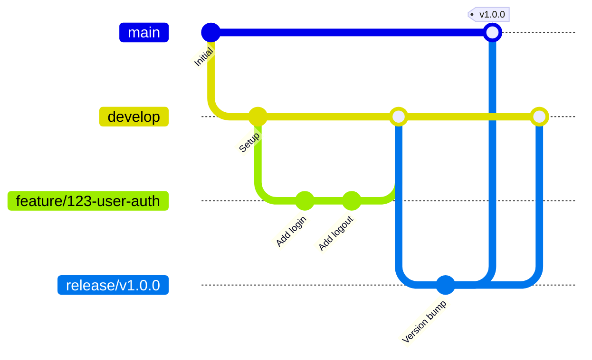

# ソースコード管理規約

## ドキュメント情報

| 項目 | 内容 |
|------|------|
| ドキュメントID | IM002-{YYYYMMDD} |
| プロジェクト名 | {プロジェクト名} |
| 作成日 | {YYYY/MM/DD} |
| 作成者 | {作成者名} |
| 最終更新日 | {YYYY/MM/DD} |
| 最終更新者 | {更新者名} |
| 版数 | {1.0} |
| 承認者 | {承認者名} |
| 承認日 | {YYYY/MM/DD} |

## 変更履歴

| 版数 | 日付 | 変更者 | 変更内容 |
|------|------|--------|----------|
| 1.0 | {YYYY/MM/DD} | {変更者名} | 新規作成 |

## 目次

1. [概要](#概要)
2. [ブランチ戦略](#ブランチ戦略)
3. [コミットルール](#コミットルール)
4. [プルリクエスト](#プルリクエスト)
5. [コードレビュー](#コードレビュー)
6. [リリース管理](#リリース管理)

---

## 概要

### 目的

{このソースコード管理規約の目的を記述}

### スコープ

{対象となるリポジトリ・プロジェクトのスコープを記述}

### 使用ツール

| ツール | バージョン | 用途 |
|--------|------------|------|
| {Git} | {2.40+} | {バージョン管理} |
| {GitHub/GitLab/Bitbucket} | {-} | {リポジトリホスティング} |
| {GitHub Actions/GitLab CI/Jenkins} | {-} | {CI/CD} |

---

## ブランチ戦略

### ブランチモデル

{Git Flow/GitHub Flow/GitLab Flow}を採用

### ブランチ種別

| ブランチ種別 | 命名規則 | 用途 | 保護 | 削除 |
|--------------|----------|------|------|------|
| main/master | main | 本番環境 | 保護 | 不可 |
| develop | develop | 開発環境 | 保護 | 不可 |
| feature | feature/{issue番号}-{機能名} | 機能開発 | なし | マージ後削除 |
| bugfix | bugfix/{issue番号}-{バグ名} | バグ修正 | なし | マージ後削除 |
| hotfix | hotfix/{issue番号}-{修正内容} | 緊急修正 | なし | マージ後削除 |
| release | release/{バージョン} | リリース準備 | 保護 | リリース後削除 |

### ブランチフロー



### ブランチ作成・削除

```bash
# feature ブランチ作成
git checkout develop
git pull origin develop
git checkout -b feature/123-user-authentication

# 作業完了後、リモートにプッシュ
git push -u origin feature/123-user-authentication

# マージ後、ローカルブランチ削除
git branch -d feature/123-user-authentication

# リモートブランチ削除
git push origin --delete feature/123-user-authentication
```

---

## コミットルール

### コミットメッセージ形式

```
<type>(<scope>): <subject>

<body>

<footer>
```

### Type一覧

| Type | 説明 | 例 |
|------|------|-----|
| feat | 新機能 | feat(auth): ユーザー認証機能追加 |
| fix | バグ修正 | fix(api): ユーザー取得APIのエラー修正 |
| docs | ドキュメント | docs(readme): インストール手順更新 |
| style | コードスタイル | style(user): インデント修正 |
| refactor | リファクタリング | refactor(db): クエリ最適化 |
| test | テスト追加・修正 | test(user): ユーザー作成テスト追加 |
| chore | ビルド・補助ツール | chore(deps): パッケージ更新 |
| perf | パフォーマンス改善 | perf(api): キャッシュ導入 |
| ci | CI/CD設定 | ci(github): ワークフロー追加 |

### コミットメッセージ例

```
feat(auth): ユーザー認証機能追加

- JWT認証を実装
- ログイン/ログアウトエンドポイント追加
- 認証ミドルウェア実装

Closes #123
```

### コミット単位

- {1コミット1機能・1修正}
- {コンパイルエラーやテスト失敗のコミットは禁止}
- {WIPコミットは使用可(プッシュ前にsquash)}

### コミットコマンド

```bash
# ステージング
git add src/auth/login.py
git add tests/test_auth.py

# コミット
git commit -m "feat(auth): ユーザー認証機能追加"

# 修正コミット(プッシュ前のみ)
git commit --amend

# 複数コミットをまとめる
git rebase -i HEAD~3
```

---

## プルリクエスト

### PR作成ルール

- {1つのPRは1つの機能・修正}
- {差分は500行以内を推奨}
- {ドラフトPRを活用}
- {CI/CDが全てパス後にマージ}

### PRテンプレート

```markdown
## 概要
<!-- このPRの目的を記述 -->

## 変更内容
<!-- 主な変更点をリストアップ -->
-
-
-

## 関連Issue
Closes #

## チェックリスト
- [ ] テストを追加・更新した
- [ ] ドキュメントを更新した
- [ ] コーディング規約に準拠している
- [ ] レビュー可能な差分量である
- [ ] CIが全てパスしている

## スクリーンショット
<!-- UIに変更がある場合 -->

## テスト方法
<!-- レビュアーが確認する手順 -->

## 補足事項
<!-- その他特記事項 -->
```

### PRマージ方法

| マージ方法 | 使用場面 | 備考 |
|------------|----------|------|
| Merge Commit | リリースブランチ | コミット履歴を全て保持 |
| Squash and Merge | feature/bugfix | 1つのコミットにまとめる |
| Rebase and Merge | 小規模修正 | 線形な履歴を維持 |

---

## コードレビュー

### レビュー観点

| 観点 | チェック項目 |
|------|--------------|
| 機能性 | 要件を満たしているか |
| 品質 | バグがないか、エッジケースを考慮しているか |
| 保守性 | 可読性は高いか、適切に分割されているか |
| パフォーマンス | 性能問題はないか |
| セキュリティ | 脆弱性はないか |
| テスト | 適切なテストが書かれているか |
| ドキュメント | コメント・ドキュメントは十分か |

### レビューコメント例

```markdown
<!-- 承認 -->
LGTM! 良い実装です。

<!-- 質問 -->
❓ この処理の意図を教えてください。

<!-- 提案 -->
💡 ここはリスト内包表記を使うと簡潔になります。

<!-- 必須修正 -->
⚠️ この部分はSQLインジェクションの脆弱性があります。修正必須です。

<!-- 軽微な指摘 -->
📝 nit: 変数名は`user_id`の方が分かりやすいです。
```

---

## リリース管理

### バージョニング

{Semantic Versioning (SemVer)}を採用: `MAJOR.MINOR.PATCH`

- {MAJOR: 互換性のない変更}
- {MINOR: 後方互換性のある機能追加}
- {PATCH: 後方互換性のあるバグ修正}

### タグ付け

```bash
# タグ作成
git tag -a v1.0.0 -m "Release version 1.0.0"

# タグプッシュ
git push origin v1.0.0

# 全タグプッシュ
git push origin --tags
```

### リリースノート

```markdown
# Release v1.0.0

## New Features
- ユーザー認証機能 (#123)
- プロフィール編集機能 (#124)

## Bug Fixes
- ログインエラー修正 (#125)

## Breaking Changes
- API v1 廃止

## Contributors
@user1, @user2
```

---

## 付録

### .gitignore 設定例

```gitignore
# 環境依存ファイル
.env
.env.local
*.local

# ビルド成果物
dist/
build/
*.pyc
__pycache__/
node_modules/

# IDE設定
.vscode/
.idea/
*.swp

# OS
.DS_Store
Thumbs.db
```

### レビュー記録

| 日付 | レビュアー | 指摘事項 | 対応状況 |
|------|------------|----------|----------|
| {YYYY/MM/DD} | {レビュアー名} | {指摘事項} | {対応済/対応中/未対応} |

### 承認記録

| 役割 | 氏名 | 承認日 | 署名 |
|------|------|--------|------|
| {作成者} | {氏名} | {YYYY/MM/DD} | {署名} |
| {承認者} | {氏名} | {YYYY/MM/DD} | {署名} |
