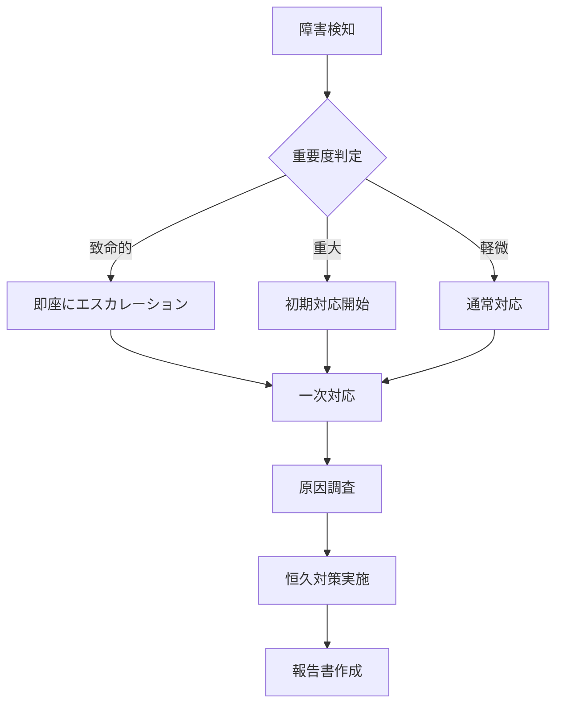

# 障害対応手順書

## ドキュメント情報

| 項目 | 内容 |
|------|------|
| ドキュメントID | MT004-{YYYYMMDD} |
| プロジェクト名 | {プロジェクト名} |
| 作成日 | {YYYY/MM/DD} |
| 作成者 | {作成者名} |
| 版数 | {1.0} |

## 変更履歴

| 版数 | 日付 | 変更者 | 変更内容 |
|------|------|--------|----------|
| 1.0 | {YYYY/MM/DD} | {変更者名} | 新規作成 |

---

## 障害対応フロー



---

## 障害分類

### 重要度定義

| 重要度 | 定義 | 対応時間 | エスカレーション |
|--------|------|----------|------------------|
| 致命的 | サービス全停止 | 即座 | 即座に運用責任者 |
| 重大 | 主要機能停止 | 30分以内 | 1時間以内に運用リーダー |
| 中 | 一部機能に影響 | 4時間以内 | 必要に応じて |
| 軽微 | 軽微な不具合 | 翌営業日 | 不要 |

---

## 障害対応手順

### 【致命的】サービス全停止

#### 初動対応

| No | 作業内容 | 担当 | 完了 |
|----|----------|------|------|
| 1 | 運用責任者にエスカレーション | 一次対応者 | {□} |
| 2 | 関係者への緊急連絡 | 運用責任者 | {□} |
| 3 | 障害状況の確認 | 一次対応者 | {□} |
| 4 | 対応方針の決定 | 運用責任者 | {□} |

#### 確認コマンド

```bash
# サービス状態確認
systemctl status app

# プロセス確認
ps aux | grep app

# ログ確認
tail -n 100 /var/log/app/error.log

# ディスク容量確認
df -h

# メモリ確認
free -h
```

#### 復旧手順

```bash
# サービス再起動
systemctl restart app

# 状態確認
systemctl status app

# ヘルスチェック
curl http://localhost:8080/health
```

### 【重大】主要機能停止

#### 初動対応

| No | 作業内容 | 担当 | 完了 |
|----|----------|------|------|
| 1 | 障害範囲の特定 | 一次対応者 | {□} |
| 2 | 一時的な回避策の検討 | 一次対応者 | {□} |
| 3 | 運用リーダーに報告 | 一次対応者 | {□} |
| 4 | ユーザーへの通知 | 運用リーダー | {□} |

---

## 障害パターン別対応

### CPU使用率高騰

#### 症状

- CPU使用率が90%を超える
- レスポンスタイムが遅延

#### 確認手順

```bash
# CPU使用率確認
top -n 1

# プロセス別CPU使用率
ps aux --sort=-%cpu | head -n 10

# 負荷平均確認
uptime
```

#### 対処方法

1. {高負荷プロセスの特定}
2. {不要プロセスの停止}
3. {スケールアウト検討}

### メモリ不足

#### 症状

- メモリ使用率が95%を超える
- OOM Killerが発動

#### 確認手順

```bash
# メモリ使用状況確認
free -h

# プロセス別メモリ使用量
ps aux --sort=-%mem | head -n 10

# OOMログ確認
dmesg | grep -i "out of memory"
```

#### 対処方法

1. {メモリリークの確認}
2. {不要プロセスの停止}
3. {メモリ増強検討}

### データベース接続エラー

#### 症状

- データベースに接続できない
- 接続数上限に達している

#### 確認手順

```sql
-- 現在の接続数確認
SELECT count(*) FROM pg_stat_activity;

-- 接続元確認
SELECT client_addr, count(*) FROM pg_stat_activity GROUP BY client_addr;

-- スロークエリ確認
SELECT * FROM pg_stat_activity WHERE state = 'active' AND now() - query_start > interval '5 seconds';
```

#### 対処方法

1. {不要なコネクションのKill}
2. {コネクションプール設定の見直し}
3. {データベーススケールアップ}

---

## 連絡体制

### エスカレーション先

| レベル | 連絡先 | 氏名 | 電話番号 | メール |
|--------|--------|------|----------|--------|
| L1 | 一次対応者 | {氏名} | {090-xxxx-xxxx} | {email} |
| L2 | 運用リーダー | {氏名} | {090-xxxx-xxxx} | {email} |
| L3 | 運用責任者 | {氏名} | {090-xxxx-xxxx} | {email} |
| L4 | システム管理者 | {氏名} | {090-xxxx-xxxx} | {email} |

---

## 報告書作成

### 障害報告書テンプレート

```markdown
# 障害報告書

## 障害概要
- 発生日時:
- 検知日時:
- 復旧日時:
- 影響範囲:

## 障害内容
{詳細を記述}

## 原因
{根本原因}

## 対応内容
{実施した対応}

## 恒久対策
{再発防止策}

## 今後の対応
{フォローアップ項目}
```

---

## 承認記録

| 役割 | 氏名 | 承認日 | 署名 |
|------|------|--------|------|
| {作成者} | {氏名} | {YYYY/MM/DD} | {署名} |
