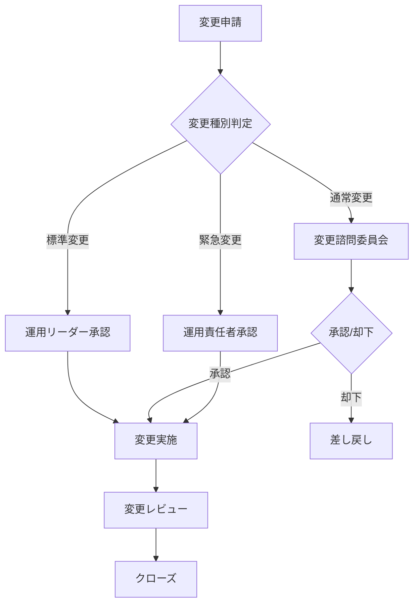

# 変更管理手順書

## ドキュメント情報

| 項目 | 内容 |
|------|------|
| ドキュメントID | MT006-{YYYYMMDD} |
| プロジェクト名 | {プロジェクト名} |
| 作成日 | {YYYY/MM/DD} |
| 作成者 | {作成者名} |
| 版数 | {1.0} |
| 承認者 | {承認者名} |
| 承認日 | {YYYY/MM/DD} |

## 変更履歴

| 版数 | 日付 | 変更者 | 変更内容 |
|------|------|--------|----------|
| 1.0 | {YYYY/MM/DD} | {変更者名} | 新規作成 |

---

## 変更管理概要

### 変更管理の目的

{変更管理の目的を記述}

### 適用範囲

- {本番環境への全ての変更}
- {ステージング環境への主要な変更}

---

## 変更分類

### 変更種別

| 変更種別 | 定義 | 承認者 | 承認期間 |
|----------|------|--------|----------|
| 標準変更 | 定型的な変更(パッチ適用等) | 運用リーダー | 即日 |
| 通常変更 | 計画的な変更(機能追加等) | 変更諮問委員会 | 5営業日 |
| 緊急変更 | 緊急の変更(障害対応等) | 運用責任者 | 即日 |

### 影響度

| 影響度 | 定義 | 例 |
|--------|------|-----|
| 高 | サービス停止を伴う | システムメンテナンス |
| 中 | 一部機能に影響 | 機能追加 |
| 低 | 影響なし | 内部リファクタリング |

---

## 変更管理フロー

---

## 変更申請手順

### 変更申請書

| 項目 | 内容 |
|------|------|
| 変更ID | {CHG-YYYYMMDD-XXX} |
| 申請日 | {YYYY/MM/DD} |
| 申請者 | {氏名} |
| 変更種別 | {標準/通常/緊急} |
| 影響度 | {高/中/低} |
| 変更対象 | {対象システム・コンポーネント} |
| 変更内容 | {変更内容の詳細} |
| 変更理由 | {変更が必要な理由} |
| 影響範囲 | {影響を受けるユーザー・機能} |
| 実施予定日時 | {YYYY/MM/DD HH:MM} ~ {YYYY/MM/DD HH:MM} |
| 作業時間 | {X時間} |
| 作業者 | {氏名} |
| 切り戻し手順 | {切り戻し方法} |
| テスト結果 | {ステージング環境でのテスト結果} |
| リスク | {想定されるリスク} |
| リスク対策 | {リスクへの対策} |

---

## 変更承認

### 承認フロー

#### 標準変更

1. {申請者が変更申請書を作成}
2. {運用リーダーが即日承認}
3. {変更実施}

#### 通常変更

1. {申請者が変更申請書を作成}
2. {運用リーダーが一次レビュー}
3. {変更諮問委員会(CAB)で審議}
4. {承認/却下の決定}
5. {承認後、変更実施}

#### 緊急変更

1. {申請者が変更申請書を作成(簡易版可)}
2. {運用責任者が承認}
3. {即時変更実施}
4. {事後報告}

---

## 変更実施

### 実施前チェックリスト

- [ ] 変更申請書が承認されている
- [ ] バックアップが取得されている
- [ ] 切り戻し手順が準備されている
- [ ] テスト環境で動作確認済み
- [ ] 関係者への通知完了
- [ ] 作業手順書が準備されている

### 実施作業

1. {実施前の状態確認}
2. {バックアップ取得}
3. {変更作業実施}
4. {動作確認}
5. {実施後の状態確認}

### 実施後チェックリスト

- [ ] 変更作業が完了している
- [ ] 動作確認が完了している
- [ ] エラーログに異常がない
- [ ] 性能劣化がない
- [ ] 関係者への報告完了

---

## 変更レビュー

### レビュー項目

| 項目 | 確認内容 |
|------|----------|
| 変更結果 | 変更が正常に完了したか |
| 影響範囲 | 想定外の影響はなかったか |
| 課題 | 問題点はあったか |
| 改善点 | 次回への改善事項 |

---

## 緊急変更の事後処理

### 事後報告

- {変更実施後24時間以内に報告}
- {変更諮問委員会への報告}
- {根本原因分析}
- {再発防止策の策定}

---

## 変更管理指標

### KPI

| 指標 | 目標値 | 測定方法 |
|------|--------|----------|
| 変更成功率 | 95%以上 | 月次集計 |
| 緊急変更率 | 10%以下 | 月次集計 |
| 変更起因障害 | 5件/月以下 | 月次集計 |

---

## 承認記録

| 役割 | 氏名 | 承認日 | 署名 |
|------|------|--------|------|
| {作成者} | {氏名} | {YYYY/MM/DD} | {署名} |
| {承認者} | {氏名} | {YYYY/MM/DD} | {署名} |
