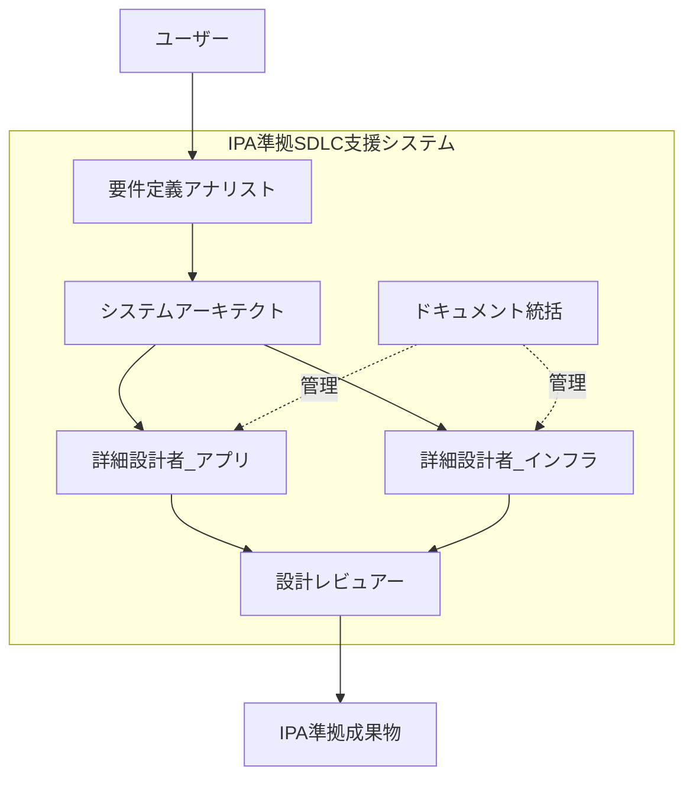
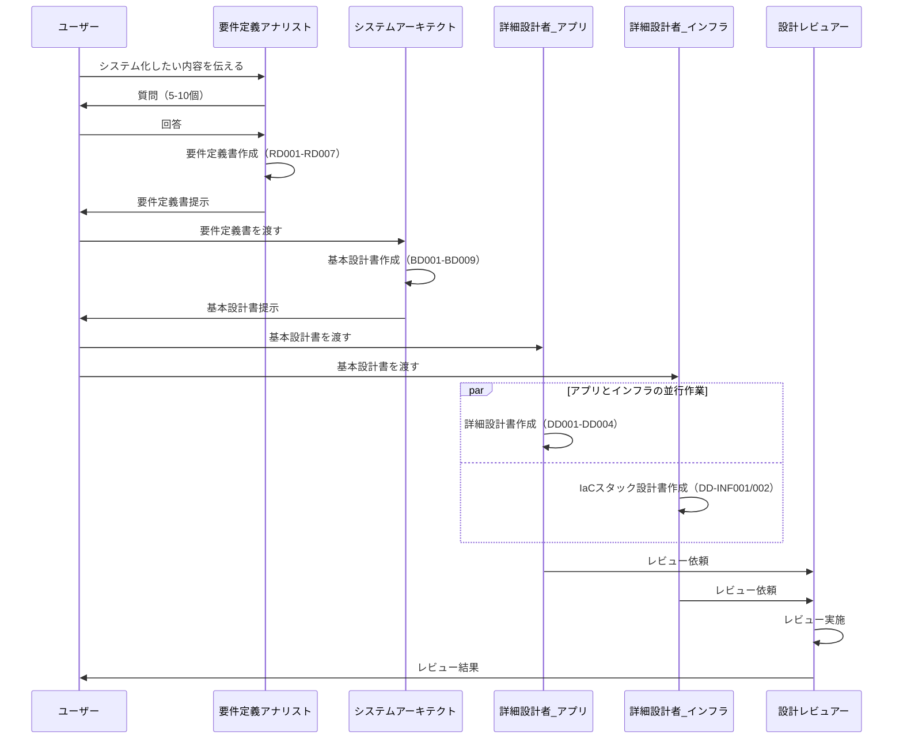

# SDLC Master Workflow

> **目的**: IPA準拠のSDLC（要件定義→基本設計→詳細設計）を、AIエージェントで効率化する

---

## 📋 目次

1. [概要](#1-概要)
2. [エージェント一覧](#2-エージェント一覧)
3. [ワークフローパターン](#3-ワークフローパターン)
4. [実行手順](#4-実行手順)
5. [成果物の配置](#5-成果物の配置)

---

## 1. 概要

### 1.1 システム構成



### 1.2 主要な特徴

- ✅ **IPA Common Frame 2013準拠**: すべてのテンプレートがIPA標準に準拠
- ✅ **大規模システム対応**: 文書分割ガイドラインにより、100クラス超のシステムにも対応
- ✅ **チーム分離サポート**: アプリチーム/インフラチームの並行作業をサポート
- ✅ **Best Practices統合**: AWS、セキュリティ、DBなどのベストプラクティスを統合
- ✅ **柔軟な質問生成**: 固定の質問リストではなく、状況に応じて必要な質問のみ生成

---

## 2. エージェント一覧

### 2.1 要件定義フェーズ

| エージェント | 役割 | 主要成果物 |
|------------|------|-----------|
| **requirements-analyst** | 要件定義アナリスト | RD001-RD007（要件定義書） |

### 2.2 基本設計フェーズ

| エージェント | 役割 | 主要成果物 |
|------------|------|-----------|
| **system-architect** | システムアーキテクト | BD001-BD009（基本設計書） |

### 2.3 詳細設計フェーズ

| エージェント | 役割 | 主要成果物 |
|------------|------|-----------|
| **detailed-designer-app** | 詳細設計者（アプリ） | DD001-DD004（クラス設計、DB設計、API設計、テスト仕様） |
| **detailed-designer-infra** | 詳細設計者（インフラ） | DD-INF001/002（IaCスタック設計） |
| **documentation-assistant** | ドキュメント統括 | DD000（詳細設計総括） |

### 2.4 レビューフェーズ

| エージェント | 役割 | 主要成果物 |
|------------|------|-----------|
| **design-reviewer** | 設計レビュアー | レビューレポート |

---

## 3. ワークフローパターン

### 3.1 完全SDLC（推奨）

要件定義から詳細設計まで一貫してサポート。



**使用コマンド**:
```bash
# フェーズごとに実行
claude-agent run requirements-analyst
claude-agent run system-architect
claude-agent run detailed-designer-app
claude-agent run detailed-designer-infra
claude-agent run design-reviewer
```

### 3.2 要件定義のみ

既存システムのリプレース、追加機能の要件定義など。

**対象**:
- 新規プロジェクトの要件定義
- 追加機能の要件定義

**使用コマンド**:
```bash
claude-agent run requirements-analyst
```

### 3.3 基本設計のみ

既存の要件定義書から基本設計を作成。

**対象**:
- 要件定義は完了しているが、基本設計をAIで効率化したい

**前提**:
- 要件定義書（RD001-RD007）が存在する

**使用コマンド**:
```bash
claude-agent run system-architect --input templates/01_要件定義/実成果物/
```

### 3.4 詳細設計のみ

既存の基本設計書から詳細設計を作成。

**対象**:
- 基本設計は完了しているが、詳細設計をAIで効率化したい
- アプリチームとインフラチームで並行作業したい

**前提**:
- 基本設計書（BD001-BD009）が存在する

**使用コマンド**:
```bash
# アプリチーム
claude-agent run detailed-designer-app --input templates/02_基本設計/実成果物/

# インフラチーム（並行実行可能）
claude-agent run detailed-designer-infra --input templates/02_基本設計/実成果物/
```

---

## 4. 実行手順

### 4.1 初回セットアップ

```bash
# 1. プロジェクトディレクトリ作成
mkdir my-project
cd my-project

# 2. .agentディレクトリをコピー
cp -r /path/to/Antigravity/.agent .

# 3. agents.jsonを確認
cat .agent/agents.json
```

### 4.2 要件定義フェーズ

**ステップ1: エージェント起動**

```bash
claude-agent run requirements-analyst
```

**ステップ2: 対話形式で要件をヒアリング**

エージェントが以下を質問：
- システムの目的
- 主要機能
- 想定ユーザー数
- 非機能要件（性能、可用性、セキュリティ）

**ステップ3: 要件定義書の生成**

以下のファイルが生成される：
```
templates/01_要件定義/実成果物/
├── RD001_システム化要求定義書.md
├── RD002_業務要件定義書.md
├── RD003_機能要件定義書.md
├── RD004_非機能要件定義書.md
├── RD005_ユースケース記述書.md
├── RD006_画面要件定義書.md
└── RD007_帳票要件定義書.md
```

### 4.3 基本設計フェーズ

**ステップ1: 要件定義書を確認**

```bash
# 要件定義書が存在することを確認
ls templates/01_要件定義/実成果物/
```

**ステップ2: エージェント起動**

```bash
claude-agent run system-architect --input templates/01_要件定義/実成果物/
```

**ステップ3: 基本設計書の生成**

以下のファイルが生成される：
```
templates/02_基本設計/実成果物/
├── BD001_システム方式設計書.md
├── BD002_アプリケーション方式設計書.md
├── BD003_データベース方式設計書.md
├── BD004_ネットワーク構成設計書.md
├── BD005_セキュリティ設計書.md
├── BD006_運用設計書.md
├── BD007_移行設計書.md
├── BD008_テスト方針書.md
└── BD009_IaC設計書.md
```

### 4.4 詳細設計フェーズ

**ステップ1: DD000総括作成**

```bash
claude-agent run documentation-assistant
```

**ステップ2: アプリ詳細設計**

```bash
claude-agent run detailed-designer-app --input templates/02_基本設計/実成果物/
```

生成ファイル:
```
templates/04_詳細設計/実成果物/01_アプリ/
├── ユーザー管理/
│   ├── DD001-01_クラス設計書_認証モジュール.md
│   ├── DD002_データベース物理設計書_ユーザーテーブル.md
│   ├── DD003_API設計書_ユーザー管理API.md
│   └── DD004_単体テスト仕様書_UserService.md
└── 注文管理/
    └── ...
```

**ステップ3: インフラ詳細設計（並行実行可能）**

```bash
claude-agent run detailed-designer-infra --input templates/02_基本設計/実成果物/
```

生成ファイル:
```
templates/04_詳細設計/実成果物/02_インフラ/
├── network/
│   └── DD-INF001_Terraformスタック設計書_VPC.md
├── security/
│   └── DD-INF001_Terraformスタック設計書_SecurityGroup.md
└── application-platform/
    └── DD-INF001_Terraformスタック設計書_ECS.md
```

### 4.5 レビューフェーズ

```bash
claude-agent run design-reviewer --input templates/
```

レビュー項目:
- IPA準拠性チェック
- 文書間の整合性確認
- セキュリティリスク検出
- パフォーマンスボトルネック検出
- コスト最適化提案

---

## 5. 成果物の配置

### 5.1 ディレクトリ構造

```
my-project/
├── .agent/
│   ├── agents.json                  # エージェント定義
│   ├── knowledge/                   # ナレッジベース
│   ├── templates/                   # テンプレート
│   └── workflows/                   # ワークフロー定義
│
├── templates/
│   ├── 01_要件定義/
│   │   └── 実成果物/               # 要件定義書の実成果物
│   │
│   ├── 02_基本設計/
│   │   └── 実成果物/               # 基本設計書の実成果物
│   │
│   └── 04_詳細設計/
│       ├── DD000_詳細設計総括.md
│       └── 実成果物/
│           ├── 00_全体俯瞰/
│           ├── 01_アプリ/          # アプリチームの成果物
│           └── 02_インフラ/        # インフラチームの成果物
│
└── reviews/                         # レビュー結果
```

### 5.2 成果物の命名規則

#### 要件定義

```
RD{番号}_{文書名}.md

例:
RD001_システム化要求定義書.md
RD003_機能要件定義書.md
```

#### 基本設計

```
BD{番号}_{文書名}.md

例:
BD001_システム方式設計書.md
BD009_IaC設計書.md
```

#### 詳細設計（アプリ）

```
DD{番号}_{文書名}_{対象範囲}.md

例:
DD001-01_クラス設計書_認証モジュール.md
DD002_データベース物理設計書_ユーザーテーブル.md
```

#### 詳細設計（インフラ）

```
DD-INF{番号}_{IaCツール}スタック設計書_{スタック名}.md

例:
DD-INF001_Terraformスタック設計書_VPC.md
DD-INF002_CloudFormationスタック設計書_SecurityGroup.md
```

---

## 6. Tips

### 6.1 並行作業

アプリチームとインフラチームで並行作業可能：

```bash
# ターミナル1（アプリチーム）
claude-agent run detailed-designer-app

# ターミナル2（インフラチーム）
claude-agent run detailed-designer-infra
```

Git運用:
```bash
# アプリチーム
git checkout -b feature/detailed-design/app

# インフラチーム
git checkout -b feature/detailed-design/infra
```

### 6.2 カスタマイズ

プロジェクト固有の要件に応じて、以下をカスタマイズ可能：

1. **agents.json**: エージェント定義の追加・変更
2. **templates/**: テンプレートのカスタマイズ
3. **knowledge/**: プロジェクト固有のベストプラクティス追加

### 6.3 よくある質問

**Q: 途中のフェーズから開始できますか？**

A: はい。各フェーズは独立しており、途中から開始可能です。
   例: 要件定義は手動で作成し、基本設計からAIを活用

**Q: 文書分割はどのタイミングで判断しますか？**

A: エージェントが自動判断します。
   - クラス数10超 → 分割推奨
   - ページ数50超 → 分割推奨

**Q: チーム分離はどうやって設定しますか？**

A: `agents.json` の `team_collaboration` 設定を確認してください。
   デフォルトでは、アプリ/インフラの分離をサポートしています。

---

## 7. トラブルシューティング

### エージェントが起動しない

```bash
# agents.jsonの構文チェック
jq . .agent/agents.json

# パスの確認
ls .agent/templates/
ls .agent/knowledge/
```

### 質問が多すぎる

エージェントの質問数は通常5-10個です。
もし20個以上質問される場合は、`questioning-guidance.md` を確認してください。

### 成果物が生成されない

以下を確認:
1. 入力ファイル（前フェーズの成果物）が存在するか
2. テンプレートファイルが存在するか
3. エージェントのログを確認

---

## 8. まとめ

このSDLC支援システムは以下を実現します：

- ✅ **IPA準拠**: Common Frame 2013に準拠した成果物
- ✅ **大規模対応**: 文書分割により、100クラス超のシステムにも対応
- ✅ **効率化**: エージェントによる自動生成で、工数を50-70%削減
- ✅ **品質向上**: ベストプラクティス統合により、高品質な設計書を生成
- ✅ **チーム協働**: アプリ/インフラチームの並行作業をサポート

詳細は各エージェントのワークフロー定義を参照してください。
