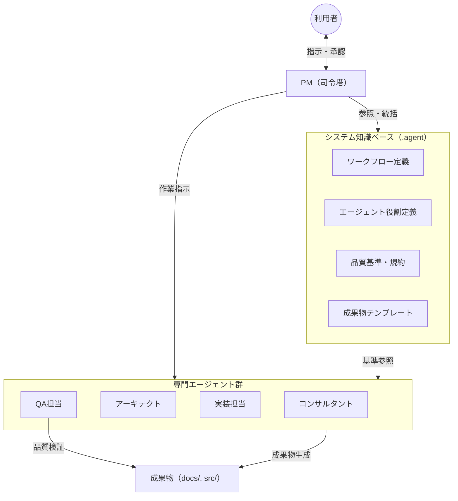

# 01. アーキテクチャ概要

## 1. 本システムのビジョン

**Antigravity Orchestration**

本システムは、単なるコード生成AIではない。PM、アーキテクト、実装担当、QA担当といった複数の専門家が、それぞれの役割を担い、定義されたプロセスと品質基準に従って自律的に連携する「仮想開発チーム」である。

## 2. 基本設計思想

### A. 司令塔モデル（Mission Control）

プロジェクトの進捗状況およびタスク管理情報は、`task.md` および `project_status.md` に**一元管理**される。この2ファイルが、プロジェクト全体における**唯一の正（Single Source of Truth）**となる。

PMエージェントがこれらのファイルを管理し、全エージェントの作業状況を統括する。

### B. 明示的な作業指示（Explicit Orchestration）

「よしなに判断する」「空気を読む」といった暗黙的な処理を排除し、すべての作業指示を標準化する。

各タスクは、以下の4要素が明示的に紐づけられた状態で実行される。

| 要素 | 定義ファイル | 説明 |
|:---|:---|:---|
| **担当者（Role）** | `personas/*.md` | 作業を担当するエージェントの役割定義 |
| **作業内容（Task）** | `workflows/*.md` | 実行すべきタスクと手順 |
| **遵守基準（Rule）** | `standards/**/*.md` | 成果物が満たすべき品質基準・規約 |
| **出力形式（Format）** | `templates/*.md` | 成果物のテンプレート |

### C. 並行開発（Parallel Execution）

依存関係のないタスク（例：API設計とインフラ設計）は、複数のエージェントによって同時並行で実行される。これにより、開発リードタイムを短縮する。

### D. エビデンスに基づくクロスレビュー

「動作するソフトウェア」を何よりも重視する。

各フェーズの完了判定には、成果物そのものに加えて、動作検証の証跡（ブラウザ操作の録画、実行ログ等）の提示を必須とする。これらのエビデンスに基づき、クロスレビューを実施し、次フェーズへの移行可否を判断する。

## 3. システム構成図

