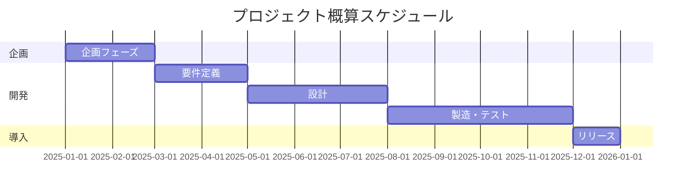
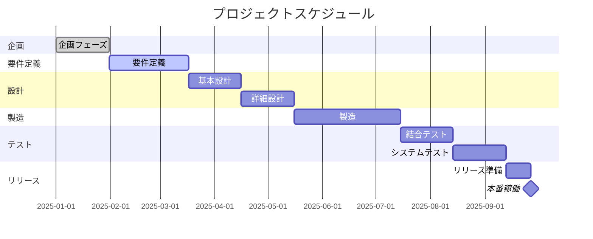
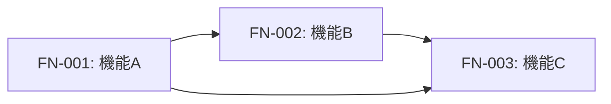
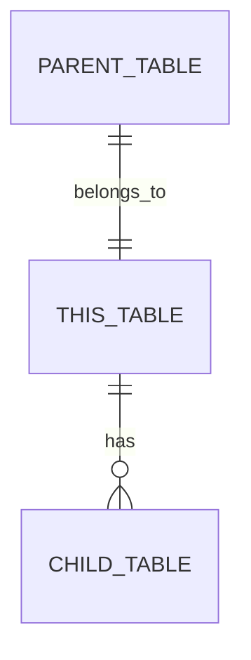

# 追加指示：IPA標準準拠ドキュメントテンプレート生成

## 概要

先の指示書で定義した `/templates/` ディレクトリ配下に、各成果物の詳細テンプレートを生成してください。

テンプレートは**Gemini 3 Proがドキュメント生成時に参照する雛形**として機能します。

---

## 生成するテンプレート一覧

```
templates/
├── 00_プロジェクト管理/
│   ├── PM001_プロジェクト計画書_template.md
│   ├── PM002_WBS_template.md
│   ├── PM003_進捗管理表_template.md
│   ├── PM004_課題管理表_template.md
│   ├── PM005_リスク管理表_template.md
│   └── PM006_変更管理表_template.md
│
├── 01_企画/
│   ├── PL001_システム化構想書_template.md
│   ├── PL002_システム化計画書_template.md
│   ├── PL003_費用対効果分析書_template.md
│   └── PL004_プロジェクト体制図_template.md
│
├── 02_要件定義/
│   ├── RD001-01_業務要件_template.md
│   ├── RD001-02_機能要件_template.md
│   ├── RD001-03_非機能要件_template.md
│   ├── RD002_業務フロー図_template.md
│   ├── RD003_ユースケース_template.md
│   ├── RD004_画面一覧_template.md
│   ├── RD005_帳票一覧_template.md
│   ├── RD006_外部インターフェース一覧_template.md
│   └── RD007_データ項目一覧_template.md
│
├── 03_基本設計/
│   ├── BD001-01_システム構成図_template.md
│   ├── BD001-02_ネットワーク構成図_template.md
│   ├── BD001-03_ソフトウェア構成図_template.md
│   ├── BD001-04_ハードウェア構成図_template.md
│   ├── BD002_機能設計書_template.md
│   ├── BD003-01_画面遷移図_template.md
│   ├── BD003-02_画面レイアウト_template.md
│   ├── BD003-03_画面項目定義書_template.md
│   ├── BD004_帳票設計書_template.md
│   ├── BD005_外部インターフェース設計書_template.md
│   ├── BD006-01_ER図_template.md
│   ├── BD006-02_テーブル一覧_template.md
│   ├── BD006-03_テーブル定義書_template.md
│   └── BD007_バッチ設計書_template.md
│
├── 04_詳細設計/
│   ├── DD001-01_クラス設計書_template.md
│   ├── DD001-02_シーケンス図_template.md
│   ├── DD001-03_状態遷移図_template.md
│   ├── DD002_データベース物理設計書_template.md
│   ├── DD003_API設計書_template.md
│   └── DD004_単体テスト仕様書_template.md
│
├── 05_製造/
│   ├── IM001_コーディング規約_template.md
│   ├── IM002_ソースコード管理規約_template.md
│   ├── IM003_単体テスト結果報告書_template.md
│   └── IM004_コードレビュー記録_template.md
│
├── 06_試験/
│   ├── TS001_テスト計画書_template.md
│   ├── TS002_テストシナリオ_template.md
│   ├── TS003_テストケース_template.md
│   ├── TS004_受入テスト仕様書_template.md
│   ├── TS005_テスト結果報告書_template.md
│   └── TS006_障害管理表_template.md
│
├── 07_リリース/
│   ├── RL001_リリース計画書_template.md
│   ├── RL002_移行計画書_template.md
│   ├── RL003_移行手順書_template.md
│   ├── RL004_切り戻し手順書_template.md
│   ├── RL005_利用者教育計画書_template.md
│   └── RL006_リリースノート_template.md
│
└── 08_保守運用/
    ├── MT001_運用設計書_template.md
    ├── MT002_運用手順書_template.md
    ├── MT003_監視設計書_template.md
    ├── MT004_障害対応手順書_template.md
    ├── MT005_保守計画書_template.md
    └── MT006_変更管理手順書_template.md
```

---

## 各テンプレートの記載内容仕様

### 共通フォーマット

すべてのテンプレートは以下の構造で作成：

```markdown
# {ドキュメント名}

## ドキュメント情報
| 項目 | 内容 |
|------|------|
| ドキュメントID | {ID} |
| バージョン | 1.0 |
| 作成日 | YYYY-MM-DD |
| 作成者 | {作成者名} |
| 承認者 | {承認者名} |
| 承認日 | YYYY-MM-DD |

## 変更履歴
| バージョン | 日付 | 変更者 | 変更内容 |
|-----------|------|--------|---------|
| 1.0 | YYYY-MM-DD | {名前} | 初版作成 |

---

{本文}
```

---

## 各テンプレートの詳細仕様

### 01_企画

#### PL001_システム化構想書_template.md

```markdown
# システム化構想書

## ドキュメント情報
（共通フォーマット）

---

## 1. エグゼクティブサマリー

{プロジェクト全体の概要を1ページ以内で記述}

---

## 2. 背景と目的

### 2.1 事業環境の変化
- 外部環境の変化
- 内部環境の変化
- 競合状況

### 2.2 現状の課題

| 課題ID | 課題分類 | 課題内容 | 影響度 | 緊急度 |
|--------|---------|---------|--------|--------|
| ISS-001 | 業務 | {課題内容} | 高/中/低 | 高/中/低 |

### 2.3 システム化の目的
- 目的1: {具体的な目的}
- 目的2: {具体的な目的}

---

## 3. システム化の方向性

### 3.1 対象業務の範囲

```
【対象範囲図】
┌─────────────────────────────────────┐
│           対象範囲                    │
│  ┌─────────┐    ┌─────────┐         │
│  │ 業務A    │    │ 業務B    │         │
│  └─────────┘    └─────────┘         │
└─────────────────────────────────────┘
```

### 3.2 基本方針
1. {方針1}
2. {方針2}
3. {方針3}

### 3.3 期待される効果

#### 定量効果
| 効果項目 | 現状 | 目標 | 改善率 |
|---------|------|------|--------|
| 処理時間 | XX時間 | YY時間 | ZZ% |
| コスト | XX万円 | YY万円 | ZZ% |

#### 定性効果
- {効果1}
- {効果2}

---

## 4. 実現可能性評価

### 4.1 技術的実現可能性
| 評価項目 | 評価 | 備考 |
|---------|------|------|
| 技術成熟度 | ○/△/× | {理由} |
| 社内スキル | ○/△/× | {理由} |
| ベンダー対応 | ○/△/× | {理由} |

### 4.2 運用面の実現可能性
| 評価項目 | 評価 | 備考 |
|---------|------|------|
| 運用体制 | ○/△/× | {理由} |
| 教育・研修 | ○/△/× | {理由} |

### 4.3 組織的実現可能性
| 評価項目 | 評価 | 備考 |
|---------|------|------|
| 経営層支援 | ○/△/× | {理由} |
| 現場受容性 | ○/△/× | {理由} |

---

## 5. 概算スケジュール



---

## 6. 概算費用

| 費用項目 | 概算金額 | 備考 |
|---------|---------|------|
| 初期費用 | XXX万円 | |
| ├ ハードウェア | XXX万円 | |
| ├ ソフトウェア | XXX万円 | |
| ├ 開発費 | XXX万円 | |
| └ その他 | XXX万円 | |
| 運用費用（年間） | XXX万円 | |
| **合計（5年間）** | **XXX万円** | |

---

## 7. リスクと対策

| リスクID | リスク内容 | 発生確率 | 影響度 | 対策 |
|---------|-----------|---------|--------|------|
| R-001 | {リスク} | 高/中/低 | 高/中/低 | {対策} |

---

## 8. 次のステップ

1. {アクション1} - 担当: {担当者} - 期限: YYYY-MM-DD
2. {アクション2} - 担当: {担当者} - 期限: YYYY-MM-DD
```

---

#### PL002_システム化計画書_template.md

```markdown
# システム化計画書

## ドキュメント情報
（共通フォーマット）

---

## 1. プロジェクト概要

### 1.1 プロジェクト名
{プロジェクト名}

### 1.2 プロジェクト目的
{目的の記述}

### 1.3 プロジェクト目標
| 目標項目 | 目標値 | 測定方法 |
|---------|--------|---------|
| {項目} | {値} | {方法} |

---

## 2. スコープ定義

### 2.1 対象範囲（In Scope）
- {対象1}
- {対象2}

### 2.2 対象外（Out of Scope）
- {対象外1}
- {対象外2}

### 2.3 前提条件
- {前提1}
- {前提2}

### 2.4 制約条件
- {制約1}
- {制約2}

---

## 3. 開発方針

### 3.1 開発手法
- [ ] ウォーターフォール
- [ ] アジャイル（スクラム）
- [ ] ハイブリッド

### 3.2 技術方針
| 項目 | 方針 |
|------|------|
| 言語 | {言語} |
| フレームワーク | {FW} |
| インフラ | {クラウド/オンプレ} |
| DB | {RDBMS名} |

---

## 4. 体制計画

### 4.1 体制図

```
                    ┌─────────────┐
                    │ プロジェクト  │
                    │ オーナー     │
                    └──────┬──────┘
                           │
                    ┌──────┴──────┐
                    │   PM        │
                    └──────┬──────┘
           ┌───────────┼───────────┐
    ┌──────┴──────┐ ┌──┴──┐ ┌──────┴──────┐
    │ 開発チーム   │ │ QA  │ │ インフラ    │
    └─────────────┘ └─────┘ └─────────────┘
```

### 4.2 役割定義

| 役割 | 担当者 | 責務 |
|------|--------|------|
| プロジェクトオーナー | {名前} | 最終意思決定、予算承認 |
| PM | {名前} | 進捗管理、課題解決 |
| PL | {名前} | 技術リード、品質管理 |

### 4.3 RACI表

| タスク | PO | PM | PL | 開発 | QA |
|--------|----|----|----|----|-----|
| 要件承認 | A | R | C | I | I |
| 設計レビュー | I | A | R | C | C |
| コーディング | I | I | A | R | I |
| テスト | I | I | A | C | R |

※ R=Responsible, A=Accountable, C=Consulted, I=Informed

---

## 5. スケジュール計画

### 5.1 マイルストーン

| マイルストーン | 予定日 | 完了条件 |
|--------------|--------|---------|
| 要件定義完了 | YYYY-MM-DD | 要件定義書承認 |
| 基本設計完了 | YYYY-MM-DD | 基本設計書承認 |
| 製造完了 | YYYY-MM-DD | 単体テスト完了 |
| リリース | YYYY-MM-DD | 本番稼働開始 |

### 5.2 WBS概要



---

## 6. 予算計画

### 6.1 費用内訳

| 費目 | 金額（税抜） | 備考 |
|------|------------|------|
| 人件費 | XXX万円 | XX人月 × YY万円 |
| 外注費 | XXX万円 | |
| ハードウェア | XXX万円 | |
| ソフトウェア | XXX万円 | ライセンス費 |
| その他 | XXX万円 | |
| **合計** | **XXX万円** | |
| 予備費（10%） | XXX万円 | |
| **総計** | **XXX万円** | |

### 6.2 月別予算計画

| 月 | 予算 | 累計 |
|----|------|------|
| 1月 | XX万円 | XX万円 |
| 2月 | XX万円 | XX万円 |
| ... | ... | ... |

---

## 7. リスク管理計画

### 7.1 リスク一覧

| ID | リスク | 発生確率 | 影響度 | リスクスコア | 対策 | 担当 |
|----|--------|---------|--------|------------|------|------|
| R-001 | {リスク内容} | 高(3)/中(2)/低(1) | 高(3)/中(2)/低(1) | {スコア} | {対策} | {担当} |

### 7.2 リスク対応方針
- 回避: {方針}
- 軽減: {方針}
- 転嫁: {方針}
- 受容: {方針}

---

## 8. コミュニケーション計画

| 会議体 | 目的 | 頻度 | 参加者 | 成果物 |
|--------|------|------|--------|--------|
| ステコミ | 意思決定 | 月次 | PO, PM | 議事録 |
| 進捗会議 | 進捗確認 | 週次 | PM, PL, 開発 | 進捗報告書 |
| デイリー | 日次共有 | 日次 | 開発チーム | - |

---

## 9. 品質管理計画

### 9.1 品質目標

| 指標 | 目標値 |
|------|--------|
| バグ密度 | X件/KLOC以下 |
| テストカバレッジ | XX%以上 |
| 重大障害 | 0件 |

### 9.2 レビュー計画

| レビュー対象 | 実施タイミング | レビューア |
|-------------|--------------|-----------|
| 要件定義書 | 要件定義完了時 | PO, PM |
| 設計書 | 各設計完了時 | PL, 有識者 |
| ソースコード | 実装完了時 | PL, 開発者 |

---

## 10. 承認

| 役割 | 氏名 | 署名 | 日付 |
|------|------|------|------|
| プロジェクトオーナー | | | |
| PM | | | |
```

---

### 02_要件定義

#### RD001-02_機能要件_template.md

```markdown
# 機能要件定義書

## ドキュメント情報
（共通フォーマット）

---

## 1. 機能要件一覧

| 機能ID | 機能名 | 概要 | 優先度 | 関連業務要件 |
|--------|--------|------|--------|-------------|
| FN-001 | {機能名} | {概要} | Must/Should/Could/Won't | BR-XXX |
| FN-002 | {機能名} | {概要} | Must/Should/Could/Won't | BR-XXX |

---

## 2. 機能詳細

### FN-001: {機能名}

#### 2.1.1 機能概要
{機能の目的と概要を記述}

#### 2.1.2 アクター
- プライマリアクター: {アクター名}
- セカンダリアクター: {アクター名}

#### 2.1.3 事前条件
- {条件1}
- {条件2}

#### 2.1.4 事後条件
- {条件1}
- {条件2}

#### 2.1.5 入力情報

| 項目名 | データ型 | 桁数 | 必須 | 説明 |
|--------|---------|------|------|------|
| {項目} | 文字列/数値/日付 | XX | ○/- | {説明} |

#### 2.1.6 出力情報

| 項目名 | データ型 | 桁数 | 説明 |
|--------|---------|------|------|
| {項目} | 文字列/数値/日付 | XX | {説明} |

#### 2.1.7 処理内容

1. {処理ステップ1}
2. {処理ステップ2}
3. {処理ステップ3}

#### 2.1.8 ビジネスルール

| ルールID | ルール内容 | 適用条件 |
|---------|-----------|---------|
| BL-001 | {ルール内容} | {条件} |

#### 2.1.9 例外処理

| 例外ID | 発生条件 | 対処方法 | エラーメッセージ |
|--------|---------|---------|----------------|
| EX-001 | {条件} | {対処} | {メッセージ} |

#### 2.1.10 画面・帳票

| 種別 | ID | 名称 |
|------|-----|------|
| 画面 | SCR-XXX | {画面名} |
| 帳票 | RPT-XXX | {帳票名} |

---

## 3. 機能間連携



---

## 4. 優先度定義（MoSCoW法）

| 優先度 | 定義 | 対象機能数 |
|--------|------|-----------|
| Must | 必須。これがないとシステムが成立しない | XX件 |
| Should | 重要。可能な限り実装すべき | XX件 |
| Could | あると良い。時間があれば実装 | XX件 |
| Won't | 今回は実装しない（将来検討） | XX件 |

---

## 5. トレーサビリティ

| 機能ID | 業務要件ID | 画面ID | テストケースID |
|--------|-----------|--------|---------------|
| FN-001 | BR-001 | SCR-001 | TC-001 |
```

---

#### RD001-03_非機能要件_template.md

```markdown
# 非機能要件定義書

## ドキュメント情報
（共通フォーマット）

---

## 1. 非機能要件サマリー

本書はIPA非機能要求グレードに準拠して定義する。

| 大項目 | 要求レベル | 備考 |
|--------|-----------|------|
| 可用性 | A/B/C | |
| 性能・拡張性 | A/B/C | |
| 運用・保守性 | A/B/C | |
| 移行性 | A/B/C | |
| セキュリティ | A/B/C | |
| システム環境 | A/B/C | |

※ A=高, B=中, C=低

---

## 2. 可用性

### 2.1 運用スケジュール

| 項目 | 要件 |
|------|------|
| サービス提供時間 | 24時間365日 / 平日9:00-18:00 / その他 |
| 計画停止 | 月次メンテナンス: 毎月第X日曜 XX:XX-XX:XX |
| 許容停止時間 | 年間XX時間以内 |

### 2.2 稼働率

| 項目 | 要件 |
|------|------|
| 目標稼働率 | XX.XX% |
| 算出期間 | 月次/年次 |
| 算出方法 | (総時間 - 停止時間) / 総時間 × 100 |

### 2.3 障害復旧

| 項目 | 要件 |
|------|------|
| RTO（目標復旧時間） | XX時間以内 |
| RPO（目標復旧地点） | XX時間前まで |
| 障害検知時間 | XX分以内 |

### 2.4 冗長構成

| 対象 | 構成 | 切替方式 |
|------|------|---------|
| Webサーバー | Active-Active / Active-Standby | 自動/手動 |
| DBサーバー | Active-Active / Active-Standby | 自動/手動 |

---

## 3. 性能・拡張性

### 3.1 性能目標

| 項目 | 要件 | 測定条件 |
|------|------|---------|
| 応答時間（平均） | XX秒以内 | 通常負荷時 |
| 応答時間（最大） | XX秒以内 | ピーク負荷時 |
| スループット | XX TPS | ピーク時 |
| バッチ処理時間 | XX時間以内 | 日次バッチ |

### 3.2 同時接続

| 項目 | 要件 |
|------|------|
| 同時接続ユーザー数（通常） | XXX人 |
| 同時接続ユーザー数（ピーク） | XXX人 |
| セッションタイムアウト | XX分 |

### 3.3 データ量

| 項目 | 初期 | 1年後 | 3年後 | 5年後 |
|------|------|-------|-------|-------|
| 総データ量 | XX GB | XX GB | XX GB | XX GB |
| 日次増加量 | XX MB | XX MB | XX MB | XX MB |
| レコード数（主要テーブル） | XX万件 | XX万件 | XX万件 | XX万件 |

### 3.4 拡張性

| 項目 | 要件 |
|------|------|
| スケールアップ | CPU/メモリ増強で対応可能 |
| スケールアウト | サーバー追加で対応可能 |
| 拡張想定 | X年後にXX倍の処理能力 |

---

## 4. 運用・保守性

### 4.1 バックアップ

| 対象 | 方式 | 頻度 | 保存期間 | 保存先 |
|------|------|------|---------|--------|
| DB（フル） | オンライン/オフライン | 日次/週次 | XX日 | {場所} |
| DB（差分） | オンライン | 日次 | XX日 | {場所} |
| ファイル | - | 日次 | XX日 | {場所} |
| ログ | - | リアルタイム | XX日 | {場所} |

### 4.2 監視

| 監視対象 | 監視項目 | 閾値 | 通知先 |
|---------|---------|------|--------|
| サーバー | CPU使用率 | XX%以上 | {通知先} |
| サーバー | メモリ使用率 | XX%以上 | {通知先} |
| サーバー | ディスク使用率 | XX%以上 | {通知先} |
| アプリ | エラー発生 | 即時 | {通知先} |
| DB | コネクション数 | XX以上 | {通知先} |

### 4.3 ログ管理

| ログ種別 | 出力内容 | 保存期間 | ローテーション |
|---------|---------|---------|---------------|
| アクセスログ | {内容} | XX日 | 日次 |
| エラーログ | {内容} | XX日 | 日次 |
| 監査ログ | {内容} | XX年 | 月次 |
| 性能ログ | {内容} | XX日 | 日次 |

---

## 5. 移行性

### 5.1 移行対象

| 対象 | データ量 | 移行元 | 移行方式 |
|------|---------|--------|---------|
| マスタデータ | XX GB | {システム名} | ETL/手動 |
| トランザクションデータ | XX GB | {システム名} | ETL |
| ファイル | XX GB | {場所} | コピー |

### 5.2 移行要件

| 項目 | 要件 |
|------|------|
| 移行許容時間 | XX時間以内 |
| データ検証 | 件数照合、サンプル検証 |
| 切り戻し | 移行前バックアップからリストア |

---

## 6. セキュリティ

### 6.1 認証・認可

| 項目 | 要件 |
|------|------|
| 認証方式 | ID/PW、多要素認証、SSO |
| パスワードポリシー | 最小XX文字、英数記号混在、有効期限XX日 |
| アカウントロック | XX回連続失敗で XX分ロック |
| セッション管理 | XX分で自動ログアウト |

### 6.2 認可（権限管理）

| ロール | 権限 |
|--------|------|
| 管理者 | 全機能 |
| 一般ユーザー | 参照・登録・更新 |
| 参照ユーザー | 参照のみ |

### 6.3 暗号化

| 対象 | 方式 |
|------|------|
| 通信 | TLS 1.3 |
| パスワード | bcrypt / Argon2 |
| 個人情報（DB） | AES-256 |
| バックアップ | AES-256 |

### 6.4 監査ログ

| イベント | 記録項目 |
|---------|---------|
| ログイン/ログアウト | 日時、ユーザーID、IPアドレス、結果 |
| データ参照 | 日時、ユーザーID、対象データ |
| データ更新 | 日時、ユーザーID、対象データ、変更前後 |
| 権限変更 | 日時、実行者、対象ユーザー、変更内容 |

### 6.5 脆弱性対策

| 脅威 | 対策 |
|------|------|
| SQLインジェクション | プリペアドステートメント |
| XSS | 出力エスケープ、CSP |
| CSRF | トークン検証 |
| セッションハイジャック | セッションID再生成、Secure Cookie |

---

## 7. システム環境・エコロジー

### 7.1 システム環境

| 項目 | 要件 |
|------|------|
| 設置場所 | データセンター / クラウド |
| 対応ブラウザ | Chrome XX以上、Edge XX以上、Safari XX以上 |
| 対応OS | Windows XX、macOS XX、iOS XX、Android XX |
| ネットワーク | 社内LAN / インターネット |

### 7.2 エコロジー

| 項目 | 要件 |
|------|------|
| 電力効率 | PUE X.X以下 |
| グリーンIT対応 | 省電力モード対応 |
```

---

### 03_基本設計

#### BD006-03_テーブル定義書_template.md

```markdown
# テーブル定義書

## ドキュメント情報
（共通フォーマット）

---

## テーブル情報

| 項目 | 内容 |
|------|------|
| テーブルID | TBL-XXX |
| テーブル物理名 | {physical_name} |
| テーブル論理名 | {論理名} |
| スキーマ | {schema_name} |
| 種別 | マスタ / トランザクション / ワーク / 履歴 |
| 概要 | {テーブルの説明} |

---

## カラム定義

| No | 論理名 | 物理名 | データ型 | 桁数 | PK | FK | NOT NULL | デフォルト | 説明 |
|----|--------|--------|---------|------|----|----|----------|-----------|------|
| 1 | {論理名} | {物理名} | VARCHAR | 100 | ○ | - | ○ | - | {説明} |
| 2 | {論理名} | {物理名} | INTEGER | - | - | - | ○ | 0 | {説明} |
| 3 | {論理名} | {物理名} | TIMESTAMP | - | - | - | ○ | CURRENT_TIMESTAMP | {説明} |
| 4 | {論理名} | {物理名} | INTEGER | - | - | ○ | ○ | - | FK: {参照先テーブル}.{カラム} |

---

## 主キー

| 制約名 | カラム |
|--------|--------|
| PK_{テーブル名} | {カラム1}, {カラム2} |

---

## 外部キー

| 制約名 | カラム | 参照先テーブル | 参照先カラム | ON DELETE | ON UPDATE |
|--------|--------|---------------|-------------|-----------|-----------|
| FK_{テーブル名}_{参照先} | {カラム} | {テーブル} | {カラム} | CASCADE/RESTRICT/SET NULL | CASCADE/RESTRICT |

---

## インデックス

| インデックス名 | カラム | ユニーク | 説明 |
|---------------|--------|---------|------|
| IDX_{テーブル名}_{カラム} | {カラム1}, {カラム2} | ○/- | {用途} |

---

## チェック制約

| 制約名 | 条件 | 説明 |
|--------|------|------|
| CHK_{テーブル名}_{項目} | {条件式} | {説明} |

---

## DDL

```sql
CREATE TABLE {schema}.{table_name} (
    {column1} VARCHAR(100) NOT NULL,
    {column2} INTEGER NOT NULL DEFAULT 0,
    {column3} TIMESTAMP NOT NULL DEFAULT CURRENT_TIMESTAMP,
    {column4} INTEGER NOT NULL,
    
    CONSTRAINT PK_{table_name} PRIMARY KEY ({column1}),
    CONSTRAINT FK_{table_name}_{ref} FOREIGN KEY ({column4}) 
        REFERENCES {ref_table}({ref_column}) ON DELETE CASCADE,
    CONSTRAINT CHK_{table_name}_{column} CHECK ({condition})
);

CREATE INDEX IDX_{table_name}_{column} ON {schema}.{table_name} ({column1}, {column2});

COMMENT ON TABLE {schema}.{table_name} IS '{テーブル説明}';
COMMENT ON COLUMN {schema}.{table_name}.{column1} IS '{カラム説明}';
```

---

## サンプルデータ

| {column1} | {column2} | {column3} | {column4} |
|-----------|-----------|-----------|-----------|
| {値} | {値} | {値} | {値} |

---

## 関連テーブル



---

## 変更履歴

| 日付 | 変更者 | 変更内容 |
|------|--------|---------|
| YYYY-MM-DD | {名前} | 初版作成 |
```

---

### 04_詳細設計

#### DD003_API設計書_template.md

```markdown
# API設計書

## ドキュメント情報
（共通フォーマット）

---

## 1. API概要

| 項目 | 内容 |
|------|------|
| API-ID | API-XXX |
| API名 | {API名} |
| 概要 | {APIの説明} |
| エンドポイント | /api/v1/{resource} |
| メソッド | GET / POST / PUT / PATCH / DELETE |
| 認証 | Bearer Token / API Key / なし |

---

## 2. リクエスト

### 2.1 パスパラメータ

| パラメータ名 | 型 | 必須 | 説明 | 例 |
|-------------|-----|------|------|-----|
| {param} | string | ○ | {説明} | abc123 |

### 2.2 クエリパラメータ

| パラメータ名 | 型 | 必須 | デフォルト | 説明 | 例 |
|-------------|-----|------|-----------|------|-----|
| page | integer | - | 1 | ページ番号 | 1 |
| limit | integer | - | 20 | 取得件数 | 50 |
| sort | string | - | created_at | ソート項目 | name |
| order | string | - | desc | ソート順 | asc |

### 2.3 リクエストヘッダー

| ヘッダー名 | 必須 | 説明 | 例 |
|-----------|------|------|-----|
| Authorization | ○ | 認証トークン | Bearer eyJhbGc... |
| Content-Type | ○ | コンテンツタイプ | application/json |
| X-Request-ID | - | リクエストID | uuid |

### 2.4 リクエストボディ

```json
{
  "field1": "string",
  "field2": 123,
  "field3": true,
  "nested": {
    "child1": "value"
  },
  "array": [
    {
      "item": "value"
    }
  ]
}
```

| フィールド | 型 | 必須 | 制約 | 説明 |
|-----------|-----|------|------|------|
| field1 | string | ○ | 1-100文字 | {説明} |
| field2 | integer | ○ | 1以上 | {説明} |
| field3 | boolean | - | - | {説明} |
| nested.child1 | string | - | - | {説明} |
| array[].item | string | - | - | {説明} |

---

## 3. レスポンス

### 3.1 成功時（200 OK / 201 Created）

```json
{
  "status": "success",
  "data": {
    "id": "abc123",
    "field1": "value",
    "field2": 123,
    "created_at": "2025-01-01T00:00:00Z",
    "updated_at": "2025-01-01T00:00:00Z"
  },
  "meta": {
    "total": 100,
    "page": 1,
    "limit": 20
  }
}
```

| フィールド | 型 | 説明 |
|-----------|-----|------|
| status | string | 処理結果 |
| data.id | string | リソースID |
| data.field1 | string | {説明} |
| meta.total | integer | 総件数 |

### 3.2 エラー時

```json
{
  "status": "error",
  "error": {
    "code": "VALIDATION_ERROR",
    "message": "入力値が不正です",
    "details": [
      {
        "field": "field1",
        "message": "必須項目です"
      }
    ]
  }
}
```

---

## 4. ステータスコード

| コード | 意味 | 使用場面 |
|--------|------|---------|
| 200 | OK | 正常完了（GET, PUT, PATCH, DELETE） |
| 201 | Created | リソース作成成功（POST） |
| 204 | No Content | 正常完了（レスポンスボディなし） |
| 400 | Bad Request | リクエスト不正 |
| 401 | Unauthorized | 認証エラー |
| 403 | Forbidden | 権限エラー |
| 404 | Not Found | リソース未存在 |
| 409 | Conflict | 競合エラー |
| 422 | Unprocessable Entity | バリデーションエラー |
| 500 | Internal Server Error | サーバーエラー |

---

## 5. エラーコード

| エラーコード | HTTPステータス | メッセージ | 対処方法 |
|-------------|---------------|-----------|---------|
| VALIDATION_ERROR | 400 | 入力値が不正です | 入力値を確認 |
| UNAUTHORIZED | 401 | 認証が必要です | トークンを確認 |
| FORBIDDEN | 403 | アクセス権限がありません | 権限を確認 |
| NOT_FOUND | 404 | リソースが見つかりません | IDを確認 |
| DUPLICATE | 409 | 既に存在します | 重複を確認 |
| INTERNAL_ERROR | 500 | サーバーエラー | 管理者に連絡 |

---

## 6. 使用例

### cURL

```bash
curl -X POST 'https://api.example.com/api/v1/resources' \
  -H 'Authorization: Bearer eyJhbGc...' \
  -H 'Content-Type: application/json' \
  -d '{
    "field1": "value",
    "field2": 123
  }'
```

### レスポンス例

```json
{
  "status": "success",
  "data": {
    "id": "abc123",
    "field1": "value",
    "field2": 123,
    "created_at": "2025-01-01T00:00:00Z"
  }
}
```

---

## 7. OpenAPI仕様（YAML）

```yaml
openapi: 3.0.3
info:
  title: {API名}
  version: 1.0.0
paths:
  /api/v1/{resource}:
    post:
      summary: {概要}
      operationId: create{Resource}
      tags:
        - {Tag}
      security:
        - bearerAuth: []
      requestBody:
        required: true
        content:
          application/json:
            schema:
              $ref: '#/components/schemas/{Resource}Request'
      responses:
        '201':
          description: Created
          content:
            application/json:
              schema:
                $ref: '#/components/schemas/{Resource}Response'
        '400':
          $ref: '#/components/responses/BadRequest'
        '401':
          $ref: '#/components/responses/Unauthorized'
```

---

## 8. 関連API

| API-ID | API名 | 関係 |
|--------|-------|------|
| API-XXX | {API名} | {関係性} |
```

---

### 06_試験

#### TS003_テストケース_template.md

```markdown
# テストケース

## ドキュメント情報
（共通フォーマット）

---

## テストケース情報

| 項目 | 内容 |
|------|------|
| テストケースID | TC-XXX |
| テストシナリオID | SCN-XXX |
| テスト種別 | 機能 / 性能 / セキュリティ / 障害 |
| 対象機能 | FN-XXX: {機能名} |
| 優先度 | 高 / 中 / 低 |
| 作成者 | {名前} |
| 作成日 | YYYY-MM-DD |

---

## テスト概要

{テストの目的と概要を記述}

---

## 前提条件

- {前提条件1}
- {前提条件2}
- {前提条件3}

---

## テストデータ

| データ項目 | 値 | 備考 |
|-----------|-----|------|
| {項目1} | {値} | {備考} |
| {項目2} | {値} | {備考} |

---

## テスト手順

| No | 操作内容 | 入力値 | 期待結果 | 確認ポイント |
|----|---------|--------|---------|-------------|
| 1 | {操作} | {入力} | {期待結果} | {確認項目} |
| 2 | {操作} | {入力} | {期待結果} | {確認項目} |
| 3 | {操作} | {入力} | {期待結果} | {確認項目} |

---

## 期待結果詳細

### 画面表示
- {期待される表示1}
- {期待される表示2}

### データベース
| テーブル | 確認項目 | 期待値 |
|---------|---------|--------|
| {テーブル} | {カラム} | {値} |

### ログ
- {期待されるログ出力}

---

## 実行結果

| 項目 | 内容 |
|------|------|
| 実行日 | YYYY-MM-DD |
| 実行者 | {名前} |
| 実行環境 | {環境名} |
| 結果 | ○合格 / ×不合格 / -未実施 / △保留 |

---

## 実行ログ

| No | 操作 | 実際の結果 | 判定 | 備考 |
|----|------|-----------|------|------|
| 1 | {操作} | {結果} | ○/× | {備考} |
| 2 | {操作} | {結果} | ○/× | {備考} |

---

## エビデンス

| No | 種別 | ファイル名 | 説明 |
|----|------|-----------|------|
| 1 | スクリーンショット | {ファイル名} | {説明} |
| 2 | ログ | {ファイル名} | {説明} |

---

## 障害情報（不合格の場合）

| 項目 | 内容 |
|------|------|
| 障害ID | BUG-XXX |
| 現象 | {現象の説明} |
| 再現手順 | {手順} |
| 原因（判明時） | {原因} |

---

## 備考

{その他特記事項}
```

---

## ワークフローへの組み込み

各ワークフロー（`.agent/workflows/XX-xxx.md`）の中で、テンプレートを参照するよう以下の記述を追加してください：

```markdown
## テンプレート参照

成果物生成時は以下のテンプレートを参照してください：

- `/templates/01_企画/PL001_システム化構想書_template.md`
- `/templates/01_企画/PL002_システム化計画書_template.md`
```

---

## 生成指示

1. 上記のディレクトリ構造に従い、全テンプレートファイルを生成してください
2. 各テンプレートは「共通フォーマット」のヘッダーを含めてください
3. テーブルや図はMarkdown/Mermaid形式で記述してください
4. プレースホルダーは `{xxx}` 形式で記述してください
5. 選択肢がある場合は `/` で区切って記述してください（例: `○/×/-`）

---

**この追加指示に基づいて、全テンプレートファイルを生成してください。**