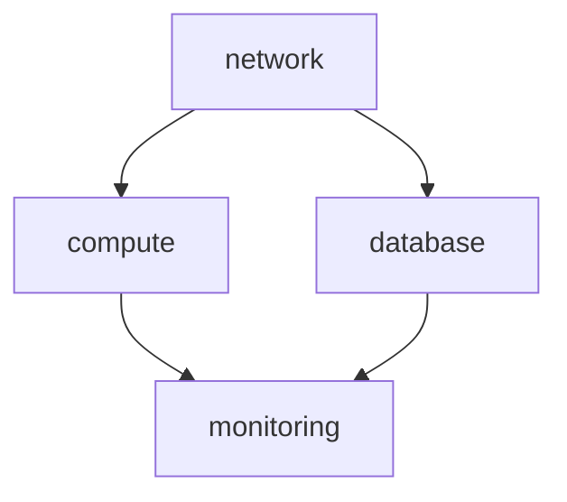

# 追加指示：クラウド/IaC/CI-CD設計テンプレート生成

## 概要

先の指示書で定義したIPA標準準拠のドキュメント体系に、**現代のクラウドネイティブ開発に必要なテンプレート**を追加してください。

これらはIPA共通フレーム2013では網羅されていない領域であり、現代のシステム開発では必須となる設計書です。

---

## 追加するテンプレート一覧

```
templates/
├── 03_基本設計/
│   ├── BD008_クラウドインフラ設計書_template.md    # 追加
│   ├── BD009_IaC設計書_template.md                 # 追加
│   └── BD010_CICD設計書_template.md                # 追加
```

---

## 設計原則：柔軟性を持たせた設計書

### 固定するもの（原則・概念）
- なぜそうするのか（Why）
- 選択肢と比較（What）
- 判断基準（When/Which）

### 固定しないもの（実装詳細）
- 具体的なツール設定
- パラメータ値
- 細かい構成

### 理由
- 技術トレンドは変化が早い
- プロジェクトごとに最適解が異なる
- 「何とでも書ける」からこそ合意形成が重要

---

## ワークフローでの進め方

各設計書を作成する際、Geminiは以下のフローで進めてください：

```
### 0. 最新ベストプラクティス調査（事前準備）
- Web検索で最新のベストプラクティスを調査
- AWS公式ドキュメント、HashiCorp公式、技術ブログ等を参照
- 「2024年」「2025年」などで新しい情報を優先

【検索例】
- "AWS IaC best practices 2025"
- "Terraform module design patterns"
- "GitHub Actions CI-CD best practices"
- "AWS Well-Architected Framework"

### 1. 概念の説明
- 各設計項目について、なぜ必要か、選択肢は何かをユーザーにわかりやすく説明する
- 調査した最新ベストプラクティスを踏まえて説明

### 2. ヒアリング
- プロジェクト規模、チーム構成、変更頻度などを確認
- 「御社の場合はどうですか？」と対話的に進める

### 3. 提案
- ヒアリング結果に基づき、推奨案を提示
- 比較表や図を使ってわかりやすく
- 「現在の主流は〜です」「AWSが推奨しているのは〜です」と根拠を示す

### 4. 承認
- ユーザーの承認を得てから設計書に記載
- 「この方針でよろしいですか？」と明示的に確認

### 5. 記録
- 決定事項、承認者、日付を設計書に記録
```

---

## BD008_クラウドインフラ設計書_template.md

**配置先**: `templates/03_基本設計/BD008_クラウドインフラ設計書_template.md`

```markdown
# クラウドインフラ設計書

## ドキュメント情報
| 項目 | 内容 |
|------|------|
| ドキュメントID | BD008 |
| バージョン | 1.0 |
| 作成日 | YYYY-MM-DD |
| 作成者 | {作成者名} |
| 承認者 | {承認者名} |
| 承認日 | YYYY-MM-DD |

## 変更履歴
| バージョン | 日付 | 変更者 | 変更内容 |
|-----------|------|--------|---------|
| 1.0 | YYYY-MM-DD | {名前} | 初版作成 |

---

## 1. 設計概要

### 1.1 本書の目的
本書はクラウドインフラストラクチャの設計方針と構成を定義する。

### 1.2 対象クラウドプラットフォーム
| 項目 | 内容 |
|------|------|
| プライマリ | AWS / GCP / Azure |
| リージョン | {リージョン} |
| マルチリージョン | 有 / 無 |

### 1.3 参考資料（調査時点の最新ベストプラクティス）
| 調査日 | 情報源 | 概要 |
|--------|--------|------|
| YYYY-MM-DD | {URL/ドキュメント名} | {要点} |

> ⚠️ 技術トレンドは変化するため、設計時に最新情報を再調査すること

---

## 2. アーキテクチャ概要

### 2.1 システム構成図

```
[ここにアーキテクチャ図を記載]
```

### 2.2 設計方針

> ⚠️ ユーザーと協議の上、決定してください

【協議ポイント】
- 可用性要件（99.9%? 99.99%?）
- スケーリング要件（垂直 / 水平 / 自動）
- コスト制約
- コンプライアンス要件

### 2.3 決定事項
| 項目 | 決定内容 | 理由 | 承認者 | 日付 |
|------|---------|------|--------|------|
| アーキテクチャパターン | {記入} | {記入} | {記入} | {記入} |

---

## 3. ネットワーク設計

### 3.1 概念
VPCはクラウド上の論理的なネットワーク境界を定義し、
セキュリティとネットワーク制御の基盤となる。

### 3.2 選択肢
| パターン | 特徴 | 向いてるケース |
|---------|------|---------------|
| シングルVPC | シンプル | 小規模、単一環境 |
| マルチVPC | 環境分離 | dev/stg/prod分離 |
| Transit Gateway | 複数VPC接続 | 大規模、複数システム |

### 3.3 VPC設計

| 項目 | 設計値 | 備考 |
|------|--------|------|
| VPC CIDR | {例: 10.0.0.0/16} | |
| Availability Zone | {例: 2 AZ} | |
| Public Subnet | {CIDR} | ALB, NAT Gateway |
| Private Subnet | {CIDR} | アプリケーション |
| Isolated Subnet | {CIDR} | データベース |

### 3.4 サブネット構成図

```
VPC (10.0.0.0/16)
├── AZ-a
│   ├── Public Subnet  (10.0.1.0/24)
│   ├── Private Subnet (10.0.10.0/24)
│   └── Isolated Subnet (10.0.20.0/24)
└── AZ-c
    ├── Public Subnet  (10.0.2.0/24)
    ├── Private Subnet (10.0.11.0/24)
    └── Isolated Subnet (10.0.21.0/24)
```

### 3.5 セキュリティグループ設計

| SG名 | 用途 | インバウンド | アウトバウンド |
|------|------|-------------|---------------|
| sg-alb | ALB用 | 443 from 0.0.0.0/0 | All to sg-app |
| sg-app | アプリ用 | 8080 from sg-alb | 5432 to sg-db |
| sg-db | DB用 | 5432 from sg-app | - |

---

## 4. コンピューティング設計

### 4.1 概念
ワークロードの特性に応じて最適なコンピューティングリソースを選択する。

### 4.2 選択肢
| サービス | 特徴 | 向いてるケース |
|---------|------|---------------|
| EC2 | フル制御 | 特殊要件、リフト&シフト |
| ECS (Fargate) | コンテナ、サーバーレス | マイクロサービス |
| EKS | Kubernetes | 大規模コンテナ、マルチクラウド |
| Lambda | イベント駆動 | 非同期処理、API |

### 4.3 本プロジェクトでの採用方針

> ⚠️ ユーザーと協議の上、決定してください

【協議ポイント】
- 既存スキルセット（コンテナ経験は？）
- ワークロードの特性（常時稼働 / イベント駆動）
- 運用体制（マネージド希望？）

### 4.4 決定事項
| 項目 | 決定内容 | 理由 | 承認者 | 日付 |
|------|---------|------|--------|------|
| コンピューティング | {記入} | {記入} | {記入} | {記入} |

### 4.5 スペック設計

| コンポーネント | サービス | スペック | 台数 | Auto Scaling |
|---------------|---------|---------|------|--------------|
| Webサーバー | {ECS/EC2/...} | {スペック} | {台数} | 有/無 |
| APIサーバー | {ECS/EC2/...} | {スペック} | {台数} | 有/無 |
| バッチ | {Lambda/ECS/...} | {スペック} | - | - |

---

## 5. データベース設計

### 5.1 選択肢
| サービス | 特徴 | 向いてるケース |
|---------|------|---------------|
| RDS | マネージドRDB | OLTP、トランザクション |
| Aurora | 高性能RDB | 大規模、高可用性 |
| DynamoDB | NoSQL | 高スループット、柔軟スキーマ |
| ElastiCache | インメモリ | キャッシュ、セッション |

### 5.2 RDS/Aurora設計

| 項目 | 設計値 |
|------|--------|
| エンジン | PostgreSQL / MySQL / ... |
| バージョン | {バージョン} |
| インスタンスクラス | {例: db.r6g.large} |
| Multi-AZ | 有 / 無 |
| リードレプリカ | {台数} |
| ストレージ | {GB} / 自動拡張 |
| バックアップ保持期間 | {日数} |
| 暗号化 | 有 / 無 |

---

## 6. ストレージ設計

### 6.1 S3設計

| バケット名 | 用途 | ストレージクラス | ライフサイクル | 暗号化 |
|-----------|------|----------------|---------------|--------|
| {バケット名} | 静的コンテンツ | Standard | - | SSE-S3 |
| {バケット名} | ログ | Standard-IA → Glacier | 90日でIA、1年でGlacier | SSE-S3 |
| {バケット名} | バックアップ | Glacier | - | SSE-KMS |

### 6.2 バージョニング・レプリケーション

| バケット | バージョニング | クロスリージョンレプリケーション |
|---------|---------------|-------------------------------|
| {バケット名} | 有効 | 有 / 無 |

---

## 7. セキュリティ設計

### 7.1 IAM設計

**原則**
- 最小権限の原則
- ロールベースアクセス制御
- MFA必須（人間ユーザー）

| ロール/ポリシー | 用途 | 権限概要 |
|----------------|------|---------|
| {ロール名} | {用途} | {権限} |

### 7.2 暗号化設計

| 対象 | 暗号化方式 | 鍵管理 |
|------|-----------|--------|
| EBS | AES-256 | KMS |
| S3 | SSE-S3 / SSE-KMS | KMS |
| RDS | AES-256 | KMS |
| 通信 | TLS 1.3 | ACM |

### 7.3 WAF/Shield設計

| 項目 | 設計値 |
|------|--------|
| WAF | 有効 / 無効 |
| マネージドルール | {ルール名} |
| Shield | Standard / Advanced |

---

## 8. 監視・ログ設計

### 8.1 CloudWatch設計

| メトリクス | 対象 | 閾値 | アラームアクション |
|-----------|------|------|-------------------|
| CPUUtilization | EC2/ECS | 80%以上 | SNS通知 |
| DatabaseConnections | RDS | {閾値} | SNS通知 |
| 5XXError | ALB | 1%以上 | SNS通知 |

### 8.2 ログ設計

| ログ種別 | 出力先 | 保持期間 |
|---------|--------|---------|
| アプリケーションログ | CloudWatch Logs | {日数} |
| ALBアクセスログ | S3 | {日数} |
| CloudTrail | S3 | {日数} |
| VPCフローログ | CloudWatch Logs | {日数} |

---

## 9. コスト設計

### 9.1 概算コスト

| サービス | 月額概算 | 備考 |
|---------|---------|------|
| EC2/ECS | ${金額} | |
| RDS | ${金額} | |
| S3 | ${金額} | |
| データ転送 | ${金額} | |
| **合計** | **${金額}** | |

### 9.2 コスト最適化方針

- [ ] リザーブドインスタンス / Savings Plans 検討
- [ ] スポットインスタンス活用（適切なワークロード）
- [ ] 不要リソースの自動停止（開発環境）

---

## 10. 災害対策（DR）設計

### 10.1 DR方針

| 項目 | 設計値 |
|------|--------|
| RTO（目標復旧時間） | {時間} |
| RPO（目標復旧地点） | {時間} |
| DR戦略 | Backup & Restore / Pilot Light / Warm Standby / Multi-Site |

### 10.2 バックアップ設計

| 対象 | 方式 | 頻度 | 保持期間 | リージョン |
|------|------|------|---------|-----------|
| RDS | 自動スナップショット | 日次 | {日数} | 同一/別リージョン |
| S3 | クロスリージョンレプリケーション | リアルタイム | - | {リージョン} |
| EBS | スナップショット | 日次 | {日数} | 同一リージョン |

---

## 11. 承認

| 役割 | 氏名 | 署名 | 日付 |
|------|------|------|------|
| インフラリード | | | |
| セキュリティ担当 | | | |
| PM | | | |
```

---

## BD009_IaC設計書_template.md

**配置先**: `templates/03_基本設計/BD009_IaC設計書_template.md`

```markdown
# IaC設計書

## ドキュメント情報
| 項目 | 内容 |
|------|------|
| ドキュメントID | BD009 |
| バージョン | 1.0 |
| 作成日 | YYYY-MM-DD |
| 作成者 | {作成者名} |
| 承認者 | {承認者名} |
| 承認日 | YYYY-MM-DD |

## 変更履歴
| バージョン | 日付 | 変更者 | 変更内容 |
|-----------|------|--------|---------|
| 1.0 | YYYY-MM-DD | {名前} | 初版作成 |

---

## 1. 設計原則

### 1.1 本書の目的
Infrastructure as Code（IaC）の設計方針を定義し、
インフラの再現性、一貫性、保守性を確保する。

### 1.2 IaCの基本原則

| 原則 | 説明 |
|------|------|
| 宣言的記述 | 「あるべき状態」を定義し、ツールが収束させる |
| 冪等性 | 何度実行しても同じ結果になる |
| バージョン管理 | インフラもコードとしてGitで管理 |
| コードレビュー | インフラ変更もPR/MRでレビュー |
| 自動化 | 手作業を排除し、CI/CDで適用 |

### 1.3 参考資料（調査時点の最新ベストプラクティス）
| 調査日 | 情報源 | 概要 |
|--------|--------|------|
| YYYY-MM-DD | {URL/ドキュメント名} | {要点} |

> ⚠️ 技術トレンドは変化するため、設計時に最新情報を再調査すること

---

## 2. ツール選定

### 2.1 概念
IaCツールにはそれぞれ特徴があり、プロジェクト要件に応じて選択する。

### 2.2 選択肢
| ツール | 特徴 | 向いてるケース |
|--------|------|---------------|
| Terraform | マルチクラウド、宣言的、大きなエコシステム | マルチクラウド、汎用性重視 |
| CloudFormation | AWS純正、サポート手厚い | AWSのみ、サポート重視 |
| Pulumi | 汎用言語（Python等）で記述 | 開発者主導、複雑なロジック |
| CDK | プログラミング言語でCFn生成 | 開発者主導、AWS中心 |

### 2.3 本プロジェクトでの採用方針

> ⚠️ ユーザーと協議の上、決定してください

【協議ポイント】
- マルチクラウドの可能性は？
- チームのスキルセットは？
- 既存資産はあるか？

### 2.4 決定事項
| 項目 | 決定内容 | 理由 | 承認者 | 日付 |
|------|---------|------|--------|------|
| IaCツール | {Terraform/CFn/...} | {理由} | {承認者} | {日付} |
| バージョン | {バージョン} | | | |

---

## 3. ディレクトリ構成

### 3.1 概念
ディレクトリ構成は可読性・保守性に直結する。
環境分離とモジュール再利用のバランスを考慮する。

### 3.2 選択肢

**パターンA: 環境別ディレクトリ**
```
infrastructure/
├── environments/
│   ├── dev/
│   │   ├── main.tf
│   │   └── terraform.tfvars
│   ├── stg/
│   └── prod/
└── modules/
    ├── network/
    ├── compute/
    └── database/
```

**パターンB: Workspaceベース**
```
infrastructure/
├── main.tf
├── variables.tf
├── terraform.tfvars.dev
├── terraform.tfvars.stg
└── terraform.tfvars.prod
```

### 3.3 本プロジェクトでの採用方針

> ⚠️ ユーザーと協議の上、決定してください

【協議ポイント】
- 環境間の差分はどの程度か？
- チームの習熟度は？

【推奨】
- 環境差分が大きい → パターンA
- 環境差分が小さい → パターンB

### 3.4 決定事項
| 項目 | 決定内容 | 承認者 | 日付 |
|------|---------|--------|------|
| ディレクトリ構成 | {パターンA/B/カスタム} | {承認者} | {日付} |

### 3.5 採用するディレクトリ構成

```
{ここに決定した構成を記載}
```

---

## 4. モジュール設計

### 4.1 概念
モジュール化により再利用性と保守性を向上させる。
ただし、過度な抽象化は複雑性を増す。

### 4.2 モジュール化の原則

| 原則 | 説明 |
|------|------|
| 単一責任 | 1モジュール = 1責務 |
| 明確なインターフェース | input/outputを明確に定義 |
| 適切な粒度 | 細かすぎず、大きすぎず |
| ドキュメント | README.mdで使い方を明記 |

### 4.3 モジュール一覧

| モジュール名 | 責務 | 入力（主要） | 出力（主要） |
|-------------|------|-------------|-------------|
| network | VPC, Subnet, SG | cidr, azs | vpc_id, subnet_ids |
| compute | ECS/EC2 | instance_type, ami | instance_ids |
| database | RDS | engine, instance_class | endpoint, port |
| monitoring | CloudWatch | alarm_configs | alarm_arns |

### 4.4 モジュール依存関係図



---

## 5. スタック分割設計

### 5.1 概念
スタックはライフサイクル（変更頻度）で分割することで、
影響範囲を最小化し、安全なデプロイを実現する。

### 5.2 選択肢
| パターン | 特徴 | 向いてるケース |
|---------|------|---------------|
| 全部1スタック | シンプル | 小規模、PoC |
| ライフサイクル分割 | 影響範囲限定 | 中〜大規模 |
| マイクロスタック | 完全分離 | 大規模、複数チーム |

### 5.3 ライフサイクル分割の例

```
[ほぼ変わらない]     network-stack（VPC, Subnet）
        ↓
[たまに変わる]       security-stack（IAM, SG）
        ↓
[よく変わる]         app-stack（ECS, Lambda）
        ↓
[独立]              monitoring-stack（CloudWatch, Alarms）
```

### 5.4 本プロジェクトでの採用方針

> ⚠️ ユーザーと協議の上、決定してください

【協議ポイント】
- プロジェクト規模は？
- チーム構成は？（単一 or 複数）
- 変更頻度の見込みは？

### 5.5 決定事項
| 項目 | 決定内容 | 承認者 | 日付 |
|------|---------|--------|------|
| スタック分割方針 | {記入} | {記入} | {記入} |

### 5.6 スタック一覧

| スタック名 | 責務 | 変更頻度 | 依存先スタック |
|-----------|------|---------|---------------|
| {スタック名} | {責務} | 低/中/高 | {依存先} |

---

## 6. ネスト構造設計

### 6.1 概念
ネスト（入れ子）構造により、可読性とメンテナンス性を向上させる。

**メリット**
- インデックス的に全体把握しやすい
- 関連リソースをグループ化
- 大量リソース（アラーム定義等）の管理が容易

**デメリット・注意点**
- 深すぎると依存関係が追えなくなる
- デバッグが困難になる

### 6.2 推奨ネスト階層

| 階層 | 推奨 | 注意 |
|------|------|------|
| 1〜2階層 | ✅ 推奨 | |
| 3階層 | ⚠️ 許容 | 依存関係を明確に |
| 4階層以上 | ❌ 非推奨 | 分割を検討 |

---

## 7. 状態管理設計（Terraform）

### 7.1 概念
Terraformはtfstateファイルで「現在の状態」を管理する。
チーム開発では共有ストレージとロック機構が必須。

### 7.2 状態管理方式

| 方式 | 特徴 | 向いてるケース |
|------|------|---------------|
| ローカル | シンプル | 個人開発、学習 |
| S3 + DynamoDB | AWS標準、ロック対応 | AWSチーム開発 |
| Terraform Cloud | フルマネージド | 大規模、エンタープライズ |

### 7.3 本プロジェクトでの採用方針

| 項目 | 設計値 |
|------|--------|
| バックエンド | S3 / Terraform Cloud / ... |
| S3バケット名 | {バケット名} |
| DynamoDBテーブル名 | {テーブル名} |
| 暗号化 | 有効 |
| バージョニング | 有効 |

### 7.4 バックエンド設定例

```hcl
terraform {
  backend "s3" {
    bucket         = "{バケット名}"
    key            = "{環境}/terraform.tfstate"
    region         = "ap-northeast-1"
    encrypt        = true
    dynamodb_table = "{テーブル名}"
  }
}
```

---

## 8. 命名規則

### 8.1 リソース命名規則

**パターン**
```
{プロジェクト}-{環境}-{リソース種別}-{用途}
```

**例**
| リソース | 命名例 |
|---------|--------|
| VPC | myapp-prod-vpc |
| Subnet | myapp-prod-subnet-public-a |
| Security Group | myapp-prod-sg-web |
| EC2 | myapp-prod-ec2-api-01 |
| RDS | myapp-prod-rds-main |
| S3 | myapp-prod-s3-logs |

### 8.2 Terraform命名規則

| 対象 | 規則 | 例 |
|------|------|-----|
| リソース名 | snake_case | `aws_instance.web_server` |
| 変数名 | snake_case | `var.instance_type` |
| モジュール名 | kebab-case | `module "network"` |
| ファイル名 | snake_case | `main.tf`, `variables.tf` |

---

## 9. タグ戦略

### 9.1 必須タグ

| タグキー | 用途 | 例 |
|---------|------|-----|
| Project | コスト配分、リソース識別 | myapp |
| Environment | 環境識別 | prod / stg / dev |
| Owner | 責任者・チーム | team-a |
| ManagedBy | 管理方法 | terraform |
| CostCenter | コストセンター | cc-12345 |

### 9.2 オプションタグ

| タグキー | 用途 | 例 |
|---------|------|-----|
| Component | コンポーネント識別 | api / web / batch |
| Version | バージョン | 1.0.0 |
| Backup | バックアップ対象 | daily / weekly |
| AutoStop | 自動停止対象（開発環境） | true / false |

### 9.3 タグ付与の自動化

```hcl
locals {
  common_tags = {
    Project     = var.project
    Environment = var.environment
    Owner       = var.owner
    ManagedBy   = "terraform"
  }
}

resource "aws_instance" "example" {
  # ...
  tags = merge(local.common_tags, {
    Name      = "${var.project}-${var.environment}-ec2-web"
    Component = "web"
  })
}
```

---

## 10. シークレット管理

### 10.1 原則
- tfファイルにシークレットをハードコードしない
- tfstateにシークレットが含まれる場合は暗号化必須
- 最小権限の原則

### 10.2 選択肢

| 方式 | 特徴 | 向いてるケース |
|------|------|---------------|
| AWS Secrets Manager | ローテーション対応、高機能 | 本番、コンプライアンス重視 |
| AWS Parameter Store | シンプル、安価 | 開発、コスト重視 |
| HashiCorp Vault | マルチクラウド、高機能 | 大規模、マルチクラウド |
| 環境変数 | シンプル | CI/CDパイプライン内 |

### 10.3 本プロジェクトでの採用方針

| 用途 | 方式 |
|------|------|
| DBパスワード | {Secrets Manager / Parameter Store} |
| APIキー | {Secrets Manager / Parameter Store} |
| CI/CD用 | {環境変数 / Secrets Manager} |

---

## 11. 運用ルール

### 11.1 変更管理フロー

```
1. featureブランチ作成
2. コード変更
3. terraform plan で差分確認
4. Pull Request作成
5. コードレビュー
6. plan結果をPRにコメント
7. 承認
8. mainマージ
9. CI/CDで自動apply（または手動）
```

### 11.2 レビュー観点

| 観点 | チェック項目 |
|------|-------------|
| セキュリティ | SG, IAMの過剰権限がないか |
| コスト | 不要なリソース、過剰スペックがないか |
| 命名規則 | 規則に従っているか |
| タグ | 必須タグが付与されているか |
| 依存関係 | 循環依存がないか |
| plan結果 | 意図しない変更がないか |

### 11.3 緊急時対応

| 状況 | 対応 |
|------|------|
| 誤ったapply | tfstateバックアップから復元、または手動修正 |
| tfstate破損 | バージョニングから復元 |
| ロック解除できない | DynamoDB手動削除（最終手段） |

---

## 12. 承認

| 役割 | 氏名 | 署名 | 日付 |
|------|------|------|------|
| インフラリード | | | |
| セキュリティ担当 | | | |
| PM | | | |
```

---

## BD010_CICD設計書_template.md

**配置先**: `templates/03_基本設計/BD010_CICD設計書_template.md`

```markdown
# CI-CD設計書

## ドキュメント情報
| 項目 | 内容 |
|------|------|
| ドキュメントID | BD010 |
| バージョン | 1.0 |
| 作成日 | YYYY-MM-DD |
| 作成者 | {作成者名} |
| 承認者 | {承認者名} |
| 承認日 | YYYY-MM-DD |

## 変更履歴
| バージョン | 日付 | 変更者 | 変更内容 |
|-----------|------|--------|---------|
| 1.0 | YYYY-MM-DD | {名前} | 初版作成 |

---

## 1. 設計原則

### 1.1 本書の目的
CI/CD（継続的インテグレーション/継続的デリバリー）の設計方針を定義し、
高速かつ安全なソフトウェアデリバリーを実現する。

### 1.2 CI/CDの基本原則

| 原則 | 説明 |
|------|------|
| 自動化 | ビルド、テスト、デプロイを自動化 |
| 高速フィードバック | 問題を早期に検出 |
| 常にリリース可能 | mainブランチは常にデプロイ可能な状態 |
| 段階的デプロイ | dev → stg → prod と段階的に |
| ロールバック可能 | いつでも前バージョンに戻せる |

### 1.3 参考資料（調査時点の最新ベストプラクティス）
| 調査日 | 情報源 | 概要 |
|--------|--------|------|
| YYYY-MM-DD | {URL/ドキュメント名} | {要点} |

> ⚠️ 技術トレンドは変化するため、設計時に最新情報を再調査すること

---

## 2. ツール選定

### 2.1 選択肢
| ツール | 特徴 | 向いてるケース |
|--------|------|---------------|
| GitHub Actions | GitHub統合、柔軟 | GitHub利用チーム |
| GitLab CI | GitLab統合、オールインワン | GitLab利用チーム |
| AWS CodePipeline | AWS統合、マネージド | AWS中心、サポート重視 |
| Jenkins | 高カスタマイズ性 | 複雑な要件、既存資産 |
| CircleCI | 高速、使いやすい | スタートアップ、SaaS |

### 2.2 本プロジェクトでの採用方針

> ⚠️ ユーザーと協議の上、決定してください

【協議ポイント】
- ソースコード管理はどこ？（GitHub / GitLab / CodeCommit）
- AWS依存度は？
- チームの習熟度は？

### 2.3 決定事項
| 項目 | 決定内容 | 理由 | 承認者 | 日付 |
|------|---------|------|--------|------|
| CI/CDツール | {GitHub Actions / CodePipeline / ...} | {理由} | {承認者} | {日付} |

---

## 3. ブランチ戦略

### 3.1 概念
ブランチ戦略はチームの開発フローとリリースサイクルを規定する。

### 3.2 選択肢
| 戦略 | 特徴 | 向いてるケース |
|------|------|---------------|
| GitHub Flow | シンプル、main + feature | 小〜中規模、頻繁リリース |
| GitFlow | develop/release/hotfix分離 | 大規模、計画的リリース |
| Trunk Based | 短命ブランチ、常にmain | 高成熟チーム、CD前提 |

### 3.3 本プロジェクトでの採用方針

> ⚠️ ユーザーと協議の上、決定してください

【協議ポイント】
- リリース頻度は？（毎日 / 週次 / 月次）
- チーム規模は？
- レビュープロセスは？

### 3.4 決定事項
| 項目 | 決定内容 | 承認者 | 日付 |
|------|---------|--------|------|
| ブランチ戦略 | {GitHub Flow / GitFlow / ...} | {承認者} | {日付} |

### 3.5 ブランチと環境の対応

| ブランチ | 環境 | デプロイ方式 |
|---------|------|-------------|
| feature/* | - | - |
| develop（GitFlowの場合） | dev | 自動 |
| main | stg | 自動 |
| main (タグ) | prod | 手動承認後 |

---

## 4. パイプライン設計

### 4.1 パイプライン構成図

```
┌─────────┐   ┌─────────┐   ┌─────────┐   ┌─────────┐   ┌─────────┐
│ Source  │ → │  Build  │ → │  Test   │ → │  Scan   │ → │ Deploy  │
└─────────┘   └─────────┘   └─────────┘   └─────────┘   └─────────┘
     │             │             │             │             │
  コード取得    ビルド       テスト実行    セキュリティ    デプロイ
  トリガー    アーティファクト  単体/結合     スキャン      環境適用
                  生成                      SAST/DAST
```

### 4.2 ステージ定義

| ステージ | 責務 | 成功条件 | 失敗時アクション |
|---------|------|---------|-----------------|
| Source | コード取得、トリガー | チェックアウト成功 | 即停止 |
| Build | ビルド、アーティファクト生成 | ビルド成功 | 即停止、通知 |
| Test | 単体/結合テスト | 全テスト合格 | 即停止、通知 |
| Scan | セキュリティスキャン | Critical/High検出なし | 重大度で判断 |
| Deploy (dev) | dev環境デプロイ | ヘルスチェック合格 | ロールバック |
| Deploy (stg) | stg環境デプロイ | ヘルスチェック合格 | ロールバック |
| Approval | 本番デプロイ承認 | 承認取得 | 待機 |
| Deploy (prod) | prod環境デプロイ | ヘルスチェック合格 | ロールバック |

### 4.3 環境別パイプライン

**dev環境**
```
Push to feature/* → Build → Test → Scan → Deploy to dev
```

**stg環境**
```
Merge to main → Build → Test → Scan → Deploy to stg
```

**prod環境**
```
Tag作成 → Build → Test → Scan → [承認] → Deploy to prod → Verify
```

---

## 5. デプロイ戦略

### 5.1 概念
デプロイ戦略はリリース時のリスクとダウンタイムを制御する。

### 5.2 選択肢
| 戦略 | 特徴 | リスク | ダウンタイム | 向いてるケース |
|------|------|--------|-------------|---------------|
| In-Place | 直接上書き | 高 | あり | 開発環境 |
| Blue/Green | 2環境切替 | 低 | なし | 本番、即時切り戻し |
| Canary | 段階的ロールアウト | 低 | なし | 大規模、影響検証 |
| Rolling | 順次入れ替え | 中 | なし | コンテナ、K8s |

### 5.3 本プロジェクトでの採用方針

> ⚠️ ユーザーと協議の上、決定してください

【協議ポイント】
- ダウンタイム許容度は？
- ロールバック速度の要件は？
- インフラコスト（Blue/Greenは2倍必要）

### 5.4 決定事項
| 環境 | デプロイ戦略 | 承認者 | 日付 |
|------|-------------|--------|------|
| dev | {In-Place / ...} | | |
| stg | {Blue/Green / ...} | | |
| prod | {Blue/Green / Canary / ...} | | |

### 5.5 Blue/Green設計（採用時）

```
                    ┌─────────────┐
                    │     ALB     │
                    └──────┬──────┘
                           │
           ┌───────────────┴───────────────┐
           ▼                               ▼
    ┌─────────────┐                 ┌─────────────┐
    │ Blue (現行) │                 │ Green (新)  │
    │   v1.0.0    │                 │   v1.1.0    │
    └─────────────┘                 └─────────────┘

1. Green環境にデプロイ
2. Greenでヘルスチェック
3. ALBのターゲットをGreenに切替
4. 問題あればBlueに即時切り戻し
5. 安定後、Blue環境を更新
```

---

## 6. 承認フロー

### 6.1 概念
本番デプロイには適切な承認プロセスが必要。
緊急時のバイパス手順も定義しておく。

### 6.2 承認設計

| 環境 | 承認要否 | 承認者 | 必要承認数 | タイムアウト |
|------|---------|--------|-----------|-------------|
| dev | 不要 | - | - | - |
| stg | 不要 | - | - | - |
| prod | 必要 | {役割} | {人数} | {時間} |

### 6.3 本番デプロイ承認ルール

| 項目 | 設計値 |
|------|--------|
| 承認者 | テックリード / PM / SRE |
| 必要承認数 | 1名以上 |
| タイムアウト | 24時間 |
| 承認前チェック | テスト全合格、スキャン問題なし |

### 6.4 緊急時（Hotfix）手順

| 項目 | 通常 | 緊急時 |
|------|------|--------|
| ブランチ | main経由 | hotfix/* → main |
| 承認者 | 通常承認者 | セキュリティ責任者単独可 |
| テスト | フルテスト | 影響範囲のみ |
| 事後対応 | - | 24時間以内にレビュー |

---

## 7. ロールバック設計

### 7.1 原則
- 「戻せる」前提で設計
- 前バージョンのアーティファクトを保持
- ロールバック判断基準を明確に

### 7.2 ロールバック方式

| 方式 | 特徴 | 復旧時間 |
|------|------|---------|
| Blue/Green切り戻し | ALBのターゲット切替 | 数秒〜数分 |
| 前バージョン再デプロイ | アーティファクトから再デプロイ | 数分〜数十分 |
| Gitリバート | コードを戻して再ビルド | 数十分 |

### 7.3 ロールバック判断基準

| 条件 | 閾値 | アクション |
|------|------|-----------|
| エラーレート | {X}%以上 | 自動ロールバック検討 |
| レイテンシ | {X}ms以上 | 調査、手動ロールバック検討 |
| ヘルスチェック失敗 | 連続{X}回 | 自動ロールバック |

### 7.4 ロールバック手順

1. 異常検知（監視アラート or 手動）
2. ロールバック判断（上記基準に基づく）
3. ロールバック実行
   - Blue/Green: ALBターゲット切替
   - ECS: 前タスク定義に戻す
4. ロールバック完了確認
5. 原因調査、修正

### 7.5 DB変更時の注意

| 方式 | 説明 | 推奨 |
|------|------|------|
| Forward-only | 追加のみ、削除は後で | ✅ 推奨 |
| Backward compatible | 新旧両対応 | ✅ 推奨 |
| Breaking change | 旧バージョン非互換 | ⚠️ 要注意 |

> ⚠️ DBスキーマ変更を含むデプロイは、ロールバックが困難になる場合がある。
> Forward-only migrationを推奨。

---

## 8. セキュリティスキャン

### 8.1 スキャン種別と配置

```
[Build] → [SAST] → [依存関係] → [Image Scan] → [Deploy] → [DAST]
```

| 種別 | タイミング | 対象 | ツール例 |
|------|-----------|------|---------|
| SAST | ビルド後 | ソースコード | SonarQube, CodeGuru Reviewer |
| 依存関係スキャン | ビルド後 | ライブラリ | Dependabot, Snyk |
| コンテナスキャン | Push前 | Dockerイメージ | Trivy, ECR Scan |
| DAST | デプロイ後 | 稼働アプリ | OWASP ZAP |

### 8.2 脆弱性対応ポリシー

| 重大度 | 対応 | 期限 |
|--------|------|------|
| Critical | 即時ブロック、修正必須 | 即時 |
| High | ブロック、修正必須 | 24時間以内 |
| Medium | 警告、修正推奨 | 1週間以内 |
| Low | 情報、対応任意 | 次スプリント |

---

## 9. シークレット管理

### 9.1 原則
- パイプライン定義にシークレットをハードコードしない
- 環境変数またはシークレットマネージャー経由
- 最小権限の原則

### 9.2 シークレット管理方式

| シークレット種別 | 管理方式 | 備考 |
|-----------------|---------|------|
| AWS認証情報 | OIDC (GitHub Actions) | 長期キー不要 |
| DBパスワード | Secrets Manager | ローテーション対応 |
| APIキー | Secrets Manager / Parameter Store | |
| Dockerレジストリ認証 | GitHub Secrets / CodeBuild環境変数 | |

### 9.3 GitHub Actions + AWS OIDC設定例

```yaml
permissions:
  id-token: write
  contents: read

steps:
  - uses: aws-actions/configure-aws-credentials@v4
    with:
      role-to-assume: arn:aws:iam::123456789012:role/GitHubActionsRole
      aws-region: ap-northeast-1
```

---

## 10. 通知設計

### 10.1 通知タイミング

| イベント | 通知先 | 重要度 |
|---------|--------|--------|
| ビルド失敗 | 開発者 | 高 |
| テスト失敗 | 開発者 | 高 |
| セキュリティスキャン検出 | 開発者 + セキュリティ | 高 |
| デプロイ成功（dev） | 開発者 | 低 |
| デプロイ成功（prod） | チーム全体 | 中 |
| デプロイ失敗 | チーム全体 | 高 |
| 承認待ち | 承認者 | 高 |
| ロールバック実行 | チーム全体 | 高 |

### 10.2 通知先設定

| 環境 | 通知先 |
|------|--------|
| dev | #dev-notification (Slack) |
| stg | #stg-notification (Slack) |
| prod | #prod-notification (Slack) + メール |

---

## 11. 監査ログ

### 11.1 記録項目

| 項目 | 内容 |
|------|------|
| デプロイ日時 | YYYY-MM-DD HH:MM:SS |
| デプロイ者 | GitHub username / 自動 |
| 承認者 | 承認者名（prod） |
| 環境 | dev / stg / prod |
| アーティファクト | コミットハッシュ、イメージタグ |
| 結果 | 成功 / 失敗 / ロールバック |

### 11.2 ログ保存

| 項目 | 設計値 |
|------|--------|
| 保存先 | S3 (バージョニング有効) |
| 保持期間 | {年数}（コンプライアンス要件に依存） |
| 暗号化 | SSE-S3 / SSE-KMS |
| アクセス制御 | 監査担当のみ参照可 |

---

## 12. パイプライン定義例

### 12.1 GitHub Actions例

```yaml
name: CI/CD Pipeline

on:
  push:
    branches: [main, develop]
  pull_request:
    branches: [main]

env:
  AWS_REGION: ap-northeast-1
  ECR_REPOSITORY: myapp

jobs:
  build:
    runs-on: ubuntu-latest
    steps:
      - uses: actions/checkout@v4
      
      - name: Build
        run: |
          # ビルドコマンド
          
      - name: Test
        run: |
          # テストコマンド
          
      - name: SAST Scan
        uses: SonarSource/sonarcloud-github-action@master
        
      - name: Build & Push Docker Image
        run: |
          # ECRへプッシュ

  deploy-dev:
    needs: build
    if: github.ref == 'refs/heads/develop'
    runs-on: ubuntu-latest
    environment: dev
    steps:
      - name: Deploy to dev
        run: |
          # devデプロイ

  deploy-stg:
    needs: build
    if: github.ref == 'refs/heads/main'
    runs-on: ubuntu-latest
    environment: stg
    steps:
      - name: Deploy to stg
        run: |
          # stgデプロイ

  deploy-prod:
    needs: deploy-stg
    if: github.ref == 'refs/heads/main'
    runs-on: ubuntu-latest
    environment: 
      name: prod
      # 承認が必要
    steps:
      - name: Deploy to prod
        run: |
          # prodデプロイ
```

---

## 13. 承認

| 役割 | 氏名 | 署名 | 日付 |
|------|------|------|------|
| 開発リード | | | |
| SRE / インフラ | | | |
| PM | | | |
```

---

## ワークフローへの組み込み

基本設計ワークフロー（`.agent/workflows/03-basic-design.md`）に以下を追加してください：

```markdown
## クラウド/IaC/CI-CD設計

モダンなシステム開発では、以下の設計も必須です。

### 追加で生成する成果物

- BD008_クラウドインフラ設計書.md
- BD009_IaC設計書.md
- BD010_CICD設計書.md

### 進め方

1. **最新ベストプラクティス調査**
   - Web検索で最新情報を収集
   - AWS公式、HashiCorp公式等を参照

2. **ユーザーとの対話**
   - 各設計項目について概念を説明
   - プロジェクト要件をヒアリング
   - 選択肢を提示し、推奨案を提案

3. **承認と記録**
   - ユーザーの承認を得てから記載
   - 決定事項、承認者、日付を記録

### テンプレート参照

- `/templates/03_基本設計/BD008_クラウドインフラ設計書_template.md`
- `/templates/03_基本設計/BD009_IaC設計書_template.md`
- `/templates/03_基本設計/BD010_CICD設計書_template.md`
```

---

## 生成指示

1. 上記3つのテンプレートファイルを `templates/03_基本設計/` に生成してください
2. 各テンプレートは「協議ポイント」「決定事項」セクションを含め、柔軟性を持たせてください
3. 技術詳細は固定せず、原則・概念を中心に記述してください
4. 「最新ベストプラクティス調査」の指示を含めてください

---

**この追加指示に基づいて、クラウド/IaC/CI-CDテンプレートを生成してください。**