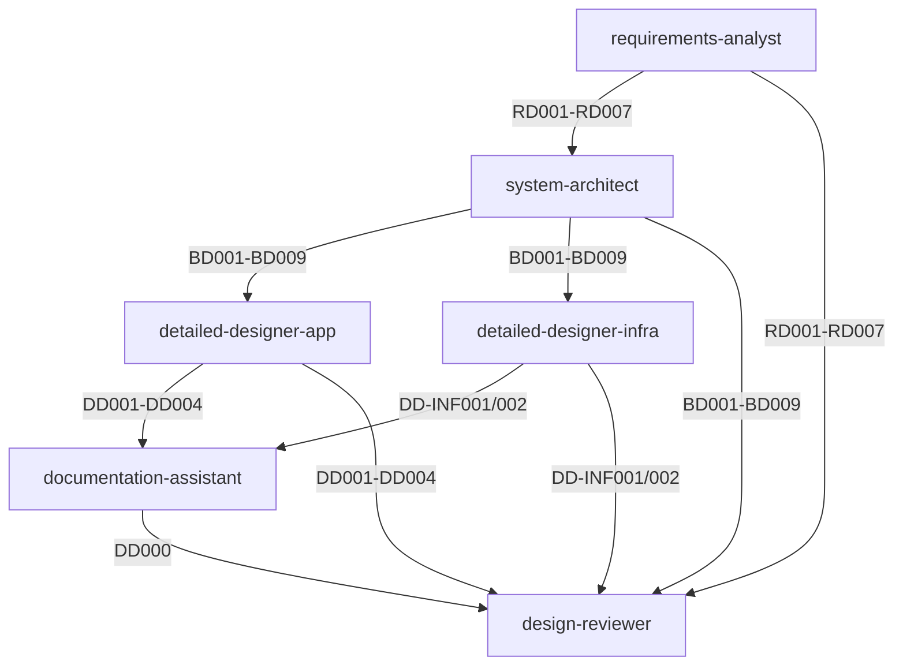

# エージェント・ワークフロー・テンプレート・ナレッジ マトリクス

## 概要

このドキュメントは、**6種類のエージェント**と、それぞれが使用する**ワークフロー・テンプレート・ナレッジベース**の完全なマッピングを示します。

---

## 📊 全体マトリクス

| エージェント | ワークフロー | テンプレート | ナレッジベース | モデル |
|------------|------------|-------------|--------------|--------|
| requirements-analyst | 02-requirements.md | RD001-RD007 | questioning-guidance | Sonnet |
| system-architect | 03-basic-design.md | BD001-BD009 | architecture, iac, team-separation | Sonnet |
| detailed-designer-app | 04-detailed-design-app.md | DD001-DD004 | application, database, team-separation | Sonnet |
| detailed-designer-infra | 05-detailed-design-infra.md | DD-INF001/002 | iac, team-separation | Sonnet |
| documentation-assistant | documentation-coordination.md | DD000 | ipa-detailed-design-scaling | Haiku |
| design-reviewer | design-review.md | - | すべて | Sonnet |

---

## 1️⃣ requirements-analyst（要件定義アナリスト）

### 基本情報

```json
{
  "name": "要件定義アナリスト",
  "role": "requirements_definition",
  "model": "sonnet"
}
```

### ワークフロー

| ファイル | 内容 |
|---------|------|
| `workflows/02-requirements.md` | 要件定義フェーズの作業手順 |

### テンプレート（7ドキュメント）

| ID | ファイル名 | 内容 |
|----|----------|------|
| RD001 | `templates/01_要件定義/RD001_システム化要求定義書_template.md` | 課題、目的、スコープ |
| RD002 | `templates/01_要件定義/RD002_業務要件定義書_template.md` | 業務フロー、業務ルール |
| RD003 | `templates/01_要件定義/RD003_機能要件定義書_template.md` | 機能一覧、画面遷移 |
| RD004 | `templates/01_要件定義/RD004_非機能要件定義書_template.md` | 性能、可用性、セキュリティ |
| RD005 | `templates/01_要件定義/RD005_ユースケース記述書_template.md` | アクター、フロー、例外 |
| RD006 | `templates/01_要件定義/RD006_画面要件定義書_template.md` | 画面レイアウト、項目定義 |
| RD007 | `templates/01_要件定義/RD007_帳票要件定義書_template.md` | 帳票レイアウト、出力条件 |

### ナレッジベース

| ファイル/ディレクトリ | 用途 |
|-------------------|------|
| `knowledge/workflows/questioning-guidance.md` | 質問生成ガイドライン（一問一答、5-10個に絞る） |
| `knowledge/ui-ux/` | 画面要件定義時の参照 |

### 成果物出力先

```
templates/01_要件定義/実成果物/
├── RD001_システム化要求定義書.md
├── RD002_業務要件定義書.md
├── RD003_機能要件定義書.md
├── RD004_非機能要件定義書.md
├── RD005_ユースケース記述書.md
├── RD006_画面要件定義書.md
└── RD007_帳票要件定義書.md
```

### 次フェーズ

→ `system-architect`（基本設計）

---

## 2️⃣ system-architect（システムアーキテクト）

### 基本情報

```json
{
  "name": "システムアーキテクト（基本設計）",
  "role": "basic_design",
  "model": "sonnet",
  "requires_input_from": ["requirements-analyst"]
}
```

### ワークフロー

| ファイル | 内容 |
|---------|------|
| `workflows/03-basic-design.md` | 基本設計フェーズの作業手順（⚠️ チーム分離確認を含む） |

### テンプレート（9ドキュメント）

| ID | ファイル名 | 内容 |
|----|----------|------|
| BD001 | `templates/02_基本設計/BD001_システム方式設計書_template.md` | システム全体構成、技術スタック |
| BD002 | `templates/02_基本設計/BD002_アプリケーション方式設計書_template.md` | アーキテクチャ、レイヤー構成 |
| BD003 | `templates/02_基本設計/BD003_データベース方式設計書_template.md` | DB論理設計、ER図 |
| BD004 | `templates/02_基本設計/BD004_ネットワーク構成設計書_template.md` | VPC、サブネット |
| BD005 | `templates/02_基本設計/BD005_セキュリティ設計書_template.md` | 認証、認可、暗号化 |
| BD006 | `templates/02_基本設計/BD006_運用設計書_template.md` | 監視、バックアップ |
| BD007 | `templates/02_基本設計/BD007_移行設計書_template.md` | データ移行計画 |
| BD008 | `templates/02_基本設計/BD008_テスト方針書_template.md` | テスト戦略、品質基準 |
| BD009 | `templates/02_基本設計/BD009_IaC設計書_template.md` | スタック分割方針、State管理 ⭐ |

### ナレッジベース

| ファイル/ディレクトリ | 用途 |
|-------------------|------|
| `knowledge/workflows/questioning-guidance.md` | 質問生成ガイドライン |
| `knowledge/documentation/team-separation-app-infra.md` | チーム分離時のディレクトリ構造、責任分界 ⭐ |
| `knowledge/architecture/` | マイクロサービス、イベント駆動、レイヤードアーキテクチャ |
| `knowledge/iac/` | Terraform/CloudFormationベストプラクティス |

### 成果物出力先

#### チーム分離がある場合

```
templates/02_基本設計/実成果物/
├── 00_アプリアーキテクチャ/    # アプリチーム担当
│   ├── BD001_システム方式設計書.md
│   ├── BD002_アプリケーション方式設計書.md
│   └── BD003_データベース方式設計書.md
│
└── 01_インフラアーキテクチャ/  # インフラチーム担当
    ├── BD004_ネットワーク構成設計書.md
    ├── BD005_セキュリティ設計書.md
    └── BD009_IaC設計書.md
```

#### チーム分離がない場合

```
templates/02_基本設計/実成果物/
├── BD001_システム方式設計書.md
├── BD002_アプリケーション方式設計書.md
├── BD003_データベース方式設計書.md
├── BD004_ネットワーク構成設計書.md
├── BD005_セキュリティ設計書.md
├── BD006_運用設計書.md
├── BD007_移行設計書.md
├── BD008_テスト方針書.md
└── BD009_IaC設計書.md
```

### 次フェーズ

- チーム分離がある場合: `detailed-designer-app` と `detailed-designer-infra` を並行実行
- チーム分離がない場合: `detailed-designer-app` → `detailed-designer-infra` を順次実行

---

## 3️⃣ detailed-designer-app（詳細設計者・アプリケーション）

### 基本情報

```json
{
  "name": "詳細設計者（アプリケーション）",
  "role": "detailed_design_application",
  "model": "sonnet",
  "requires_input_from": ["system-architect"]
}
```

### ワークフロー

| ファイル | 内容 |
|---------|------|
| `workflows/04-detailed-design-app.md` | アプリケーション詳細設計の作業手順 |

### テンプレート（4ドキュメント）

| ID | ファイル名 | 内容 |
|----|----------|------|
| DD001-01 | `templates/04_詳細設計/DD001-01_クラス設計書_template.md` | クラス図、メソッド定義、責務 |
| DD002 | `templates/04_詳細設計/DD002_データベース物理設計書_template.md` | テーブル定義、インデックス、制約 |
| DD003 | `templates/04_詳細設計/DD003_API設計書_template.md` | エンドポイント、リクエスト/レスポンス |
| DD004 | `templates/04_詳細設計/DD004_単体テスト仕様書_template.md` | テストケース、カバレッジ目標 |

### ナレッジベース

| ファイル/ディレクトリ | 用途 |
|-------------------|------|
| `knowledge/documentation/ipa-detailed-design-scaling.md` | 大規模システム対応（モジュール分割） ⭐ |
| `knowledge/documentation/team-separation-app-infra.md` | チーム分離時のディレクトリ構造 ⭐ |
| `knowledge/workflows/questioning-guidance.md` | 質問生成ガイドライン |
| `knowledge/application/` | エラーハンドリング、API設計原則 |
| `knowledge/database/` | インデックス戦略、スキーマ設計 |
| `knowledge/security/` | 認証パターン、OWASP Top 10 |

### 成果物出力先

#### 小規模システム（クラス数10以下）

```
templates/04_詳細設計/実成果物/01_アプリ/
├── DD001-01_クラス設計書.md
├── DD002_データベース物理設計書.md
├── DD003_API設計書.md
└── DD004_単体テスト仕様書.md
```

#### 大規模システム（クラス数10超、モジュール分割）

```
templates/04_詳細設計/実成果物/01_アプリ/
├── ユーザー管理/
│   ├── DD001-01_クラス設計書_認証モジュール.md
│   ├── DD001-02_クラス設計書_権限管理モジュール.md
│   ├── DD002_データベース物理設計書_ユーザーテーブル.md
│   ├── DD003_API設計書_ユーザー管理API.md
│   └── DD004_単体テスト仕様書_ユーザー管理.md
│
└── 注文管理/
    ├── DD001-01_クラス設計書_注文処理モジュール.md
    ├── DD002_データベース物理設計書_注文テーブル.md
    └── ...
```

### 次フェーズ

→ `implementation`（製造フェーズ）

---

## 4️⃣ detailed-designer-infra（詳細設計者・インフラ）

### 基本情報

```json
{
  "name": "詳細設計者（インフラ）",
  "role": "detailed_design_infrastructure",
  "model": "sonnet",
  "requires_input_from": ["system-architect"]
}
```

### ワークフロー

| ファイル | 内容 |
|---------|------|
| `workflows/05-detailed-design-infra.md` | インフラ詳細設計（IaCスタック設計）の作業手順 |

### テンプレート（2ドキュメント）

| ID | ファイル名 | 内容 |
|----|----------|------|
| DD-INF001 | `templates/04_詳細設計/DD-INF001_Terraformスタック設計書_template.md` | スタック分割、モジュール構成、設計判断 ⭐ |
| DD-INF002 | `templates/04_詳細設計/DD-INF002_CloudFormationスタック設計書_template.md` | スタック分割、パラメーター、設計判断 ⭐ |

### ナレッジベース

| ファイル/ディレクトリ | 用途 |
|-------------------|------|
| `knowledge/documentation/team-separation-app-infra.md` | チーム分離時のディレクトリ構造、責任分界 ⭐ |
| `knowledge/workflows/questioning-guidance.md` | 質問生成ガイドライン |
| `knowledge/iac/` | Terraform/CloudFormationベストプラクティス、スタック分割戦略 |

### 成果物出力先

```
templates/04_詳細設計/実成果物/02_インフラ/
├── network/
│   └── DD-INF001_Terraformスタック設計書_VPC.md
│
├── security/
│   └── DD-INF001_Terraformスタック設計書_SecurityGroup.md
│
└── application-platform/
    ├── DD-INF001_Terraformスタック設計書_ECS.md
    └── DD-INF001_Terraformスタック設計書_RDS.md
```

### 次フェーズ

→ `implementation`（製造フェーズ、IaCコード作成）

---

## 5️⃣ documentation-assistant（ドキュメント統括アシスタント）

### 基本情報

```json
{
  "name": "ドキュメント統括アシスタント",
  "role": "documentation_coordination",
  "model": "haiku"
}
```

### ワークフロー

| ファイル | 内容 |
|---------|------|
| `workflows/documentation-coordination.md` | DD000詳細設計総括の作成・更新手順 |

### テンプレート（1ドキュメント）

| ID | ファイル名 | 内容 |
|----|----------|------|
| DD000 | `templates/04_詳細設計/DD000_詳細設計総括.md` | 全詳細設計書の索引、進捗管理 |

### ナレッジベース

| ファイル/ディレクトリ | 用途 |
|-------------------|------|
| `knowledge/documentation/ipa-detailed-design-scaling.md` | DD000の作成方針、文書索引の管理 |

### 成果物出力先

```
templates/04_詳細設計/
└── DD000_詳細設計総括.md
```

### 役割

大規模システムで詳細設計書が複数に分割された場合、DD000で全体を俯瞰：

```markdown
# DD000 詳細設計総括

## 文書一覧

| 文書ID | 文書名 | 担当チーム | 状態 |
|-------|--------|----------|------|
| DD001-01 | クラス設計書_認証モジュール | アプリ | 完了 |
| DD001-02 | クラス設計書_権限管理モジュール | アプリ | 作成中 |
| DD-INF001-01 | Terraformスタック設計書_VPC | インフラ | 完了 |
```

---

## 6️⃣ design-reviewer（設計レビュアー）

### 基本情報

```json
{
  "name": "設計レビュアー",
  "role": "design_review",
  "model": "sonnet",
  "requires_input_from": [
    "requirements-analyst",
    "system-architect",
    "detailed-designer-app",
    "detailed-designer-infra"
  ]
}
```

### ワークフロー

| ファイル | 内容 |
|---------|------|
| `workflows/design-review.md` | 設計レビューの実施手順 |

### テンプレート

なし（レビューレポートを自由形式で生成）

### ナレッジベース

| ファイル/ディレクトリ | 用途 |
|-------------------|------|
| `knowledge/documentation/ipa-detailed-design-scaling.md` | 文書分割の適切性確認 |
| `knowledge/documentation/team-separation-app-infra.md` | 責任分界の妥当性確認 |
| `knowledge/` | すべてのナレッジベースを参照可能 |

### 成果物出力先

```
reviews/
└── {YYYY-MM-DD}_設計レビューレポート.md
```

### レビュー観点

1. **IPA準拠性チェック**: 必須項目が記載されているか
2. **文書間の整合性確認**: 要件定義→基本設計→詳細設計の一貫性
3. **セキュリティリスク検出**: OWASP Top 10、認証/認可の妥当性
4. **パフォーマンスボトルネック検出**: N+1クエリ、インデックス不足
5. **コスト最適化提案**: 過剰なリソース、不要な冗長化
6. **文書分割の適切性確認**: モジュール分割、チーム分離の妥当性

---

## 📋 依存関係マトリクス



---

## 🔄 ワークフロー実行パターン

### パターンA: フルSDLC（要件定義→基本設計→詳細設計）

```bash
# 1. 要件定義
claude-agent run requirements-analyst
# 出力: templates/01_要件定義/実成果物/RD001-RD007

# 2. 基本設計
claude-agent run system-architect --input templates/01_要件定義/実成果物/
# 出力: templates/02_基本設計/実成果物/BD001-BD009

# 3. 詳細設計（アプリ）
claude-agent run detailed-designer-app --input templates/02_基本設計/実成果物/
# 出力: templates/04_詳細設計/実成果物/01_アプリ/DD001-DD004

# 4. 詳細設計（インフラ）- 並行実行可能
claude-agent run detailed-designer-infra --input templates/02_基本設計/実成果物/
# 出力: templates/04_詳細設計/実成果物/02_インフラ/DD-INF001/002

# 5. DD000総括作成
claude-agent run documentation-assistant
# 出力: templates/04_詳細設計/DD000_詳細設計総括.md

# 6. 設計レビュー
claude-agent run design-reviewer
# 出力: reviews/設計レビューレポート.md
```

### パターンB: 詳細設計のみ（基本設計書から）

```bash
# アプリチーム（ターミナル1）
cd your-project
git checkout -b feature/detailed-design/app
claude-agent run detailed-designer-app --input templates/02_基本設計/実成果物/

# インフラチーム（ターミナル2）- 同時実行可能
cd your-project
git checkout -b feature/detailed-design/infra
claude-agent run detailed-designer-infra --input templates/02_基本設計/実成果物/
```

---

## 📊 ナレッジベース参照マトリクス

| ナレッジ | requirements-analyst | system-architect | detailed-designer-app | detailed-designer-infra | documentation-assistant | design-reviewer |
|---------|---------------------|------------------|-----------------------|------------------------|------------------------|----------------|
| questioning-guidance.md | ✅ | ✅ | ✅ | ✅ | - | - |
| team-separation-app-infra.md | - | ✅ | ✅ | ✅ | - | ✅ |
| ipa-detailed-design-scaling.md | - | - | ✅ | - | ✅ | ✅ |
| architecture/ | - | ✅ | ✅ | - | - | ✅ |
| application/ | - | - | ✅ | - | - | ✅ |
| database/ | - | - | ✅ | - | - | ✅ |
| iac/ | - | ✅ | - | ✅ | - | ✅ |
| security/ | - | ✅ | ✅ | - | - | ✅ |
| ui-ux/ | ✅ | - | - | - | - | - |

---

## まとめ

このマトリクスにより、**各エージェントの役割と責任範囲**が明確になります。

- **ワークフロー**: 作業手順を定義
- **テンプレート**: 成果物の構造を標準化
- **ナレッジベース**: ベストプラクティスを提供

この3要素が連携することで、**IPA準拠の高品質なシステム設計書**を自動生成します。
