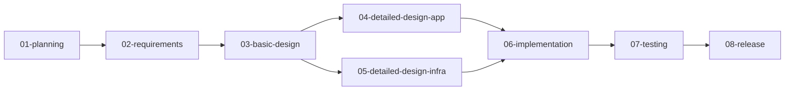

# システムアーキテクチャ - ワークフロー・テンプレート・ナレッジの連携

## 概要

Antigravityは、**3層アーキテクチャ**でシステム開発プロセスをオーケストレーションします。

```
┌─────────────────────────────────────────────────────┐
│          Layer 1: オーケストレーション層                │
│              (GEMINI.md + agents.json)              │
│  - フェーズ認識                                       │
│  - エージェント選択                                    │
│  - ワークフロー実行制御                                │
└─────────────────────────────────────────────────────┘
                      │
                      ▼
┌─────────────────────────────────────────────────────┐
│          Layer 2: ワークフロー実行層                   │
│              (.agent/workflows/)                    │
│  - 入力確認                                          │
│  - 作業手順定義                                       │
│  - 完了条件チェック                                    │
│  - 次フェーズ提案                                      │
└─────────────────────────────────────────────────────┘
                      │
         ┌────────────┴────────────┐
         ▼                         ▼
┌──────────────────┐      ┌──────────────────┐
│  Layer 3a:       │      │  Layer 3b:       │
│  テンプレート層    │      │  ナレッジ層       │
│  (templates/)    │      │  (knowledge/)    │
│  - 成果物構造     │      │  - ベストプラクティス│
│  - 必須項目       │      │  - 設計パターン   │
│  - IPA準拠       │      │  - ガイドライン   │
└──────────────────┘      └──────────────────┘
```

---

## Layer 1: オーケストレーション層

### GEMINI.md - AIオーケストレーターの脳

**役割**: AIエージェントの動作原則を定義

#### 1. フェーズ認識

ユーザーの発言からキーワードを抽出し、現在のフェーズを推定：

```
ユーザー: 「ECサイトの機能要件を整理したい」
            │
            ▼ キーワード抽出
         「機能要件」
            │
            ▼ フェーズマッピング
      【要件定義フェーズ】
            │
            ▼ ワークフロー選択
     workflows/02-requirements.md
```

**フェーズマッピングテーブル**:
| キーワード | フェーズ | ワークフロー |
|----------|---------|------------|
| 機能、要件、ユースケース | 要件定義 | 02-requirements.md |
| アーキテクチャ、構成、インフラ | 基本設計 | 03-basic-design.md |
| クラス、API、DB設計 | 詳細設計 | 04-detailed-design-app.md |

#### 2. 提案型実行

勝手に実行せず、必ずユーザー承認を得る：

```
AI: 「📍 現在位置：【要件定義フェーズ】

     要件定義では、以下の成果物を作成します：
     - RD001_システム化要求定義書
     - RD002_業務要件定義書
     - RD003_機能要件定義書
     ...

     → /requirements を実行しますか？」

ユーザー: 「はい」

AI: （ワークフロー実行開始）
```

#### 3. 一問一答形式

質問リストを避け、1つずつ質問：

```python
# ❌ 避けるべきパターン
def ask_all_questions():
    questions = [
        "課題は？",
        "ユーザー数は？",
        "予算は？",
        "納期は？",
        ...
    ]
    return "\n".join([f"{i+1}. {q}" for i, q in enumerate(questions)])

# ✅ 推奨パターン
def ask_one_by_one():
    question = "どのような課題を解決したいですか？"
    # ユーザー回答待ち
    # 回答を受けて次の質問を決定
    next_question = determine_next_question(user_response)
    return next_question
```

### agents.json - エージェント定義

**役割**: 各エージェントに、ワークフロー・テンプレート・ナレッジを紐付け

```json
{
  "agents": {
    "system-architect": {
      "name": "システムアーキテクト（基本設計）",
      "role": "basic_design",

      "workflow": "workflows/03-basic-design.md",

      "knowledge_base": [
        "knowledge/documentation/ipa-detailed-design-scaling.md",
        "knowledge/documentation/team-separation-app-infra.md",
        "knowledge/architecture/",
        "knowledge/iac/"
      ],

      "model": "sonnet",
      "requires_input_from": ["requirements-analyst"]
    }
  }
}
```

**紐付けの意味**:
- `workflow`: このエージェントが実行する作業手順
- `knowledge_base`: このエージェントが参照するナレッジ
- `requires_input_from`: 前フェーズのエージェント（依存関係）

---

## Layer 2: ワークフロー実行層

### ワークフローの構造

すべてのワークフローは、以下の構造を持ちます：

```markdown
---
description: {フェーズ名} - {IPA準拠情報}
---

# {フェーズ名}ワークフロー

## 概要
IPA共通フレーム2013「X.X.X」に準拠。

## 入力確認
`templates/{前フェーズ}/実成果物/` の成果物を読み込んでください。

## 生成する成果物

### 出力先
`templates/{現フェーズ}/実成果物/`

### 必須成果物（IPA準拠）

#### {成果物ID}_{成果物名}_template.md
- {内容説明}
- {項目例}

## 完了条件

- [ ] すべての成果物が作成完了
- [ ] {フェーズ固有の条件}

## 次フェーズ

→ /{次フェーズのワークフロー} を実行しますか？
```

### 例: 03-basic-design.md の実行フロー

```
┌─────────────────────────────────────────────────────┐
│ 1. 入力確認                                          │
│    templates/01_要件定義/実成果物/ を読み込む         │
│    - RD001_システム化要求定義書.md                    │
│    - RD003_機能要件定義書.md                         │
│    - RD004_非機能要件定義書.md                       │
└─────────────────────────────────────────────────────┘
                      │
                      ▼
┌─────────────────────────────────────────────────────┐
│ 2. チーム分離の確認（⚠️ 重要）                        │
│    「プロジェクトでアプリチームとインフラチームは      │
│     分かれていますか？」                               │
│                                                     │
│    → 分かれている: 00_アプリ/ と 01_インフラ/ に分割  │
│    → 分かれていない: 単一ディレクトリ                 │
└─────────────────────────────────────────────────────┘
                      │
                      ▼
┌─────────────────────────────────────────────────────┐
│ 3. テンプレート適用                                   │
│    knowledge_base を参照しながら、                    │
│    templates/02_基本設計/ のテンプレートを埋める       │
│                                                     │
│    参照ナレッジ:                                     │
│    - team-separation-app-infra.md                  │
│    - architecture/microservices-design.md         │
│    - iac/terraform-best-practices.md              │
└─────────────────────────────────────────────────────┘
                      │
                      ▼
┌─────────────────────────────────────────────────────┐
│ 4. 成果物生成                                        │
│    templates/02_基本設計/実成果物/                    │
│    ├── BD001_システム方式設計書.md                    │
│    ├── BD009_IaC設計書.md                           │
│    └── ...                                         │
└─────────────────────────────────────────────────────┘
                      │
                      ▼
┌─────────────────────────────────────────────────────┐
│ 5. 完了条件チェック                                   │
│    - [ ] すべての基本設計書（BD001-BD009）が作成完了  │
│    - [ ] アーキテクチャレビュー完了                    │
│    - [ ] チーム分離がある場合、責任分界が明確化       │
└─────────────────────────────────────────────────────┘
                      │
                      ▼
┌─────────────────────────────────────────────────────┐
│ 6. 次フェーズ提案                                     │
│    「→ /detailed-design-app を実行しますか？」         │
│    「→ /detailed-design-infra を実行しますか？」       │
│    （チーム分離がある場合は並行実行可能）               │
└─────────────────────────────────────────────────────┘
```

### ワークフロー間の依存関係



**重要**: ワークフローは、前フェーズの成果物を入力として受け取ります。

---

## Layer 3a: テンプレート層

### テンプレートの役割

**成果物の構造を標準化**し、IPA準拠を保証します。

### テンプレートの構造

```markdown
---
document_id: {ドキュメントID（例: BD001）}
phase: {フェーズ（例: 基本設計）}
ipa_reference: {IPA共通フレーム2013の参照番号}
---

# {ドキュメント名}

## 1. ドキュメント情報

| 項目 | 内容 |
|------|------|
| ドキュメントID | {ID} |
| 版数 | 1.0 |
| 作成日 | YYYY-MM-DD |

## 2. {セクション1}

### 2.1 {サブセクション}

{説明}

#### 記載例
```
{記載例}
```

## 3. {セクション2}

...
```

### テンプレートの種類

#### 要件定義（RD001-RD007）

| ID | 名称 | 主要項目 |
|----|------|---------|
| RD001 | システム化要求定義書 | 課題、目的、スコープ |
| RD002 | 業務要件定義書 | 業務フロー、業務ルール |
| RD003 | 機能要件定義書 | 機能一覧、画面遷移 |
| RD004 | 非機能要件定義書 | 性能、可用性、セキュリティ |
| RD005 | ユースケース記述書 | アクター、フロー、例外 |
| RD006 | 画面要件定義書 | 画面レイアウト、項目定義 |
| RD007 | 帳票要件定義書 | 帳票レイアウト、出力条件 |

#### 基本設計（BD001-BD009）

| ID | 名称 | 主要項目 |
|----|------|---------|
| BD001 | システム方式設計書 | 技術スタック、構成図 |
| BD002 | アプリケーション方式設計書 | レイヤー構成、パターン |
| BD003 | データベース方式設計書 | ER図、正規化方針 |
| BD004 | ネットワーク構成設計書 | VPC、サブネット |
| BD005 | セキュリティ設計書 | 認証、認可、暗号化 |
| BD006 | 運用設計書 | 監視、バックアップ |
| BD007 | 移行設計書 | 移行方針、スケジュール |
| BD008 | テスト方針書 | テスト戦略、品質基準 |
| BD009 | IaC設計書 ⭐ | スタック分割、State管理 |

#### 詳細設計（DD001-DD004, DD-INF001/002）

| ID | 名称 | 主要項目 |
|----|------|---------|
| DD001-01 | クラス設計書 | クラス図、メソッド定義 |
| DD002 | データベース物理設計書 | テーブル定義、インデックス |
| DD003 | API設計書 | エンドポイント、リクエスト/レスポンス |
| DD004 | 単体テスト仕様書 | テストケース、カバレッジ |
| DD-INF001 | Terraformスタック設計書 | スタック分割、モジュール構成 |
| DD-INF002 | CloudFormationスタック設計書 | スタック分割、パラメーター |

---

## Layer 3b: ナレッジ層

### ナレッジの役割

**ベストプラクティスを提供**し、成果物の品質を向上させます。

### ナレッジのカテゴリ

```
knowledge/
├── documentation/              # 文書化ガイドライン
│   ├── ipa-detailed-design-scaling.md
│   └── team-separation-app-infra.md
│
├── workflows/                  # ワークフローガイダンス
│   └── questioning-guidance.md
│
├── architecture/               # アーキテクチャパターン
│   ├── microservices-design.md
│   ├── event-driven-architecture.md
│   └── layered-architecture.md
│
├── application/                # アプリケーション設計
│   ├── backend/
│   │   ├── error-handling-patterns.md
│   │   └── api-design-principles.md
│   └── frontend/
│       └── component-design.md
│
├── database/                   # データベース設計
│   ├── index-strategy.md
│   └── schema-design-patterns.md
│
├── iac/                        # IaC
│   ├── terraform-best-practices.md
│   └── cloudformation-patterns.md
│
├── security/                   # セキュリティ
│   ├── authentication-patterns.md
│   └── owasp-top-10.md
│
├── testing/                    # テスト
│   └── test-strategy.md
│
└── ui-ux/                      # UI/UX
    └── accessibility.md
```

### ナレッジの使われ方

#### 例1: questioning-guidance.md

**役割**: エージェントが質問を生成する際のガイドライン

```markdown
# 質問生成ガイダンス

## 原則

1. **一問一答形式**: 一度に1つの質問のみ
2. **状況に応じた質問数**: 5-10個に絞る
3. **推測できる項目は前提として提示**: 質問を減らす

## 良い例

「ECサイト」とのことですので、以下を前提に設計を進めます：
- 想定同時接続数: 1,000ユーザー
- データベース: PostgreSQL

この前提でよろしいですか？
```

**使用エージェント**: requirements-analyst, system-architect

#### 例2: team-separation-app-infra.md

**役割**: アプリ/インフラチーム分離時のガイドライン

```markdown
# チーム分離ガイドライン

## ディレクトリ構造

### 基本設計

```
templates/02_基本設計/実成果物/
├── 00_アプリアーキテクチャ/    # アプリチーム
└── 01_インフラアーキテクチャ/  # インフラチーム
```

## 責任分界

| 成果物 | アプリチーム | インフラチーム |
|-------|-----------|--------------|
| BD001 システム方式設計書 | R | A |
| BD009 IaC設計書 | C | R |
```

**使用エージェント**: system-architect, detailed-designer-app, detailed-designer-infra

#### 例3: ipa-detailed-design-scaling.md

**役割**: 大規模システムの文書分割ガイドライン

```markdown
# 大規模システム対応ガイドライン

## 分割判断基準

| 条件 | 分割方針 |
|------|---------|
| クラス数10超 | モジュール単位で分割 |
| ページ数50超 | 機能単位で分割 |

## DD000 詳細設計総括

すべての詳細設計書の索引として、DD000を作成：

```markdown
# DD000 詳細設計総括

## 文書一覧

| 文書ID | 文書名 | 担当チーム |
|-------|--------|----------|
| DD001-01 | クラス設計書_認証モジュール | アプリ |
| DD-INF001-01 | Terraformスタック設計書_VPC | インフラ |
```
```

**使用エージェント**: detailed-designer-app, detailed-designer-infra, documentation-assistant

---

## 3層の連携フロー（詳細）

### ケーススタディ: 基本設計フェーズの実行

```
┌─────────────────────────────────────────────────────────┐
│ ユーザー: 「ECサイトのアーキテクチャを設計したい」          │
└─────────────────────────────────────────────────────────┘
                          │
                          ▼
┌─────────────────────────────────────────────────────────┐
│ Layer 1: オーケストレーション層                            │
│ (GEMINI.md)                                             │
│                                                         │
│ 1. フェーズ認識                                          │
│    キーワード「アーキテクチャ」「設計」                    │
│    → 基本設計フェーズと判定                               │
│                                                         │
│ 2. エージェント選択                                       │
│    agents.json から system-architect を選択              │
│                                                         │
│ 3. 提案                                                 │
│    「→ /basic-design を実行しますか？」                   │
└─────────────────────────────────────────────────────────┘
                          │
                          ▼ ユーザー承認
┌─────────────────────────────────────────────────────────┐
│ Layer 2: ワークフロー実行層                               │
│ (workflows/03-basic-design.md)                          │
│                                                         │
│ 1. 入力確認                                              │
│    templates/01_要件定義/実成果物/ を読み込む             │
│                                                         │
│ 2. チーム分離確認（⚠️ 重要）                             │
│    knowledge/documentation/team-separation-app-infra.md │
│    を参照                                                │
│    「アプリとインフラチームは分かれていますか？」           │
│                                                         │
│ 3. 成果物生成計画                                        │
│    - BD001-BD009のリストを提示                           │
│    - 出力先ディレクトリ構造を提示                          │
└─────────────────────────────────────────────────────────┘
                          │
          ┌───────────────┴───────────────┐
          ▼                               ▼
┌────────────────────────┐    ┌────────────────────────┐
│ Layer 3a: テンプレート層 │    │ Layer 3b: ナレッジ層    │
│                        │    │                        │
│ BD001_template.md      │◄───│ architecture/          │
│ - システム構成図        │    │ - microservices-       │
│ - 技術スタック選定      │    │   design.md            │
│                        │    │                        │
│ BD009_template.md      │◄───│ iac/                   │
│ - スタック分割方針      │    │ - terraform-best-      │
│ - State管理方針        │    │   practices.md         │
└────────────────────────┘    └────────────────────────┘
          │                               │
          └───────────────┬───────────────┘
                          ▼
┌─────────────────────────────────────────────────────────┐
│ 成果物生成                                                │
│                                                         │
│ templates/02_基本設計/実成果物/                           │
│ ├── BD001_システム方式設計書.md                           │
│ │   （テンプレート + マイクロサービスパターン）             │
│ ├── BD009_IaC設計書.md                                  │
│ │   （テンプレート + Terraformベストプラクティス）          │
│ └── ...                                                │
└─────────────────────────────────────────────────────────┘
```

---

## まとめ

Antigravityのアーキテクチャは、**3層の明確な責任分離**により、柔軟かつ拡張可能なオーケストレーションを実現しています。

| 層 | 責任 | 成果物 |
|----|------|--------|
| **Layer 1** | フェーズ認識、エージェント選択、提案型実行 | ユーザーとの対話 |
| **Layer 2** | 作業手順定義、完了条件チェック、次フェーズ提案 | ワークフロー実行ログ |
| **Layer 3a** | 成果物構造の標準化、IPA準拠保証 | IPA準拠ドキュメント |
| **Layer 3b** | ベストプラクティス提供、品質向上 | 高品質な設計判断 |

この3層が連携することで、**ユーザーの発言から高品質なIPA準拠成果物まで**を自動生成します。
